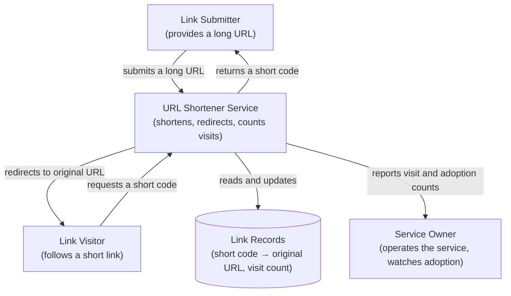
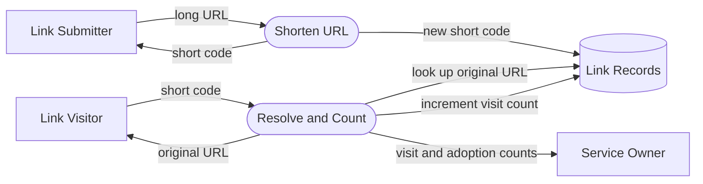

# BRD-01: URL Shortener

## Document Control

| Field | Value |
|-------|-------|
| Document ID | BRD-01 |
| Status | Draft |
| Version | 1.0.0 |
| BRD type | platform |
| Readiness score | 92 |
| Created | 2026-06-07 |
| Last updated | 2026-06-07 |
| Author | flow-walkthrough |

| Version | Date | Author | Change |
|---------|------|--------|--------|
| 1.0.0 | 2026-06-07 | flow-walkthrough | Initial MVP draft (saga iteration 1). |

## 1. Executive Summary

A small URL-shortener service turns a long web address into a compact short
code and sends anyone who visits the short link to the original address. The
service also reports how often each short link is used. The business intent is
a dependable redirection capability with predictable responsiveness and
reliable, conflict-free codes — nothing more for this cycle.

## 2. Diagrams

This BRD carries two business-level diagrams: a system-context view (Section 4)
and a top-level data-flow view (Section 5). Both describe actors, the service,
and the information it holds — not technical components.

## 3. Introduction

This BRD defines the business requirements for a URL-shortener service. A person
submits a long URL and receives a short code; visiting the short link redirects
to the original URL. Short codes are unique and collision-free, and the service
counts visits per short link. Detailed product features and user stories belong
to the downstream PRD.

## 4. Business Objectives

@diagram: c4-l1

| Field | Value |
|-------|-------|
| diagram_type | c4-context |
| level | 1 |
| scope_boundary | URL Shortener service and the people who interact with it |
| upstream_refs | (none — root layer) |
| downstream_refs | PRD-01 |

- **BRD.01.04.9e4e — Validate Shortening Demand**: The service SHALL let people
  turn long URLs into short links and confirm that those links are adopted and
  visited. Baseline: greenfield service — 0 links created and 0 visits at launch
  (current state = none). Goal state: a non-zero, owner-defined adoption floor
  (at least one created link demonstrably visited) reached within cycle 1; the
  exact quantitative threshold is set in PRD-01.
- **BRD.01.04.f439 — Reliable Redirection**: The service SHALL redirect short
  links to their original URLs dependably and with predictable responsiveness.
  Baseline: greenfield service — no redirect path exists today (current state =
  none). Goal state: redirect p95 < 50 ms and ≥ 99.9% monthly availability — the
  same two targets carried by the redirect-latency and monthly-availability
  thresholds declared and demonstrated/operated in Section 11.
- **BRD.01.04.38b1 — Adoption Metric**: The service SHALL make the count of short
  links created and the count of visits observable to the Service Owner.
  Baseline: greenfield service — no adoption telemetry exists today (current
  state = none). Goal state: created-link and visit counts are observable to the
  Service Owner from launch; the quantitative adoption target this observability
  is measured against is set in PRD-01.

The two adoption objectives above (BRD.01.04.9e4e, BRD.01.04.38b1) carry their
current-state baseline at this layer (greenfield: 0 links / 0 visits, no
telemetry); only the concrete quantitative adoption/visit success targets are
deferred to PRD-01, which sets the numeric thresholds for this MVP cycle.

## 5. Project Scope

@diagram: dfd-l1

| Field | Value |
|-------|-------|
| diagram_type | data-flow |
| level | 1 |
| scope_boundary | Information held and exchanged by the URL Shortener service |
| upstream_refs | (none — root layer) |
| downstream_refs | PRD-01 |

In scope: shortening a long URL into a unique short code, redirecting a short
link to its original URL, and counting visits per short link. Out of scope for
this cycle: custom vanity domains, user accounts and authentication, and
analytics dashboards.

## 6. Stakeholders

| Stakeholder | Interest |
|-------------|----------|
| Link Submitter | Wants a long URL turned into a reliable, shareable short link. |
| Link Visitor | Expects a short link to send them to the intended destination quickly. |
| Service Owner | Wants dependable operation, conflict-free codes, and visit reporting. |

## 7. Functional Requirements

Access classes are fixed at this layer as explicit trust-boundary decisions
(not implied by the Section 5 scope exclusions). The public shorten, redirect,
and unknown-code paths are **anonymous public** — any unauthenticated caller may
invoke them; visit/adoption reporting to the Service Owner is **internal /
privileged**, restricted to a Service-Owner role. The corresponding
authentication/authorisation model is: no authentication for the anonymous
public paths; a named role-restricted model (Service-Owner role) for the
reporting capability. This BRD excludes end-user accounts (Section 5); the
authorisation mechanism is deferred to PRD-01, but the access class and auth
model per capability are fixed here so PRD does not default reporting access to
anonymous.

- **BRD.01.07.6c3f — Submit and Shorten URL** (P1, anonymous public): The service
  SHALL accept a well-formed public web (http/https) URL and return a short code
  that resolves to that URL; destinations that are not well-formed public web
  addresses are rejected at submission.
- **BRD.01.07.15e1 — Redirect Short Link** (P1, anonymous public): The service
  SHALL redirect a request for a short code to its original URL.
- **BRD.01.07.52c7 — Resolve Unknown Short Code** (P1, anonymous public): When a
  request names a short code that was never issued, is mistyped, or is otherwise
  unresolvable, the service SHALL respond clearly that no such short link exists
  rather than failing opaquely.
- **BRD.01.07.882c — Count Visits** (P1, internal / privileged — Service-Owner
  role): The service SHALL count how many times each short link is visited and
  make that count, and the count of short links created, available to the
  Service Owner.

Shared-data ownership: Link Records (Section 5, store D1) is the single shared
entity. The Submit-and-Shorten capability (BRD.01.07.6c3f) owns creation of Link
Records (new short-code-to-URL mappings); the Resolve-and-Count path
(BRD.01.07.15e1 read, BRD.01.07.882c visit-count increment) owns read access and
the visit-count mutation. Both operate on the same Link Records entity and no
other capability writes it — this fixes write authority for the concurrent-
increment correctness commitment (BRD.01.07.390f) before PRD splits the design.

Acceptance criteria:

- **BRD.01.07.d088 — Redirect Resolves**: Given a short code issued for a long
  URL, when a visitor requests it, then the service redirects to that original
  URL.
- **BRD.01.07.be48 — Code Uniqueness**: Every issued short code is unique and
  resolves to exactly one original URL.
- **BRD.01.07.390f — Visit Count Accurate**: Each visit to a short link increases
  that link's recorded visit count by one, and the count remains accurate when
  many visitors follow the same short link at the same time (no visits are lost
  under concurrent access).
- **BRD.01.07.0b38 — Unknown Code Reported**: Given a short code that was never
  issued or is mistyped, when a visitor requests it, then the service indicates
  clearly that no such short link exists.

## 8. ADR Topics

These topics are recorded for downstream decision records; this BRD does not
resolve them and references no decision-record numbers.

- **BRD.01.08.a63d — Link Record Storage** (Data Architecture, Pending): durable
  retention of short-code-to-URL mappings and visit counts.
- **BRD.01.08.9665 — Code Generation Approach** (Technology Selection, Pending):
  how unique, collision-free short codes are produced.
- **BRD.01.08.66e2 — Redirect Performance** (Infrastructure, Pending): how
  redirection meets the responsiveness target.
- **BRD.01.08.5b91 — Availability Approach** (Infrastructure, Pending): how the
  monthly availability target is met.
- **BRD.01.08.daeb — Abuse Protection** (Security, Pending): how redirection to
  harmful destinations is limited.
- **BRD.01.08.c478 — Visit Observability** (Observability, Pending): how visit
  counts are recorded and exposed.
- **BRD.01.08.0bea — AI/ML Applicability** (AI/ML, N/A): no AI/ML capability is
  required for this cycle.
- **BRD.01.08.ff9a — External System Integration** (Integration, N/A): the
  service is standalone this cycle and integrates with no external systems.

## 9. Quality Expectations

- Performance: redirection is responsive enough for interactive use (see
  Section 11 launch gates and the redirect-latency threshold).
- Reliability: the service is reliably reachable for shortening and redirection.
- Integrity: short codes never collide (see Section 10 constraints).
- Load envelope: the redirect-latency and availability targets hold under a
  business-altitude expected load of up to 100 redirects/sec sustained, up to
  20 concurrent visitors on a single short link, submitted original URLs up to
  2,048 characters, and a target link corpus on the order of 10⁶ links. The
  technical capacity design that meets this envelope is owned by ADR topic
  BRD.01.08.66e2 (Redirect Performance); throughput beyond this envelope is
  out of scope for this cycle.
- Degraded-mode stance (business-altitude): when the write path (shortening) is
  unavailable, the business accepts rejecting new short-code creation with a
  clear error while redirects of existing links continue; when visit-counting is
  impaired, redirects continue and counts may be reconciled later (a redirect is
  never blocked on counting). These stances are owned here so PRD/SPEC do not
  reverse a business decision downstream.

## 10. Constraints and Assumptions

- **BRD.01.10.e118 — Collision-Free Codes** (constraint): Short codes SHALL be
  unique; the service SHALL never issue a code that already maps to a different
  original URL.
- **BRD.01.10.09f1 — Single Original URL** (constraint): Each short code SHALL map
  to exactly one original URL for the lifetime of that code.
- **BRD.01.10.b607 — Scope Exclusions** (assumption): Custom vanity domains, user
  accounts/authentication, and analytics dashboards are excluded this cycle;
  their absence does not block the core redirection value. Per-exclusion
  rationale: vanity domains — adjacent feature scope, deferred to a later cycle
  (BRD-02/03); accounts/authentication — deferred to a later cycle, outside the
  MVP timeline, with public paths intentionally anonymous (Section 7); analytics
  dashboards — visit-count exposure to the Owner suffices for MVP, richer
  reporting deferred on cost grounds.
- **BRD.01.10.3407 — Link Durability** (constraint): An issued short link SHALL
  remain resolvable for its committed lifetime; loss of a link record is a
  business failure, not an acceptable degradation. Recovery objectives: RPO = 0
  for confirmed-issued links (no confirmed mapping may be lost); RTO =
  resolvability restored within 30 minutes of an incident. Recovery design is
  owned by the availability ADR topic (BRD.01.08.5b91).
- **BRD.01.10.7d5a — Visit-Count Durability** (constraint): Visit counts are
  confirmed-write durable, matching the no-loss-under-concurrency criterion
  (BRD.01.07.390f): a confirmed increment SHALL NOT be lost, though brief
  reconciliation lag during a counting-path outage is acceptable (Section 9
  degraded-mode stance).
- **BRD.01.10.c2e1 — Data Classification** (constraint): The original-URL field
  is submitted by anonymous parties — an uncontrolled-content surface that may
  embed personal data or secrets (tokens, session ids, emails in query strings)
  — and is classified potentially-confidential / may-contain-PII; the visit-count
  field is operational / non-sensitive.
- **BRD.01.10.9c72 — Single-Cycle Scope** (assumption): This BRD addresses one
  MVP cycle; multi-feature expansion (vanity domains, accounts) is addressed in
  separate BRD cycles (BRD-02, BRD-03, …).

## 11. Acceptance Criteria

- **BRD.01.11.fcab — Redirect Launch Gate**: Submitting a long URL returns a
  unique short code, visiting that short link redirects to the original URL, and
  the visit count increases — demonstrated end to end.
- **BRD.01.11.e2a0 — Quality Launch Gate**: The redirect-latency target below is
  demonstrable before promotion.
- **BRD.01.11.341c — Abuse-Control Launch Gate**: Before promotion, the service
  has destination-abuse controls in place that address the Redirect Abuse risk
  (BRD.01.12.de0a) — namely destination screening against a reputation source
  and an operational takedown path for reported short links. This control
  category is a go-live precondition; the technical approach is owned by ADR
  topic BRD.01.08.daeb. Dependency-reliability stance: the reputation source is
  an external upstream dependency made a go-live precondition, so when it is slow
  or unavailable the business accepts fail-closed — new short-code creation is
  rejected with a clear capacity/availability error for the duration of the
  outage, while redirects of existing links continue unaffected. The fallback
  mechanism (e.g. async re-screening on recovery) is owned by ADR topic
  BRD.01.08.daeb.

Redirect latency p95 stays under 50 ms.
Tracked as @threshold: BRD.01.perf.redirectp95

Service availability is a post-launch operational objective, not a launch-time
demonstration: the service SHALL sustain at least 99.9% availability measured
over each calendar month, monitored continuously after promotion.
Tracked as @threshold: BRD.01.reliability.availabilitymonthly

## 12. Risk Management

- **BRD.01.12.8b9b — Short-Code Exhaustion**: Likelihood Low, Impact Medium. The
  pool of available short codes could be depleted, preventing new links.
  Mitigation: size the code space and monitor utilization; on reaching a defined
  utilization threshold (e.g. 90%), alert the Service Owner, and on actual
  exhaustion reject new shortening requests with a clear capacity error while
  existing links remain resolvable. Owner: Service Owner.
- **BRD.01.12.de0a — Redirect Abuse**: Likelihood Medium, Impact High. Short links
  could point visitors toward harmful destinations, harming trust. Mitigation:
  screen destinations and allow takedown of offending links. Owner: Service Owner.
- **BRD.01.12.4f8e — Metric Poisoning**: Likelihood Medium, Impact Low. The
  Count-Visits capability (BRD.01.07.882c) may be abused to inflate adoption
  metrics via automated repeat visits, misrepresenting adoption to the Service
  Owner and undermining the Adoption Metric objective (BRD.01.04.38b1).
  Mitigation: selection deferred downstream; the abuse case is named here at
  capability altitude. Owner: Service Owner.
- **BRD.01.12.b3d2 — Data-Protection Applicability** (compliance): Because
  anonymously-submitted original URLs can embed personal data, processing and
  storage of the original-URL field (BRD.01.07.6c3f, classified per
  BRD.01.10.c2e1) plausibly falls under external data-protection regulation such
  as GDPR / CCPA. Assessment for this MVP cycle: treat the original-URL field as
  potentially-personal data; the concrete obligation (lawful basis, retention,
  erasure path) is assessed and resolved downstream in PRD/ADR rather than
  asserted here. Owner: Service Owner.

## 13. Approval

| Role | Name | Date |
|------|------|------|
| Service Owner | flow-walkthrough | 2026-06-07 |

Approval criteria: all P1 functional requirements defined; collision-freedom and
both quality targets stated; critical risks identified with mitigation.

## 14. Traceability

This is the root layer; there are no upstream artifacts.

| Direction | Artifact |
|-----------|----------|
| Downstream | PRD-01 |

## 15. Glossary

| Term | Definition |
|------|------------|
| Short code | A compact identifier that stands in for a long URL. |
| Short link | A reference built from a short code that redirects to the original URL when visited. |
| Original URL | The long web address supplied by a Link Submitter. |
| Redirect | Sending a Link Visitor from a short link to its original URL. |
| Visit count | The number of times a given short link has been visited. |

## Appendix

Lifecycle: this BRD represents one MVP cycle for the URL-shortener service. New
feature areas (for example vanity domains or accounts) would be authored as
separate BRDs (BRD-02, BRD-03) rather than expanding this document.
