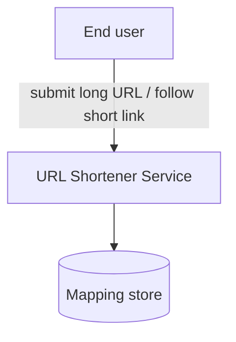
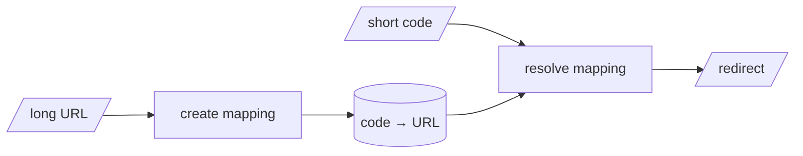

# BRD-01: URL Shortener

## Document Control

| Field | Value |
|-------|-------|
| Document ID | BRD-01 |
| Status | Approved |
| Version | 1.0.0 |
| BRD type | platform |
| Readiness score | 92 / 100 |
| Created | 2026-05-27 |
| Last updated | 2026-05-27 |

| Version | Date | Author | Change |
|---------|------|--------|--------|
| 1.0.0 | 2026-05-27 | flow-walkthrough | Initial BRD from the seed requirement |

## 1. Purpose & Context

Provide a service that turns a long URL into a short, shareable code and
redirects visitors of that code to the original URL, counting visits. This BRD
captures the business intent for the first delivery cycle; product detail is
deferred to `PRD-01`.

## 2. Business Context (C4 Context)

The service sits between end users (who create and follow short links) and the
data store that holds the code-to-URL mappings.

`@diagram: c4-l1`

- diagram_type: c4
- level: l1
- scope_boundary: URL-shortener service and its external actors
- upstream_refs: seed/initial-requirements.md
- downstream_refs: PRD-01

## 3. Stakeholders

| Stakeholder | Interest |
|-------------|----------|
| End user | Create short links and be redirected reliably |
| Operations | Keep redirects fast and the service available |

## 4. Business Requirements

- **BRD.01.04.0a13** — The service SHALL let a user submit a long URL and return
  a unique short code for it.
- **BRD.01.04.7c2e** — The service SHALL redirect a request for a short code to
  the original URL.
- **BRD.01.04.b8f1** — The service SHALL count the number of times each short
  code is visited.

## 5. Constraints & Assumptions

- **BRD.01.05.1f9d** — Short codes SHALL be unique and collision-free.
- **BRD.01.05.3a77** — Assumption: a single mapping store is sufficient for the
  first cycle (no multi-region).

## 6. Data Model (DFD Level 1)

`@diagram: dfd-l1`

- diagram_type: dfd
- level: l1
- scope_boundary: top-level data movement for create + redirect
- upstream_refs: BRD.01.04.0a13, BRD.01.04.7c2e
- downstream_refs: PRD-01

## 7. Success Metrics

- **BRD.01.07.9d2c** — Redirect latency p95 under 50 ms.
  Tracked as @threshold: BRD.01.perf.redirectP95Ms
- **BRD.01.07.5e8a** — Availability 99.9% monthly.
  Tracked as @threshold: BRD.01.reliability.monthlyAvailability

## 8. Risks

- **BRD.01.08.0b4e** — Code-space exhaustion as link volume grows; mitigate by
  sizing the code length for the projected volume.

## 9. Traceability

This is the root layer (no upstream). Downstream: `PRD-01` refines these
requirements into product features.

## 10. Glossary

- **Short code** — the compact identifier that maps to a long URL.
