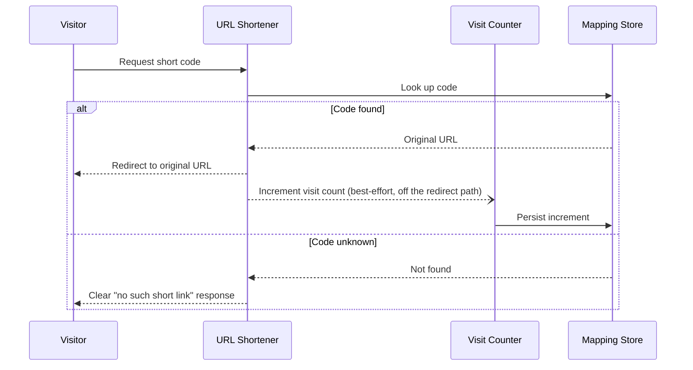
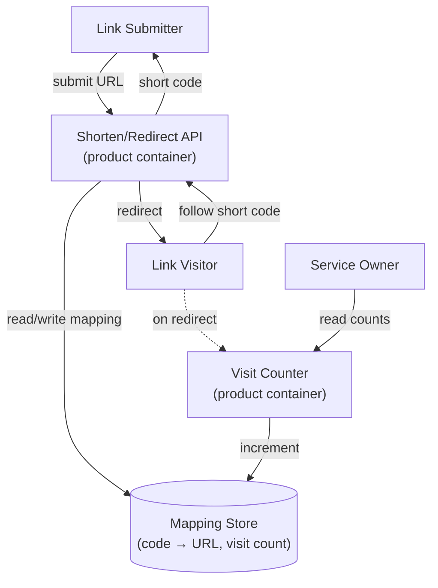
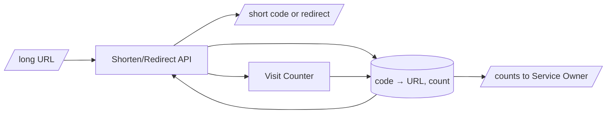

# PRD-01: URL Shortener

## 1. Document Control

| Field | Value |
|-------|-------|
| Product name | URL Shortener |
| Document ID | PRD-01 |
| Status | Draft |
| Version | 1.0.0 |
| Priority | High |
| EARS readiness score | 92 / 100 |
| Created | 2026-06-10 |
| Last updated | 2026-06-10 |
| Author | flow-walkthrough (Product Manager) |
| Reviewer | flow-walkthrough (Technical Lead) |
| Approver | flow-walkthrough (Service Owner) |
| BRD reference | @brd: BRD.01.07.6c3f |
| Target release | MVP cycle 1 |

| Version | Date | Author | Change |
|---------|------|--------|--------|
| 1.0.0 | 2026-06-10 | flow-walkthrough | Initial MVP draft from BRD-01 (saga iteration 1). |

## 2. Executive Summary

The URL Shortener turns a long public web address into a compact short code and
redirects any visitor of the short link to the original address, counting visits
per link. It refines BRD-01 into product features, personas, and KPIs for one
MVP cycle: dependable redirection, conflict-free codes, and owner-visible
adoption metrics. No accounts, vanity domains, or dashboards this cycle.

MVP hypothesis: we believe that Link Submitters will create and share short
links, and Link Visitors will follow them, if we provide reliable shortening and
redirection with visit counting. We will know this is true when, within 30 days
of launch, the created-link floor is reached and at least one created link is
demonstrably visited (Section 5).

Timeline: a single MVP cycle — development and testing in cycle 1, MVP launch at
the end of the cycle, then a 30-day validation period.

## 3. Problem Statement

Current state (greenfield — no service exists today):

- Long URLs are unwieldy to share: impact — reduced shareability across
  length-limited channels.
- No durable short-to-long mapping exists: impact — no compact, stable
  references can be issued or resolved.
- No adoption signal exists: impact — the Service Owner cannot tell whether the
  capability is used.

Opportunity: provide a dependable redirection capability with predictable
responsiveness and conflict-free codes, and make adoption observable so the
owner can decide whether to invest further (BRD-01 §1).

## 4. Target Audience

Primary persona:

| Attribute | Value |
|-----------|-------|
| Name | Link Submitter |
| Role | Anonymous public caller who shortens a long URL |
| Key characteristic | Wants a compact, shareable, reliable short link |
| Main pain point | Long URLs are hard to share and break in length-limited channels |
| Success criterion | Receives a unique short code that resolves to the exact submitted URL |
| Usage frequency | Ad hoc, per link to be shared |

Secondary personas:

| Name | Role |
|------|------|
| Link Visitor | Anonymous public caller who follows a short link and expects a fast, correct redirect or a clear not-found response. |
| Service Owner | Internal / privileged role that operates the service and watches created-link and visit counts. |

Personas map to BRD-01 §6 stakeholders; PRD expands them into actionable
product personas.

## 5. Success Metrics

These metrics set the concrete adoption targets BRD-01 deferred to this layer
(BRD.01.04.9e4e, BRD.01.04.38b1).

| ID | Metric | Baseline | Target | Measurement |
|----|--------|----------|--------|-------------|
| PRD.01.05.4b2f | Created-link adoption | 0 | ≥ owner-defined floor in 30 days | Count of short codes issued |
| PRD.01.05.e64e | Visited-link adoption | 0 | ≥ 1 created link visited in 30 days | Count of links with ≥ 1 visit |
| PRD.01.05.546d | Redirect reliability | none | p95 < 50 ms (redirect/resolve path; see scope note); ≥ 99.9% monthly | Latency telemetry; availability monitor |

Measurement scope for the p95 < 50 ms target (binds §5, §9, and the §11
Quality gate to one context): measured on the redirect (resolve-and-redirect)
path only — not the create path — server-side, in a production-equivalent
environment, over a rolling window excluding cold-start, under the BRD §9 load
envelope (100 redirects/sec sustained, up to 20 concurrent visitors on one
link, ~10⁶-link corpus). All three references to the p95 target inherit this
scope.

Created-link floor tracked as @threshold: PRD.01.quota.createdlinkfloor

Visited-link floor tracked as @threshold: PRD.01.quota.visitedlinkfloor

Decision gate: all targets met → proceed; 60–80% met → iterate; < 60% met →
pivot. The reliability KPI traces BRD objective BRD.01.04.f439.

## 6. Goals and Objectives

| ID | Goal | Metric | Target | Timeline | Source |
|----|------|--------|--------|----------|--------|
| PRD.01.06.5258 | Reliable redirection | Redirect p95 / availability | p95 < 50 ms; ≥ 99.9% monthly | MVP launch | @brd: BRD.01.04.f439 |
| PRD.01.06.fd82 | Validated adoption | Created + visited links | Floor reached; ≥ 1 visited | MVP+30d | @brd: BRD.01.04.9e4e |
| PRD.01.06.2566 | Owner-observable metrics | Counts exposed to owner | Available from launch | MVP launch | @brd: BRD.01.04.38b1 |

Stretch (only if MVP metrics exceed targets by 50%): richer adoption reporting —
deferred to a later cycle, not designed here.

## 7. Scope and Requirements

In scope (P1 — must) for this MVP cycle:

| # | Feature | Priority | Description |
|---|---------|----------|-------------|
| 1 | Create short link | P1-Must | Accept a well-formed public http/https URL, return a unique short code. |
| 2 | Redirect short link | P1-Must | Resolve a short code to its original URL and redirect. |
| 3 | Handle unknown code | P1-Must | Return a clear not-found response for unissued/unresolvable codes. |
| 4 | Count visits | P1-Must | Increment a per-code visit counter and expose counts to the owner. |
| 5 | Reject invalid destination | P1-Must | Reject submissions that are not well-formed public web addresses. |

Dependencies:

- Technical: durable store for code→URL mappings and visit counts (design owned
  by the storage ADR topic, Section 14).
- External: destination-reputation source for abuse screening — a go-live
  precondition with a fail-closed stance on create (BRD-01 §11, §14).
  Integration contract (container altitude): the Shorten/Redirect API container
  calls **out** to the external reputation source at create time, exchanging a
  candidate destination URL for a reputation verdict, over a synchronous
  request/response protocol family (e.g. HTTP). The transport, payload schema,
  and timeout mechanism are owned by the abuse-protection ADR topic (§14,
  BRD.01.08.daeb); the direction, data exchanged, and synchronous shape are
  fixed here so SPEC does not infer the integration.
- Business: the Service Owner sets the created-link adoption floor before launch.

Trust-boundary notes for the public, anonymous redirect surface (§9
PRD.01.09.dd8d):

- Enumeration / scraping defense — because short codes resolve to original
  URLs classified potentially-confidential / may-contain-PII (§12), the
  resolution surface SHALL carry at least two independent defense layers:
  (1) high-entropy, non-sequential short codes so the keyspace is not walkable,
  and (2) per-source rate-limiting on resolution requests. The concrete entropy
  and rate parameters are owned by the code-generation and abuse-protection ADR
  topics (§14, BRD.01.08.9665 / BRD.01.08.daeb).
- Time-of-check/time-of-use (TOCTOU) — screening is at-submit with fail-closed
  on create; a destination clean at submit may later turn malicious. The
  re-screen-vs-screen-once decision (periodic / on-resolution re-evaluation of
  stored destinations) is an explicit deferral owned by the abuse-protection
  ADR topic (§14, BRD.01.08.daeb); the reactive takedown path (§13
  PRD.01.13.011a) is not a substitute for that decision.

Out of scope (rationale): custom vanity domains — adjacent scope, later cycle;
user accounts/authentication — public paths intentionally anonymous; analytics
dashboards — owner-visible counts suffice for MVP (BRD.01.10.b607).

## 8. User Stories

Roles:

| Role | Description |
|------|-------------|
| Link Submitter | Anonymous public caller who shortens a long URL. |
| Link Visitor | Anonymous public caller who follows a short link. |
| Service Owner | Internal / privileged role; views adoption and visit counts. |

Stories (product-level summaries only — detailed behaviors live in EARS;
executable scenarios live in BDD):

| ID | As a | I want | So that | Priority | Acceptance (what, not how) |
|----|------|--------|---------|----------|----------------------------|
| PRD.01.08.0bd0 | Link Submitter | a short code for my long URL | I can share it compactly | P1 | A unique code is returned and resolves to the exact submitted URL. |
| PRD.01.08.8c32 | Link Visitor | the short link to take me to the original page | I reach the intended destination | P1 | Visiting an issued code redirects to its original URL. |
| PRD.01.08.4ee0 | Link Visitor | a clear message when a code does not exist | I am not left with an opaque failure | P1 | An unissued or mistyped code returns a clear not-found response. |
| PRD.01.08.b795 | Service Owner | created-link and visit counts | I can judge adoption | P1 | Counts of created links and per-link visits are available to me. |

## 9. Functional Requirements

Product-level capabilities expanding BRD-01 §7. Each is atomic and testable;
detailed behavior is formalized downstream in EARS.

- **PRD.01.09.b6cb — Create short link**: Accept a well-formed public http/https
  URL and return a unique short code that resolves to it. Acceptance: the
  returned code is unique and resolves to the exact submitted URL
  (BRD.01.07.be48). Source @brd: BRD.01.07.6c3f
- **PRD.01.09.dd8d — Redirect short link**: Resolve a short code to its original
  URL and redirect the visitor. Acceptance: an issued code redirects to its
  original URL within the latency target (BRD.01.07.d088).
  Source @brd: BRD.01.07.15e1
- **PRD.01.09.e525 — Handle unknown code**: Return a clear not-found response
  when a code was never issued or is unresolvable. Acceptance: unknown codes
  report not-found rather than failing opaquely (BRD.01.07.0b38).
  Source @brd: BRD.01.07.52c7
- **PRD.01.09.d101 — Count visits**: Increment a per-code visit counter on each
  successful redirect and expose created-link and visit counts to the Service
  Owner; counts are not lost under concurrent visits to the same link.
  Acceptance: concurrent visits to one link lose no counts (BRD.01.07.390f).
  Source @brd: BRD.01.07.882c
- **PRD.01.09.9e0f — Reject invalid destination**: Reject submissions whose
  destination is not a well-formed public web address. The rejected input
  classes are: empty or blank input; input exceeding the 2,048-character limit;
  non-http/https schemes (including `javascript:`, `data:`, `file:`); and
  malformed or relative URLs. Acceptance: a submission in any rejected class is
  rejected at submission with the §10 invalid-destination validation message,
  returning neither a 5xx nor an issued code (BRD.01.07.6c3f).
  Source @brd: BRD.01.07.6c3f

Quantitative targets (refine BRD thresholds at product level):

- Redirect latency p95 under 50 ms, measured per the §5 scope note (redirect
  path only, server-side, production-equivalent, rolling window excluding
  cold-start, under the load envelope below) — @threshold: PRD.01.perf.redirectp95
- Monthly availability at least 99.9%, a post-launch operational objective — @threshold: PRD.01.reliability.availabilitymonthly
- Sustained load up to 100 redirects/sec and up to 20 concurrent visitors on one link — @threshold: PRD.01.rate.redirectsustained
- Submitted original URL up to 2,048 characters — @threshold: PRD.01.quota.urlmaxlen

### User journey (happy path + error path)

@diagram: sequence-sync

Decomposition note (sequence-sync): the Visit Counter (`C`) owns the
visit-count increment, consistent with the C4-L2 and DFD-L2 views. The
increment is dispatched best-effort **after** the redirect response is
returned to the visitor (`--)` async dispatch) — a redirect is never blocked
on counting (§12 durability stance; gated by the §11 "redirect never blocked
on counting" launch gate).

### Container view

@diagram: c4-l2

| Field | Value |
|-------|-------|
| diagram_type | c4-container |
| level | 2 |
| scope_boundary | URL Shortener product containers and the mapping store |
| upstream_refs | BRD-01 |
| downstream_refs | EARS-01 |

Decomposition note (c4-l2): single Mapping Store for MVP — read/write store
splitting is deferred to the storage ADR topic (§14, BRD.01.08.a63d). The
Shorten/Redirect API and Visit Counter are shown as two responsibilities;
whether they ship as one or two deployable containers for MVP is owned by the
redirect-performance / visit-observability ADR topics (§14) and is not fixed
here. The Visit Counter is the single owner of the visit-count increment
across all three diagrams.

### Data movement

@diagram: dfd-l2

Decomposition note (dfd-l2): the Visit Counter is the increment owner
(API → Counter → Store), matching c4-l2 and the sequence view; the increment
edge is best-effort and off the synchronous redirect path. The single
`code → URL, count` store is an MVP simplification — read/write or count-store
splitting is deferred to the storage / visit-observability ADR topics (§14).

## 10. Customer-Facing Content

Product positioning: a dependable URL-shortening service that issues
conflict-free short codes, redirects reliably, and reports visit counts to its
operator — without accounts or setup.

Key messages:

- Share long links as compact, stable short codes.
- Short links redirect reliably to the exact original destination.

Error messages:

| Trigger | Message | Guidance |
|---------|---------|----------|
| Unknown / mistyped short code | "No such short link exists." | Check the link or request a new short code. |
| Invalid destination submitted | "That address can't be shortened — only public http/https web addresses are accepted." | Submit a well-formed public URL. |
| Shortening unavailable (write path or reputation source down) | "Short links can't be created right now. Existing links still work." | Retry later; existing redirects are unaffected. |
| Short-code space exhausted (capacity, not a transient outage) | "Short links are at capacity and can't be created right now. Existing links still work." | Non-retryable — retrying will not succeed until capacity is expanded; existing redirects are unaffected. |

Success confirmations:

| Trigger | Message | Channel |
|---------|---------|---------|
| Short code created | "Your short link is ready." | In-app (API response) |
| Redirect resolved | (transparent redirect to original URL) | In-app |

## 11. Acceptance Criteria

Launch gates:

| Category | Criterion | Threshold | Validation |
|----------|-----------|-----------|------------|
| Functional | All P1 features complete | 100% | End-to-end demo (create → redirect → count) |
| Functional | Invalid-destination rejection | All §9 PRD.01.09.9e0f rejected classes return the §10 invalid-destination message | Input-validation test: each rejected class (empty/blank, >2,048 chars, `javascript:`/`data:`/`file:` schemes, malformed/relative) returns the validation error — not a 5xx and not an issued code |
| Quality | Redirect latency target | p95 < 50 ms, per the §5 measurement-scope note | Load test on the redirect path under the BRD §9 load envelope (100 redirects/sec, 20 concurrent/link, ~10⁶ corpus), production-equivalent, excluding cold-start |
| Quality | Redirect never blocked on counting | Redirect served regardless of counting-path success/latency | Fault-injection test: with the counting path stalled or failing, a redirect for an issued code still resolves within the latency target (§12 durability stance) |
| Security | Destination-abuse control in place | Reputation screening enforced on every create + a documented takedown runbook | Integration test asserting create is screened; takedown drill removes a flagged code and confirms it returns not-found |
| Security | Screening fail-closed on dependency outage | Create rejected fail-closed when the reputation source is unreachable/slow; existing redirects continue | Dependency-outage drill: with the reputation source unreachable or past its screening deadline, create returns the capacity/availability error (not fail-open, not a stall) while issued codes still redirect |
| Reliability | Code-space capacity guard | Alert at 90% utilization; new creation rejected with the capacity error while existing links resolve | Capacity test: drive utilization past the alert threshold; confirm the alert fires and create returns the non-retryable capacity message while redirects of existing links continue |
| Reliability | Link durability | RPO = 0; RTO ≤ 30 min | Recovery drill |
| Compliance | Data-protection deferral recorded | Lawful-basis / retention / erasure-path decision logged as owned downstream | Confirm the §13 PRD.01.13.d50d deferral is recorded against a named ADR topic (§14, BRD.01.08.daeb) before promotion |

Business acceptance:

- Submitting a long URL returns a unique short code; visiting it redirects to the
  original URL and the visit count increases — demonstrated end to end
  (BRD.01.11.fcab).
- Created-link and visit counts are visible to the Service Owner.

Technical acceptance:

- Every issued short code is unique and resolves to exactly one original URL.
- Concurrent visits to one short link lose no counts.
- Availability ≥ 99.9% monthly is monitored continuously post-launch (see
  the reliability threshold in Section 9).

## 12. Constraints and Assumptions

Constraints:

| ID | Category | Description | Source |
|----|----------|-------------|--------|
| PRD.01.12.01ee | Technical | Short codes are unique; no code maps to two different URLs. | @brd: BRD.01.10.e118 |
| PRD.01.12.c49e | Technical | Each short code maps to exactly one original URL for its lifetime. | @brd: BRD.01.10.09f1 |
| PRD.01.12.04a7 | Regulatory | The original-URL field is anonymous-submitted, potentially-confidential, may contain PII. | @brd: BRD.01.10.c2e1 |
| PRD.01.12.7b71 | Regulatory | The visit-count aggregate is operational / non-sensitive (carried forward from the BRD classification). | @brd: BRD.01.10.c2e1 |
| PRD.01.12.59b7 | Regulatory | The short-code → original-URL mapping store inherits the potentially-confidential / may-contain-PII classification of the URL value it holds; access and erasure controls follow the original-URL classification. | @brd: BRD.01.10.c2e1 |

Assumptions:

| ID | Assumption | Validation | Source |
|----|------------|------------|--------|
| PRD.01.12.d1c9 | Vanity domains, accounts, and dashboards are out of scope this cycle. | Scope review at launch | @brd: BRD.01.10.b607 |

Durability stance (from BRD): confirmed-issued links are RPO = 0 / RTO ≤ 30 min
(BRD.01.10.3407); confirmed visit increments are not lost, with a bounded
reconciliation lag tolerated (BRD.01.10.7d5a). The maximum-staleness window for
owner-visible counts during and after a counting-path outage is an explicit
ADR deferral owned by the visit-observability ADR topic (§14, BRD.01.08.c478);
"brief" is not a verifiable bound and the concrete window is set there so
EARS/QA inherit a testable maximum staleness rather than unbounded prose.

## 13. Risk Assessment

| ID | Description | Likelihood | Impact | Mitigation | Source |
|----|-------------|------------|--------|------------|--------|
| PRD.01.13.011a | Short links point to harmful destinations. | Medium | High | Screen destinations against a reputation source; fail-closed on create when the source is unavailable or exceeds its screening deadline; operational takedown path. The screening-deadline value (the ms bound after which a slow source trips fail-closed) and the takedown SLA (time from report to removal) are explicit deferrals owned by the abuse-protection ADR topic (§14, BRD.01.08.daeb); verified by the §11 fail-closed and takedown gates. | @brd: BRD.01.12.de0a |
| PRD.01.13.385e | Short-code space depleted, blocking new links. | Low | Medium | Size the code space; alert at 90% utilization; reject new creation with a clear capacity error while existing links resolve. | @brd: BRD.01.12.8b9b |
| PRD.01.13.e661 | Automated repeat visits inflate adoption metrics. | Medium | Low | Mitigation selection is an explicit deferral owned by the adoption-metric-integrity ADR topic (§14, BRD.01.08.c478); abuse case named at product altitude. | @brd: BRD.01.12.4f8e |
| PRD.01.13.d50d | Anonymously-submitted URLs may embed personal data (GDPR/CCPA). | Medium | Medium | Treat original-URL as potentially-personal; lawful-basis, retention, and erasure-path resolution is an explicit deferral owned by the data-protection ADR topic (§14, BRD.01.08.daeb), recorded by the §11 Compliance gate. | @brd: BRD.01.12.b3d2 |

## 14. Traceability

@prd: PRD-01

Upstream BRD-01 elements: @brd: BRD.01.07.6c3f @brd: BRD.01.07.15e1 @brd: BRD.01.07.52c7 @brd: BRD.01.07.882c @brd: BRD.01.04.9e4e @brd: BRD.01.04.f439 @brd: BRD.01.04.38b1

Downstream: EARS-01 formalizes these features.

### ADR topic elaboration

Options per BRD-01 §8 topic (no ADR numbers).

| Topic | BRD ref | Options | Criteria |
|-------|---------|---------|----------|
| Link storage | @brd: BRD.01.08.a63d | relational; key-value; embedded | RPO=0; latency; cost |
| Code generation | @brd: BRD.01.08.9665 | random+check; hashed; counter | collision-free; length |
| Redirect perf | @brd: BRD.01.08.66e2 | in-memory; edge; index-read | p95<50ms; coherence |
| Availability | @brd: BRD.01.08.5b91 | backups; multi-AZ; multi-region | 99.9%; RTO 30min |
| Abuse protection | @brd: BRD.01.08.daeb | sync; async re-screen; allowlist | fail-closed; takedown (deferrals per §7/§13) |
| Visit observability | @brd: BRD.01.08.c478 | sync; async aggregate | no-loss; lag (bounds per §12/§13) |

Topics BRD.01.08.0bea and BRD.01.08.ff9a are N/A this cycle.

## 15. Glossary

| Term | Definition |
|------|------------|
| PRD | Product Requirements Document (Layer 2, Container level). |
| MVP | Minimum Viable Product — the cycle-1 scope. |
| KPI | Key Performance Indicator. |
| Short code | A compact identifier that stands in for a long URL. |
| Short link | A reference built from a short code that redirects to the original URL. |
| Original URL | The long public web address supplied by a Link Submitter. |
| Visit count | The number of times a given short link has been visited. |
