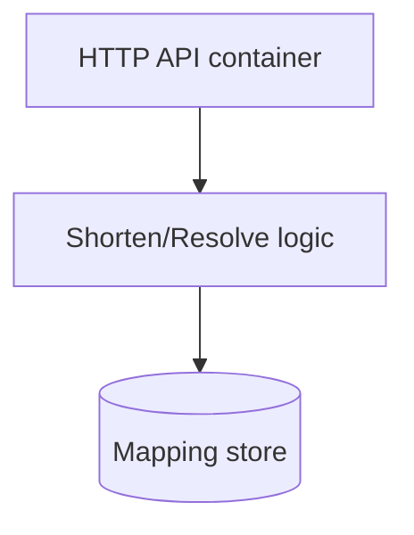
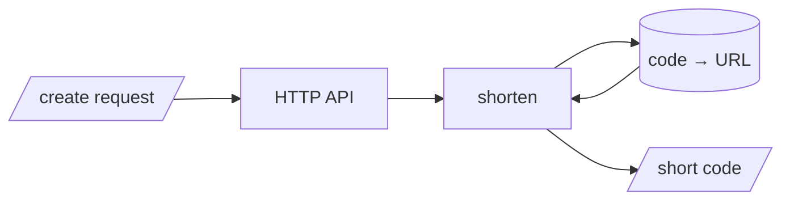
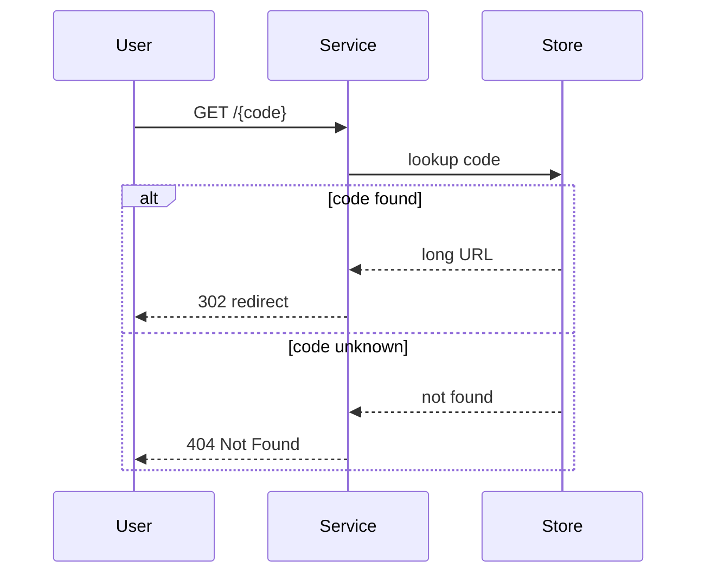

# PRD-01: URL Shortener

## Document Control

| Field | Value |
|-------|-------|
| Document ID | PRD-01 |
| Status | Approved |
| Version | 1.0.0 |
| Readiness score | 91 / 100 |
| Source | @brd: BRD.01.04.0a13 |

## 1. Product Overview

The product turns a long URL into a short code and redirects visitors, counting
visits. It refines `BRD-01` into product features for the first cycle.

## 2. User Personas

- **Link creator** — pastes a long URL, wants a short link back immediately.
- **Link follower** — clicks a short link, wants to land on the right page fast.

## 3. User Stories

- As a link creator, I want a short code for my URL so I can share it compactly.
- As a link follower, I want the short link to take me to the original page.

## 4. Container View (C4 Level 2)

`@diagram: c4-l2`

- diagram_type: c4
- level: l2
- scope_boundary: service containers and the store
- upstream_refs: BRD.01.04.0a13
- downstream_refs: EARS-01

## 5. Data Movement (DFD Level 2)

`@diagram: dfd-l2`

## 6. Key Flow (sequence, with error path)

`@diagram: sequence-sync`

## 7. Feature Requirements

- **PRD.01.09.1dbc** — Create short link: accept a long URL, return a unique
  short code. Source @brd: BRD.01.04.0a13
- **PRD.01.09.4e21** — Redirect: resolve a short code to its long URL and
  redirect. Source @brd: BRD.01.04.7c2e
- **PRD.01.09.8f4c** — Click count: increment a per-code counter on each
  successful redirect. Source @brd: BRD.01.04.b8f1

## 8. Acceptance Criteria

- A created code resolves back to the exact submitted URL.
- An unknown code returns a 404 response.

## 9. Non-Functional Requirements

- **PRD.01.21.0d5f** — Redirect latency p95 under 50 ms.
  Tracked as @threshold: PRD.01.perf.redirectP95Ms

## 10. Traceability

Upstream: @brd: BRD.01.04.0a13 | @brd: BRD.01.04.7c2e | @brd: BRD.01.04.b8f1
Downstream `EARS-01` formalizes these features.
