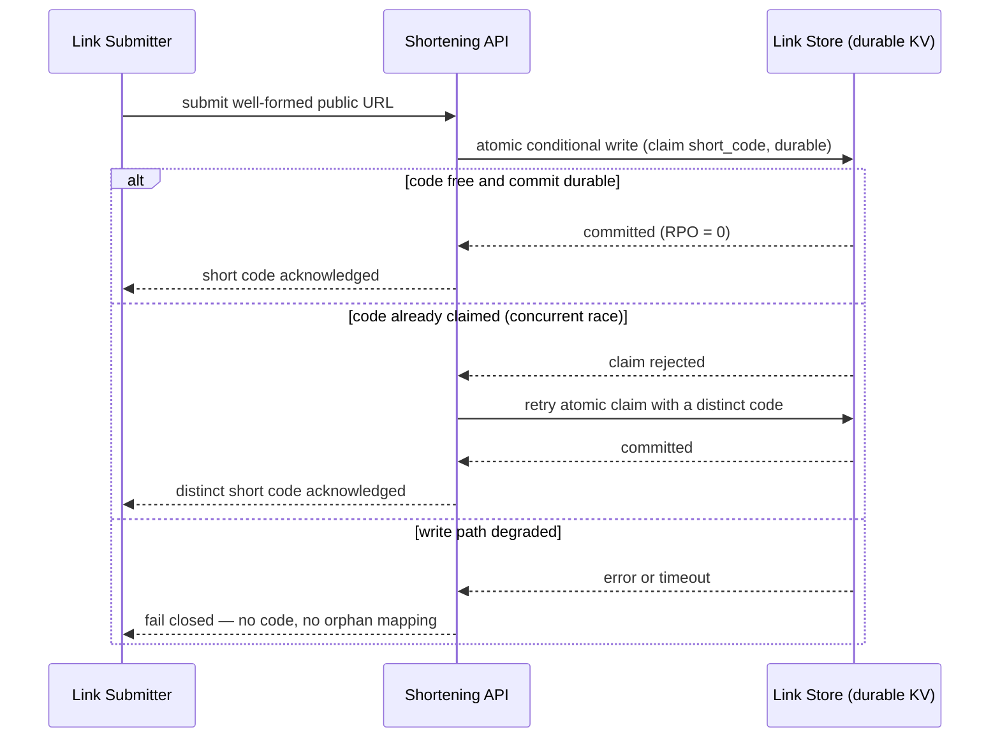
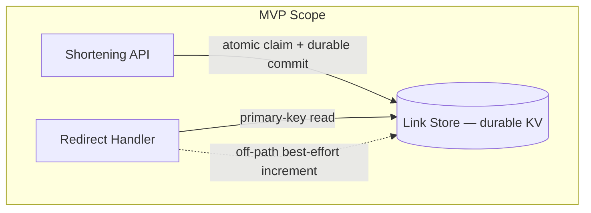

# ADR-01: Link Record Storage

Self-tag: @adr: ADR-01

Cumulative upstream tags (Layer 5): @brd: BRD.01.08.a63d | @prd: PRD.01.09.7f20 | @ears: EARS.01.03.8df7 | @bdd: BDD.01.03.8b97

## 1. Document Control

| Field | Value |
|-------|-------|
| Document ID | ADR-01 |
| Title | Link Record Storage |
| Status | Proposed |
| Version | 1.0.0 |
| Category | Data Architecture |
| Decision makers | Architect, Tech Lead (flow-walkthrough) |
| Author | flow-walkthrough |
| Originating topic | PRD-01 §14 Link record storage @brd: BRD.01.08.a63d |
| BRD reference | @brd: BRD.01.08.a63d |
| SPEC readiness score | 88/100 provisional |
| Created | 2026-06-09 |
| Last updated | 2026-06-09 |

| Version | Date | Author | Change |
|---------|------|--------|--------|
| 1.0.0 | 2026-06-09 | flow-walkthrough | Initial proposal from BDD-01 v1.0.2 (saga iteration 1). |

One decision: the storage substrate for link records. The score is provisional;
the binding gate is the doc-adr-audit pass, and promotion to Accepted needs SPEC
readiness >= 90.

## 2. Context

**Problem statement.** The service must durably retain short-code-to-URL
mappings and per-link visit counts so an issued short link resolves for its
committed lifetime. The originating topic is PRD-01 §14 *Link record storage*
(BRD.01.08.a63d), which leaves the substrate open as "durable key-value store
vs relational table." A substrate must be chosen before the SPEC can define
component interfaces and data models.

**Business driver.** BRD-01 makes conflict-free redirection a launch objective
(BRD.01.04.f439) and fixes RPO = 0 for confirmed-issued links as a hard
constraint — loss is a business failure (BRD.01.10.3407). Visit counts are
confirmed-write durable (BRD.01.10.7d5a); codes must be collision-free
(BRD.01.10.e118).

**Key constraints.**

- RPO = 0 for confirmed mappings; an acknowledged code always resolves
  (EARS.01.04.93f7, PRD.01.13.ebf9).
- Code uniqueness holds under concurrent issuance, not only in isolation
  (EARS.01.03.86ae, PRD.01.13.7760).
- The redirect read path leaves headroom under the p95 redirect budget
  @threshold: PRD.01.perf.redirectp95 (p95 < 50 ms); analytical query
  capability is not required this cycle.

**Technical context.** Per PRD §9 the Link Store is a single aggregate
(mapping, status, visit count); count-splitting is deferred to Visit
Observability (BRD.01.08.c478) and caching to Redirect Performance
(BRD.01.08.66e2). This ADR owns only the storage substrate and its write
semantics — not the cache, code generator, or replication model. BDD-01 fixes
the behaviours it must support: write-before-acknowledge (BDD.01.03.8b97),
concurrent-issuance collision (BDD.01.03.bdae), fail-closed issuance on a
degraded write path (BDD.01.03.ed21), and idempotent recovery (BDD.01.03.bcfb).

## 3. Decision

**Chosen solution — ADR.01.03.5c3c — Durable transactional key-value Link
Store.** Persist link records in a single durable, transactional key-value
store keyed by short code. Each record holds the original URL, link status, and
visit count. Issuance performs an **atomic conditional write** (compare-and-set
or unique-key constraint on the short code) and **commits durably before the
short code is acknowledged** to the submitter. The redirect path reads the
record by its primary key. Visit-count increments are applied off the hot path
and are best-effort relative to redirect availability.

Selected because its native primary-key access matches the only shapes this
cycle requires — point lookup on redirect, point write on issuance — while its
atomic conditional-write resolves the concurrent-issuance race (PRD.01.13.7760)
without an application lock, and durable-commit-before-acknowledge delivers
RPO = 0 (EARS.01.03.8df7).

**Key components.**

| Component | Role |
|-----------|------|
| Link Store (durable KV) | Authoritative persistence of `short_code -> {original_url, status, visit_count}`. |
| Atomic claim primitive | Conditional-put / unique-key write enforcing collision-free issuance under concurrency. |
| Off-path increment | Best-effort visit-count update that never blocks an otherwise-resolvable redirect. |

**Implementation approach.**

- *MVP scope:* single-aggregate KV record; synchronous durable commit on the
  issue path; atomic conditional claim; primary-key read on redirect; off-path
  best-effort increment with reconciliation logging.
- *Next-cycle scope:* splitting the count into an append-and-aggregate store
  (deferred to BRD.01.08.c478) and any read-replica or caching strategy
  (deferred to BRD.01.08.66e2 and BRD.01.08.5b91).

**Decision semantics.**

- ADR.01.03.f5f5 — *Reversibility:* **one-way** (foundational substrate;
  reversal migrates every committed record, one cycle, blast radius confined by
  the storage interface — §7 Rollback plan).
- ADR.01.03.3315 — *Issuance:* **at-most-once per logical submission**; the
  atomic-claim primitive keys idempotency on a submitter idempotency key
  (fallback: deterministic content-derived candidate), collapsing a retried
  submission onto the same record (BDD.01.03.bcfb).
- ADR.01.03.1050 — *Trust boundary (API ↔ store):* the API/redirect services
  authenticate to the KV store with a **per-service principal** (provider IAM
  role / scoped least-privilege key, never a shared credential) over
  **TLS 1.2+**; an auth/TLS failure fails the write closed (§6,
  BDD.01.03.f44a/ed21/5f58).

## 4. Alternatives

### ADR.01.04.1e7b — Durable transactional key-value store *(selected)*

Primary-key store on the short code with an atomic conditional-put and durable
commit before acknowledge.

- **Pros:** O(1) primary-key lookup leaves headroom under the redirect budget;
  native conditional-write gives collision-free issuance under concurrency;
  single-aggregate model maps directly onto the PRD §9 Link Store.
- **Cons:** weak ad-hoc / analytical query capability; multi-key transactions
  are limited.
- **Estimated cost:** ~$30/month (managed single-region KV at MVP volume).
- **Fit:** Best — the only required access patterns are point read and point
  write; no relational query need exists this cycle.

### ADR.01.04.fef7 — Relational table *(rejected)*

A single relational table with a unique index on the short-code column.

- **Pros:** unique index gives an atomic claim; mature ACID semantics and
  tooling.
- **Cons:** heavier per-request overhead (SQL parse plus connection pool) on a
  pure primary-key access pattern; schema and migration overhead with no
  relational query requirement this cycle.
- **Rejection reason:** no relational or analytical query requirement exists for
  the MVP; the KV substrate matches the single-aggregate, primary-key-only
  access pattern and the latency budget more directly. Reconsider if a later
  cycle introduces cross-entity queries.
- **Estimated cost:** ~$50/month (managed single-instance relational).
- **Fit:** Good.

### ADR.01.04.89b7 — In-memory store with periodic snapshot *(rejected)*

An in-process map persisted by periodic background snapshots.

- **Pros:** lowest read latency; trivial to implement.
- **Cons:** confirmed mappings written between snapshots are lost on a crash.
- **Rejection reason:** cannot satisfy RPO = 0 for confirmed-issued links
  (BRD.01.10.3407) or write-before-acknowledge durability (EARS.01.03.8df7) — an
  acknowledged code could fail to resolve after a restart, the exact failure
  BDD.01.03.8b97 forbids.
- **Estimated cost:** ~$10/month (compute only).
- **Fit:** Poor.

## 5. Consequences

**Positive outcomes.**

- ADR.01.05.e35b — Primary-key lookup leaves latency headroom under the 50 ms
  redirect budget @threshold: PRD.01.perf.redirectp95 (p95 < 50 ms).
- ADR.01.05.3afa — Atomic conditional write guarantees collision-free issuance
  under concurrency without application-level locks (EARS.01.03.86ae,
  EARS.01.03.97c4).
- ADR.01.05.d549 — A single durably-committed aggregate makes RPO = 0 for
  confirmed mappings achievable (EARS.01.04.93f7).

**Trade-offs and risks.**

| ID | Trade-off / risk | Severity | Mitigation |
|----|------------------|----------|------------|
| ADR.01.05.0f1f | Key-value access limits ad-hoc analytical queries over link records. | Low | No analytical query is required this cycle; richer reporting is deferred to Visit Observability (BRD.01.08.c478). |
| ADR.01.05.9107 | A single mapping+count aggregate couples two write paths with different durability needs. | Medium | Write paths are partitioned per ADR.01.03.5536 — the mapping is written once and never rewritten by the increment path, which uses an isolated partial-field write; the increment is off-path and best-effort (EARS.01.03.d808), so a count-write fault cannot fail a redirect; reconciliation is logged (BDD.01.03.a7ad). |
| ADR.01.05.7158 | Synchronous durable commit on the issue path adds submission latency. | Low | Commit stays on the issue path only, not the redirect path; the 500 ms issue budget (EARS.01.04.4eec) absorbs it while the redirect budget is unaffected. |

**Cost estimate.**

| Item | Value |
|------|-------|
| MVP cost | ~$0 (MVP-tier managed KV within free / low tier) |
| Ongoing monthly | ~$30/month (single-region managed KV at MVP volume) |
| Notes | Excludes caching / replication infrastructure, owned by Redirect Performance (BRD.01.08.66e2) and Availability (BRD.01.08.5b91). |

## 6. Architecture Flow

Intent: show how the issuance write path enforces atomic claim and durable
commit before acknowledgement — the decision's load-bearing interaction.
Scope boundary: Shortening API to Link Store on the issue path.
Upstream refs: BDD.01.03.8b97, BDD.01.03.bdae.
Downstream refs: SPEC-01 (Shortening API, Link Store interfaces).

@diagram: sequence-sync

Supplementary decision view (optional flowchart):

**Integration points.**

| System | Integration type | Purpose |
|--------|------------------|---------|
| Link Store (durable KV) | Synchronous write / read over TLS 1.2+, authenticated by a per-service principal (ADR.01.03.1050) | Durable mapping persistence; atomic claim on issuance; primary-key resolution on redirect. |

*Data-at-rest (ADR.01.03.0db1):* records persist under provider-managed
envelope encryption (AES-256) with a provider-managed KMS key on the provider
default rotation cadence; a customer-managed key is a deferred hardening option.

## 7. Implementation Assessment

Decision-level assessment only; file-level execution belongs to IPLAN (Layer 8).

**MVP phases.**

| Phase | Scope | Key risk | Blast radius |
|-------|-------|----------|--------------|
| 1 | Provision managed KV; define the `short_code` record schema and the atomic-claim write primitive. | The chosen KV tier's conditional-write semantics differ from assumed compare-and-set. | Cross-service — breaks collision-free issuance system-wide. |
| 2 | Wire write-before-acknowledge on the issue path and primary-key read on the redirect path. | Commit latency pushes the issue path toward the 500 ms budget. | Single-service — issue-path latency only. |
| 3 | Off-path best-effort increment with reconciliation logging. | Increment coupling leaks back onto the hot path. | Single-service — redirect latency degradation only. |

**Rollback plan.**

- *Strategy:* reversal is one-way and interface-confined (ADR.01.03.f5f5); all
  access stays behind the storage interface. Runbook: (1) halt new issuance
  traffic; (2) drain in-flight writes; (3) snapshot/export committed records;
  (4) provision and validate the alternative store; (5) import records with
  uniqueness verification; (6) atomically re-point the data-access layer;
  (7) run an RPO = 0 smoke test post-cutover.
- *Trigger:* the KV tier cannot meet RPO = 0 or atomic-claim semantics under
  load test.
- *Estimated effort:* ~2–4 hours at MVP volume (interface stable; data
  migration dominates).

**Monitoring baseline.**

| Metric | Target | Alert threshold |
|--------|--------|-----------------|
| Durable-commit latency (issue path, p95) | < 500 ms | >= 500 ms |
| Atomic-claim write-conflict rate | low, bounded | > 5 conflicts/min sustained over a 5-min window -> WARN (code-space pressure, BRD.01.08.9665; provisional pending load-test calibration) |
| Confirmed-mapping loss (RPO) | 0 | any loss |

## 8. Verification

**Success criteria.**

| Criterion | Measurement |
|-----------|-------------|
| An acknowledged short code always resolves (RPO = 0). | Crash / restart durability test (BDD.01.03.8b97). |
| Concurrent issuance preserves uniqueness. | Forced same-candidate race (BDD.01.03.bdae). |
| A degraded write path leaves no orphan code and recovers idempotently. | Fault injection on the write path (BDD.01.03.ed21, BDD.01.03.bcfb). |
| A count-write fault never fails a redirect. | Visit-count fault injection (BDD.01.03.5f58, BDD.01.03.a7ad). |

**BDD scenario cross-references.**

@bdd: BDD.01.03.8b97 | @bdd: BDD.01.03.bdae | @bdd: BDD.01.03.ed21 | @bdd: BDD.01.03.bcfb | @bdd: BDD.01.03.f44a | @bdd: BDD.01.03.0759 | @bdd: BDD.01.03.5f58 | @bdd: BDD.01.03.a7ad

## 9. Traceability

Document tag: @adr: ADR-01 (originating topic PRD-01 §14, see §1).

**Cumulative upstream tags (Layer 5 — all four required).**

- @brd: BRD.01.08.a63d | @brd: BRD.01.10.3407 | @brd: BRD.01.10.7d5a | @brd: BRD.01.10.e118 | @brd: BRD.01.07.6c3f | @brd: BRD.01.07.882c
- @prd: PRD.01.09.7f20 | @prd: PRD.01.12.8500 | @prd: PRD.01.12.11be | @prd: PRD.01.13.ebf9 | @prd: PRD.01.13.7760 | @prd: PRD.01.13.15a3
- @ears: EARS.01.03.8df7 | @ears: EARS.01.03.97c4 | @ears: EARS.01.03.86ae | @ears: EARS.01.03.19ec | @ears: EARS.01.03.d808 | @ears: EARS.01.03.fab2 | @ears: EARS.01.04.93f7 | @ears: EARS.01.04.7934 | @ears: EARS.01.04.8e22
- @bdd: BDD.01.03.8b97 | @bdd: BDD.01.03.bdae | @bdd: BDD.01.03.ed21 | @bdd: BDD.01.03.bcfb | @bdd: BDD.01.03.f44a | @bdd: BDD.01.03.0759 | @bdd: BDD.01.03.5f58 | @bdd: BDD.01.03.a7ad

**Downstream (expected).**

| Consumer | Layer | Relationship |
|----------|-------|--------------|
| SPEC-01 | 6 | Turns this storage decision into Link Store interfaces, the record data model, and write-ordering contracts. |

**Health score.** SPEC readiness 88/100 provisional; target >= 90/100
(see §1 Document Control).

## 10. Related Decisions

These topics are recorded for downstream decision records; each is a distinct,
not-yet-authored ADR and is **not** decided here. No ADR is superseded by this
record.

| Topic (future ADR) | Relationship | Rationale |
|--------------------|--------------|-----------|
| Code Generation (BRD.01.08.9665) | Constrains | The code generator must produce candidates the atomic-claim primitive can uniquely commit; write-conflict rate signals code-space pressure. |
| Redirect Performance (BRD.01.08.66e2) | Extended by | Any read cache layers over this substrate's primary-key read; this ADR owns persistence, not the hot-path cache. |
| Visit Observability (BRD.01.08.c478) | Extended by | Splitting the visit count into an append-and-aggregate store builds on this single-aggregate baseline. |
| Availability (BRD.01.08.5b91) | Depended on by | The replication / recovery model that meets RTO <= 30 min layers onto this store's RPO = 0 commit semantics. |

## Glossary

| Term | Definition |
|------|------------|
| ADR | Architecture Decision Record. |
| SPEC readiness | Score measuring ADR maturity for the SPEC transition (90 or above required). |
| Link Store | The durable store of short-code-to-URL records and visit counts. |
| Atomic claim | A conditional write that grants a short code to exactly one issuance. |
| RPO | Recovery Point Objective — tolerated data loss; zero for confirmed mappings. |
| Hot path | The synchronous redirect path the 50 ms latency budget measures. |
| Off-path | Work (such as the visit-count increment) done outside the redirect hot path. |

## Appendix

MVP lifecycle: this record holds one decision in the MVP -> PROD -> NEW MVP
cycle. New substrates, caches, or count splits are authored as new ADRs and
related back in §10. Update in place only to clarify the decision (patch) or
change status (Proposed -> Accepted at SPEC readiness >= 90); deprecate or
supersede it when a later decision replaces the durable-KV substrate.
