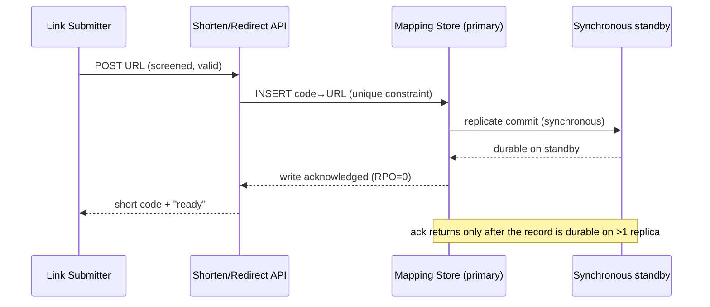

# ADR-01: Link Record Storage

## 1. Document Control

| Field | Value |
|-------|-------|
| Document ID | ADR-01 |
| Status | Proposed |
| Version | 1.0.0 |
| Decision | The Mapping Store engine for code→URL records and visit counts |
| Originating topic | PRD-01 §14 "Link storage" (BRD origin BRD.01.08.a63d) |
| Decision-makers | flow-walkthrough (Architect, Tech Lead) |
| Author | flow-walkthrough |
| SPEC readiness score | 89/100 (provisional — binding gate is doc-adr-audit) |
| Created / Updated | 2026-06-10 |

| Version | Date | Author | Change |
|---------|------|--------|--------|
| 1.0.0 | 2026-06-10 | flow-walkthrough | Initial proposal — Link Record Storage decision (saga iteration 1). |

## 2. Context

**Problem statement.** The service needs a durable home for two record kinds:
the short-code→URL mapping and the per-code visit count (originating topic
PRD-01 §14 "Link storage", BRD origin BRD.01.08.a63d). The store choice
determines whether the system meets zero-data-loss durability, the code-to-URL
uniqueness invariant, confidential read control over a may-contain-PII original
URL, and the redirect read-latency budget. It is the foundational
data-architecture decision the other topics build on, so it is recorded first.

**Business driver.** A short link that silently loses or mis-resolves its
destination destroys product trust (BRD.01.08.a63d); durable, correct,
low-latency resolution is the core value.

**Key constraints.**

- RPO = 0 — a confirmed-issued link survives a crash immediately after ack
  (EARS.01.04.5e5b; BDD.01.03.9b90); RTO ≤ 30 min on store loss.
- Redirect reads hold p95 < 50 ms (EARS.01.03.c4c9, EARS.01.04.cea3;
  BDD.01.03.613b).
- The original-URL value is may-contain-PII; readable only by least-privilege
  principals (EARS.01.03.4ebf; BDD.01.03.c8a6, BDD.01.03.167e).
- MVP scale ~10⁶ links at 100 redirects/sec sustained; cost-sensitive.

**Technical context.** PRD-01 names a single **Mapping Store** behind the
**Shorten/Redirect API** and **Visit Counter**. Code-to-URL uniqueness is a
system-wide invariant (EARS.01.03.bca8; BDD.01.03.a688); confirmed visit
increments must not be lost (EARS.01.04.1898; BDD.01.03.02c1); the store must
degrade to a bounded error (BDD.01.03.1f90) and recover within RTO
(BDD.01.03.44fe). Caching and failover topology are owned by sibling topics
(§10) and are out of scope here.

**Threat model (scope).** The column/row access control here mitigates
**over-broad principal read** of the PII original URL (insider / lateral-movement
read beyond the least-privilege reader). **Out of scope here** — owned by the
data-protection ADR (BRD.01.08.daeb) — are at-rest encryption, backup/export
confidentiality, and erasure.

## 3. Decision

@ears: EARS.01.04.5e5b @ears: EARS.01.03.bca8 @ears: EARS.01.03.4ebf @bdd: BDD.01.03.9b90 @bdd: BDD.01.03.a688

**ADR.01.03.4226 — Adopt a managed relational store with synchronous
replication as the Mapping Store.**

Writes use synchronous commit-before-acknowledge replication to a standby, so
the create path acknowledges only after the record is durable on more than one
replica (RPO = 0). The mapping table carries a **unique constraint on the short
code**, enforcing the uniqueness invariant declaratively rather than in
application code. The may-contain-PII original-URL column is governed by
database column/row access control. Recovery uses point-in-time recovery plus
standby promotion to meet RTO ≤ 30 min.

This is chosen because every hard correctness obligation —
durability-before-ack, one-URL-per-code, classified read control, bounded
recovery — maps to a **native, declarative database guarantee** instead of
app-side logic re-proven per call path. The redirect budget is met by
primary-key lookups; the read cache that gives latency headroom is owned by the
redirect-performance topic (BRD.01.08.66e2) and is deliberately not decided
here.

**Failure semantics — synchronous-standby loss.** On loss or partition of the
synchronous standby, the primary **halts create-path writes** rather than
auto-degrading to async: durability (RPO = 0) is preserved at the cost of
create-path availability, and the store emits a degraded-mode signal so the
shorten path returns a bounded error (BDD.01.03.1f90). This is fail-closed on
durability, not fail-open on availability. The redirect read path is
independent and unaffected by the halt.

**Access-control identity model (authN + identity translation).** The
may-contain-PII original-URL column is read only via an **app-tier identity
mapped to a least-privilege database role**. The API authenticates the caller
(authN); the authZ decision is made in the app tier, which connects to the store
as the least-privilege reader principal for that call path — so the column/row
grant is evaluated against a per-call-path DB role, not one shared service
principal. End-principal identity is thus translated to a DB principal at the
API→Store boundary, making the paired checks (BDD.01.03.c8a6 permit /
BDD.01.03.167e deny) realizable against a named mechanism. The read **fails
closed** when the decision cannot be made (grant down, classification missing, or
role-lookup error).

**Key components.** Mapping Store (relational primary) — authoritative records,
unique constraint, classification access control. Synchronous standby —
receives the commit before ack; source for RTO-bounded promotion.

**Implementation approach.** *MVP:* one primary + one synchronous standby;
unique constraint; column grant on original-URL; PITR; PK read path.
*Next cycle:* read-replica fan-out and sharding once the corpus outgrows one
primary (a separate future decision).

## 4. Alternatives

@ears: EARS.01.03.c4c9 @bdd: BDD.01.03.1f90

- **ADR.01.04.0478 — Managed relational store (synchronous replica)** —
  *selected.* Managed relational DB with a synchronous standby; PK-lookup reads;
  declarative unique constraint; column/row access control; PITR.
  - Pros: RPO = 0 from commit-before-ack; uniqueness and access control are
    native guarantees; mature recovery tooling; predictable PK-read p95.
  - Cons: synchronous replication adds create-path latency; one write primary
    has a vertical-scale ceiling.
  - Estimated cost: ~$300/month (primary + standby, MVP tier). Fit: Best.

- **ADR.01.04.8909 — Distributed key-value store** — *rejected.* Distributed
  wide-column / persisted in-memory store keyed by short code.
  - Pros: very low read latency; horizontal scale.
  - Cons: uniqueness and classification read control become app-side concerns;
    RPO = 0 depends on fragile per-write durability config; exactly-once count
    durability needs extra reconciliation.
  - Rejection reason: pushes three hard correctness obligations into application
    code; latency headroom does not justify that correctness cost at MVP scale.
  - Estimated cost: ~$250/month. Fit: Good.

- **ADR.01.04.5ee2 — Embedded single-node store** — *rejected.* Embedded engine
  (e.g. SQLite/LMDB) co-located on the app node.
  - Pros: lowest read latency and cost; no network hop.
  - Cons: durability and availability bounded by one node; no synchronous
    replica.
  - Rejection reason: cannot meet RPO = 0, RTO ≤ 30 min, and ≥ 99.9% on node
    loss — fails the survives-crash obligation (BDD.01.03.9b90) outright.
  - Estimated cost: ~$0/month. Fit: Poor.

## 5. Consequences

@bdd: BDD.01.03.c8a6 @bdd: BDD.01.03.167e @ears: EARS.01.04.1898

**Positive outcomes.**

- **ADR.01.05.47a1 — Declarative durability and uniqueness.** RPO = 0 from
  synchronous commit and one-URL-per-code from a unique constraint remove the
  app-side correctness burden (EARS.01.03.bca8, EARS.01.04.5e5b).
- **ADR.01.05.454a — Native classification access control.** Column/row grants
  satisfy the may-contain-PII least-privilege requirement without bespoke code
  (EARS.01.03.4ebf).
- **ADR.01.05.cb92 — Mature recovery tooling.** PITR and standby promotion meet
  RTO ≤ 30 min with proven mechanisms (BDD.01.03.44fe).

**Trade-offs and risks.** *Impact* = severity; *Blast radius* = single-service
/ cross-service / data-loss-possible (so SPEC/BDD can size defenses).

- **ADR.01.05.5896 — Create-path halt on standby loss.** *Impact: High; blast
  radius: cross-service* (shorten stalls; reads continue). The §3 halt precludes
  the data-loss outcome (silent RPO breach), trading it for a bounded write
  outage (BDD.01.03.1f90); §7 pool isolation averts a retry storm.
- **ADR.01.05.7dde — Read-latency headroom dependency.** *Impact: Medium; blast
  radius: single-service.* PK reads meet p95 only with pooling and a cache.
  *Mitigation:* the cache is owned by BRD.01.08.66e2.
- **ADR.01.05.2740 — Write amplification under sync replication.** *Impact:
  Medium; blast radius: single-service.* Commit-before-ack adds create-path
  latency. *Mitigation:* it lands inside the screening budget, not the redirect
  budget.
- **ADR.01.05.3adb — Vertical-scale ceiling.** *Impact: Low; blast radius:
  single-service.* One write primary scales vertically. *Mitigation:* the MVP
  corpus fits one node; re-shard is a follow-on.
- **ADR.01.05.98ff — At-rest encryption of the PII column deferred.** *Impact:
  Medium; blast radius: data-loss-possible* (backup/media exposure). The grant is
  access control, not at-rest encryption. *Accepted risk:* encryption,
  key-management, and rotation are deferred to the data-protection ADR
  (BRD.01.08.daeb); the interim compensating control is the least-privilege grant
  plus managed-tier volume encryption.

**Side-effect contract — visit-count increment.** Delivered **at-least-once**
with an idempotency/dedup key in the count table (EARS.01.04.1898;
BDD.01.03.02c1, BDD.01.03.44fe) so a retry cannot drop it; dedup of
double-applies is owned by BRD.01.08.c478. SPEC-01 inherits this contract.

**Reversibility: two-way** — reversible at days-scale cost behind the Mapping
Store interface; requires a two-table migration and re-proof of RPO = 0.

**Cost estimate.** MVP setup ~$500 one-time (provisioning + PITR); ongoing
~$300/month (primary + synchronous standby, MVP tier). Excludes the read cache
(BRD.01.08.66e2) and any multi-region cost (BRD.01.08.5b91).

## 6. Architecture Flow

Mandatory interaction sequence — the create-and-durably-commit-before-ack path
that realizes RPO = 0.

Intent header — `diagram_type`: sequence · `level`: n/a (decision bridge, no C4
level) · `scope_boundary`: Submitter → Shorten/Redirect API → Mapping Store
(primary + synchronous standby) · `upstream_refs`: EARS.01.04.5e5b,
BDD.01.03.9b90 · `downstream_refs`: SPEC-01 (interface, data model, write
ordering).

@diagram: sequence-sync

**Integration points.** Mapping Store (relational) — synchronous DB connection,
authoritative read/write. Synchronous standby — DB replication for
commit-before-ack durability and RTO-bounded promotion.

## 7. Implementation Assessment

Decision-level only; IPLAN (Layer 8) owns implementation detail.

**MVP phases.**

| Phase | Scope | Key risk |
|-------|-------|----------|
| 1 Provision | Primary + synchronous standby; PITR on | Synchronous mode silently degrades to async (breaks RPO=0) |
| 2 Schema | Unique constraint on code; visit-count table; original-URL column grant | Missing constraint lets a duplicate code violate the invariant |
| 3 Read path | PK lookup on the resolution surface | Unindexed lookup misses the p95 budget |

**Rollback plan.** The engine sits behind the Mapping Store interface, so an
alternative can be substituted without changing callers. *Trigger:* synchronous
replication is unreliable, or PK-read p95 exceeds budget after caching. *Ordered
steps:* (1) drain the write path; (2) export+verify the two tables onto the
replacement, confirming its sync-replica + unique-constraint posture; (3)
re-point the interface and confirm RPO = 0. The export carries the PII column,
so it inherits the access/at-rest controls (encrypted, least-privilege,
secure-deleted; params owned by BRD.01.08.daeb). Write/read pools are isolated
with a fail-fast create-path timeout (BDD.01.03.1f90) so a stalled standby
cannot starve reads. *Effort:* days.

**Monitoring baseline.** Each signal carries a detection-time bound (fraction of
the 30-min RTO). Replica commit lag — target 0, alert on non-zero within ≤ 60 s.
Redirect read p95 — alert ≥ 45 ms over a 5-min window. Standby health — alert on
unavailable within ≤ 30 s. PITR backup recency — alert when the last WAL is > 1 h
or base backup > 24 h, plus a periodic restore-probe signal; the RTO claim (§2)
depends on this chain. Config drift — alert if `synchronous_commit` deviates.

## 8. Verification

**Success criteria.**

| Criterion | Measurement |
|-----------|-------------|
| Link survives a hard kill immediately after ack | Crash-recovery probe; code still resolves after restart (BDD.01.03.9b90) |
| Each issued code maps to exactly one URL | Resubmission assertion + constraint property check (BDD.01.03.a688) |
| Original-URL read denied without grant, permitted with it | Paired access checks (BDD.01.03.c8a6, BDD.01.03.167e) |
| Original-URL read denies when the access-control decision is unavailable (fail-closed) | Deny-on-grant-unavailable probe; mirrors the deny/permit pair |
| PK read path within budget under the no-cache MVP load envelope (p95 < 50 ms jointly owned with BRD.01.08.66e2, verifiable once the cache lands) | Sustained-load read test (BDD.01.03.613b) |
| Degradation returns a bounded error, then recovers | Degradation + restoration probes (BDD.01.03.1f90, BDD.01.03.44fe) |

**BDD cross-references.**
@bdd: BDD.01.03.9b90 @bdd: BDD.01.03.a688 @bdd: BDD.01.03.c8a6 @bdd: BDD.01.03.167e @bdd: BDD.01.03.613b @bdd: BDD.01.03.1f90 @bdd: BDD.01.03.44fe @bdd: BDD.01.03.02c1

## 9. Traceability

@adr: ADR-01

Originating topic: PRD-01 §14 "Link storage" (BRD origin BRD.01.08.a63d). Per
the necessary-upstream contract, ADR carries `@ears` and `@bdd` element tags;
PRD/BRD lineage is transitive via that chain.

Upstream EARS:
@ears: EARS.01.04.5e5b @ears: EARS.01.03.bca8 @ears: EARS.01.03.4ebf @ears: EARS.01.03.c4c9 @ears: EARS.01.04.cea3 @ears: EARS.01.04.1898

Upstream BDD:
@bdd: BDD.01.03.9b90 @bdd: BDD.01.03.a688 @bdd: BDD.01.03.c8a6 @bdd: BDD.01.03.167e @bdd: BDD.01.03.613b @bdd: BDD.01.03.1f90 @bdd: BDD.01.03.44fe @bdd: BDD.01.03.02c1

Downstream (expected): SPEC-01 implements this as the Mapping Store component —
interface, data model, durability behavior contract.

## 10. Related Decisions

This decision is the data-architecture foundation; the following PRD-01 §14
topics are separate ADRs:

| Topic | BRD ref | Relationship |
|-------|---------|--------------|
| Redirect performance (cache) | BRD.01.08.66e2 | Extends — owns the read cache (ADR.01.05.7dde) |
| Availability / failover | BRD.01.08.5b91 | Extends — owns multi-AZ/region + store-loss detection |
| Visit observability | BRD.01.08.c478 | Depends on — persists counts here; owns dedup |
| Code generation | BRD.01.08.9665 | Constrains — supplies the codes the constraint stores |
| Abuse protection | BRD.01.08.daeb | Depends on — takedown state recorded here |

Depends-on cross-links resolve once those siblings are authored. **Deployment
ordering:** this store's provisioning (Phase 1–2) and its health checks (replica
lag, standby, PITR) gate all five sibling ADR deployments. Supersedes: none.

## Glossary

| Term | Definition |
|------|------------|
| ADR | Architecture Decision Record (Layer 5 — one decision). |
| SPEC readiness | Score measuring ADR maturity for SPEC transition (≥ 90/100). |
| RPO | Recovery Point Objective; RPO = 0 means no committed data lost on failure. |
| RTO | Recovery Time Objective; bound on time-to-restore after store loss. |
| Mapping Store | The store holding code→URL mappings and visit counts. |
| Synchronous replication | Commit acknowledged only after durable on > 1 replica. |
| PITR | Point-in-time recovery from continuous backups. |

## Appendix

This ADR records ONE decision (Link Record Storage). A new architectural choice
gets a new ADR rather than expanding this one. Update it for clarifications
(patch) or a status change (Proposed → Accepted once the doc-adr-audit gate
passes). Deprecate or supersede only if the store strategy is replaced — e.g.
when the vertical-scale ceiling (ADR.01.05.3adb) forces a sharding decision,
recorded as a new ADR that this one `@depends:` on.
