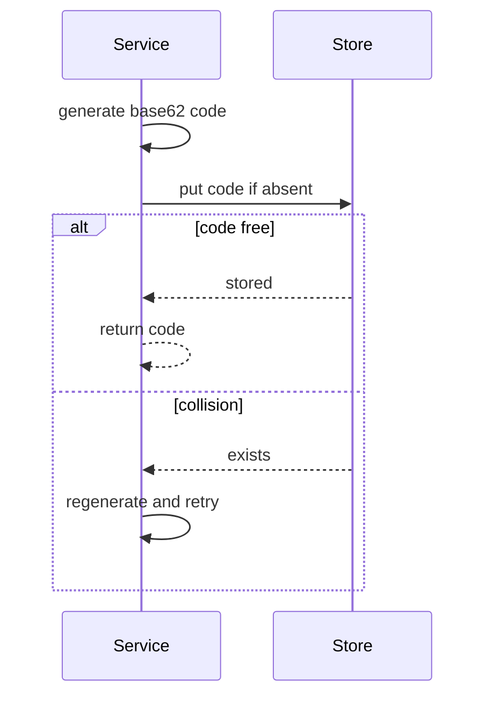

# ADR-01: Short-code generation strategy

## Document Control

| Field | Value |
|-------|-------|
| Document ID | ADR-01 |
| Status | Accepted |
| Version | 1.0.0 |
| Readiness score | 93 / 100 |
| Self | @adr: ADR-01 |

## 1. Context

`EARS-01` requires unique short codes via @ears: EARS.01.03.b2e8 and fast
redirects via @ears: EARS.01.03.a1f7 — so we must choose how codes are generated
and stored. Upstream: @brd: BRD.01.05.1f9d | @prd: PRD.01.09.1dbc | @bdd: BDD.01.03.8f4c

## 2. Decision

- **ADR.01.02.e5b1** — Generate a 7-character base62 random code; on the rare
  store-collision, regenerate and retry (bounded retries). Persist the
  code-to-URL mapping in a key-value store keyed by code.

## 3. Alternatives Considered

| Option | Pros | Cons | Rejected because |
|--------|------|------|------------------|
| Monotonic counter + base62 | no collisions | guessable, leaks volume | predictability is undesirable |
| UUID code | trivially unique | long, not "short" | violates the short-code goal |
| Random base62 + retry (chosen) | short, unguessable | needs a collision check | acceptable with bounded retry |

## 4. Consequences

- Positive: short, opaque codes; O(1) lookup by code.
- Trade-off: a uniqueness check on create (one store read); bounded retries cap
  the worst case.

## 5. Architecture Flow (decision sequence)

`@diagram: sequence-sync`

- diagram_type: sequence
- scope_boundary: create-code decision path
- upstream_refs: BDD.01.03.8f4c
- downstream_refs: SPEC-01

## 6. Implementation Assessment

Low complexity; the retry loop and the store contract are specified downstream in
`SPEC-01`.

## 7. Verification

Covered by @bdd: BDD.01.03.8f4c (create) and @bdd: BDD.01.03.9a1d (unknown code).

## 8. Traceability

Upstream: @brd: BRD.01.05.1f9d | @prd: PRD.01.09.1dbc | @ears: EARS.01.03.b2e8 |
@bdd: BDD.01.03.8f4c
Downstream `SPEC-01`.
