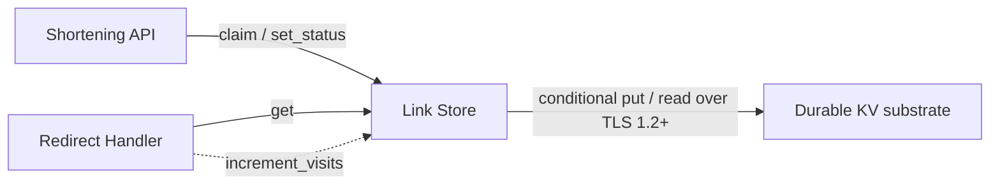
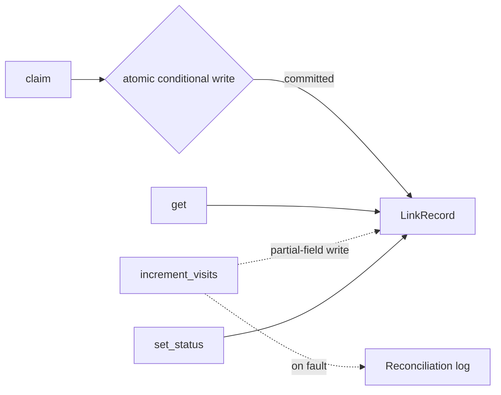
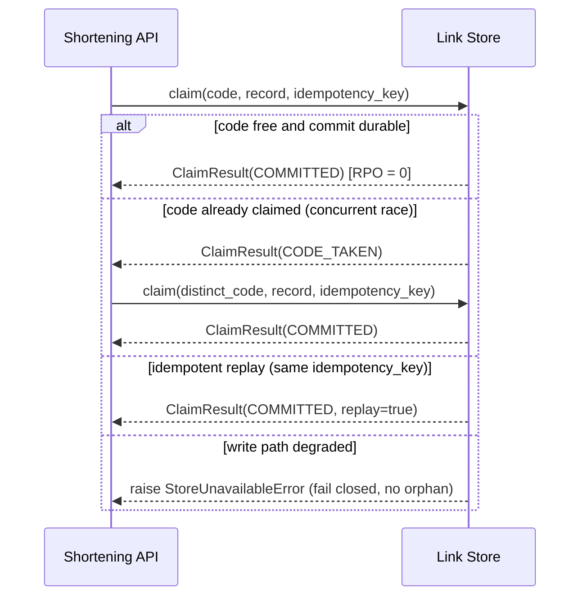

# SPEC-01: Link Store

Self-tag: @spec: SPEC-01

Cumulative upstream tags (Layer 6): @brd: BRD.01.08.a63d | @prd: PRD.01.09.7f20 | @ears: EARS.01.03.8df7 | @bdd: BDD.01.03.8b97 | @adr: ADR-01

## 1. Document Control

| Field | Value |
|-------|-------|
| Document ID | SPEC-01 |
| Title | Link Store |
| Component | Link Store |
| Status | Draft |
| Version | 1.0.1 |
| Author | flow-walkthrough |
| Architecture decision | @adr: ADR-01 |
| TDD readiness score | recomputed by doc-spec-audit |
| Created | 2026-06-09 |
| Last updated | 2026-06-09 |

| Version | Date | Author | Change |
|---------|------|--------|--------|
| 1.0.0 | 2026-06-09 | flow-walkthrough | Initial SPEC draft from ADR-01 v1.0.0. |
| 1.0.1 | 2026-06-09 | flow-walkthrough | Audit remediation (iteration 1): 1 P1 + 9 P2 + 9 P3 from `06_SPEC-audit`. |

## 2. Component Overview

The Link Store is the authoritative persistence component for short-link
records, holding one aggregate per short code
(`short_code -> {original_url, status, visit_count}`) in a durable,
transactional key-value substrate (ADR.01.03.5c3c). It exposes an atomic-claim
write committing durably before a code is acknowledged — RPO = 0 for confirmed
mappings (EARS.01.03.8df7); a primary-key redirect read (EARS.01.03.e2e9); an
off-path best-effort visit-count increment that never blocks a resolvable
redirect (EARS.01.03.d808); and a takedown status transition (EARS.01.03.539a).
It owns persistence and write ordering only — code generation, the redirect
cache, and replication are separate components per ADR-01 §10. It also **owns
the reconciliation log** — a durable, append-only off-path sink
`increment_visits` writes on a count fault (§5), never on the redirect path.

Component view (`@diagram: c4-l3`):



Data-flow view (`@diagram: dfd-l3`):



**Language.** Python (typed contracts; KV adapter bound at IPLAN, Layer 8).

**Dependencies.**

| Dependency | Version | Purpose |
|------------|---------|---------|
| Managed durable KV client | provider-pinned at IPLAN; **substrate contract v1** (tracks SPEC MAJOR) | Conditional-put / unique-key write with durable-commit acknowledgement. |

**`LinkStore` contract version.** The port (§3) is **contract v1**, tracking the
SPEC MAJOR: a breaking interface or §4 field change bumps both in lockstep, and
downstream TDD/IPLAN and every KV adapter pin `LinkStore v1` as the drift anchor.

**KV substrate minimum-capability matrix.** The pluggable KV adapter MUST
provide every *required* capability below; an adapter lacking one is
**non-conformant** — no application-lock or read-modify-write fallback is
permitted (ADR.01.05.3afa).

| Capability | Requirement |
|------------|-------------|
| Atomic conditional-put OR unique-key constraint on `short_code` (`claim`) | required |
| Durable-commit-before-acknowledge (`claim`, RPO = 0) | required |
| Native atomic field increment / ADD/INCR (`increment_visits`) | required |
| Partial-field write (`increment_visits`) | required |
| TLS 1.2+ + per-service-principal auth (ADR.01.03.1050) | required |
| Multi-key transactions / secondary-index query | not required — deferred (ADR.01.05.0f1f) |

## 3. Interfaces

`LinkStore` is the public port (**contract v1**, tracks SPEC MAJOR — see §2),
adapting the ADR-01 KV substrate to this contract. Signatures are typed; no
implementation.

```python
class LinkStore(Protocol):
    async def claim(
        self, code: str, record: LinkRecord, idempotency_key: str | None = None
    ) -> ClaimResult: ...

    async def get(self, code: str) -> LinkRecord | None: ...

    async def increment_visits(self, code: str, delta: int = 1) -> None: ...

    async def set_status(self, code: str, status: LinkStatus) -> LinkRecord: ...
```

| Export | Description | Errors |
|--------|-------------|--------|
| `claim` | Atomically claim `code` for `record` and commit durably before returning `COMMITTED`. A retried submission carrying the same `idempotency_key` collapses onto the existing record (replay) rather than failing (ADR.01.03.3315, BDD.01.03.bcfb). **Retry-safety:** `claim` is idempotent — safe to retry after `StoreUnavailableError` — **only** with a non-`None` `idempotency_key` (submitter-supplied, or the content-derived fallback per ADR.01.03.3315); a no-key retry has no dedup guarantee and MUST NOT be issued. | `StoreUnavailableError` — write path degraded; fail closed, no orphan code (BDD.01.03.ed21). `ValueError` — `code`/`record` violate the §4 field contract. |
| `get` | Primary-key read on the redirect hot path; returns the record or `None` for an unknown code. Read latency leaves headroom under @threshold: PRD.01.perf.redirectp95 — component allocation quantified in §6 (ADR.01.05.e35b). | `StoreUnavailableError` — read path unavailable; caller maps to a fail-safe not-found / 5xx per EARS.01.03.fab2 (BDD.01.03.f44a). |
| `increment_visits` | Off-path best-effort increment of `visit_count`, implemented as a **native atomic field-increment (KV ADD/INCR)** — never a read-modify-write, which would lose concurrent increments and break the monotonic contract (ADR.01.05.9107). MUST NOT raise onto the redirect path; on failure records a reconciliation log entry and returns (BDD.01.03.5f58, BDD.01.03.a7ad). | none surfaced — faults swallowed and logged for reconciliation. |
| `set_status` | Transition a record's status (e.g. `active -> taken_down`) so the redirect path can refuse a taken-down code (EARS.01.03.539b). **Idempotent** — safe to retry after `StoreUnavailableError` (§5). | `KeyError` — no record for `code`. `StoreUnavailableError` — write path unavailable. |

**Boundary failure semantics.** Each synchronous boundary carries an explicit
timeout / retry / circuit-break contract so a degraded substrate is shed
deterministically; concrete values bind at TDD against the cited budgets.

| Boundary | Operation(s) | Timeout | Retry | Circuit-break |
|----------|--------------|---------|-------|---------------|
| API → Link Store | `claim`, `set_status` | issuance budget EARS.01.03.f909 less commit headroom | only with a stable `idempotency_key`, bounded attempts (§6); no key ⇒ none | open after a bounded failure count ⇒ fail closed |
| Redirect → Link Store | `get` | « redirect budget @threshold: PRD.01.perf.redirectp95 | one fast retry within budget | open ⇒ fail-safe not-found (EARS.01.03.fab2) |
| Redirect → Link Store | `increment_visits` | off-path; never charged to redirect | none; fault → reconciliation log | n/a — best-effort |

## 4. Data Models

Typed contracts passed through the interface — not storage schemas.

```python
class LinkStatus(str, Enum):
    active = "active"          # code resolves to its destination
    taken_down = "taken_down"  # code suppressed; redirect returns not-found
```

**`LinkRecord`** (dataclass)

| Field | Type | Required | Description |
|-------|------|----------|-------------|
| `short_code` | `str` | yes | Primary key; collision-free under concurrent issuance (EARS.01.03.97c4). |
| `original_url` | `str` | yes | Destination; screened upstream, not re-validated here (§5). |
| `status` | `LinkStatus` | yes | Defaults to `active` on claim; `taken_down` via `set_status`. |
| `visit_count` | `int` | yes | Monotonic, best-effort; written only by `increment_visits` off-path. |
| `idempotency_key` | `str \| None` | no | Collapses a retried submission onto one record (ADR.01.03.3315). |
| `created_at` | `datetime` (UTC) | yes | Durable-commit timestamp of the claim. |

**`ClaimResult`** (dataclass)

| Field | Type | Required | Description |
|-------|------|----------|-------------|
| `outcome` | `Enum[COMMITTED, CODE_TAKEN]` | yes | `COMMITTED` = durably written; `CODE_TAKEN` = code already claimed, caller retries a distinct code. |
| `record` | `LinkRecord \| None` | no | The committed record when `outcome == COMMITTED`; **`None` on `CODE_TAKEN`** — the loser never receives the winner's record. |
| `replay` | `bool` | yes | `True` only in conjunction with `COMMITTED`, when an `idempotency_key` matched an existing record (no new write); `False` on `CODE_TAKEN`. |

The `(outcome, record, replay)` triple is total: `COMMITTED → (record set,
replay ∈ {true,false})`; `CODE_TAKEN → (record None, replay false)`.

**Schema evolution.** `LinkRecord` and `ClaimResult` evolve
**backward-compatibly within a SPEC MAJOR**: new fields optional with defaults,
`LinkStatus` **append-only**. A breaking change to a persisted field bumps the
SPEC MAJOR + `LinkStore` contract version (§2) and triggers the ADR-01 §7
migration runbook; prior-shape records stay readable, removed fields retained as
`[DEPRECATED]`.

## 5. Behavior

**Validation rules.**

| Rule | Source |
|------|--------|
| `short_code` is the unique primary key; a second claim on a live code yields `CODE_TAKEN`, never an overwrite. | @ears: EARS.01.03.97c4 |
| `short_code` MUST conform to the code-generation alphabet — base62 `[A-Za-z0-9]` allowlist, length within the generator's fixed width (owned by the deferred code-generation contract) — validated **before** the conditional-put; a non-conforming code yields `ValueError`. | @brd: BRD.01.08.9665 |
| `original_url` is screened for public http/https form **upstream by the Shortening API ingress** (the owning interface); the Link Store trusts records only from that per-service principal (ADR.01.03.1050) and does not re-screen. | @adr: ADR.01.03.1050 |
| `claim` commits durably before returning `COMMITTED` — an acknowledged code always resolves. | @ears: EARS.01.03.8df7 |
| A claim whose `idempotency_key` matches an existing record returns `COMMITTED`, `replay=true`, no new write. | @bdd: BDD.01.03.bcfb |
| `increment_visits` is best-effort and isolated; never rewrites mapping fields, never blocks `get`. | @ears: EARS.01.03.d808 |

**State transitions.**

| From | To | Trigger | Source |
|------|----|---------|--------|
| (absent) | active | `claim` conditional write commits durably | @bdd: BDD.01.03.8b97 |
| active | taken_down | `set_status(code, taken_down)` | @ears: EARS.01.03.539a |
| visit_count = n | visit_count = n + delta | `increment_visits` partial-field write succeeds | @bdd: BDD.01.03.1664 |

**Error handling.**

| Condition | Response | Source |
|-----------|----------|--------|
| Concurrent claims race on the same candidate code. | Exactly one `COMMITTED`; the loser gets `CODE_TAKEN` and retries a distinct code — no orphan. | @bdd: BDD.01.03.bdae |
| Write path degraded / timing out during `claim`. | Raise `StoreUnavailableError`; fail closed, no code committed, no orphan. | @bdd: BDD.01.03.ed21 |
| Write path restored; submitter retries with the same `idempotency_key`. | Idempotent re-claim resolves to the same record (`replay=true`). | @bdd: BDD.01.03.bcfb |
| Read path unavailable during `get`. | Surface `StoreUnavailableError`; redirect degrades fail-safe and recovers when the store returns. | @bdd: BDD.01.03.f44a |
| `increment_visits` fault. | Swallow, emit a reconciliation log entry, return; redirect still resolves. The log write is itself off-path best-effort — if it faults the delta drops silently (count is best-effort), drop metric emitted (§6). | @bdd: BDD.01.03.5f58 |
| A logged dropped increment is reconciled into the recorded count. | Replay logged deltas into `visit_count` without double-counting: each delta carries a unique `delta_id` (commit marker) and replay skips a `delta_id` already reflected, making "no double-count" enforceable. | @bdd: BDD.01.03.a7ad |
| Write path restored; takedown retried via `set_status`. | Idempotent re-apply converges to the same terminal status (last-writer-wins). | @ears: EARS.01.03.539a |

Issuance write path (error branches shown with `alt`/`else`):



## 6. Implementation Notes

**Constraints.**

- Stateless: no in-memory authoritative state; the durable KV substrate is the single source of truth (ADR-01 §3).
- `claim` MUST use a native atomic conditional-put / unique-key constraint on `short_code` — never an application lock (ADR.01.05.3afa).
- Durable commit MUST precede the `COMMITTED` acknowledgement; no write-behind on the issue path.
- Authenticate to the substrate with a per-service principal (least-privilege, never shared) over TLS 1.2+; an auth/TLS failure fails the write closed (ADR.01.03.1050).

**Patterns.**

- Repository / port pattern: `LinkStore` is a Protocol; the KV adapter binds at IPLAN.
- Idempotency key (submitter-supplied, content-derived fallback) as the claim de-duplication key (ADR.01.03.3315).
- Off-path write isolation: `increment_visits` runs outside the redirect hot path so a count fault cannot fail a redirect (ADR.01.05.9107).

**Performance & at-rest.**

- `get` is an O(1) primary-key read — no scans, no secondary-index reads on the hot path.
- Records persist at rest under provider-managed AES-256 envelope encryption with a provider-managed KMS key on the provider-default rotation cadence; a customer-managed key (CMK) is deferred hardening (ADR.01.03.0db1). Encryption + key binding are a TDD contract (§7).

**NFR targets** (per operation, independently testable at the boundary):

| Op | Latency (component allocation) | Throughput | Error budget |
|----|--------------------------------|------------|--------------|
| `get` | ≤ 10 ms p95 — the store's slice of the 50 ms redirect budget @threshold: PRD.01.perf.redirectp95 (≥ 40 ms for handler/network) | ≥ 500 read/s | ≥ 99.9%; `StoreUnavailableError` ≤ 0.1% |
| `claim` | within issuance budget EARS.01.03.f909 (issue path only) | ≥ 50 write/s | ≥ 99.9% durable-commit; RPO = 0 |
| `increment_visits` | off-path, best-effort; no budget | ≥ 500/s | best-effort; deltas reconciled (§5) |

Percentiles observed server-side over a rolling 5-min window at design load;
error budget = `StoreUnavailableError`/timeout fraction. TDD owns the fixtures.

**Resilience envelope.**

- Safe-overload margin 1.5× design load; beyond it the store sheds fail-fast (`StoreUnavailableError`, no unbounded queuing). "Throttled" (retry within budget) is distinct from "unavailable" (circuit-break, fail closed/safe per §3).
- Shed order under saturation: `increment_visits`, then `claim`; `get` preserved last.
- `CODE_TAKEN` retry bounded: ≤ N distinct-code retries with backoff (N from the code-generation contract, default 5); exhaustion → terminal issuance error.
- Reconciliation log bounded (max retention); at the bound oldest deltas drop with a `reconciliation_overflow` alert; post-fault drain rate-bounded.

**Observability** (per boundary): the Link Store emits durable-commit latency,
write-conflict rate, atomic-claim outcome, and increment-drop / reconciliation
depth; the caller emits the `StoreUnavailableError` log and propagates a trace
span across the edge.

**Audit events.** Emit `{event_type, actor_principal, target_code, outcome,
ts_utc}` for `claim`, `set_status`/takedown (old→new status), and authn
success/failure incl. the fail-closed auth/TLS path (ADR.01.03.1050) — not the
§5 reconciliation log.

## 7. TDD Contracts

The downstream TDD defines test inputs, expected outputs, and thresholds.

TDD document: @tdd: TDD-01

| Test file | Covers |
|-----------|--------|
| `tests/unit/test_link_store.py` | `claim` / `get` / `increment_visits` / `set_status` contracts; `LinkRecord` + `ClaimResult` field validation; idempotent-replay outcome. |
| `tests/integration/test_link_store_kv.py` | Atomic conditional write under concurrent claims; durable-commit-before-acknowledge; per-service-principal + TLS auth failure fails closed. |
| `tests/e2e/test_durability_and_recovery.py` | Crash/restart RPO = 0 (BDD.01.03.8b97); fail-closed degraded write (BDD.01.03.ed21); idempotent recovery (BDD.01.03.bcfb); count-fault isolation + reconciliation (BDD.01.03.5f58, BDD.01.03.a7ad). |
| `tests/integration/test_security_and_audit.py` | At-rest AES-256 envelope encryption + provider-managed KMS key binding; audit-event emission with the `{event_type, actor, code, outcome, ts}` schema on `claim`, takedown (`set_status`), and authn success/failure. |

## 8. Traceability

Document tag: @spec: SPEC-01

**Cumulative upstream tags (Layer 6 — all five required).**

- @brd: BRD.01.08.a63d | @brd: BRD.01.08.9665 | @brd: BRD.01.10.3407 | @brd: BRD.01.10.e118
- @prd: PRD.01.09.7f20 | @prd: PRD.01.13.7760
- @ears: EARS.01.03.8df7 | @ears: EARS.01.03.97c4 | @ears: EARS.01.03.d808 | @ears: EARS.01.03.e2e9 | @ears: EARS.01.03.539a
- @bdd: BDD.01.03.8b97 | @bdd: BDD.01.03.bdae | @bdd: BDD.01.03.ed21 | @bdd: BDD.01.03.bcfb | @bdd: BDD.01.03.f44a | @bdd: BDD.01.03.1664 | @bdd: BDD.01.03.5f58 | @bdd: BDD.01.03.a7ad
- @adr: ADR-01 | @adr: ADR.01.03.5c3c | @adr: ADR.01.03.1050 | @adr: ADR.01.05.3afa

**Downstream (expected).**

| Consumer | Layer | Relationship |
|----------|-------|--------------|
| TDD-01 | 7 | Test cases validating the contracts. |
| IPLAN | 8 | Binds KV provider + file manifest. |
