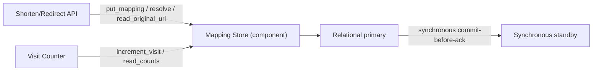
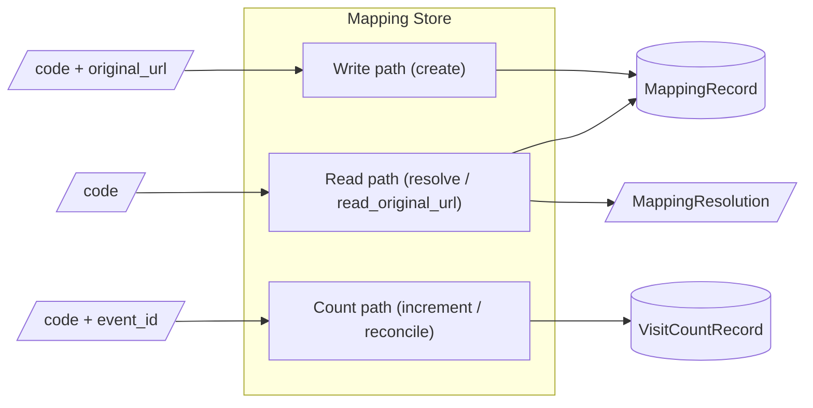
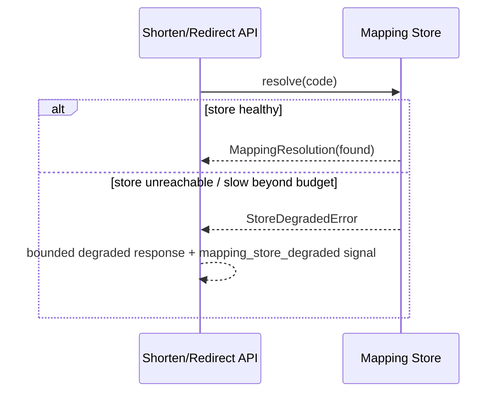

# SPEC-01: Mapping Store

## 1. Document Control

| Field | Value |
|-------|-------|
| Document ID | SPEC-01 |
| Component | Mapping Store |
| Status | Draft |
| Version | 1.0.0 |
| Architecture decision | @adr: ADR-01 @adr: ADR.01.03.4226 |
| Language | Python |
| TDD readiness score | 90/100 (provisional — binding gate is doc-spec-audit) |
| Created / Updated | 2026-06-10 |
| Author | flow-walkthrough |

| Version | Date | Author | Change |
|---------|------|--------|--------|
| 1.0.0 | 2026-06-10 | flow-walkthrough | Initial component specification for the Mapping Store, derived from ADR-01 (saga iteration 1). |

SPEC (Layer 6) carries the necessary-upstream tags `@ears @bdd @adr`; PRD/BRD
lineage is transitive via the EARS/BDD chain (§8). The TDD readiness score is
provisional — the binding gate is doc-spec-audit.

## 2. Component Overview

The **Mapping Store** is the authoritative C4-L3 component for two record kinds:
the short-code→URL mapping and the per-code visit count. It is the single store
named by PRD-01's container view, behind the Shorten/Redirect API and the Visit
Counter. It owns four contracts ADR-01 resolved to native, declarative database
guarantees rather than app-side logic:

- **Durability before acknowledgement** — a confirmed mapping survives a crash
  immediately after ack (RPO = 0), via synchronous commit-before-ack replication
  (ADR.01.03.4226, ADR.01.05.47a1).
- **Code-to-URL uniqueness** — every issued code maps to exactly one URL, via a
  declarative unique constraint on the code (ADR.01.05.47a1).
- **Classified read control** — the may-contain-PII original-URL is readable only
  by a least-privilege principal, fail-closed (ADR.01.05.454a).
- **At-least-once visit-count durability** — confirmed increments are not lost,
  reconciled to exactly-once via an idempotency/dedup key (ADR-01 §5).

The component does not own caching, failover topology, code generation, or the
numeric durability/at-rest parameters — sibling ADR topics (ADR.01.05.7dde
read-cache dependency; ADR.01.05.98ff deferred at-rest encryption).

Architecture decision: @adr: ADR-01

### Diagrams

@diagram: c4-l3



@diagram: dfd-l3



### Dependencies

| Dependency | Version | Purpose |
|------------|---------|---------|
| Managed relational store (primary + synchronous standby) | per ADR-01 MVP tier | Authoritative records; RPO = 0 via synchronous commit; PITR recovery. |
| Database column/row access control | engine-native | Enforces the may-contain-PII original-URL classification grant (ADR.01.05.454a). |

## 3. Interfaces

The operations below are the component contract (the repository boundary ADR-01
§7 defines for reversibility) — typed signatures, not implementations; no SQL or
storage detail is exposed.

**Contract version.** The `MappingStore` interface tracks the SPEC document
version (1.0.0); a breaking signature change increments it on a MAJOR bump per
the §4 schema-evolution policy. **Delivery channel.** `increment_visit` is
carried off the synchronous redirect path by a durable async dispatch queue
**owned by the Visit Counter**, which provisions, persists (on durable storage,
not in-memory), and replays the queue and its dead-letter destination after a
crash. At-least-once and reconciliation depend on that durable transport; the
idempotent `event_id`-keyed consumer makes replay safe.

```python
class MappingStore:
    def put_mapping(self, code: ShortCode, original_url: OriginalUrl) -> MappingRecord:
        """Durably store a code->URL mapping, acknowledging only after the
        record is committed on more than one replica (RPO = 0). The unique
        constraint on `code` enforces the code-to-URL uniqueness invariant
        declaratively. A retry of an identical (same code, same URL) create is
        idempotent — the unique constraint makes the re-INSERT a no-op success,
        not a duplicate. Sourced: EARS.01.04.5e5b, EARS.01.03.bca8.
        Errors:
          - DuplicateCodeError: `code` already maps to a *different* URL.
            Not-retryable (terminal — re-issuing the same code for a different
            URL will never succeed).
          - DurabilityHaltError: synchronous standby unavailable — the write
            path halts fail-closed rather than degrading to async
            (ADR.01.05.5896). Retryable once the standby recovers; the retry is
            idempotent for an identical code->URL.
        """

    def resolve(self, code: ShortCode) -> MappingResolution:
        """Resolve an issued code to its mapping via a primary-key lookup,
        within the redirect read budget. Returns a not-found resolution for an
        unknown or taken-down code (never raises for those). The call is
        budget-bounded by a fail-fast read timeout tied to
        @threshold: PRD.01.perf.redirectp95 so StoreDegradedError is raised
        within the redirect budget rather than the call hanging past it.
        Sourced: EARS.01.03.c4c9, EARS.01.03.e4db.
        Errors:
          - StoreDegradedError: store unreachable/slow beyond budget — the
            caller returns a bounded degraded response (BDD.01.03.1f90).
            Not-retryable inline on the synchronous redirect path (the caller
            degrades rather than retrying within the budget).
        """

    def read_original_url(self, code: ShortCode, principal: Principal) -> OriginalUrl:
        """Read the may-contain-PII original-URL value. The caller's identity is
        translated at the API->Store boundary to a per-call-path least-privilege
        database role (ADR-01 §3 access-control identity model); the column/row
        grant is evaluated against that translated DB role, never a shared
        service account. Permitted only when the resolved role holds the
        least-privilege read grant; fails closed when the access decision cannot
        be made (grant down, classification missing, or role-lookup error).
        Sourced: EARS.01.03.4ebf.
        Errors:
          - AccessDenied: the translated principal lacks the grant, or the
            grant/classification decision is unavailable (fail-closed,
            BDD.01.03.c8a6). Not-retryable (a deterministic deny).
        """

    def increment_visit(self, code: ShortCode, event_id: EventId) -> None:
        """Record a confirmed visit at-least-once, dispatched off the
        synchronous redirect path, idempotent on `event_id` (a re-delivered event
        does not double-count). It also satisfies the no-lost-update invariant —
        concurrent confirmed visits to the same code lose no increment
        (BDD.01.03.02c1) — as an obligation inherited from ADR-01 §5; the
        concurrency-control primitive (atomic upsert, single-writer queue, or a
        serialized transaction) is deferred to TDD-01/IPLAN, not bound to a named
        isolation level here. That obligation is distinct from the `dedup_key`
        gate, which gives idempotency against re-delivery, not concurrency safety.
        Sourced: EARS.01.04.1898, EARS.01.03.4425. A stalled count path never
        blocks a redirect (EARS.01.03.9425).
        Delivery contract: bounded redelivery with exponential backoff. The
        dead-letter trip is time-driven, not retry-count-driven — an event still
        unreconciled when the @threshold: PRD.01.reliability.countstaleness window
        elapses is routed to a dead-letter destination and alerted, never silently
        dropped; the §6 reconciliation-lag metric and dead-letter counter fire on
        that same condition. Recovery: dead-lettered events are replayed through
        the idempotent (`event_id`-keyed) increment path on operator action — a
        bounded manual reconciliation closing the exactly-once loop for the failure
        tail. No error is raised on the redirect path.
        """

    def read_counts(self, principal: Principal) -> Counts:
        """Return the created-link count and per-link visit counts to a
        Service-Owner principal. Sourced: EARS.01.03.aa59.
        Errors:
          - AccessDenied: principal does not bear the Service-Owner role
            (BDD.01.03.6921). Not-retryable (a deterministic deny).
        """

    def mark_taken_down(self, code: ShortCode) -> MappingRecord:
        """Transition an issued code to the taken_down state so subsequent
        resolves return not-found. Idempotent: re-marking an already taken-down
        code is a no-op success (a retried takedown converges), not an error.
        Sourced: EARS.01.03.f62a, BDD.01.03.3c70.
        Errors:
          - UnknownCodeError: `code` was never issued. Not-retryable.
        """
```

## 4. Data Models

Typed field contracts passed through the interfaces above. These are component
data models, not storage schemas; physical table/column shape is owned by the
implementation (IPLAN/Code).

```python
class MappingState(Enum):
    ACTIVE = "active"          # resolves to its original URL
    TAKEN_DOWN = "taken_down"  # resolves to not-found (EARS.01.03.f62a)


class MappingRecord:           # the authoritative code->URL record
    code: ShortCode            # required — unique across all records (invariant)
    original_url: OriginalUrl  # required — classification: may-contain-PII
    state: MappingState        # required — defaults to ACTIVE on create
    created_at: Timestamp      # required — durable-commit timestamp
    classification: str        # required — "may-contain-PII" (gates read access)


class MappingResolution:       # result of resolve()
    code: ShortCode            # required
    original_url: OriginalUrl  # present only when found and ACTIVE; else absent
    found: bool                # required — false for unknown or taken_down


class VisitCountRecord:        # the per-code count record
    code: ShortCode            # required
    count: int                 # required — monotonic, exactly-once reconciled
    dedup_key: EventId         # required — last applied event id; idempotency key


class Counts:                  # result of read_counts()
    created_link_count: int    # required — total issued links
    per_link: dict[ShortCode, int]  # required — visit count per code
```

**Invariants.**

- Uniqueness: `MappingRecord.code` is unique across all records — exactly one
  original_url per code for its lifetime (EARS.01.03.bca8; BDD.01.03.a688).
  Enforced as a declarative unique constraint (ADR.01.05.47a1), verified as a
  property/contract test at the TDD layer.
- Durability: a record returned by `put_mapping` is committed on more than one
  replica before acknowledgement — RPO = 0 (EARS.01.04.5e5b; BDD.01.03.9b90).
- Count durability: `count` reflects every confirmed visit without loss under
  concurrency, reconciled exactly-once via dedup_key (EARS.01.04.1898;
  BDD.01.03.02c1, BDD.01.03.976e).
- Classification: original_url carries may-contain-PII; reads are gated by
  `read_original_url` (EARS.01.03.4ebf).

**Schema evolution.** The shared request/response shapes (`MappingResolution`,
`Counts`), the `increment_visit` event payload (`code` + `event_id`), and the
persisted records (`MappingRecord`, `VisitCountRecord`) follow an
additive-backward-compatible policy within a MAJOR version: new optional fields
may be added without breaking in-flight events or persisted rows; a field removal
or a `dedup_key`/`event_id` format change is breaking and ships only on a MAJOR
bump (tracked by the §3 interface contract version).

**Compatibility window (increment_visit event / VisitCountRecord).** Because
reconciliation may straddle a deploy, the producer (emitter) and consumer
(reconciler) are guaranteed to interoperate across **N-1 in both directions**
during a rolling deploy — maximum tolerated skew is a single MAJOR version.
Multi-step skew (v1↔v3, skipping v2) is **out of window**, not guaranteed
decodable.

| Producer \ Consumer | vN-1 | vN | vN+1 |
|---------------------|------|-----|------|
| vN-1 | decode | decode | dead-letter |
| vN | decode | decode | decode |
| vN+1 | dead-letter | decode | decode |

An event whose payload version falls outside this window is **rejected to the
dead-letter destination** (§3 delivery contract), never best-effort decoded, so a
skew beyond N-1 is observed rather than silently mis-applied. The window is the
contract the MAJOR-bump policy above must preserve: a MAJOR bump may move the
edge by one version per rollout but never widen the supported skew, keeping the
straddle guarantee verifiable at TDD-01.

## 5. Behavior

### Validation rules

- rule: A new mapping is acknowledged only after durable commit on more than one
  replica (RPO = 0). Source: @ears: EARS.01.04.5e5b
- rule: Every issued code maps to exactly one original URL for its lifetime,
  enforced by the unique constraint. Source: @ears: EARS.01.03.bca8
- rule: An original-URL read is permitted only for a least-privilege principal;
  the caller is translated to a per-call-path least-privilege DB role at the
  API->Store boundary and the grant is evaluated against that translated role,
  not a shared service account (ADR-01 §3). Source: @ears: EARS.01.03.4ebf
- rule: `put_mapping` accepts only a typed/parsed `OriginalUrl` — an http/https
  scheme allowlist plus a maximum length per @threshold: PRD.01.quota.urlmaxlen
  characters — as a store-boundary precondition. The Shorten/Redirect API owns
  primary screening; the store re-validates as defense in depth.
  Source: @bdd: BDD.01.03.588f
- rule: A confirmed visit increments the count exactly once; re-delivery of the
  same event id does not produce a second increment. Source: @ears: EARS.01.04.1898
- rule: `resolve` and `mark_taken_down` accept only a `ShortCode` matching the
  code-generation charset/length allowlist (alphabet owned by BRD.01.08.9665) as
  a store-boundary precondition — the same defense-in-depth re-validation
  `put_mapping` applies, so the parameterized PK lookup is not the sole guard on
  an attacker-controllable code. Source: @ears: EARS.01.03.c4c9

### State transitions

- from ACTIVE to TAKEN_DOWN — trigger: destination flagged or taken down via
  `mark_taken_down`. Source: @bdd: BDD.01.03.3c70
- from TAKEN_DOWN to a not-found resolution — trigger: `resolve` of a taken-down
  code returns found = false. Source: @ears: EARS.01.03.f62a
- from degraded (store unreachable/slow) to recovered — trigger: store restored;
  resolves resume within RTO ≤ 30 min. Source: @bdd: BDD.01.03.44fe

### Error handling

- condition: `put_mapping` cannot reach the synchronous standby. Response: halt
  the create write fail-closed (DurabilityHaltError); preserve RPO = 0 over create
  availability; the read path is unaffected. Source: @adr: ADR.01.05.5896
- condition: `resolve` of a code never issued or taken down. Response: return a
  not-found resolution within the redirect budget; never a 5xx.
  Source: @ears: EARS.01.03.e4db
- condition: Mapping Store unreachable/slow during a read. Response: the caller
  returns a bounded degraded response within the redirect budget and emits a
  degraded-mode signal; no 5xx, no hang. Source: @bdd: BDD.01.03.1f90
- condition: `read_original_url` by a principal without the grant, or the access
  decision is unavailable. Response: deny (AccessDenied), fail-closed. The
  permit/deny pair is verified together. Source: @bdd: BDD.01.03.c8a6
- condition: the count path is stalled or lagging. Response: never block the
  redirect; defer or buffer the increment off the synchronous path and reconcile
  exactly-once on recovery. Source: @bdd: BDD.01.03.976e
- condition: `read_counts` by a non-Service-Owner principal. Response: deny;
  disclose no counts. Source: @bdd: BDD.01.03.6921

### Audit events

The security-relevant authorization decisions and state mutations emit an audit
event on both the permit and the deny path, separate from the operational
degraded-mode signals. Each event carries
`{subject, action, resource, decision, timestamp, reason}`:

- `read_original_url` — the classified may-contain-PII read. `subject` is the
  translated DB principal (§3), `resource` the `code`, `decision` permit or deny.
  This trail makes the ADR-01 threat-model concern (over-broad principal read /
  lateral movement) detectable; without it a PII read is untraceable.
  Source: @ears: EARS.01.03.4ebf
- `read_counts` — emitted on the Service-Owner deny path so a denied count read
  is auditable. Source: @bdd: BDD.01.03.6921
- `mark_taken_down` — the takedown state mutation that suppresses resolution
  (the abuse-protection sibling BRD.01.08.daeb depends on this state). Emitted on
  takedown and re-mark so an unauthorized or erroneous takedown of a live code is
  independently traceable. Source: @bdd: BDD.01.03.3c70

### Degraded-read sequence (error path)

@diagram: sequence-error



## 6. Implementation Notes

**Constraints.**

- The component is accessed only through the `MappingStore` interface, so the
  engine is substitutable without changing callers (ADR.01.05.47a1).
- The unique constraint on `code` must be declarative (database-enforced), not
  re-checked in application code (EARS.01.03.bca8).
- Write acknowledgement must be gated on synchronous commit; synchronous_commit
  drift is a monitored failure mode (ADR-01 §7).
- Interim compensating control for the deferred at-rest encryption
  (ADR.01.05.98ff): the least-privilege column grant plus managed-tier volume
  encryption remain in force until the data-protection ADR (BRD.01.08.daeb)
  lands column-level at-rest encryption. IPLAN/Code keeps volume encryption
  enabled as the pre-go-live mitigation.

**Patterns.**

- Repository pattern at the `MappingStore` boundary for engine substitutability.
- At-least-once plus idempotency-key (dedup_key) for visit counting, off the
  redirect path (EARS.01.04.1898).
- Fail-closed on both durability (standby loss, ADR.01.05.5896) and classified
  reads (grant unavailable, ADR.01.05.454a).

**Performance considerations.**

- Resolution uses a primary-key lookup; the read-latency headroom to meet p95
  depends on the read cache owned by the sibling topic, not specified here
  (ADR.01.05.7dde).
- Synchronous replication adds create-path latency (write amplification) inside
  the create/screening budget, not the redirect budget (ADR.01.05.2740); that
  target is the screening deadline @threshold: PRD.01.perf.screeningdeadline so
  TDD-01 has a testable anchor.
- Write and read connection pools are isolated with a fail-fast create-path
  timeout so a stalled standby cannot starve reads (BDD.01.03.1f90): the read
  timeout derives from @threshold: PRD.01.perf.redirectp95 and the create timeout
  from @threshold: PRD.01.perf.screeningdeadline so both trip points are
  reproducible.
- Read design-load envelope (ADR-01 §2): ~10^6 links at a sustained
  @threshold: PRD.01.rate.redirectsustained rate. The read pool is bounded; beyond
  a safe-overload margin `resolve` fast-fails to the bounded degraded response
  (BDD.01.03.1f90) rather than exhausting the pool — saturation maps to the
  degraded response, not a hang.
- Create design-load (write pool): bounded by the sync-commit tier's sustainable
  throughput. The PRD commits no create rate, so the write design-load point is
  that tier capacity, not a named threshold. Beyond a safe-overload margin the
  create path **fast-fails with a bounded create error and sheds** (mirroring the
  code-space capacity error @threshold: PRD.01.quota.codespacecapacity in shape)
  rather than queueing unboundedly; the fail-fast timeout
  @threshold: PRD.01.perf.screeningdeadline caps how long a create holds a write
  connection. `DurabilityHaltError` retries (retryable once the standby recovers,
  ADR.01.05.5896) use bounded exponential backoff with jitter so a synchronized
  retry does not storm the recovering standby (detected by the §7 standby-health
  alert).

**Observability.** Per crossed boundary the Mapping Store names a signal:
`mapping_store_degraded` on the degraded read path (§5, BDD.01.03.1f90); a
reconciliation-lag metric and dead-letter counter on the `increment_visit` edge
so count-staleness or a poisoned event stays visible; and a durability-halt
signal when `DurabilityHaltError` trips on standby loss (ADR.01.05.5896) —
mirroring the store-tier alerts in ADR-01 §7.

## 7. TDD Contracts

TDD document: @tdd: TDD-01 — defines test inputs, expected outputs, edge cases,
and thresholds for the contracts below.

| Contract | Verifies | Source |
|----------|----------|--------|
| `put_mapping` acknowledges only after durable commit; mapping survives a hard kill after ack | RPO = 0 durability | @bdd: BDD.01.03.9b90 |
| `put_mapping` enforces one-URL-per-code (unique-constraint property) | uniqueness invariant | @bdd: BDD.01.03.a688 |
| `read_original_url` denies without grant, permits with grant, denies on grant-unavailable | classified read control fail-closed | @bdd: BDD.01.03.c8a6 @bdd: BDD.01.03.167e |
| `resolve` of unknown or taken-down code returns not-found within budget | not-found path | @bdd: BDD.01.03.5ab2 @bdd: BDD.01.03.3c70 |
| `increment_visit` counts once; re-delivery does not double-count; concurrent visits lose none | count durability and idempotency | @bdd: BDD.01.03.5645 @bdd: BDD.01.03.1365 @bdd: BDD.01.03.02c1 |
| Store degradation returns a bounded error, then recovers within RTO | degraded-mode and recovery | @bdd: BDD.01.03.1f90 @bdd: BDD.01.03.44fe |
| `read_counts` returns counts to Service Owner, denies others | count authorization | @bdd: BDD.01.03.cb64 @bdd: BDD.01.03.6921 |

| Test file | Covers |
|-----------|--------|
| tests/unit/test_mapping_store.py | `put_mapping`, `resolve`, `mark_taken_down`, data-model invariants |
| tests/unit/test_visit_count.py | `increment_visit` idempotency and reconciliation |
| tests/integration/test_mapping_store_durability.py | crash-recovery (RPO = 0), standby-loss halt, degraded-mode and recovery |
| tests/integration/test_mapping_store_access.py | classified original-URL read control; count authorization |

## 8. Traceability

@spec: SPEC-01

SPEC carries the necessary-upstream tags `@ears @bdd @adr`; PRD/BRD lineage is
transitive via the EARS/BDD chain.

Upstream ADR:
@adr: ADR-01 @adr: ADR.01.03.4226 @adr: ADR.01.05.47a1 @adr: ADR.01.05.454a @adr: ADR.01.05.5896 @adr: ADR.01.05.7dde @adr: ADR.01.05.2740

Upstream EARS:
@ears: EARS.01.04.5e5b @ears: EARS.01.03.bca8 @ears: EARS.01.03.4ebf @ears: EARS.01.04.1898 @ears: EARS.01.03.c4c9 @ears: EARS.01.03.e4db @ears: EARS.01.03.f62a @ears: EARS.01.03.4425 @ears: EARS.01.03.9425 @ears: EARS.01.03.aa59

Upstream BDD:
@bdd: BDD.01.03.9b90 @bdd: BDD.01.03.a688 @bdd: BDD.01.03.c8a6 @bdd: BDD.01.03.167e @bdd: BDD.01.03.5ab2 @bdd: BDD.01.03.3c70 @bdd: BDD.01.03.5645 @bdd: BDD.01.03.1365 @bdd: BDD.01.03.02c1 @bdd: BDD.01.03.976e @bdd: BDD.01.03.1f90 @bdd: BDD.01.03.44fe @bdd: BDD.01.03.cb64 @bdd: BDD.01.03.6921 @bdd: BDD.01.03.588f

Downstream: @tdd: TDD-01 then IPLAN then Code.

Thresholds:
@threshold: PRD.01.perf.redirectp95
@threshold: PRD.01.reliability.countstaleness

## Glossary

| Term | Definition |
|------|------------|
| SPEC | Technical Specification (Layer 6 — one component's contract). |
| Mapping Store | The C4-L3 component holding code→URL mappings and visit counts. |
| TDD readiness | Score measuring SPEC maturity for TDD transition (≥ 90/100). |
| RPO | Recovery Point Objective; RPO = 0 means no committed data lost on failure. |
| Idempotency key | The dedup_key that reconciles at-least-once delivery to exactly-once. |
| Fail-closed | On a durability or access-decision failure, deny rather than proceed unsafely. |
