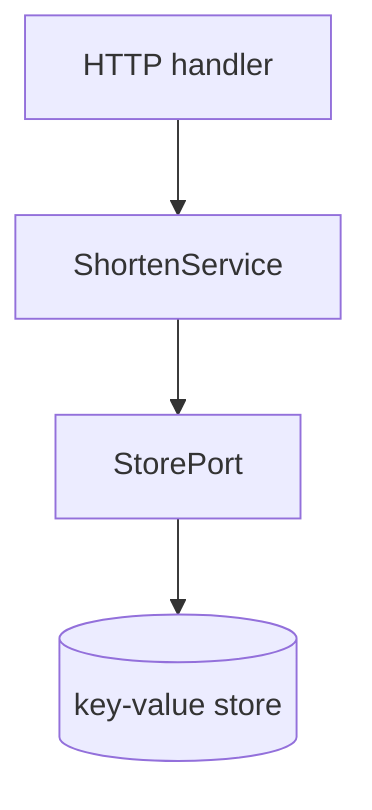
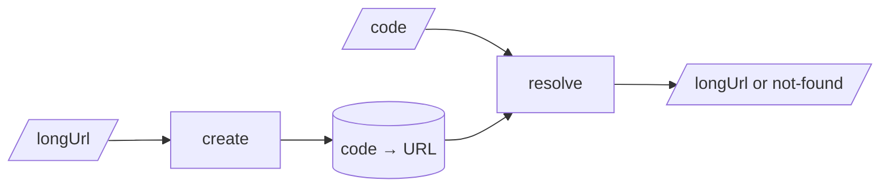
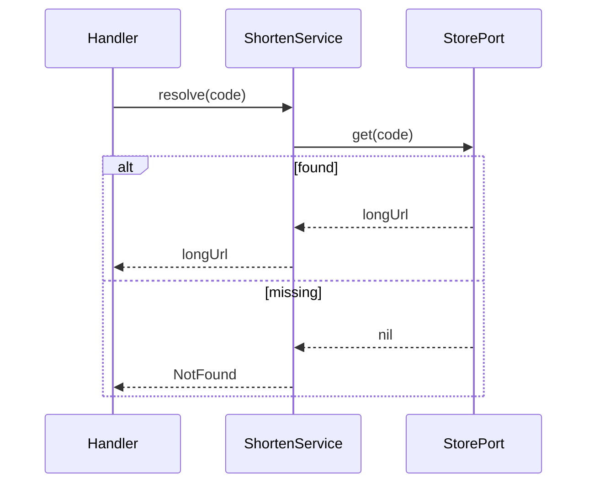

# SPEC-01: Shorten Service

## Document Control

| Field | Value |
|-------|-------|
| Document ID | SPEC-01 |
| Status | Approved |
| Version | 1.0.0 |
| Readiness score | 92 / 100 |
| Decision source | @adr: ADR-01 |

## 1. Overview

The implementation-ready, C4-L3 component contract for the URL shortener,
realizing @adr: ADR-01 and the EARS requirements. C4-L4 (code/class) detail is
deferred to `TDD-01` and the implementation.

## 2. Component View (C4 Level 3)

`@diagram: c4-l3`

- diagram_type: c4
- level: l3
- scope_boundary: ShortenService component and its store port
- upstream_refs: @adr: ADR-01
- downstream_refs: TDD-01

## 3. Component Contract

- **SPEC.01.03.a1b2** — `ShortenService.create(longUrl) -> code`. Generates a
  7-char base62 code, stores the mapping, returns the code. Source
  @ears: EARS.01.03.5e2a and @adr: ADR-01
- **SPEC.01.03.c3d4** — `ShortenService.resolve(code) -> longUrl | NotFound`.
  Looks the code up; returns the URL or a not-found result. Source
  @ears: EARS.01.03.a1f7

### Interfaces

| Operation | Input | Output | Errors |
|-----------|-------|--------|--------|
| create | longUrl | code | invalid-url |
| resolve | code | longUrl | not-found |

## 4. Data-Flow Constraints (DFD Level 3)

`@diagram: dfd-l3`

## 5. Behavior — required sequence paths

`@diagram: sequence-error`

## 6. Quality Attributes

Redirect latency budget p95 under 50 ms.
Tracked as @threshold: SPEC.01.perf.redirectP95Ms

## 7. Traceability

Upstream: @brd: BRD.01.04.0a13 | @prd: PRD.01.09.1dbc | @ears: EARS.01.03.5e2a | @bdd: BDD.01.03.8f4c | @adr: ADR-01
Downstream `TDD-01` defines the tests; C4-L4 ownership lands in the implementation.
