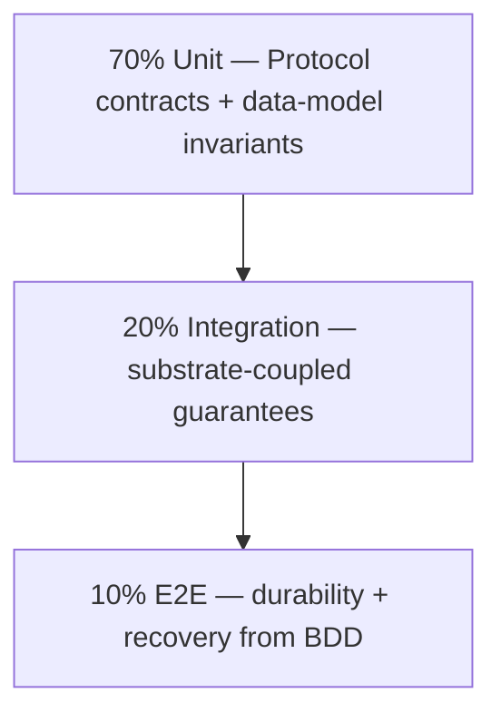

# TDD-01: Link Store

Self-tag: @tdd: TDD-01

Cumulative upstream tags (Layer 7 — necessary-upstream contract): @ears: EARS.01.03.8df7 | @ears: EARS.01.03.97c4 | @ears: EARS.01.03.d808 | @ears: EARS.01.03.e2e9 | @ears: EARS.01.03.539a | @bdd: BDD.01.03.8b97 | @bdd: BDD.01.03.bdae | @bdd: BDD.01.03.ed21 | @bdd: BDD.01.03.bcfb | @bdd: BDD.01.03.f44a | @bdd: BDD.01.03.1664 | @bdd: BDD.01.03.5f58 | @bdd: BDD.01.03.a7ad | @adr: ADR-01 | @adr: ADR.01.03.5c3c | @adr: ADR.01.03.1050 | @adr: ADR.01.03.f5f5 | @adr: ADR.01.05.3afa | @adr: ADR.01.05.9107 | @spec: SPEC-01

## 1. Document Control

| Field | Value |
|-------|-------|
| Document ID | TDD-01 |
| Component | Link Store |
| Status | Draft |
| Version | 1.0.1 |
| Author | flow-walkthrough |
| SPEC reference | @spec: SPEC-01 |
| Readiness score | recomputed by doc-tdd-audit |
| Created | 2026-06-10 |
| Last updated | 2026-06-10 |

| Version | Date | Author | Change |
|---------|------|--------|--------|
| 1.0.0 | 2026-06-10 | flow-walkthrough | Initial draft from SPEC-01 v1.0.1; eight Link-Store BDD scenarios mapped. |
| 1.0.1 | 2026-06-10 | doc-tdd-fixer | Audit remediation (iter 1): 12 P2 + 8 P3; 21 → 30 cases; observability/latency/runtime/flake gates + fixture/naming/fault conventions. |

## 2. Test Pyramid

Effort distribution (targets, not quotas).

| Type | Target | Focus |
|------|--------|-------|
| unit | 70% | method contracts; `LinkRecord` + `ClaimResult` field validation |
| integration | 20% | atomic write, durable-commit ordering, native increment, encryption, audit, auth/TLS |
| e2e | 10% | RPO = 0, fail-closed write, idempotent recovery, count-fault isolation + reconciliation |

## 3. Test Mapping

Each of the eight Link-Store BDD scenarios (SPEC-01 §8) maps to test types and
files. `@ears`/`@adr`/`@spec`-tagged rows are *contract-derived* — validating a
SPEC contract no single BDD scenario isolates. Test files precede code (§6).

| Scenario / source | Behavior | Unit | Integration | E2E |
|---|---|---|---|---|
| @bdd: BDD.01.03.8b97 | durable commit before ack (RPO = 0) | `TDD.01.04.2fdb` | `TDD.01.04.af07` `TDD.01.04.a300` | `TDD.01.04.ec06` |
| @bdd: BDD.01.03.bdae | concurrent collision → distinct codes | `TDD.01.04.82ff` | `TDD.01.04.840c` | — |
| @bdd: BDD.01.03.ed21 | issuance fails closed, no orphan | — | — | `TDD.01.04.0340` |
| @bdd: BDD.01.03.bcfb | idempotent recovery | `TDD.01.04.fa16` | — | `TDD.01.04.4e51` |
| @bdd: BDD.01.03.f44a | `get` known / unknown / taken-down; fails over + recovers when degraded | `TDD.01.04.cf05` `TDD.01.04.54b8` `TDD.01.04.1bc0` `TDD.01.04.d9ec` | `TDD.01.04.7115` `TDD.01.04.9fe0` | — |
| @bdd: BDD.01.03.1664 | visit count off the hot path (success) | `TDD.01.04.74e8` `TDD.01.04.25b2` | `TDD.01.04.ab25` | — |
| @bdd: BDD.01.03.5f58 | redirect survives degraded count write (fault isolation) | `TDD.01.04.9528` | — | `TDD.01.04.3e85` |
| @bdd: BDD.01.03.a7ad | dropped increment reconciled | — | — | `TDD.01.04.3e85` |
| @ears: EARS.01.03.539a | `set_status` takedown / KeyError / unavailable | `TDD.01.04.dfd3` `TDD.01.04.ee3d` | `TDD.01.04.74a4` | — |
| @brd: BRD.01.08.9665 | code-validation `ValueError` (+ fuzz) | `TDD.01.04.8504` | `TDD.01.04.fc47` | — |
| @spec: SPEC-01 | `LinkRecord` / `ClaimResult` contracts | `TDD.01.04.a632` `TDD.01.04.8c69` | — | — |
| @spec: SPEC-01 §6 | resilience — load / overload / shed order | — | `TDD.01.04.233a` `TDD.01.04.d5ca` | — |
| @adr: ADR.01.03.1050 | encryption / audit / auth / TLS | — | `TDD.01.04.24ff` `TDD.01.04.7822` `TDD.01.04.31ba` `TDD.01.04.5045` | — |
| @adr: ADR.01.03.f5f5 | one-way substrate deploy-gate + rollback-path smoke | — | `TDD.01.04.d5d7` `TDD.01.04.f8c1` | — |

Files (test-first): `tests/unit/test_link_store.py` ·
`tests/integration/test_link_store_kv.py` · `.../test_security_and_audit.py` ·
`tests/e2e/test_durability_and_recovery.py`. Coverage: 8/8 BDD scenarios, 4/4
methods, 2/2 data models; 30 cases (unit 13, integration 7, security 3, e2e 4,
performance 2, smoke 1).

## 4. Test Cases

Element IDs are four-segment (per §3); trace tags in §7; e2e cases carry their
`bdd_ref` inline.

**Test conventions** (all cases): naming `test_<method>_<condition>_<expected>`;
each unit case builds a fresh function-scoped in-memory KV double (no carry-over,
order-independent); faults (refused/dns/tls/timeout/latency) come from a
controllable KV-adapter double or toxiproxy with a deterministic clock — never a
real `sleep` or restart; every fault-injecting case clears the fault and asserts
a clean baseline before the next test.

**Unit** — `tests/unit/test_link_store.py` (SPEC §3–4, in-memory KV double):

- `TDD.01.04.2fdb` `claim` a free code → `ClaimResult(COMMITTED, record, replay=False)`; a later `get` returns it. type: unit.
- `TDD.01.04.82ff` second `claim` on a live code → `CODE_TAKEN, record=None, replay=False`; winner unchanged; loser never gets the record. type: unit.
- `TDD.01.04.fa16` re-`claim` with the same `idempotency_key` → `COMMITTED, replay=True`, no new write; a no-key retry is out of contract and never issued. type: unit.
- `TDD.01.04.8504` `claim` with `"abc!23"` / `""` / over-width / spaced code, plus encoding-edge and injection-class inputs (unicode NFC/NFD, percent-encoded, embedded NUL/control char, base62 homoglyph per BDD.01.03.e8b9) → `ValueError` before the conditional-put; no write. type: unit.
- `TDD.01.04.cf05` `get` a known code → its `LinkRecord`. type: unit.
- `TDD.01.04.54b8` `get` an unknown code → `None`, not an exception. type: unit.
- `TDD.01.04.1bc0` `get` a `taken_down` code → record still returned; suppression is the redirect path's concern. type: unit.
- `TDD.01.04.d9ec` `get` with a malformed / oversized / encoding-edge / homoglyph `code` (unicode NFC/NFD, percent-encoded, NUL/control char, base62 homoglyph) → `ValueError` before any substrate read, or a deterministic `None`; read-path normalization matches the claim path — never a normalized-key collision with a claimed code. type: unit.
- `TDD.01.04.74e8` `increment_visits` on a healthy count write → `visit_count += delta` (default 1); partial-field write only, mapping fields untouched, never blocks `get`. type: unit.
- `TDD.01.04.25b2` `increment_visits` with a negative / zero / overflow-width `delta` → rejected or no-op, preserving the SPEC §4 monotonic `visit_count` contract; an encoding-edge `code` → `ValueError` before the native increment. type: unit.
- `TDD.01.04.9528` `increment_visits` with the count write faulting → returns `None`, raises nothing, writes a reconciliation entry with a unique `delta_id`; redirect path unaffected. type: unit.
- `TDD.01.04.dfd3` `set_status(code, taken_down)` on a live code → updated record; re-apply is idempotent (last-writer-wins, same terminal status). type: unit.
- `TDD.01.04.ee3d` `set_status` on a missing code → `KeyError` (SPEC §3 named error); no record created. type: unit.
- `TDD.01.04.a632` `LinkRecord` enforces required fields; `status` defaults to `active`, `visit_count` to `0`; `idempotency_key` optional; `created_at` UTC; `LinkStatus ∈ {active, taken_down}`. type: unit.
- `TDD.01.04.8c69` `ClaimResult` totality: `COMMITTED → (record set, replay∈{T,F})`; `CODE_TAKEN → (record None, replay False)`; `(CODE_TAKEN, replay=True)` rejected. type: unit.

**Integration** — real KV adapter (SPEC §5–6):

- `TDD.01.04.840c` two coroutines released on a shared `asyncio.Event` barrier `claim` the same candidate → exactly one `COMMITTED`, one `CODE_TAKEN`, one durable record, no orphan; assert the write-conflict counter incremented and the atomic-claim-outcome metric carries `outcome=CODE_TAKEN` for the loser (SPEC §6); an adapter lacking atomic conditional-put is non-conformant. file: `test_link_store_kv.py`. type: integration.
- `TDD.01.04.af07` `claim` against a healthy KV adapter returns `COMMITTED` only after the durable commit is observed (RPO = 0); no write-behind; assert the durable-commit latency metric, a `claim` trace span (with status), and the atomic-claim-outcome metric carrying `outcome=COMMITTED` (SPEC §6). file: `test_link_store_kv.py`. type: integration.
- `TDD.01.04.a300` `claim` against a faulting KV adapter whose durable commit fails → raises `StoreUnavailableError`, no orphan, no write-behind; success-path observability does not fire. file: `test_link_store_kv.py`. type: integration.
- `TDD.01.04.7115` `get` with the read path forced down (refused/timeout) → raises `StoreUnavailableError` within ≤ 1 s (EARS.01.03.fab2), no hang; assert a `StoreUnavailableError` ERROR log with structured fields; caller maps to fail-safe not-found / 5xx. A happy-path probe asserts `get` p95 ≤ 10 ms (SPEC §6). file: `test_link_store_kv.py`. type: integration.
- `TDD.01.04.9fe0` get-path recovery: read path forced down → `get` raises `StoreUnavailableError` (detection, as `7115`); clear the fault, then a subsequent `get` resolves the known record within p95 ≤ 10 ms (SPEC-01 §5 "recovers when the store returns"); mirrors the `ec06`/`4e51` write-path detection+recovery pairs. file: `test_link_store_kv.py`. type: integration.
- `TDD.01.04.ab25` N = 20 concurrent `increment_visits` (consistent with BDD.01.03.b9e7), all dispatched behind a shared `asyncio.Event` barrier, via native ADD/INCR → final `visit_count == start + 20` (no lost updates), partial-field write only; never blocks `get`. file: `test_link_store_kv.py`. type: integration.
- `TDD.01.04.24ff` claim a record → stored bytes are AES-256 envelope-encrypted under the provider-managed KMS key; plaintext `original_url` absent at rest; missing key binding fails closed; a KMS key-unwrap delay that pushes total claim latency past the EARS.01.03.f909 issuance budget → claim completes within budget or raises `StoreUnavailableError` with no orphan. Cipher-mode, KMS key-ARN, and the concrete ms ceiling bind at IPLAN. file: `test_security_and_audit.py`. type: integration.
- `TDD.01.04.7822` `claim`, takedown `set_status`, and authn success/failure each emit one audit event carrying `{event_type, actor_principal, target_code, outcome, ts_utc}`; the §5 reconciliation log stays separate. file: `test_security_and_audit.py`. type: integration.
- `TDD.01.04.74a4` `set_status` with the write path degraded → raises `StoreUnavailableError` (SPEC §3 named error), fails closed, the record's status is unchanged, and the operation is safe to retry idempotently. file: `test_link_store_kv.py`. type: integration.
- `TDD.01.04.233a` load/overload (BDD.01.03.b9e7 100 rps / 30k-sample envelope): design load → throughput floors hold (≥ 500 read/s, ≥ 50 write/s, ≥ 500 increment/s), error budget ≤ 0.1%; 1.5× safe-overload margin holds; beyond 1.5× → fail-fast shed (`StoreUnavailableError`, bounded queue, no collapse). file: `test_link_store_kv.py`. type: performance.
- `TDD.01.04.d5ca` past the shed threshold, assert the SPEC §6 shed ORDER: `increment_visits` sheds first, then `claim`, while `get` still resolves known codes (`get` preserved last) — the positive degradation guarantee, not single-feature absence. file: `test_link_store_kv.py`. type: performance.
- `TDD.01.04.d5d7` deploy-gate smoke for the one-way substrate decision (ADR.01.03.f5f5): `claim` a fresh code on the live substrate → `COMMITTED`; `get` returns it; durable-commit metric emitted. timeout ≤ 30 s. file: `test_link_store_kv.py`. type: smoke.
- `TDD.01.04.f8c1` non-prod rollback-path smoke for the one-way substrate decision (ADR.01.03.f5f5, ADR §7 runbook steps 3/5/7): export committed records from the primary KV; import into a secondary KV with uniqueness-verification (no duplicates, no loss); run an RPO = 0 probe on the secondary — `claim` a fresh code, then `get` confirms the pre-imported records still resolve. timeout ≤ 120 s. file: `test_link_store_kv.py`. type: smoke.

**Security** — `tests/integration/test_security_and_audit.py` (SPEC §6, ADR.01.03.1050):

- `TDD.01.04.31ba` a `claim` with an invalid / non-least-privilege principal → write fails closed (`StoreUnavailableError`), no orphan, authn-failure audit event. threat: CWE-287/CWE-306. type: security.
- `TDD.01.04.5045` a substrate connection over plaintext / TLS < 1.2 → refused, fails closed, no read or write over the non-conforming channel. threat: CWE-319. type: security.
- `TDD.01.04.fc47` `set_status` with a malformed / oversized / encoding-edge `code` (unicode NFC/NFD, percent-encoded, embedded NUL/control char, base62 homoglyph) → `ValueError` before any write; no partial state change. threat: CWE-20. type: security.

**E2E** — `tests/e2e/test_durability_and_recovery.py`:

- `TDD.01.04.ec06` bdd_ref @bdd: BDD.01.03.8b97 — claim → `COMMITTED`; hard-restart the store; `get` resolves the unchanged mapping (RPO = 0). timeout 60 s; cleanup tear down store + namespace. type: e2e.
- `TDD.01.04.0340` bdd_ref @bdd: BDD.01.03.ed21 — degrade the write (refused/dns/tls/slow ≥ 600 ms); `claim` raises `StoreUnavailableError`, nothing committed, later `get` → `None`. timeout 30 s; cleanup restore + assert empty. type: e2e.
- `TDD.01.04.4e51` bdd_ref @bdd: BDD.01.03.bcfb — a claim fails closed, write path restored, retry the same `(code, record, key)` → exactly one code committed (replay honored), no orphan, within issuance budget. timeout 30 s; cleanup assert single record. type: e2e.
- `TDD.01.04.3e85` bdd_ref @bdd: BDD.01.03.5f58 | @bdd: BDD.01.03.a7ad — degrade the count write, drive a redirect-triggered increment; redirect still resolves, drop logged with a unique `delta_id`; assert the increment-drop metric and reconciliation-depth gauge emitted; restore + reconcile, then reconcile again → delta replayed exactly once (no double-count), reconciliation completing within the 60 s budget (BDD.01.03.a7ad), not merely the 90 s harness timeout. timeout 90 s; cleanup drain log. type: e2e.

## 5. Thresholds

CI enforces these gates.

| Type | Coverage | Pass criteria | Fail action |
|------|----------|---------------|-------------|
| unit | ≥ 90% | all pass; no skips | block merge |
| integration | ≥ 85% | all pass; atomic-put + durable-commit + native-increment contracts validate | block merge |
| e2e | ≥ 75% happy paths; ≤ 300 s | RPO = 0, fail-closed, recovery, reconciliation pass; no regressions | block deploy to staging |
| security | all auth/authz + transport paths | auth fail-closed + TLS-required hold; no OWASP A02/A07 findings | block deploy |
| performance | throughput floors + 1.5× margin + shed order (case `d5ca`) | ≥ 500 read/s, ≥ 50 write/s, ≥ 500 increment/s; `StoreUnavailableError` ≤ 0.1%; fail-fast shed beyond 1.5× | block deploy |
| smoke | claim+get+metric on live substrate; ≤ 30 s | `COMMITTED` + record present + durable-commit metric emitted | block deploy (all environments) |

Per-operation latency gates:

| Operation | Gate | Source |
|-----------|------|--------|
| `get` | p95 ≤ 10 ms (store slice of the 50 ms redirect budget) | SPEC §6 / @threshold: PRD.01.perf.redirectp95 |
| `claim` | within issuance budget EARS.01.03.f909 less commit headroom | SPEC §6 |
| `StoreUnavailableError` raise (`get`/`claim`/`set_status`) | ≤ 1 s (EARS.01.03.fab2) | SPEC §3 |
| reconciliation | ≤ 60 s of trigger (BDD.01.03.a7ad) | SPEC §5 |

Runtime baselines and flake budgets (baselines via `pytest --durations=0` on
the first green run; over-budget tests are quarantined within one business day):

| Class | Runtime baseline | Flake budget | Regression trigger |
|-------|------------------|--------------|--------------------|
| unit | ≤ 10 s | 0% | > 50% over baseline → investigation gate |
| integration | ≤ 60 s | ≤ 1% (30-day rolling) | > 50% over baseline → investigation gate |
| e2e | ≤ 300 s | ≤ 2% | > 50% over baseline → investigation gate |

## 6. TDD Order

Test-first generation order:

| Phase | Name | Action |
|-------|------|--------|
| 1 | Write Tests | generate all four test files from §3–4 |
| 2 | Run (Red) | execute; confirm failure (no implementation) |
| 3 | Implement | generate the `LinkStore` adapter to pass tests |
| 4 | Verify (Green) | re-run; confirm all pass |
| 5 | Refactor | clean up; tests stay green |

Phase-1 order: unit → integration → e2e.

## 7. Traceability

Document tag: @tdd: TDD-01

Cumulative upstream tags (Layer 7 — necessary-upstream contract); PRD/BRD
lineage is transitive through the EARS/BDD chain.

- @spec: SPEC-01
- @ears: EARS.01.03.8df7 | @ears: EARS.01.03.97c4 | @ears: EARS.01.03.d808 | @ears: EARS.01.03.e2e9 | @ears: EARS.01.03.539a
- @bdd: BDD.01.03.8b97 | @bdd: BDD.01.03.bdae | @bdd: BDD.01.03.ed21 | @bdd: BDD.01.03.bcfb | @bdd: BDD.01.03.f44a | @bdd: BDD.01.03.1664 | @bdd: BDD.01.03.5f58 | @bdd: BDD.01.03.a7ad
- @adr: ADR-01 | @adr: ADR.01.03.5c3c | @adr: ADR.01.03.1050 | @adr: ADR.01.03.f5f5 | @adr: ADR.01.05.3afa | @adr: ADR.01.05.9107

Downstream: IPLAN-01 enforces test-before-code and binds the KV provider,
consuming @tdd: TDD-01

Health: 8/8 BDD scenarios mapped · 4/4 methods · target ≥ 90/100.

## Glossary

| Term | Definition |
|------|------------|
| RPO | Recovery Point Objective — tolerated data-loss window; zero for acknowledged mappings. |
| CODE_TAKEN | `claim` outcome when a code is already claimed; loser retries a distinct code. |
| Replay | An idempotent re-claim matching an existing record with no new write. |
| Reconciliation | Replaying logged dropped visit-count deltas without double-counting. |
