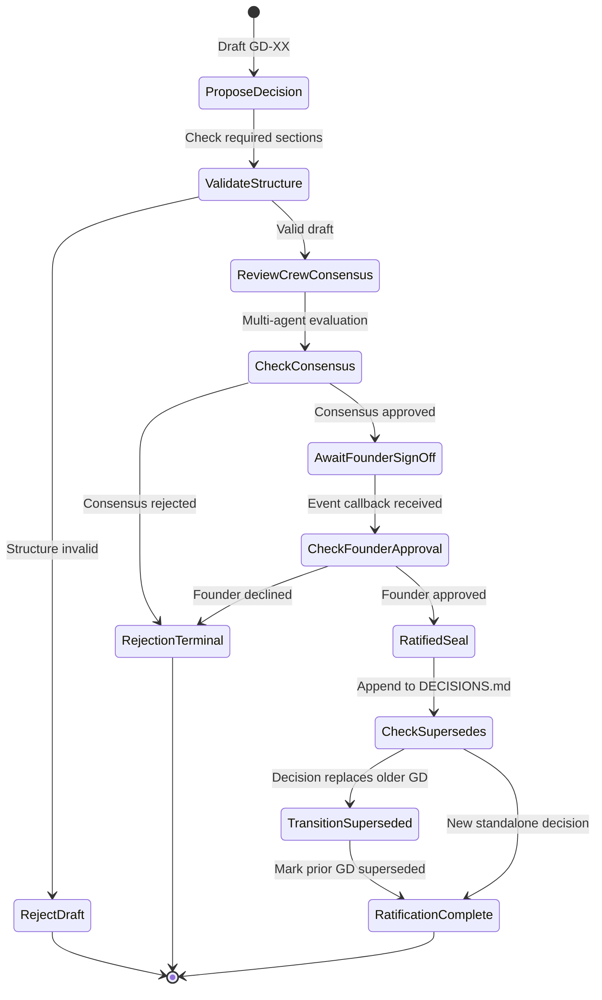

# Decision Workflow: Seed vs Module vs SDD ADR

## Document Control

| Field | Value |
|-------|-------|
| Version | 1.2 |
| Status | Approved |
| Last Updated | 2026-10-05 |
| Author | Framework Maintainer |
| Framework Version | 0.88.0 |


Defines the authorship boundary between seed, module, and SDD decision layers.
This document prevents duplication between seed suggestions and SDD formal
decisions. It is engine-agnostic — it constrains the artifacts, not any
platform's runtime.

## Purpose

The SDD chain has three distinct tiers where decisions are recorded, each with
a different author, content scope, and lifecycle. Confusion about which tier
owns which decision causes duplication, stale documents, and rework. This
document clarifies the boundaries.

## Three-Tier Decision Model

```
Seed (architect)          Module (product owner)        SDD ADR (dev team)
─────────────────         ──────────────────────        ───────────────────
Suggestions               ALL source material            ONE selected option
2-3 options               Refined decisions              Formal decision
Options + rationale       Invariants + constraints       Context-Decision-Consequences
Frozen per version (GD-36) Living document                Versioned per CHG
```

### Tier 1: Seed Documents

- **Author:** System architect, with stakeholder/management input
- **Content:** Initial architecture suggestions, 2-3 options per decision,
  design principles, rationale for each option
- **Location:** `<project>/seed/architecture/`, `<project>/seed/agent-surface/`
  (canonical Tier 1 Inputs path; scaffold: `framework/templates/SEED-TEMPLATE.md`)
- **Lifecycle:** Frozen per version once the first BRD of a cycle is authored
  (per `SEED_CONTRACT.md` R1); supersedes version via F3 Phase 0a per GD-36

**What seed docs contain:**
- "Here are 3 options for telemetry collection"
- "Option A: managed Grafana Cloud. Option B: self-hosted. Option C: hybrid"
- "Design principle: vendor-neutral, PII-safe, layered"
- "ADR-14 accepted this strategy but was never implemented"

**What seed docs do NOT contain:**
- Final implementation decisions
- Code-level constraints
- Business requirements (those belong in BRD)

### Tier 2: Module Docs

- **Author:** Product owner, refined by development team
- **Content:** ALL source material for a module — overview, refined decisions,
  invariants, constraints, seed references, business rules, acceptance criteria
- **Location:** `<project>/modules/MODULE-NN_name.md` (can have multiple files
  per module)
- **Lifecycle:** Living document, updated as understanding evolves

**What module docs contain:**
- Refined design principles (from seed, validated against codebase reality)
- Invariants (non-negotiable constraints)
- Business rules and acceptance criteria
- Seed references with context
- Architecture diagrams
- Implementation roadmap
- Dependencies and constraints

**Module is the single source of truth.** Everything needed to write a BRD for
this module lives in the module doc.

**Multi-file modules:** If a module grows beyond ~1000 lines, split into:
- `MODULE-NN_overview.md` — overview, principles, constraints
- `MODULE-NN_<topic>.md` — specific subsystems

### Tier 3: SDD ADR (Layer 5)

- **Author:** Development team
- **Content:** ONE selected architecture with Context-Decision-Consequences
- **Location:** `<project>/sdd/05_ADR/ADR-NN_name.yaml`
- **Lifecycle:** Versioned per CHG (rewritten, not appended)

**What SDD ADRs contain:**
- "We chose option B (self-hosted Grafana stack)"
- Context: why this decision matters
- Decision: what was selected
- Consequences: what this enables and constrains
- Alternatives considered: briefly listed (not full analysis)

**What SDD ADRs do NOT contain:**
- Full analysis of 2-3 options (that's in the seed)
- Business requirements (that's in the BRD)
- Implementation details (that's in the SPEC)

## Rules

1. **No separate seed ADR files.** Decisions live in modules. The
   `seed/adr/` directory contains web-specific ADRs from the original seed —
   it is not a template for creating new seed ADR files.

2. **Module is the bridge.** Seed → Module → SDD. The module refines seed
   suggestions into constraints and invariants. The SDD ADR selects one
   approach from the module's options.

3. **SDD ADR selects, doesn't re-survey.** The ADR's "Alternatives Considered"
   section briefly lists options (from the module/seed), but the full analysis
   stays in the seed. The ADR focuses on the selected option and its
   consequences.

4. **Seed claims go to BRD, not ADR.** The BRD's `seed_disposition:` section
   accounts for every seed claim (absorbed/rejected/deferred). The ADR doesn't
   need its own seed disposition.

5. **Module can reference archived ADRs.** If a seed doc references an archived
   ADR (e.g., ADR-14), the module carries that reference forward. The SDD ADR
   (Layer 5) creates a fresh decision, not a copy of the archived one.

## Authorship Matrix

| Artifact | Author | Contains | Lifecycle |
|----------|--------|----------|-----------|
| Seed doc | System architect + stakeholders | Suggestions, options, principles | Frozen per version (GD-36) |
| Module doc | Product owner + dev team | ALL source material, refined decisions | Living document |
| BRD | Dev team (from module) | Business requirements, seed disposition | Approved when PRD starts |
| SDD ADR | Dev team | ONE selected architecture | Versioned per CHG |
| SPEC | Dev team | Implementation specification | Versioned per CHG |
| IPLAN | Dev team | Execution plan | Completed when code is green |

## Executable CNCF Decision Ratification Flow

Decisions that alter framework governance or shared contracts (`DECISIONS.md`) pass through
a formal ratification state machine. To guarantee procedural consistency and provide multi-agent
graph orchestrators with deterministic state transitions, the ratification lifecycle is
formalized in:
`framework/governance/workflows/decision-ratification-flow.sw.yaml`.

The workflow conforms to the CNCF Serverless Workflow v0.8 specification (`specVersion: "0.8"`):



### State-to-Primitive Mapping

| Workflow State | CNCF State Type | Operational Semantics |
|---|---|---|
| `ProposeDecision` | `operation` | Collects candidate decision draft (Context, Decision, Consequences, Alternatives) |
| `ValidateStructure` | `switch` | Verifies presence of mandatory sections and unique GD-XX identifier |
| `RejectDraft` | `operation` (end) | Rejects draft due to structural or metadata defects |
| `ReviewCrewConsensus` | `parallel` | Gathers independent multi-agent evaluations from review personas |
| `CheckConsensus` | `switch` | Evaluates whether review crew reached unanimous or qualified consensus |
| `AwaitFounderSignOff` | `callback` | Suspends execution awaiting asynchronous human founder OK (`decisionSignOffEvent`) |
| `CheckFounderApproval` | `switch` | Branches based on founder signature / approval decision |
| `RatifiedSeal` | `operation` | Marks decision as Accepted, seals record with merge SHA and ISO timestamp |
| `CheckSupersedes` | `switch` | Detects whether the new decision supersedes prior ratified decisions |
| `TransitionSuperseded` | `operation` | Marks superseded decisions with transition pointer and reason |
| `RatificationComplete` | `operation` (end) | Bumps `DECISIONS.md` control version, updates changelog |
| `RejectionTerminal` | `operation` (end) | Terminal rejection state preserving audit log and rejection rationale |

## Cross-References

- `SEED_CONTRACT.md` — Seed lifecycle, disposition rules, and supersede flow
- `framework/templates/SEED-TEMPLATE.md` — Canonical seed document template
- `DOC_GOVERNANCE_CORE.md` — Version bumping, template policy
- `DECISIONS.md` — Authoritative record of ratified framework governance decisions
- `workflows/decision-ratification-flow.sw.yaml` — Canonical CNCF Serverless Workflow state machine
- `GOVERNANCE_WORKFLOW_STANDARD.md` — Normative specification for CNCF Serverless Workflow adoption
- `DIAGRAM_STANDARDS.md` — Visualization standards and Mermaid syntax for governance workflows
- `layers/09_CHG/gates/` — Gate definitions for CHG approval
- `registry/LAYER_REGISTRY.yaml` — Layer definitions and dependencies
