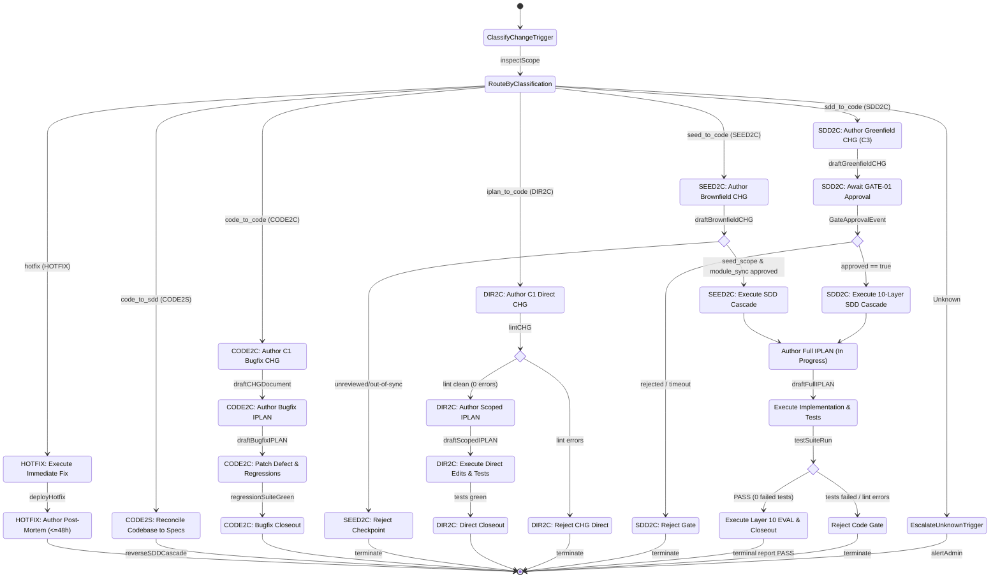

# CHG Request Flows

## Document Control

| Field | Value |
|-------|-------|
| Version | 1.4 |
| Status | Approved |
| Last Updated | 2026-10-06 |
| Author | Framework Maintainer |
| Framework Version | 0.90.2 |

| Field | Value |
|---|---|
| Status | **RATIFIED** (0.57.0, CHG-06) — REVIEWED 2/2; F3/spec vehicle landed the §7 deltas. Normative from this version |
| Version applicability | MINOR `0.56.0 → 0.57.0` (standalone; STALE P1 batch takes the next MINOR if shipped separately) |
| Provenance | Converted 2026-09-22 from `plans/CHG-REQUEST-FLOWS-CORE-DRAFT.md` (pass-1 gaps G1–G10 applied); ratified via CHG-06 + IPLAN-06 (`framework/archive/CHG-06/`); review history in Appendix A |
| Normative dependencies (LANDED in 0.57.0) | `change_source: direct` (template enum + guidance); F2.2 §3.13 sentence; GOV-018 + `chg_lint` CHG-L013 + fixtures; conformance router-agreement test |

> **Ratified 0.57.0 (CHG-06).** All §7 deltas landed: `direct` is a valid template value, the F2.2
> ruling governs §3.13, and CHG-L013/GOV-018 enforces the router.

## 1. Flow selector (normative router)

Every artifact change MUST be classified into exactly one flow — or into a governed non-flow path (Emergency,
Type-R) that yields to its own section — before a CHG is authored. Classify in this order — the first matching
row wins:

| Code | Flow Identifier | Traversal Path | Trigger | `change_source` | `change_level` | Entry Gate | SDD Cascade? | IPLAN Shape | Verification |
|:---:|:---|:---|:---|:---|:---|:---|:---|:---|:---|
| **HOTFIX** | `hotfix` | `Code` $\rightarrow$ `Prod` (post-hoc `Doc`) | Critical production issue requiring fix before authorization | `Emergency` level | Emergency | Post-hoc | None (retroactive document within 48h + post-mortem) | Fix IPLAN post-hoc per `09_CHG/README.md` + `POST_MORTEM-TEMPLATE.md` | Post-mortem verification; deployable fixes close live (§3.3 rule 10) |
| **CODE2S** | `code_to_sdd` | `Code` $\rightarrow$ `IPLAN` $\rightarrow$ `SDD` | Verified working codebase preceding its specs (non-emergency empirical work) | `reconciliation` | C2 typical | GATE-CODE | Reverse — Code→TDD→SPEC→BDD→EARS per §3.1.2 | Reverse-authored (ground truth from code) | §3.1.2 Phase-3 battery; runtime touches close live (§3.3 rule 10) |
| **CODE2C** | `code_to_code` | `Defect` $\rightarrow$ `IPLAN` $\rightarrow$ `Code` | Defect found in EVAL, manual test, or field use, traceable to a `Completed`/`Verified` parent IPLAN | `feedback` | C1 CHG (CHG-05 vehicle) | GATE-CODE | No (parent SDD stands; fix-IPLAN carries `validation_findings`) | Bugfix-subtype (`parent_iplan` + `source_chg`, repair-scoped manifest, rollback) | Regression suite + parent revision entry; runtime fixes close live (§3.3 rule 10) |
| **SEED2C** | `seed_to_code` | `Seed` $\rightarrow$ `Module` $\rightarrow$ `SDD` $\rightarrow$ `Code` | Product design or behavior change to an implemented product (Full Multi-Tier Chain) | `upstream` / `midstream` / `design` / `spec` | C2 / C3 (C3 if cross-layer or new requirements) | GATE-01 / 03 / 06 / GATE-SPEC | Yes — modules-first restart per §4 (0a seed_scope, 0b affected-module sync + review checkpoint, 0c SDD cascade over affected layers and everything below) | Full, referencing NEW SDD versions (authored only after checkpoint passes) | EVAL cycles + live closeout (deployable — §3.3 rule 10) |
| **DIR2C** | `iplan_to_code` | `IPLAN` $\rightarrow$ `Code` / `Docs` | Human or AI-agent request, unrelated to any prior IPLAN, no product-behavior change (docs, scripts, hooks, small tooling) | `direct` | C1 (every C1: C1 CHG + scoped IPLAN per F2.2, every author; sole exception seed-phase drafting pre-first-BRD) | GATE-CODE | No (`sdd_lifecycle: []`) | Scoped (manifest + steps only, §3.3) | Covering tests + verification commands in scoped IPLAN; static closeout (non-deployable — §3.3 rule 10) |
| **SDD2C** | `sdd_to_code` | `BRD` $\rightarrow$ `PRD` $\rightarrow$ ... $\rightarrow$ `Code` | New product / new layer chain, no prior implementation (SDD Layer Chain) | `upstream` | C3 | GATE-01 | Yes — full 10-layer authoring per §3.1.1 (BRD→PRD→EARS→BDD→ADR→SPEC→TDD→IPLAN→Code→EVAL) | Full (all code steps, full manifest) | EVAL cycles + live closeout (deployable — §3.3 rule 10) |

*(Legacy Aliases: `HOTFIX` $\leftrightarrow$ Emergency, `CODE2S` $\leftrightarrow$ Type-R, `CODE2C` $\leftrightarrow$ F4, `SEED2C` $\leftrightarrow$ F3, `DIR2C` $\leftrightarrow$ F2, `SDD2C` $\leftrightarrow$ F1).*

### 1.1 Change Request Governance State Machine (CNCF Serverless Workflow Parity)

Normative visual representation maintaining 1-to-1 parity with `framework/governance/workflows/chg-request-flow.sw.yaml` per `DIAGRAM_STANDARDS.md` §Governance State Machines & Workflow Graphs:

<!--
diagram_type: state
scope_boundary: chg_request_flows
upstream_refs: [chg-request-flow.sw.yaml]
downstream_refs: [DOC_GOVERNANCE_CORE.md]
-->
<!-- @diagram: state-chg-request-flow -->

## 2. SDD2C (sdd_to_code / F1) — Greenfield SDD layer cascade

The initial 10-layer SDD flow (BRD → PRD → EARS → BDD → ADR → SPEC → TDD → IPLAN → Code/Docs/Scripts → EVAL → Verified).
`change_source: upstream`, `change_level: C3` (cross-layer by construction; `gate_approval.approver` required before status leaves `Proposed` per GOV-012),
entry GATE-01. SDD-first order (§3.1.1) applies end to end: no IPLAN before the SDD versions it references exist;
no code before an `In Progress` IPLAN exists (§3.13). This flow is fully governed today; it is named here so the
router is total — authors MUST NOT file greenfield work as `DIR2C` (F2) or `CODE2C` (F4) to dodge the cascade.

## 3. DIR2C (iplan_to_code / F2) — Direct leaf request

A change request from a human or another AI agent that is NOT related to a previous IPLAN implementation and does
NOT change product behavior: documentation edits, hook/script/tooling tweaks (`hooks/`, `framework/scripts/`,
`sdd_doc_lint/` tooling), template typo fixes, non-normative prose. No full SDD chain is required because there is
no SDD contract at stake — but every `DIR2C` change is traced: a C1 CHG + scoped IPLAN for every author (agents and
humans), no direct-commit path (CHG-12, issues #772/#773). The sole exception is seed-phase drafting before the
first BRD is authored against seed vN (SEED_CONTRACT R1) — when no other documents exist yet, there is nothing
to trace against.

**F2.1 — `change_source: direct` (new value).** Definition: origin is a direct requester instruction, not a layer
artifact, not production feedback, not an empirical codebase. Entry gate: GATE-CODE — its entry criteria apply
conditionally ("If cascade: upstream gates passed"; "IPLAN updated (if file manifest changes)"), so a
cascade-free change enters cleanly, and its RCA + regression-scope rows fit small changes. GATE-08 MUST NOT be
used: it requires upstream gates passed and TDD test cases defined unconditionally (`GATE-08_IPLAN.md:49-78`),
which a cascade-free change cannot satisfy. `External` MUST NOT be used for direct requests: `External (business)` routes to GATE-01 and
`External (technical)` to GATE-03 with multi-layer cascades (regulatory, CVE, dependency, 3rd-party API) —
routing a script tweak through either would mandate a phantom cascade. If the requester cites a regulation, CVE,
or vendor-API change, the flow is NOT `DIR2C` (reclassify: External → `SEED2C`-shaped cascade).

**F2.2 — C1 ruling (always-traced; CHG-12).** The template's old C1 row ("None — direct commit") is
retired. Every C1 requires a C1 CHG + scoped IPLAN, for every author (agents and humans):
- Docs-only, non-normative C1 (typo, formatting, clarification touching no code/scripts and no normative
  template/governance text): C1 CHG + scoped IPLAN. The shape stays minimal (requester citation, manifest,
  steps/commands, verification; covering tests N/A-allowed for pure prose) so trivial edits stay cheap —
  but traced. No direct-commit path survives (supersedes the F2-UNIFY-PLAN D2 human-only exception, CHG-12).
- Code- or script-touching C1 (any `*.sh`, `*.py`, hook, workflow, or normative-template edit): a C1 CHG +
  a scoped IPLAN are REQUIRED. The IPLAN Gate (§3.13) is satisfied by a scoped IPLAN (`In Progress`,
  `source_chg` naming the C1 CHG, manifest covering every touched file, covering test cases for code).
  "Small diff" is not an exemption; the IPLAN is what makes small diffs auditable.
- Normative-text C1 (a one-line governance/template fix that changes a contract): C1 CHG + scoped IPLAN; the
  prose change itself ships in the same diff. (This is how §7-type one-line fixes avoid full `SEED2C` ceremony
  without evading review.)
- Sole exception (all bullets): seed-phase drafting before the first BRD is authored against seed vN
  (SEED_CONTRACT R1) — pre-first-BRD drafting with no other documents in existence ships without a CHG/IPLAN.

**F2.3 — Minimal shapes.** The C1 CHG carries: change control (`direct`, C1), `sdd_lifecycle: []` (EMPTY —
any entry reclassifies the change to `SDD2C`/`SEED2C`) PAIRED WITH SDD-free `artifacts_modified` (GOV-014 binds the two:
no SDD document may appear in `artifacts_modified` unless the lifecycle lists it — for `DIR2C` both are empty of
SDD), implementation steps limited to IPLAN creation, and the requester citation (who asked, verbatim ask or
link — carried in the change description; no new template field). The scoped IPLAN carries: manifest,
steps/commands, covering test cases (REQUIRED for code-touching changes — GATE-CODE entry demands test cases
exist for changed code; verification commands alone do not satisfy entry), and verification commands;
SDD-trace sections stay empty by construction. Anything
larger than this shape is NOT `DIR2C`.

**F2.4 — Misclassification guard (lint).** A CHG with a code/script manifest AND (`sdd_lifecycle: []` without
`source: direct`, OR no IPLAN reference, OR no `parent_iplan` where `CODE2C` applies) fails lint — candidate
GOV-018, see §7. The failure message MUST name the suspected correct flow (`DIR2C`/`SEED2C`/`CODE2C`) so the author reclassifies
instead of force-passing. Known limit (pass 2): the guard is SYNTACTIC — a behavior change filed with a
well-formed `DIR2C` shape (source `direct` + scoped IPLAN + code manifest) lints green. Semantic misclassification
relies on human review of the requester citation (§F2.3) and the rejected-candidate record (§6, router rule).
Untraced changes (commits riding no CHG/IPLAN at all) are caught the same way: the PR reviewer verifies every
commit against the authorizing CHG/IPLAN manifest (CHG-12 enforcement decision) — branch protection forces
every change through a PR, so the review gate is total. GOV-018 stays syntactic by design (see LINT_RULES.md).

## 4. SEED2C (seed_to_code / F3) — Brownfield behavior change (full multi-tier chain)

A product design or behavior change to an implemented product restarts the full SDD chain at the lowest affected
layer: source `upstream` (BRD/PRD-level) / `midstream` (EARS/BDD/ADR) / `design` (SPEC/TDD), level C2 (single-layer
refinement, peer review) or C3 (cross-layer or new requirements, formal gate + approver), entry GATE-01/03/06 by
source. The §3.1.1 cascade is MANDATORY and ordered — and Phase 0 itself is ordered (modules-first):
Phase 0a seed_scope, Phase 0b module_lifecycle, Phase 0c SDD archive → rewrite → bump (upper layers first),
then Phase 1 IPLAN referencing the NEW versions, Phase 2 code.

**Phase 0a — seed_scope (record, or supersede).** The CHG records a `seed_scope` decision against the
seed tier: `no-change` (with the checked seed files cited — the common case, proven by verification, never
assumed), `create` (a genuinely new domain mints a new `seed/architecture/` or `seed/agent-surface/` file),
or `supersede` (a changed assumption archives the affected seed file's vN and authors vN+1 clean with a
`supersedes` link — affected files only, per `seed_scope.entries`). A published seed version is NEVER
rewritten in place (SEED_CONTRACT R1, frozen per version); a stale seed assumption is superseded, not
edited away. Every supersede re-points or re-disposes the BRD ledger rows pinned (`seed_version`) to the archived version
in the same CHG lifecycle. `change_source: spec` (framework self-changes:
templates/governance/registry/VERSION, GATE-SPEC, level ≥ C2 per GATE-SPEC-E003) is the special case of `SEED2C` where
the "product" is the framework itself. `SEED2C` MUST NOT be filed as `DIR2C` (no SDD
cascade) even when the diff looks small: behavior change without SDD update is the exact defect §3.1.1 exists to
prevent. `SEED2C` MUST NOT be filed as `CODE2C`: `CODE2C` repairs output to match standing SDD; `SEED2C` changes what the SDD promises.

**Phase 0b — module_lifecycle (sync affected modules only).** Every module the change touches is archived and
synced in the same CHG lifecycle as the SDD rewrites — version/date/changelog header, scope and invariants
updated, seed references re-pointed, never duplicated. Untouched modules are NOT versioned: the lifecycle lists
affected modules only, mirroring the SDD minimal-regeneration rule. Modules are the living source of truth the
SDD chain formalizes from, so a stale module is a defect of the same class as a stale SPEC.

**Review checkpoint (hard gate).** The seed → modules chain is reviewed and MUST pass BEFORE any SDD rewrite
begins and BEFORE any IPLAN is authored: seed_scope verified (checked files read; no-change justified, new
seed file landed, or supersede archived + bumped with ledger rows re-pointed), every affected module synced and archived, every untouched module provably out of scope.
No SDD lifecycle step runs and no IPLAN is authored until this checkpoint passes — an IPLAN written against
unreviewed modules references a chain that is not actual. The checkpoint verdict is recorded in the CHG.

## 5. CODE2C (code_to_code / F4) — Bugfix on implemented IPLAN

A defect found during EVAL, manual test, or field use, traceable to a `Completed`/`Verified` parent IPLAN, is
repaired exclusively through the CHG-05 vehicle (0.56.0, canon — `LINT_RULES.md:131` GOV-013 carve-out): the parent
stays immutable (no reopening, no backward transitions); a C1 CHG authorizes; a scoped bugfix-subtype IPLAN
(`parent_iplan` + `source_chg`, `In Progress`, repair-scoped manifest, rollback with PENDING→DONE/SKIPPED markers)
satisfies §3.13 as the governed path, not an exemption. Source is `feedback` (production/user-originated defect);
`execution` (IPLAN-level correction pre-completion) stays on the parent IPLAN itself and never becomes `CODE2C`.
No-fix-on-fix: a failed attempt runs rollback; retry is a new sibling citing `prior_attempts`. `CODE2C` MUST NOT be used
for behavior change (that's `SEED2C`) or for defects in `Draft`/`Approved`/`In Progress` plans (fix on the active IPLAN
itself — the AGENTS.md exception — no CHG required).

## 6. Router procedure (replaces ad-hoc classification)

1. Critical production issue requiring fix before authorization? → **`HOTFIX` (`hotfix` / Emergency path)** (fix → deploy → document + post-mortem within 48h). The router yields. `DIR2C` is never the speed lane for production incidents.
2. Verified working codebase preceding its specs (non-emergency empirical work)? → **`CODE2S` (`code_to_sdd` / Type-R)**: §3.1.2 governs (reverse-authored IPLAN, GATE-CODE, Phase-3 battery). The router yields; `SDD2C` MUST NOT claim it.
3. Is there a defect traceable to a `Completed`/`Verified` IPLAN? → **`CODE2C` (`code_to_code` / F4)** (repair-scoped manifest, parent SDD stands).
4. Does the change alter product behavior, requirements, specs, or test contracts? → **`SEED2C` (`seed_to_code` / F3)** (full multi-tier chain: Seed→Module→SDD→IPLAN→Code; framework self-change → `SEED2C`/`spec`).
5. Is there any prior IPLAN this change relates to, or any SDD contract at stake? If neither: → **`DIR2C` (`iplan_to_code` / F2 with C1 CHG + scoped IPLAN)** (code/script-touching AND docs-only non-normative alike, every author — CHG-12). Sole exception: seed-phase drafting before the first BRD is authored against seed vN (no flow, no CHG).
6. Otherwise → **`SDD2C` (`sdd_to_code` / F1)** (new SDD chain, L1–L10) — the default for anything that reaches IPLAN without a parent.

Steps 1–6 are ordered as a decision list: `HOTFIX` first (safety), `CODE2S` second (chronology), `CODE2C` third (narrowest flow), `SEED2C` fourth (full chain), `DIR2C` fifth (scoped leaf), `SDD2C` sixth (greenfield default). When two rows seem to match, the EARLIER row wins; record the rejected candidate and one-line rationale in the CHG so reclassification is auditable.

## 7. Ratification deltas (REQUIRED before this document takes effect)

1. `CHG-TEMPLATE.yaml` (both copies — after #667 canon): add `direct` row to the `change_source` guidance table
   (Definition: direct requester instruction; Entry GATE-CODE; Affected: IPLAN→Code, no SDD) AND the `direct`
   value to the `value: null # …` enum comment (`:110`); extend the C1 row with
   the F2.2 bound (docs-only direct commit vs code-touching C1 CHG + scoped IPLAN); extend `entry_gate` comment
   (`None (C1 docs-only)`).
2. `DOC_GOVERNANCE_CORE.md`: fold §§1–6 in as §3.1.3 (this file then becomes the overflow record or is retired
   with a pointer); §3.13 appends the F2.2 IPLAN-Gate sentence.
3. Lint: candidate `GOV-018` (F2.4 misclassification guard — GOV-017 is taken: EARS/BDD ID existence, D21–D22) + `chg_lint` check (code manifest ∧ empty lifecycle ∧
   source ≠ `direct` ∧ no `parent_iplan` → error naming the suspected flow); fixtures: one C1-direct golden
   (empty lifecycle + scoped IPLAN ref, green) and one misclassified golden (code manifest, no source, red).
4. Conformance: router-agreement test (F1–F4 × source × gate × cascade-flag matrix, mirroring the
   `test_iplan_bugfix_lifecycle.py:103-116` codes-vs-catalog pattern); `09_CHG/README.md` + `chg/README.md` gain
   the selector table.
5. Pre-flight at CHG authoring: confirm no `change_source` enum is locked in `saga.schema.json` or linter
   allowlists that would reject `direct` (STALE P1-6 triple-lock, #671 — fix in the same pass if locked).
6. Ratification vehicle: F3/spec authoring CHG + IPLAN per the Governance Gate; Flow 2 machinery filed as its
   own issue at CHG authoring (mint-`direct` + C1/IPLAN ruling + lint rule).

## 8. Open decisions (pass 2 verdicts — all CONFIRMED 2026-09-22)

- (a) Emergency handling: CONFIRMED — router step 1 yields to the Emergency path (fix → deploy → document +
  post-mortem 48h); Emergency keeps its post-hoc procedure unchanged (`09_CHG/README.md` Workflow line +
  entry-gate and change-class Emergency rows, `templates/POST_MORTEM-TEMPLATE.md` in both CHG homes);
  the change here is routing only. F2 is never a speed lane for production incidents (Type-R §3.1.2 Emergency-exclusion applies).
- (b) `direct` vs broadening `External`: `direct` CONFIRMED — `External`'s GATE-01/03 cascades are load-bearing
  (`CHG-TEMPLATE.yaml:70-111` re-read at pass 2: business→GATE-01, technical→GATE-03); broadening it would route
  script tweaks through phantom multi-layer cascades.
- (c) Who may select F2: any author CONFIRMED, always-traced (CHG-12 — the F2-UNIFY-PLAN D2 human-only
  exception is superseded: no direct-commit path survives for any author), with two backstops acknowledged:
  the syntactic F2.4 lint guard (fails closed, names the suspected flow) for malformed filings, and human
  review of the citation + rejected-candidate record for well-formed-but-wrong filings (documented limit in
  F2.4) — plus reviewer verification that every commit rides the authorizing CHG/IPLAN manifest, for filings
  with no record at all. Rejected candidate: retain-human-exception (trivial human typos stay cheap) — rejected
  because Agent-first trackability traces every post-seed change regardless of author; cheapness survives via
  the minimal C1 shape. No human approval gate.

## Appendix A — Review history (condensed from the draft)

- Pass 0 (2026-09-22): initial draft — 4 flows (F1 greenfield, F2 direct, F3 brownfield, F4 bugfix).
- Pass 1 (2026-09-22): 10 gaps, all applied — G1 Emergency branch added (was misroutable to F3); G2 Type-R
  branch added (was falling into the F1 default); G3 F2 entry GATE-08 → GATE-CODE (`GATE-08_IPLAN.md:49-78`
  requires upstream gates + TDD unconditionally); G4 misclassification guard GOV-017 → GOV-018 (`LINT_RULES.md:135`
  collision); G5 lifecycle/artifacts binding; G6 citation home (change description); G7 enum comment; G8
  verification column; G9 version sequencing; G10 router rewrite. Method: `ls`/`grep`/`sed` against the 0.56.0 tree.
- Pass 2 (2026-09-22, on this file): §8 all CONFIRMED with live re-verification (`09_CHG/README.md` Workflow line + entry-gate and change-class Emergency rows,
  `templates/POST_MORTEM-TEMPLATE.md` both homes, `CHG-TEMPLATE.yaml:70-111`, GATE-CODE §2 entry). Amendments:
  F2.3 covering-tests REQUIRED for code-touching F2 (GATE-CODE entry demands test cases exist — commands alone
  insufficient); F2.4 documented syntactic-guard limit (semantic misclassification → human review of citation +
  rejected-candidate record); Emergency row cites `:318` + post-mortem template; §8 rewritten as verdicts.
  Memory cross-check: no conflicting prior decision found. Next: F3/spec vehicle (authoring CHG + IPLAN, Flow 2
  machinery issue) → §7 deltas → ratification flip of the header banner.
