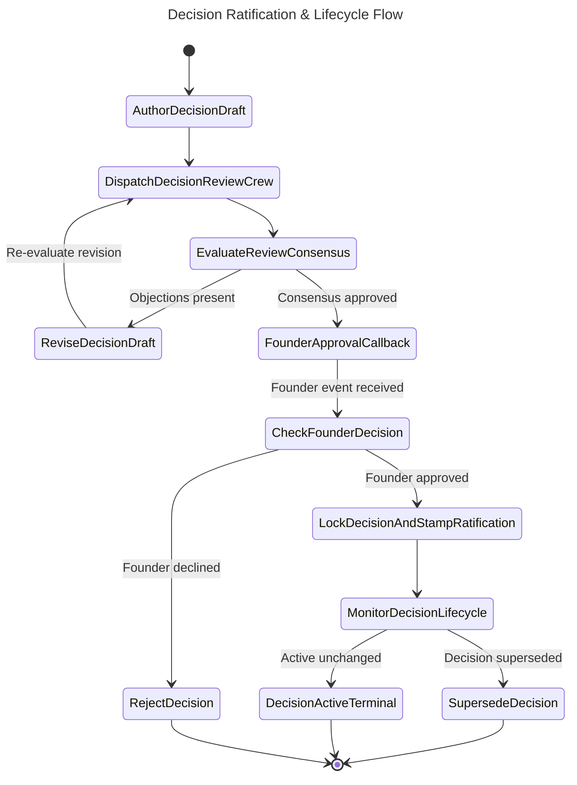

# Decision Workflow: Architecture, Governance, and Change Request Decisions

## Document Control

| Field | Value |
|-------|-------|
| Version | 1.4 |
| Status | Approved |
| Last Updated | 2026-10-07 |
| Author | Framework Maintainer |
| Framework Version | 0.91.1 |


Defines the authorship boundaries, lifecycle, and decision-making procedures across
seed, module, SDD architectural decision records (Layer 05 ADR), and Change Requests (Layer 09 CHG).
This document prevents duplication, eliminates split-brain registries, and ensures every architectural
and governance choice is formally tracked by its authorizing change vehicle. It is engine-agnostic —
it constrains the artifacts and state machines, not any platform's runtime.

## Purpose

The SDD framework has four distinct tiers where decisions are recorded, each with
a different author, content scope, and lifecycle:
1. **Initial Suggestions**: Seed documents explore options before development starts.
2. **Living Source of Truth**: Modules refine invariants and constraints.
3. **Project System Architecture**: SDD ADRs (Layer 05) select concrete system components.
4. **Change Request Governance**: Every Change Request (`CHG-NN`) articulates a formal decision record (`DEC-CHG-NN`).

Clarifying these boundaries eliminates duplication, prevents stale documents, and ensures complete
auditability between code diffs and architectural choices.

## Four-Tier Decision Model

```
Tier 1: Seed             Tier 2: Module           Tier 3: SDD ADR          Tier 4: CHG Decision
(Architect)              (Product Owner)          (Dev Team)               (Change Author / Agent)
────────────────         ──────────────────       ───────────────          ───────────────────────
Suggestions              ALL source material      ONE selected option      FORMAL change decision
2-3 options              Refined decisions        Formal architecture      Context + Choice + Invariants
Options + rationale      Invariants + constraints Context-Decision-Conseq  Every CHG (C1, C2, C3, EMG)
Frozen per version       Living document          Versioned per CHG        Mandatory in CHG Section 1B
```

### Tier 1: Seed Documents

- **Author:** System architect, with stakeholder/management input
- **Content:** Initial architecture suggestions, 2-3 options per decision,
  design principles, rationale for each option
- **Location:** `<project>/seed/architecture/`, `<project>/seed/agent-surface/`
  (canonical Tier 1 Inputs path; scaffold: `framework/templates/SEED-TEMPLATE.md`)
- **Lifecycle:** Frozen per version once the first BRD of a cycle is authored
  (per `SEED_CONTRACT.md` R1); supersedes version via F3 Phase 0a per GD-36

**What seed docs contain:**
- "Here are 3 options for telemetry collection"
- "Option A: managed Grafana Cloud. Option B: self-hosted. Option C: hybrid"
- "Design principle: vendor-neutral, PII-safe, layered"
- "ADR-14 accepted this strategy but was never implemented"

**What seed docs do NOT contain:**
- Final implementation decisions
- Code-level constraints
- Business requirements (those belong in BRD)

### Tier 2: Module Docs

- **Author:** Product owner, refined by development team
- **Content:** ALL source material for a module — overview, refined decisions,
  invariants, constraints, seed references, business rules, acceptance criteria
- **Location:** `<project>/modules/MODULE-NN_name.md` (can have multiple files per module)
- **Lifecycle:** Living document, updated as understanding evolves

**What module docs contain:**
- Refined design principles (from seed, validated against codebase reality)
- Invariants (non-negotiable constraints)
- Business rules and acceptance criteria
- Seed references with context
- Architecture diagrams
- Implementation roadmap
- Dependencies and constraints

**Module is the single source of truth.** Everything needed to write a BRD for
this module lives in the module doc.

### Tier 3: SDD ADR (Layer 5)

- **Author:** Development team
- **Content:** ONE selected architecture with Context-Decision-Consequences
- **Location:** `<project>/sdd/05_ADR/ADR-NN_name.yaml`
- **Lifecycle:** Versioned per CHG (rewritten, not appended)

**What SDD ADRs contain:**
- "We chose option B (self-hosted Grafana stack)"
- Context: why this decision matters
- Decision: what was selected
- Consequences: what this enables and constrains
- Alternatives considered: briefly listed (not full analysis)

**What SDD ADRs do NOT contain:**
- Full analysis of 2-3 options (that's in the seed)
- Business requirements (that's in the BRD)
- Implementation details (that's in the SPEC)

### Tier 4: Change Request Decision Record (`DEC-CHG-NN`)

- **Author:** Change request author (human engineer or autonomous AI agent)
- **Content:** Formal decision record embedded in the Change Request Section 1B
- **Location:** Embedded in `CHG-NN.yaml` (archived under `docs/sdd/09-CHG/archive/CHG-NN/` or `framework/archive/CHG-NN/`)
- **Lifecycle:** Authored during CHG proposal, reviewed in PR, locked upon merge; spec-affecting decisions graduate to `framework/governance/DECISIONS.md`

**What CHG Decision records contain:**
- `decision_id`: Unambiguous identifier tied 1:1 to the change vehicle (e.g. `DEC-CHG-80`)
- `title`: Concise summary of the decision
- `status`: Lifecycle status (`Proposed` | `Ratified` | `Superseded`)
- `context`: Defect, operational challenge, or requirement driving the decision
- `choice`: Concrete architectural, operational, or procedural rule adopted
- `consequences`: Invariants enforced, downstream constraints, and capabilities enabled
- `alternatives_considered`: Alternative designs considered and explicit rationale for rejection

---

## Mandatory Decision Tracking in Change Requests (CHGs)

To eliminate unrecorded architectural drift, **every Change Request MUST carry a populated `decision:` block in Section 1B of `CHG-TEMPLATE.yaml`**. There are no exceptions for small changes.

### Sizing and Rigor Guidelines

| Change Scope | Required Detail in `decision:` block | Example |
|---|---|---|
| **Major / Spec / Architectural (C3 / C2 Spec)** | Complete Context, Choice, Invariants, and explicit Alternatives with rejection rationale. | GD-70 / DEC-CHG-76 (3-Tier Durable Execution Standard) |
| **Operational / Policy (C2 / C1 Repo)** | Clear Context and Choice defining the repo rule or workflow behavior; alternatives noted. | DEC-CHG-80 (Mandatory CHG decisions; retirement of plans/DECISIONS.md) |
| **Minor / Leaf Doc Sync / Bugfix (C1 / DIR2C / CODE2C)** | Concise 1–2 sentence statement of the choice made and why the alternative (e.g., status quo or workaround) was rejected. | DEC-CHG-79 (Harden startup quickstart commands; reject online-only installation) |

### Linter Enforcement (`CHG-L018`)

The structural linter `sdd_doc_lint/chg_lint.py` automatically enforces rule **`CHG-L018`** (governance alias `GOV-022`) on every CHG document:
- The top-level `decision` section must be present and formatted as a mapping.
- The fields `decision_id`, `title`, `choice`, and `consequences` must be present and non-empty.
- Any CHG lacking this block or carrying placeholder empty fields fails validation with exit code 1.

---

## Decision Surfaces and Deprecation of `plans/DECISIONS.md`

Historically, decisions were split between `plans/DECISIONS.md` (repo working log) and `framework/governance/DECISIONS.md` (spec governance). This created confusion, drift, and forgotten logs.

### Deprecation and Tombstone Policy

1. **`plans/DECISIONS.md` is RETIRED**:
   - The file is converted into a permanent, frozen tombstone per Decision `DEC-CHG-80`.
   - Historical records (`D-0065` through `D-0086`) remain in place strictly to preserve permalinks, CI workflow citations, and git history.
   - **No new entries may be authored in `plans/DECISIONS.md`.**
2. **Primary Authoring Surface**:
   - Every decision is authored directly in its authorizing Change Request (`CHG-NN.yaml`).
3. **Master Normative Spec Register**:
   - Framework specification changes (`change_source: spec` passing `GATE-SPEC`) graduate to `framework/governance/DECISIONS.md` as ratified entries (e.g., `GD-71 — Title (DEC-CHG-80)`).

---

## Decision Threshold Matrix

| CHG Classification | Primary Decision Location | Graduation to `framework/governance/DECISIONS.md`? | Project SDD ADR Required? |
|---|---|---|---|
| **C3 Major Spec Change** | Embedded in `CHG-NN.yaml` | **Yes** (Ratified GD entry) | No (Framework spec level) |
| **C2 Spec / Workflow Standard** | Embedded in `CHG-NN.yaml` | **Yes** (Ratified GD entry) | No (Framework spec level) |
| **C2 / C1 Repo Operational Policy** | Embedded in `CHG-NN.yaml` | No (Remains in CHG archive) | No |
| **C1 Maintenance / Scoped Leaf Sync** | Embedded in `CHG-NN.yaml` (concise) | No (Remains in CHG archive) | No |
| **Consuming Project System Architecture** | Embedded in project `CHG-NN.yaml` | No | **Yes** (Authored as `sdd/05_ADR/ADR-NN.yaml`) |

---

## Authorship Matrix

| Artifact | Author | Contains | Lifecycle |
|----------|--------|----------|-----------|
| Seed doc | System architect + stakeholders | Suggestions, options, principles | Frozen per version (GD-36) |
| Module doc | Product owner + dev team | ALL source material, refined decisions | Living document |
| BRD | Dev team (from module) | Business requirements, seed disposition | Approved when PRD starts |
| SDD ADR | Dev team | ONE selected architecture | Versioned per CHG |
| SPEC | Dev team | Implementation specification | Versioned per CHG |
| IPLAN | Dev team | Execution plan | Completed when code is green |
| CHG Decision | Change author (human or AI) | Concrete change decision, invariants, consequences | Locked on CHG merge |

---

## Executable CNCF Decision Ratification Flow

Decisions that alter framework governance or shared contracts (`DECISIONS.md`) pass through
a formal ratification state machine. To guarantee procedural consistency and provide multi-agent
graph orchestrators with deterministic state transitions, the ratification lifecycle is
formalized in:
`framework/governance/workflows/decision-ratification-flow.sw.yaml`.

The workflow conforms to the CNCF Serverless Workflow v0.8 specification (`specVersion: "0.8"`):

<!-- @diagram: state-decision-ratification-flow -->


### State-to-Primitive Mapping

| Workflow State | CNCF State Type | Operational Semantics |
|---|---|---|
| `AuthorDecisionDraft` | `operation` | Collects candidate decision draft (Context, Decision, Consequences, Alternatives) in status Proposed |
| `DispatchDecisionReviewCrew` | `parallel` | Dispatches independent review personas (Architect, Auditor, Security) simultaneously (`completionType: allOf`) |
| `EvaluateReviewConsensus` | `switch` | Evaluates whether review crew reached consensus without blocking objections |
| `ReviseDecisionDraft` | `operation` | Updates decision draft with review crew feedback before re-dispatching |
| `FounderApprovalCallback` | `callback` | Suspends execution awaiting asynchronous human founder OK (`FounderDecisionApprovalEvent`) |
| `CheckFounderDecision` | `switch` | Branches based on founder verdict (`APPROVED` vs declined) |
| `LockDecisionAndStampRatification` | `operation` | Finalizes ratification, sets status to Locked, appends record to `framework/governance/DECISIONS.md` |
| `MonitorDecisionLifecycle` | `switch` | Monitors whether the decision remains active or has been superseded by a newer decision |
| `SupersedeDecision` | `operation` (end) | Marks decision as Superseded with pointer to replacing decision ID |
| `DecisionActiveTerminal` | `inject` (end) | Terminal active state certifying decision is in active, locked enforcement |
| `RejectDecision` | `operation` (end) | Terminal rejection state recording rationale and setting status to Rejected |

---

## Cross-References

- `SEED_CONTRACT.md` — Seed lifecycle, disposition rules, and supersede flow
- `framework/templates/SEED-TEMPLATE.md` — Canonical seed document template
- `DOC_GOVERNANCE_CORE.md` — Version bumping, template policy
- `DECISIONS.md` — Authoritative record of ratified framework governance decisions
- `plans/DECISIONS.md` — Retired repository working log (frozen tombstone)
- `framework/governance/chg/CHG-TEMPLATE.yaml` — Canonical Change Request template with mandatory Section 1B `decision:` block
- `framework/governance/LINT_RULES.md` — Enforces `CHG-L018` mandatory decision check
- `workflows/decision-ratification-flow.sw.yaml` — Canonical CNCF Serverless Workflow state machine
- `GOVERNANCE_WORKFLOW_STANDARD.md` — Normative specification for CNCF Serverless Workflow adoption
- `DIAGRAM_STANDARDS.md` — Visualization standards and Mermaid syntax for governance workflows
- `layers/09_CHG/gates/` — Gate definitions for CHG approval
- `registry/LAYER_REGISTRY.yaml` — Layer definitions and dependencies
