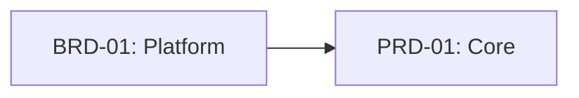
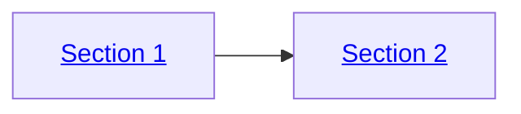

# Diagram Standards

## Document Control

| Field | Value |
|---|---|
| Version | 1.12 |
| Status | Approved |
| Last Updated | 2026-10-07 |
| Author | Framework Maintainer |
| Framework Version | 0.90.0 |

## Mandatory Format: Mermaid Only

All diagrams, charts, workflows, and visual representations in SDD framework artifacts MUST use Mermaid syntax.

### Requirements

| Requirement | Description |
|---|---|
| **Format** | Mermaid syntax (fenced code blocks with `mermaid` language tag) |
| **Validation** | Diagrams must render without parse errors |
| **Style** | Follow the platform's diagram-generation tooling for syntax correctness |
| **File Management** | Use the platform's diagram-generation tooling for SVG generation and embedding |

### Prohibited Formats

The following diagram formats are NOT permitted in any SDD artifact:

| Format Type | Example | Prohibition Reason |
|---|---|---|
| ASCII art boxes | `+----+`, `|    |`, `+----+` | Not renderable, inconsistent display |
| Text-based flowcharts | `A --> B --> C` (outside Mermaid) | No semantic structure |
| Unicode box-drawing | `┌─┐`, `│ │`, `└─┘` | Font-dependent rendering |
| Manual arrow diagrams | `==>`, `->`, `<--` (outside Mermaid) | No styling or layout control |
| Indented hierarchy text | Manual spacing alignment | Fragile, breaks with formatting |

### Allowed Exceptions

| Exception | Permitted Use | Example |
|---|---|---|
| Directory trees | File/folder structure representation | `📁 src/`, `├── tests/` |
| Inline code references | Simple path or command notation | `src/main.py` |
| Table-based data | Structured data display | Markdown tables |

### Diagram Types Reference

Use appropriate Mermaid diagram type for the content:

| Content Type | Mermaid Diagram |
|---|---|
| Process flows | `flowchart TD/LR` |
| Sequences/interactions | `sequenceDiagram` |
| State transitions | `stateDiagram-v2` |
| Class relationships | `classDiagram` |
| Entity relationships | `erDiagram` |
| Timelines | `timeline` |
| Mind maps | `mindmap` |

## C4 + DFD + Sequence Ownership Model

Use the following model across the MVP → PROD → NEW MVP lifecycle.

| Layer / Tier Artifact | Required Model | Purpose |
|---|---|---|
| Seed (Tier 1 Inputs)  | C4 L1 (Context) + DFD L1 | System boundary in external environment and top-level data movement |
| Module (Tier 2 Domain)| C4 L2 (Container) + DFD L2 + sequence | Subsystem container architecture, data movement & sensitivity matrix, process choreography |
| BRD (L1) | C4 L1 (Context) + DFD L1 | Business/system boundary and top-level data movement |
| PRD (L2) | C4 L2 (Container) + DFD L2 + key sequence | Product container interactions, data movement, temporal user/system flow |
| ADR (L5) | Decision sequence (no C4 level — decision bridge) | Architecture decision rationale and alternatives |
| SPEC (L6) | C4 L3 (Component) + DFD L3 | Component interfaces, data-flow constraints, behavior contracts |
| Code | C4 L4 (Code) | Implementation-level class/package structure |

### Diagram Intent Header (Mandatory)

Each required diagram block MUST include an intent header immediately above the Mermaid block.

Required fields:
- `diagram_type`: `c4` | `dfd` | `sequence` | `state` | `flow`
- `level`: `l1` | `l2` | `l3` | `l4` (as applicable, aligned: C4 level = DFD level)
- `scope_boundary`: short boundary definition
- `upstream_refs`: source requirement/decision references
- `downstream_refs`: implementation or validation references

Required machine tags adjacent to diagram blocks:
- `@diagram: c4-l1 | c4-l2 | c4-l3 | c4-l4`
- `@diagram: dfd-l1 | dfd-l2 | dfd-l3`
- `@diagram: sequence-sync | sequence-async | sequence-error`
- `@diagram: state-*` and `@diagram: flow-*` — non-C4 kinds (GD-22)

**Per-layer policing applies to C4 and DFD levels only.** `sequence-*`, `state-*` and `flow-*`
are valid on **every** layer: they describe behaviour, not system structure, so there is no
level to align to a layer. `DG02` enforces exactly this — the per-layer allowlist governs the
`c4-*` / `dfd-*` tags and is read from `LAYER_REGISTRY.yaml` `c4_mapping[*].diagram_tags`
(GD-22, #552), which is **the authority for that allowlist**; this document remains the
authority for the tag vocabulary and the intent-header contract.

Validation severity defaults:
- Error: missing mandatory diagram type for the layer/section
- Warning: missing trust-boundary annotation or missing sequence exception-path branch
- Info: optional enrichment gaps

### SPEC Component Diagram Rule

- SPEC MUST NOT require embedded C4 L4 code/class diagrams as mandatory content.
- SPEC MUST reference downstream TDD/IPLAN location where C4 L4 ownership is implemented.

### Component Diagram Contract (SPEC)

Required fields in SPEC diagram contract subsection:
- `@diagram: c4-l3` component-level references
- `@diagram: dfd-l3` data-flow boundary tags
- Required sequence paths for critical integrations and error handling
- Downstream TDD path for test case ownership

### Layer Enforcement Summary

| Layer / Tier | Mandatory Checks |
|---|---|
| Seed (Tier 1) | `@diagram: c4-l1`, `@diagram: dfd-l1` (defined in `framework/templates/SEED-TEMPLATE.md`) |
| Module (Tier 2) | `@diagram: c4-l2`, `@diagram: dfd-l2`, `@diagram: sequence-sync` (or `sequence-async`); required Data Sensitivity Matrix (`framework/templates/MODULE-TEMPLATE.md`) |
| BRD (L1) | `@diagram: c4-l1`, `@diagram: dfd-l1`; sequence optional for critical journeys |
| PRD (L2) | `@diagram: c4-l2`, `@diagram: dfd-l2`, `@diagram: sequence-sync`; required sequence with explicit error path |
| EARS (L3) | No diagrams required (refinement step; inherits upstream) |
| BDD (L4) | structured YAML scenarios or CNCF Serverless Workflow state machines (BDD-SWF-TEMPLATE.yaml; bdd-acceptance-run.sw.yaml) |
| ADR (L5) | Required decision sequence; no C4/DFD tags (decision bridge, not a C4 level) |
| SPEC (L6) | `@diagram: c4-l3`, `@diagram: dfd-l3`, required Component Diagram Contract subsection, sequence-path constraints, downstream TDD ownership link |
| TDD (L7) | No C4/DFD requirements (test case definitions) |
| IPLAN (L8) | No C4/DFD requirements (execution plan) |
| Code | C4 L4 ownership declarations aligned with SPEC references |

### BRD Required Diagrams by Type

BRD diagrams are scoped by `brd_type` (platform or feature). Required diagrams ensure consistent visual coverage across all BRDs.

**Platform BRD (3 required)**:

| # | Type | Description | Diagram Tag |
|---|---|---|---|
| 1 | `structure_overview` | Document section map with key metrics | `@diagram: c4-l1` |
| 2 | `cross_brd_dependencies` | Upstream/downstream BRD dependency graph | `@diagram: c4-l1` |
| 3 | `data_model` | Primary data model or entity hierarchy | `@diagram: dfd-l1` |

**Feature BRD (2 required)**:

| # | Type | Description | Diagram Tag |
|---|---|---|---|
| 1 | `user_journey` | Happy-path user flow | `@diagram: sequence-sync` |
| 2 | `integration_points` | External system touchpoints | `@diagram: c4-l1` |

**Optional (both types)**:

- `implementation_phases` -- phase timeline or Gantt
- `risk_summary` -- risk matrix visualization
- `architecture_decisions` -- ADT decision tree
- `key_flow_diagrams` -- domain-specific data or process flows

All diagrams follow the `diagrams` registry in BRD-TEMPLATE.yaml. Each item requires: `id`, `title`, `file`, `source`, `scope`.

### Interactive Diagrams (RECOMMENDED)

For enhanced navigability, Mermaid diagrams MAY include click handlers to link nodes to related documents or sections. This is **optional but recommended** for traceability diagrams.

**Basic Click Handler Syntax**:


```mermaid
flowchart LR
    BRD01[BRD-01: Platform]
    PRD01[PRD-01: Core]

    BRD01 --> PRD01

    click BRD01 "../../01_BRD/BRD-01_platform/" "View BRD-01"
    click PRD01 "../PRD-01_core/" "View PRD-01"
```

**Click Handler Format**:
```
click <node_id> "<relative_path>" "<tooltip_text>"
```

**When to Use Interactive Diagrams**:

| Use Case | Recommended | Example |
|---|---|---|
| Traceability diagrams | [PASS] Yes | Link BRD → PRD → EARS nodes |
| Architecture overviews | [PASS] Yes | Link to component docs |
| Workflow diagrams | [WARN] Optional | Link to process docs |
| Simple concept diagrams | [FAIL] No | Static is sufficient |

**Best Practices**:

| Practice | Guidance |
|---|---|
| **Relative Paths** | Use `../` relative paths, not absolute URLs |
| **Consistent Direction** | Link from diagram location to target |
| **Tooltip Text** | Include descriptive tooltip (e.g., "View PRD-01 Details") |
| **Fallback** | Diagrams must be readable without clicking |
| **Validation** | Test links after file moves or renames |

**Security — sanitize handler targets and inline markup (REQUIRED)**:

Click handlers and inline HTML render and execute in HTML-based Mermaid viewers,
so an agent-authored diagram is an injection surface (see `SECURITY_REVIEW.md`).
Diagram content MUST be sanitized:

| Rule | Allowed | Rejected |
|---|---|---|
| **Handler target scheme** | a repo-relative path (`../PRD-01/`) or an `https://` URL | `javascript:`, `data:`, `file:`, `vbscript:` or any other scheme |
| **Inline node markup** | plain text; an `<a href>` with a relative/`https` target | `<script>`, event attributes (`onclick=…`), `<iframe>`/`<object>`, or markup built from untrusted input |
| **Untrusted-sourced labels/paths** | escaped and treated as data | a path or label copied verbatim from an external document without review |

A diagram that cannot be sanitized to these rules uses a static (non-interactive)
form instead. The platform's diagram tooling enforces this scan before embedding.

**Alternative: Inline Anchor Links**:

For HTML-rendered Markdown, anchor links can be embedded in node labels:


```mermaid
flowchart LR
    A["<a href='#section-1'>Section 1</a>"]
    B["<a href='#section-2'>Section 2</a>"]
    A --> B
```

**Note**: Anchor link syntax may not render in all Mermaid viewers. Use `click` handlers for broader compatibility.

**Format Comparison**:

| Aspect | Static Diagram | Click Handlers | Inline Anchors |
|---|---|---|---|
| **Compatibility** | [PASS] All viewers | [PASS] Most viewers | [WARN] HTML only |
| **Maintainability** | [PASS] No path updates | [FAIL] Path breakage risk | [FAIL] Path breakage risk |
| **Navigation** | [FAIL] Manual | [PASS] One-click | [PASS] One-click |
| **Recommended For** | Conceptual diagrams | Published traceability | In-document navigation |

### Governance State Machines & Workflow Graphs (CNCF Serverless Workflow)

Workflow graphs across the framework are formally declared as Directed Acyclic
Graphs (DAGs) using the CNCF Serverless Workflow standard in YAML format (`specVersion: "0.8"`):
1. **Governance State Machines** (`framework/governance/workflows/*.sw.yaml` and `framework/governance/workflows/review/*.sw.yaml`): Defined in `GOVERNANCE_WORKFLOW_STANDARD.md` and `REVIEW_WORKFLOW_STANDARD.md`. Includes change request flow (`chg-request-flow.sw.yaml`), module decomposition (`seed-to-module-decomposition.sw.yaml`), worktree PR lifecycle (`worktree-pr-lifecycle.sw.yaml`), quality remediation saga (`review-remediation-flow.sw.yaml`), 9 per-layer review & remediation flows (`workflows/review/*.sw.yaml`), decision ratification (`decision-ratification-flow.sw.yaml`), BDD acceptance run (`bdd-acceptance-run.sw.yaml`), TDD test execution (`tdd-test-execution.sw.yaml`), SPEC choreography contracts (`spec-choreography-contract.sw.yaml`), architectural decision analysis (`adr-decision-analysis.sw.yaml`), requirements validation (`ears-requirements-validation.sw.yaml`), product feature decomposition (`prd-feature-decomposition.sw.yaml`), and business requirements validation (`brd-business-validation.sw.yaml`).
2. **Implementation Execution Graphs** (`framework/layers/08_IPLAN/IPLAN-SWF-TEMPLATE.yaml`): Defined in `IPLAN_WORKFLOW_STANDARD.md`.
3. **Evaluation Execution State Machines** (`framework/governance/workflows/eval-verification-run.sw.yaml`): Defined in `framework/layers/10_EVAL/README.md`.
4. **Behavioral Acceptance State Machines** (`framework/layers/04_BDD/BDD-SWF-TEMPLATE.yaml`): Defined in `framework/layers/04_BDD/BDD_WORKFLOW_STANDARD.md`.
5. **Test Execution & Fixture Rollback State Machines** (`framework/layers/07_TDD/TDD-SWF-TEMPLATE.yaml`): Defined in `framework/layers/07_TDD/TDD_WORKFLOW_STANDARD.md`.
6. **Distributed Interaction & Choreography State Machines** (`framework/layers/06_SPEC/SPEC-SWF-TEMPLATE.yaml`): Defined in `framework/layers/06_SPEC/SPEC_WORKFLOW_STANDARD.md`.
7. **Architectural Decision & Trade-off State Machines** (`framework/layers/05_ADR/ADR-SWF-TEMPLATE.yaml`): Defined in `framework/layers/05_ADR/ADR_WORKFLOW_STANDARD.md`.
8. **Requirements Validation State Machines** (`framework/layers/03_EARS/EARS-SWF-TEMPLATE.yaml`): Defined in `framework/layers/03_EARS/EARS_WORKFLOW_STANDARD.md`.
9. **Product Decomposition State Machines** (`framework/layers/02_PRD/PRD-SWF-TEMPLATE.yaml`): Defined in `framework/layers/02_PRD/PRD_WORKFLOW_STANDARD.md`.
10. **Business Validation & Value Stream State Machines** (`framework/layers/01_BRD/BRD-SWF-TEMPLATE.yaml`): Defined in `framework/layers/01_BRD/BRD_WORKFLOW_STANDARD.md`.

Every workflow graph MUST maintain 1-to-1 parity with a native Mermaid `stateDiagram-v2` or `flowchart` diagram embedded directly within its companion governance prose document or implementation plan.

| Aspect | Workflow Specification |
|---|---|
| Governance Workflows | `framework/governance/workflows/<slug>.sw.yaml` and `workflows/review/<slug>.sw.yaml` (CNCF v0.8 YAML) |
| Implementation Workflows | `framework/layers/08_IPLAN/<slug>.yaml` (`workflow:` block) |
| Behavioral Workflows | `framework/layers/04_BDD/<slug>.yaml` (`workflow:` block) |
| Test Execution Workflows | `framework/layers/07_TDD/<slug>.yaml` (`workflow:` block) |
| Choreography Workflows | `framework/layers/06_SPEC/<slug>.yaml` (`workflow:` block) |
| Architectural Decision Workflows | `framework/layers/05_ADR/<slug>.yaml` (`architecture_flow.decision_workflow:` block) |
| Requirements Validation Workflows | `framework/layers/03_EARS/<slug>.yaml` (`requirements.workflow_definition:` block) |
| Product Decomposition Workflows | `framework/layers/02_PRD/<slug>.yaml` (`component_decomposition.workflow_definition:` block) |
| Business Validation Workflows | `framework/layers/01_BRD/<slug>.yaml` (`value_stream_mapping.workflow_definition:` block) |
| Standards Authority | `GOVERNANCE_WORKFLOW_STANDARD.md`, `REVIEW_WORKFLOW_STANDARD.md`, `IPLAN_WORKFLOW_STANDARD.md`, `BDD_WORKFLOW_STANDARD.md`, `TDD_WORKFLOW_STANDARD.md`, `SPEC_WORKFLOW_STANDARD.md`, `ADR_WORKFLOW_STANDARD.md`, `EARS_WORKFLOW_STANDARD.md`, `PRD_WORKFLOW_STANDARD.md`, `BRD_WORKFLOW_STANDARD.md` |
| Visual Diagram Kind | `@diagram: state-*` or `@diagram: flow-*` (Mermaid `stateDiagram-v2`) |
| Parity Requirement | All states, transitions, choice conditions, and terminal sinks must match the YAML spec |

### Diagram Tooling

Each platform supplies its own diagram-generation tooling for Mermaid syntax
generation, error prevention, SVG conversion, and document embedding. This
standard defines the Mermaid-only requirement; the platform supplies the tools
that enforce and assist it.

### Enforcement

1. **Pre-commit validation**: Quality gates check for text-based diagram patterns
2. **Workflow enforcement**: All document-generation workflows include the Mermaid-only requirement
3. **Review checklist**: Diagram format verification in code review

### Traceability

This standard applies to all SDD artifacts across Layers 1-8.

**Cross-references**:
- Framework guide: `../SPEC_DRIVEN_DEVELOPMENT_GUIDE.md`
