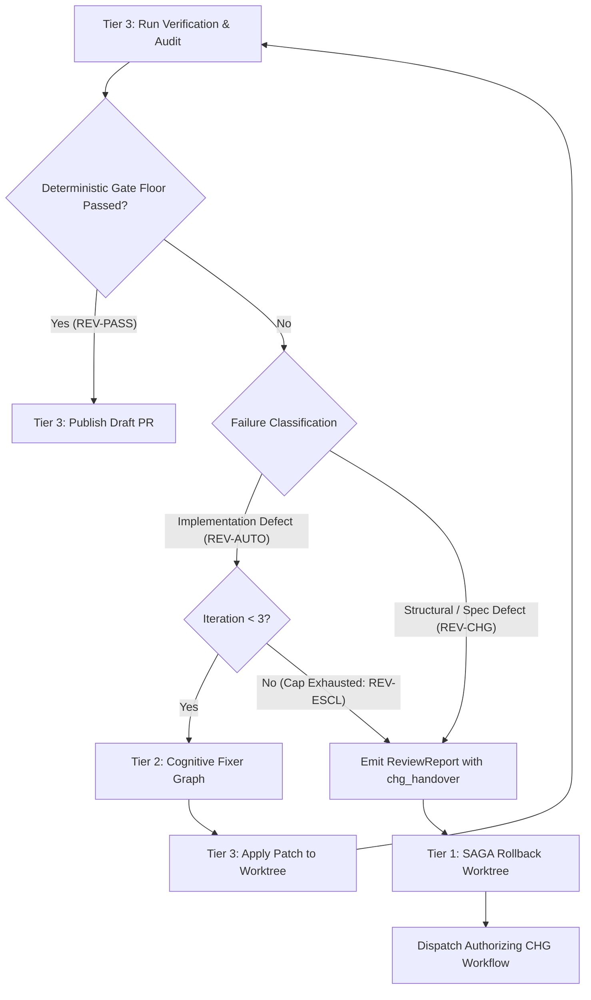
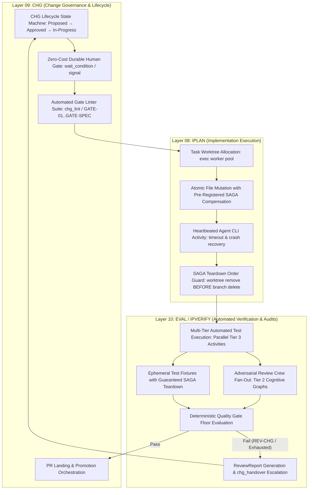

# Durable Multi-Agent Execution Standard: 3-Tier Architecture for Autonomous SDD Engineering

## Document Control

| Field | Value |
|---|---|
| Version | 1.0 |
| Status | Approved |
| Last Updated | 2026-10-07 |
| Author | Framework Maintainer |
| Framework Version | 0.90.1 |

Establishes the engine-agnostic 3-tier runtime execution architecture for running autonomous,
high-assurance Specification-Driven Development (SDD) multi-agent systems with durable state,
cognitive reasoning graphs, and deterministic side effects.

---

## 1. Purpose & Foundational Law

The SDD framework standardizes specifications, declarative workflow graphs (`.sw.yaml`), review crews,
and quality gates across the 10 SDD layers (01_BRD through 10_EVAL). Per **Decision [GD-13 / D-0013](DECISIONS.md)**,
the framework is strictly **engine-agnostic**: it defines the contract, interfaces, and lifecycles,
while runtime execution engines are implemented on the platform side.

Historically, autonomous agent implementations struggled with three critical failure modes:
1. **The Fragility Trap**: Running long-lived multi-agent loops in ephemeral processes where network blips, worker crashes, or rate-limit timeouts cause total loss of progress or duplicate mutations.
2. **The Stochastic Hallucination Trap**: Allowing LLMs to perform uncontrolled filesystem mutations, git operations, or compensation rollbacks, leading to corrupted repositories.
3. **The Unbounded History Trap**: Accumulating infinite message histories and prompt transcripts in orchestrator state, crashing storage engines and exceeding message size limits.

This standard resolves these failure modes by defining an **engine-agnostic, 3-tier durable multi-agent architecture**.
Any capable orchestration platform (e.g., Temporal, Restate, Hatchet, DBOS, LangGraph, Kogito, or custom agent harnesses)
implements this standard to execute framework workflows with absolute durability, crash recovery, and deterministic safety.

---

## 2. The 3-Tier Execution Architecture

The runtime platform is strictly partitioned into three complementary tiers:

```
┌─────────────────────────────────────────────────────────────────────────────┐
│ TIER 1: DURABLE WORKFLOW (Control, SAGA & Orchestration)                   │
│         Crash recovery · replay determinism · durable human gates           │
│         SAGA compensation · timeout budgets · lifecycle convergence         │
├─────────────────────────────────────────────────────────────────────────────┤
│ TIER 2: GRAPH-BASED COGNITIVE FLOWS (Reasoning & Multi-Persona Auditing)    │
│         Planning & exploration · multi-persona review fan-out               │
│         Diagnostic fixer loops · proposal synthesis · cycle-based graphs    │
├─────────────────────────────────────────────────────────────────────────────┤
│ TIER 3: DETERMINISTIC EFFECT & VERIFICATION SERVICES (Physical Effects)     │
│         Isolated worktrees · compilers · linters (sdd_doc_lint, swf_lint)   │
│         Test suites · secret scanners · git push/PR publication             │
└─────────────────────────────────────────────────────────────────────────────┘
        Data Plane: Artifact Store (URIs only) · Control Plane: Thin State Tokens
```

### Tier 1: Durable Workflow (Control & SAGA)
- **Role**: State machine orchestration, lifecycle gating, timeout enforcement, durable human-in-the-loop pauses, and reverse-order SAGA rollback.
- **Characteristics**: Deterministic, replayable code. It never calls an LLM directly, never reads system clocks or random numbers, and never performs I/O.
- **Durability**: Survives worker crashes, host reboots, and rolling platform deployments without losing execution progress or duplicating side effects.

### Tier 2: Graph-Based Cognitive Flows (Reasoning & Auditing)
- **Role**: Cognitive deliberation, multi-persona review crews ([`REVIEW_CREWS.yaml`](REVIEW_CREWS.yaml)), requirement decomposition, planning, and diagnostic root-cause analysis.
- **Characteristics**: Non-deterministic reasoning cycles modeled as directed graphs. Nodes represent prompt/model invocations or tool synthesis steps.
- **Execution Boundary**: Every cognitive node that calls an LLM or remote tool is dispatched as an isolated, retryable activity from the Tier 1 workflow.

### Tier 3: Deterministic Effect & Verification Services (Execution & Gating)
- **Role**: Interacting with the real world—filesystem, git repositories, compilers, linters ([`sdd_doc_lint`](../../sdd_doc_lint/), [`sdd_swf_lint`](../../sdd_doc_lint/swf_lint.py)), test suites, and remote forge APIs.
- **Characteristics**: 100% deterministic CLIs and services.
- **Gate Floor**: Outputs are returned as structured data values, evaluating the normative deterministic quality gate floor:
  $$\text{Gate Floor} = (\text{structural\_pass} == \text{true}) \land (\text{blocking\_findings} == 0)$$

---

## 3. The Golden Rule of Autonomous Execution

> **Reasoning in Cognitive Graphs, Effects in Deterministic Services, Control in Durable Workflows.**
>
> 1. **Cognitive Graphs *propose*** (plans, diffs, review findings). They write proposals to the external artifact store and NEVER touch the filesystem, git, or production state directly.
> 2. **Deterministic Services *apply and verify*** (worktree mutation, compilation, linting, testing). They execute physical changes and return deterministic verification results.
> 3. **Durable Workflows *orchestrate, compensate, gate, and advance***. The workflow decides what happens next based on returned values.

---

## 4. Unified Role & Agent Taxonomy (`RoleSpec`)

Agents are not hardcoded monolithic entities. An agent is a registered **role** defined by a declarative specification (`RoleSpec`):

```yaml
role_spec:
  name: "security_auditor"
  kind: "graph"                   # graph | executor | service
  queue: "agents"                 # task queue / worker pool
  timeout_seconds: 300
  retry_policy:
    max_attempts: 3
    initial_interval_seconds: 2
    backoff_coefficient: 2.0
  model_alias: "audit-tier1"      # model alias routed through proxy
  effectful: false
  compensation: null
  max_loops: 1
```

### The Three Kinds

| Kind | Uses an LLM? | Runtime Construct | Framework Mapping & Examples |
|---|---|---|---|
| **`graph`** (Cognitive Reasoning) | Yes | Graph node or subgraph dispatched as a retryable task | Review personas from [`REVIEW_CREWS.yaml`](REVIEW_CREWS.yaml) (Architect, Security Engineer, QA Lead, Chaos Engineer, Auditor); Planners; Diagnosticians |
| **`executor`** (Autonomous Coding Agent) | Yes (internal tool loop) | Long-running activity wrapping an agent CLI in an isolated worktree | Code implementer (e.g. Claude Code, Antigravity, custom coding CLI behind an adapter) |
| **`service`** (Deterministic Tool) | No | Plain activity / deterministic execution step | Workspace manager (`git worktree`), Linters (`sdd_doc_lint`, `sdd_swf_lint`), Compilers, Test runners, PR Publisher |

### Role Maintenance & Registration
- The number of roles is **unbounded**. Adding a role is a configuration event in the platform's role registry, not an architectural redesign.
- Every role that mutates physical state (`effectful: true`) MUST name an idempotent compensation service (`compensation`).

---

## 5. SAGA Compensation & Rollback Invariants

Autonomous development workflows can fail at any stage (validation failure, test breakdown, quota exhaustion, human rejection).
Rollback must be instantaneous, reliable, and deterministic.

### Invariants:
1. **No LLM in Rollback**: No generative model is ever instructed to "revert what it did". Rollbacks are executed exclusively by deterministic services:
   - `git worktree remove --force <path>`
   - `git branch -D <feature-branch>`
   - Remote branch deletion via forge API
2. **Order Guard (§3.8)**: Worktree removal MUST strictly precede local branch deletion (`worktree remove` before `branch delete`), preventing dangling git locks per [`WORKTREE_FLOW.md`](WORKTREE_FLOW.md).
3. **Pre-Registration Invariant**: A compensation activity MUST be registered in the workflow's SAGA stack *before* the effectful activity is executed. If the activity triggers a side effect and then times out before reporting completion, the compensation is already armed.
4. **Idempotency**: Every compensation service must be a safe no-op if the target resource does not exist or was already cleaned up.
5. **Reverse-Order Execution**: On failure or cancellation, compensations execute in strict LIFO (last-in, first-out) order.

---

## 6. Thin State vs. Data Plane Separation

To prevent event history bloat and payload serialization crashes, platforms enforce strict separation between the **Control Plane** and the **Data Plane**:

```
[Control Plane: Durable Workflow State]
  ├── run_id: "RUN-20261007-001"
  ├── branch: "feature/chg-76-durable-standard"
  ├── base_sha: "923e9252"
  ├── traversal_code: "REV-AUTO"
  ├── blocking_findings: 0
  └── artifact_uris:
        ├── plan: "artifact://runs/76/plan.md"
        ├── review_report: "artifact://runs/76/review-report.yaml"
        └── diff: "artifact://runs/76/implementation.patch"

[Data Plane: Artifact Store / Shared Filesystem]
  ├── plan.md (Full prose, requirements, decomposition)
  ├── review-report.yaml (Complete multi-persona findings & analysis)
  └── implementation.patch (Full source diff and compiler output)
```

- **Rule**: Durable workflows pass **URIs, IDs, status codes, and compact summaries ($\le 2$ KB) only**.
- **Data Plane**: Large artifacts (plans, logs, patches, diffs, AST bundles) reside in an external Artifact Store (e.g. S3, GCS, shared volume, or git repository).

---

## 7. Event History Limits & Capacity Budgeting

Durable execution engines track execution through an append-only event log.
Platforms must budget runs to guarantee they operate well below event limits:

### Event Budget Formula:
$$\text{Worst-Case Activities} = A_{\text{init}} + \sum_{r \in \text{Roles}} (N_{r} \times L_{r}) + A_{\text{verify}} \times L_{\text{remediation}} + A_{\text{cleanup}}$$

Where:
- $N_{r}$: Activities per role invocation
- $L_{r}$: Role retry/loop cap (default $\le 3$)
- $L_{\text{remediation}}$: In-band remediation iteration cap (default $\le 3$, per CB-1)
- $A_{\text{verify}}$: Verification stages (Static, Lint, Compile, Test, Security)

### Budget Benchmarks:
- Typical SDD Run: $\approx 25$ activities ($\approx 150$ workflow events).
- Worst-Case Exhausted Run: $\approx 52$ activities ($\approx 330$ workflow events).
- **Safety Margin**: A 330-event worst-case run consumes $\approx 3\%$ of standard platform warning thresholds (10,240 events), leaving vast headroom for multi-persona crew fan-out.
- **Run Sizing Guardrail**: If an extraordinary run exceeds $5,000$ events, it MUST partition into **Child Workflows** or execute **Continue-As-New** carrying the task cache forward.

---

## 8. CNCF Serverless Workflow (`.sw.yaml`) Compilation Mapping

Platforms ingest framework declarative workflows ([`framework/governance/workflows/`](workflows/)) and map them directly to 3-tier runtime execution:

| CNCF Serverless Workflow Construct | Tier 1: Durable Workflow | Tier 2: Cognitive Graph | Tier 3: Deterministic Service |
|---|---|---|---|
| `start` / `states` | Workflow definition & entry state | Graph entry node | — |
| `type: operation` (actions) | Step execution / activity dispatch | Deliberation action | Tool / CLI invocation |
| `type: parallel` (branches) | Concurrent task fan-out (`asyncio.gather`) | Multi-persona crew fan-out | Parallel test execution |
| `type: switch` (dataConditions) | Deterministic conditional branching | Routing edge based on findings | Exit code evaluation |
| `type: sleep` | Durable timer (zero-cost wait) | — | — |
| `type: event` | Durable human signal / approval gate | User clarification prompt | Webhook / CI callback |
| `compensatedBy: <state>` | SAGA compensation registration | — | Idempotent cleanup action |
| `end: true` | Workflow completion & status emission | Terminal node | — |

---

## 9. Dual-Path Remediation Integration (`REV-AUTO` vs. `REV-CHG`)

Review and verification failures are handled through the formal dual-path routing contract defined in [`REVIEW_REMEDIATION_FLOW.md`](REVIEW_REMEDIATION_FLOW.md):



1. **In-Band Auto-Remediation (`REV-AUTO`)**:
   - For code-level lint errors, minor syntax bugs, or formatting inconsistencies.
   - Handled inside Tier 2 Cognitive Graphs in a bounded loop ($\le 3$ iterations).
2. **Structural Change Escalation (`REV-CHG`)**:
   - For contract violations, requirement contradictions, architectural conflicts, or exhausted retry budgets.
   - The platform compiles a canonical [`ReviewReport`](review_report.schema.json) with `chg_handover` metadata, invokes SAGA compensation to clean the worktree, and transitions control to the change management workflow ([`chg-request-flow.sw.yaml`](workflows/chg-request-flow.sw.yaml)).

---

## 10. Worker Topology & Locality Guardrails

To prevent concurrency hazards and resource contention, workers are separated into two distinct pools:

| Pool / Queue | Purpose | Characteristics | Scaling Model |
|---|---|---|---|
| **`agents`** | Cognitive graph nodes, LLM prompts, tool reasoning | I/O-bound (network, API calls), stateless | Horizontal auto-scaling (high concurrency per node: 50–100) |
| **`exec`** | Git worktrees, compilers, test execution, linters | CPU/Disk/Memory bound, stateful filesystem | Vertical sizing, bounded concurrency (2–4 per host) |

### The Filesystem Locality Sharp Edge:
Git worktrees and build caches require atomic local disk access. If multiple `exec` activities for the same task run across disparate physical hosts sharing a network filesystem (e.g. NFS/SMB/EFS), file-locking and cache-coherency failures will occur.

**Required Locality Solutions (Choose One)**:
1. **Host-Affinity Task Queues**: The initial `create_workspace` activity registers a unique, host-pinned task queue (e.g. `exec-worker-node42`). All subsequent `exec` activities for that task run exclusively on that host.
2. **Ephemeral Container Sandboxes**: Each run provisions a dedicated lightweight container sandbox with a private volume; all `exec` steps are executed inside that container via remote execution RPC.

---

## 11. Layer-Specific Durable Architecture: IPLAN, CHG & EVAL Execution Focus

While the 3-tier architecture governs all SDD workflows across the 10 layers, durable execution guarantees are mission-critical for three downstream execution and governance layers: **IPLAN (Layer 08)**, **CHG (Layer 09)**, and **EVAL / IPVERIFY (Layer 10)**.



### 11.1 Layer 08 — IPLAN (Implementation Planning & Code Execution)
The IPLAN layer bridges design artifacts (SPEC/TDD/ADR) to filesystem mutations and source code changes. Without durable workflow orchestration, partial patches, executor crashes, or worktree leaks leave the repository in an inconsistent state.

1. **Workspace Lifecycle as Tier 3 Deterministic Service**:
   - Worktree creation, branching, file editing, git staging, and compilation are executed strictly as Tier 3 Deterministic Effect Activities on the `exec` worker pool.
   - Worktrees are provisioned per task ([`WORKTREE_FLOW.md`](WORKTREE_FLOW.md) §1 invariants: `feature/<issue-or-chg>-<slug>`).
2. **Step-by-Step Patch Application & Compensation Stacking**:
   - The IPLAN file manifest (`file_manifest`) defines the atomic sequence of modifications.
   - For every modifying activity dispatched (e.g. `write_file`, `apply_patch`), the Tier 1 Durable Workflow pushes an idempotent compensation action onto the active SAGA compensation stack before dispatching the mutation.
   - If an activity fails or times out, the Tier 1 workflow executes compensations in reverse order (LIFO), restoring modified files to their clean baseline or restoring pre-change backups.
3. **Autonomous Agent CLI Executor (`AgentSpec.kind == "executor"`) Lifecycle**:
   - When an AI agent CLI (e.g. Claude Code, Codex, Antigravity, or custom coding agent) is invoked to implement complex code hunks, it runs as a managed Tier 3 activity wrapped by an adapter.
   - The activity enforces heartbeating (e.g., heartbeat every 15–30s) and a hard execution timeout. If the CLI process crashes, hangs, or loses connectivity, the activity fails deterministically and triggers durable retry or compensation without duplicating partial diffs.
   - The CLI communicates only via stdout/stderr/patch files written to disk; its output is captured into the artifact store.
4. **SAGA Worktree Teardown & Order Guard**:
   - Teardown of the feature worktree is registered as the foundational SAGA compensation.
   - **Order Guard Invariant ([`WORKTREE_FLOW.md`](WORKTREE_FLOW.md) §3.8)**: The compensation activity must execute `git worktree remove` *before* executing branch deletion (`git branch -D` or remote deletion). Deleting the branch before removing the worktree creates git metadata corruption and orphaned references.

### 11.2 Layer 09 — CHG (Governance Change Management & Gate Control)
The CHG layer governs change authorization, automated quality gates, and branch promotion. Durable execution prevents unrecorded modifications, skipped approvals, and race conditions during promotion.

1. **Change Lifecycle State Machine**:
   - The CHG lifecycle follows strict, append-only state transitions:
     $$\text{Proposed} \longrightarrow \text{Approved} \longrightarrow \text{In-Progress} \longrightarrow \text{Implemented} \longrightarrow \text{Completed}$$
   - State transitions are recorded as immutable workflow state events in Tier 1. Premature step completion (CHG-L017 / E28) is rejected by automated linter gates before state advances.
2. **Zero-Cost Durable Human Approval Gates**:
   - Tier 1 Durable Workflows suspend execution at governance gates (e.g., C3 architectural changes requiring human founder approval, or plan approvals prior to coding).
   - The workflow uses durable wait constructs (e.g., Temporal `wait_condition`, signals, or event subscriptions) that consume zero CPU, zero memory, and zero worker threads while awaiting approval.
   - The approval signal carries the approver identity, timestamp, and signature, validating against the governance crew requirements in [`REVIEW_CREWS.yaml`](REVIEW_CREWS.yaml).
3. **Automated Gate Execution (GATE-01 through GATE-SPEC)**:
   - Prior to advancing a CHG from `Proposed` to `Approved` or from `In-Progress` to `Implemented`, the workflow invokes the automated gate suites (`chg_lint.py`, `sdd_doc_lint`, `swf_lint`) as Tier 3 Deterministic Services.
   - Red checks fail closed. Any failure halts progression, preventing unapproved or non-conforming code from reaching the target branch (`dev`).
4. **PR Landing & Promotion Coordination**:
   - Upon successful verification, the Tier 1 workflow dispatches a Tier 3 activity to open the pull request (`feature/*` $\to$ `dev`).
   - The workflow polls PR status checks via durable timers (e.g., 15s intervals), verifies merge eligibility (`mergeStateStatus == CLEAN`), and triggers squash merge.
   - Following successful squash merge, the workflow orchestrates final branch cleanup and records the closing commit SHA in the CHG document.

### 11.3 Layer 10 — EVAL / IPVERIFY (Automated Verification, Audits & Reviews)
The EVAL / IPVERIFY layer establishes deterministic proof of correctness before change completion. Durable execution enables parallel adversarial audits, robust fixture lifecycle management, and systematic failure routing.

1. **Automated Multi-Tier Verification Suite Orchestration**:
   - EVAL orchestrates verification across five independent testing tiers:
     - *Static & Architectural Lints*: `sdd_doc_lint`, `swf_lint`, `chg_lint`
     - *Unit Tests*: Sub-second component test suites
     - *Conformance & Acceptance Tests*: SDD conformance suites and playbook fixtures
     - *Security & Secret Scans*: Dependency vulnerability checks and credential scans
     - *Integration / E2E Verification*: System-under-test runs
   - Each suite runs as an isolated Tier 3 activity. Failures are returned as structured data payloads (`TestResult { passed: bool, exit_code: int, failures: [...] }`), never unhandled workflow exceptions.
2. **Ephemeral Fixture Lifecycle & SAGA Teardown**:
   - Complex verification often requires ephemeral databases, mock servers, or test sandbox environments.
   - Fixture provisioning activities register explicit SAGA teardown activities in Tier 1. Whether tests pass, fail, or crash due to worker timeouts, the durable workflow guarantees the execution of all teardown compensations, preventing resource leaks.
3. **Multi-Persona Adversarial Audit Fan-Out**:
   - Review crews defined in [`REVIEW_CREWS.yaml`](REVIEW_CREWS.yaml) (e.g., `architect`, `security_engineer`, `qa_lead`, `auditor`, `chaos_engineer`) are dispatched in parallel as Tier 2 Cognitive Reasoning Graphs across the `agents` worker pool.
   - Each reviewer operates with a specialized persona prompt and playbooks ([`framework/playbooks/10_EVAL/`](../playbooks/10_EVAL/)), outputting findings into the artifact store.
4. **Deterministic Quality Gate Floor**:
   - The Tier 1 workflow aggregates results from all verification suites and audit personas.
   - It deterministically evaluates the Quality Gate Floor:
     $$\text{Gate Passed} \iff (\text{structural\_pass} == \text{true}) \land (\text{blocking\_findings} == 0) \land (\text{all\_tests\_passed} == \text{true})$$
5. **Dual-Path Routing & `ReviewReport` Handover**:
   - If findings exist, the workflow evaluates the failure classification per [`REVIEW_REMEDIATION_FLOW.md`](REVIEW_REMEDIATION_FLOW.md):
     - *Implementation defects* route to the Tier 2 Cognitive Fixer Graph (`REV-AUTO`) within the bounded iteration cap ($\le 3$).
     - *Structural/Spec defects or exhausted retry budgets* trigger escalation (`REV-CHG`). The workflow compiles a canonical `ReviewReport` ([`review_report.schema.json`](review_report.schema.json)) with `chg_handover` metadata, writes it to the artifact store, executes SAGA rollback of the worktree, and triggers the authorizing CHG workflow.

---

## 12. References & Governance Traceability

- **Engine-Agnostic Law**: [Decision GD-13 / D-0013](DECISIONS.md)
- **Worktree Invariants & Order Guard**: [`WORKTREE_FLOW.md`](WORKTREE_FLOW.md)
- **Review Crews & Persona Playbooks**: [`REVIEW_CREWS.yaml`](REVIEW_CREWS.yaml) and [`framework/playbooks/`](../playbooks/)
- **Review Remediation Dual-Path Flow**: [`REVIEW_REMEDIATION_FLOW.md`](REVIEW_REMEDIATION_FLOW.md)
- **Serverless Workflow Specifications**: [`framework/governance/workflows/`](workflows/)
- **Review Report Schema**: [`review_report.schema.json`](review_report.schema.json)
- **Decision Ratification**: [Decision GD-70](DECISIONS.md)

