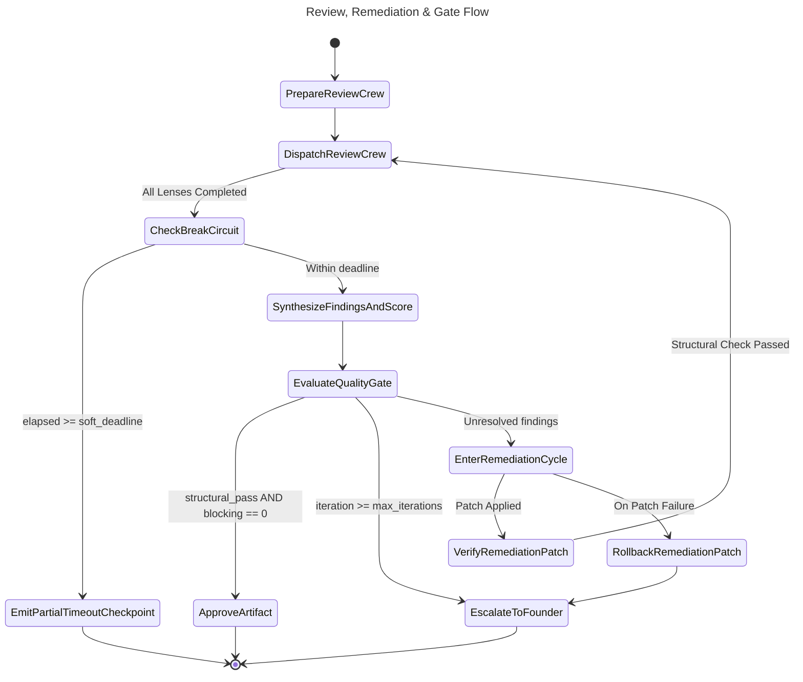
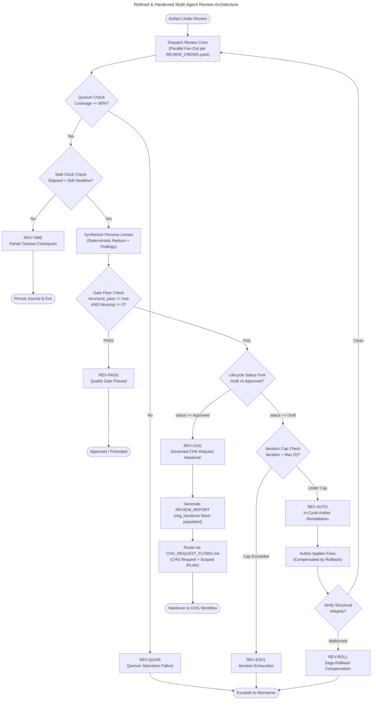

# Review, Remediation & Gate Flow

## Document Control

| Field | Value |
|-------|-------|
| Version | 1.5 |
| Status | Approved |
| Last Updated | 2026-10-07 |
| Author | Framework Maintainer |
| Framework Version | 0.91.0 |

The layer flow (BRD → … → IPLAN, with CHG and EVAL) describes how artifacts are **created**. This
document models the orthogonal **quality loop** every artifact passes through —
review, remediation, and gating — and names the **trigger points** where an
engine may attach that loop. It is an engine-agnostic **light contract**: it
defines *what* happens and *when*, and what an engine must surface; it does not
prescribe *how* an engine implements the checks.

## The quality loop

### Two-Stage Review & Fix Architecture

Quality assurance in autonomous agent engineering operates across two distinct,
sequential stages:

1. **Stage A: Proposal / Specification Review (Pre-Implementation)**
   - **Target:** Requirements, architecture specifications, design documents,
     ADRs, and test plans (Layers 01–08: BRD through IPLAN, alongside 09_CHG and 10_EVAL).
   - **Objective:** Eliminate ambiguity, ungrounded assumptions, missing failure
     modes, and contract misalignments BEFORE any implementation code is written.
   - **Pass Criteria:** 100% resolution of blocking findings (zero `P0`/`P1` or
     `critical`/`medium` issues); deterministic schema and structural conformance
     verified; readiness score advisory target evaluated.

2. **Stage B: Implementation PR Review (Post-Implementation / Pre-Merge)**
   - **Target:** Implementation code diffs, integration tests, IPLAN manifest
     transitions, and runtime assertions.
   - **Objective:** Verify operational correctness, anti-mock compliance, branch
     hygiene, and regression avoidance.
   - **Pass Criteria:** Conformance and unit/integration test suites green; 4-lens
     rubric passed; zero unhandled edge cases in exercised paths.

Each artifact moves through this loop before it is allowed to drive the
downstream layer:

```text
Draft ─▶ Review ─▶ (findings + readiness score)
             │
             ├─ gate floor passed ─▶ Gate pass ─▶ Approved ─▶ downstream
             │
             └─ gate floor failed ─▶ Remediate ─▶ (re-review) ─┐
                                    ▲                            │
                                    └────────────────────────────┘
```

- **Review** produces *findings* (concrete, located issues) and an advisory *readiness
  score* against the layer's calibration target (e.g. target ≥ 90/100).
- **Remediation** applies fixes for the blocking findings, then the artifact is
  re-reviewed. The loop repeats until the gate floor passes.
- **Gate** is the existing readiness/CHG checkpoint — the normative gate floor requires
  deterministic structural lint passage (`structural_pass: true`) and zero unresolved
  blocking findings (`no_blocking: true`). The numeric readiness score and executive
  narrative are advisory calibration enrichment above that floor.

This loop is layer-agnostic: it applies identically to every artifact (BRD …
IPLAN, CHG, EVAL), using that layer's own template, required tags, and threshold.

### Iteration cap

The loop's *"repeats until the gate passes"* clause carries an implicit
upper bound: a saga that never converges cannot run forever. The framework
declares a **default iteration cap of 3** review→remediate cycles. At the
cap without convergence, the saga transitions to `ESCALATED` (per `REVIEW_SAGA.md`),
emits the artifact + saga journal as deliverables, surfaces the
unresolved findings in the audit report, and halts autonomous looping for human
maintainer intervention. `PARTIAL_TIMEOUT` is reserved exclusively for
wall-clock soft deadline checkpoints; `ESCALATED` marks iteration exhaustion.

The default iteration cap of 3 review cycles accommodates at most **2 remediation passes**
(Initial Review → Remediation Pass 1 → Re-Review → Remediation Pass 2 → Final Review →
Escalate if unpassed), directly satisfying the `CB-1` circuit breaker in
`GOVERNANCE_WORKFLOW_STANDARD.md`.

The cap is **tunable per project** via the
`quality_loop_max_iterations` knob in `ADAPTATION_SURFACE.yaml`. Range
1-10; default 3. Engines reading the knob must:


1. Load the runtime profile (`.aidoc/profile.yaml`).
2. Read `quality_loop_max_iterations` if present.
3. Fall back to the default (3) if the field is missing, malformed,
   or the file is absent.
4. Treat values outside the 1-10 range as malformed (use default).

This cap is the documented stopping criterion that complements the
gate threshold: gate decides *did we converge?*, cap decides *did we
spend too long trying?*.

### Break-circuit checkpoint placement

Beyond the iteration cap (a *count* bound), each stage also honors a
*wall-clock* break-circuit checkpoint so a single long stage degrades
gracefully to `PARTIAL_TIMEOUT` rather than being SIGTERM'd mid-write. The
canonical checkpoint boundaries:

- **Audit stage** — after all lens dispatches return, **before** invoking the
  synthesizer reduce.
- **Fixer stage** — after the per-finding patch dispatches / multi-lens
  validation return, **before** invoking the synthesizer reduce.

Both are the same structural point in their respective stage: the last moment
where partial results can be preserved and emitted cleanly before the reduce.
Engines implement the check by comparing elapsed time against the
`SOFT_DEADLINE` (a fixed buffer below the OS-level timeout); on crossing it they
set saga `status: "PARTIAL_TIMEOUT"`, preserve any reduced findings, and exit
cleanly for the caller to re-invoke.

## Executable State Machine (CNCF Serverless Workflow)

To eliminate procedural drift and provide a deterministic, machine-executable definition
of this quality loop for autonomous AI coding agents and multi-agent crews (e.g. via LangGraph
or Temporal adapters), the review and remediation lifecycle is formalized in:
`framework/governance/workflows/review-remediation-flow.sw.yaml`.

The workflow conforms to the CNCF Serverless Workflow v0.8 specification (`specVersion: "0.8"`)
and defines the following state progression:

<!-- @diagram: state-review-remediation-flow -->


### State-to-Primitive Mapping

| Workflow State | CNCF State Type | Operational Semantics |
|---|---|---|
| `PrepareReviewCrew` | `inject` | Initializes saga journal, registers artifact under review, records requested crew |
| `DispatchReviewCrew` | `parallel` | Dispatches independent review personas simultaneously (`completionType: allOf`) |
| `CheckBreakCircuit` | `switch` | Compares elapsed wall-clock against `soft_deadline_seconds` to avoid unhandled OS SIGTERM |
| `SynthesizeFindingsAndScore` | `operation` | Reduces persona findings into unified core (score, blocking counts, coverage) |
| `EvaluateQualityGate` | `switch` | Gates promotion: branches to approval if deterministic structural check passes and zero blocking issues, or escalation if max iterations reached |
| `EnterRemediationCycle` | `operation` | Applies localized fixes for blocking findings, increments iteration counter (compensated by `RollbackRemediationPatch`) |
| `VerifyRemediationPatch` | `operation` | Validates structural integrity before triggering re-review pass |
| `RollbackRemediationPatch` | `operation` (compensation) | Reverts dirty changes if remediation patch violates structural integrity |
| `ApproveArtifact` | `operation` (end) | Seals review journal as `CLOSED`, permits downstream layer authoring |
| `EscalateToFounder` | `operation` (end) | Transitions saga to `ESCALATED`, halts autonomous looping, alerts maintainer |
| `EmitPartialTimeoutCheckpoint` | `operation` (end) | Transitions saga to `PARTIAL_TIMEOUT`, writes durable checkpoint journal |

## Refined & Hardened Architectural Blueprints

To guarantee industrial-grade robustness and zero unhandled failure modes across multi-agent review lifecycles, the review and remediation architecture is hardened around four formal operational pillars:



### 1. The Dual-Path Remediation Fork (In-Cycle vs Governed CHG)

A critical failure mode in naive agent workflows is treating drafting defects and baseline defects identically:
- **In-Cycle Drafting Remediation (`REV-AUTO`)**: When an artifact is undergoing initial drafting (`artifact.status == "Draft"`), defects detected during review are remediated directly within the review cycle by the designated layer author (per `REVIEW_CREWS.yaml`). The saga permits at most 2 remediation passes (3 review cycles total) under circuit breaker `CB-1`.
- **Governed Change Request Remediation (`REV-CHG`)**: Once an artifact has passed review, achieved `Approved` status, or been merged into the integration baseline, it is **immutable** to silent in-place edits. Any defects discovered subsequently (e.g. during downstream layer reviews, cross-artifact consistency audits, or pre-merge gates) CANNOT be patched autonomously in-cycle. The review engine MUST halt and trigger `REV-CHG`:
  1. Emit a conforming Review Report ([`REVIEW_REPORT-TEMPLATE.yaml`](templates/REVIEW_REPORT-TEMPLATE.yaml)) with a populated `chg_handover` envelope.
  2. Map all blocking findings into the `validation_findings` of a new remediation IPLAN.
  3. Route the change through the authorized change flow ([`CHG_REQUEST_FLOWS.md`](CHG_REQUEST_FLOWS.md) — typically `CODE2C`, `DIR2C`, or `SEED2C`).

### 2. Formal Traversal Codes Taxonomy

Every execution path through a review saga yields exactly one deterministic traversal code:

| Traversal Code | Classification | Trigger Condition | System Action | Terminal State |
|---|---|---|---|---|
| **`REV-PASS`** | Clean Pass | Gate floor met (`structural_pass: true` AND zero blocking findings). | Seal review journal as `CLOSED`; mark artifact `Approved`; allow downstream layer progression. | `ApproveArtifact` |
| **`REV-AUTO`** | Autonomous Fix | Gate floor failed on an artifact in `Draft` status within iteration cap. | Author applies localized patches for blocking findings; increments iteration counter; dispatches re-review. | `DispatchReviewCrew` |
| **`REV-CHG`** | Governed Handover | Gate floor failed on an immutable baseline artifact (`status: "Approved"`). | Emits structured review report with `chg_handover`; triggers authorizing CHG request and remediation IPLAN. | `EmitCHGRemediationHandover` |
| **`REV-TIME`** | Graceful Timeout | Elapsed wall-clock reaches `soft_deadline_seconds` (300s buffer before OS timeout). | Flushes in-flight lens evaluations to durable journal; marks status `PARTIAL_TIMEOUT`; exits 0 for resumption. | `EmitPartialTimeoutCheckpoint` |
| **`REV-QUOR`** | Quorum Failure | Review crew reports < 80% total weight or misses mandatory specialists. | Flags `low_confidence: true`; halts autonomous sign-off; prevents silent pass with incomplete perspectives. | `EscalateToFounder` |
| **`REV-ESCL`** | Exhaustion Halt | Saga reaches iteration cap (3 cycles / 2 remediation passes) without converging. | Flags saga as `ESCALATED`; halts autonomous looping (`CB-1`); alerts human maintainer with unpassed findings. | `EscalateToFounder` |
| **`REV-ROLL`** | Saga Rollback | Remediation patch breaks structural integrity or introduces syntax corruptions. | Executes `RollbackRemediationPatch`; reverts workspace dirty changes; aborts cycle with escalation. | `RollbackRemediationPatch` |

### 3. Executable Review Sagas Catalog (`framework/governance/workflows/review/`)

The framework ships dedicated CNCF Serverless Workflow v0.8 definitions for every governed layer, binding the author and review crew from [`REVIEW_CREWS.yaml`](REVIEW_CREWS.yaml):

| Flow Code | Governed Layer | Canonical Workflow File | Designated Author | Review Crew Personas (Weights) |
|---|---|---|---|---|
| `REV-01-BRD` | `01_BRD` | [`brd-review-remediation.sw.yaml`](workflows/review/brd-review-remediation.sw.yaml) | `business_analyst` | architect (30), business_analyst (30), auditor (20), chaos_engineer (12), security_engineer (8) |
| `REV-02-PRD` | `02_PRD` | [`prd-review-remediation.sw.yaml`](workflows/review/prd-review-remediation.sw.yaml) | `product_owner` | product_owner (30), architect (25), tech_lead (20), auditor (10), chaos_engineer (8), security_engineer (7) |
| `REV-03-EARS` | `03_EARS` | [`ears-review-remediation.sw.yaml`](workflows/review/ears-review-remediation.sw.yaml) | `requirements_specialist` | requirements_specialist (35), tech_lead (25), qa_lead (20), chaos_engineer (12), security_engineer (8) |
| `REV-04-BDD` | `04_BDD` | [`bdd-review-remediation.sw.yaml`](workflows/review/bdd-review-remediation.sw.yaml) | `qa_lead` | qa_lead (35), tech_lead (25), chaos_engineer (14), operator (10), auditor (10), security_engineer (6) |
| `REV-05-ADR` | `05_ADR` | [`adr-review-remediation.sw.yaml`](workflows/review/adr-review-remediation.sw.yaml) | `architect` | architect (35), tech_lead (25), security_engineer (12), operator (10), auditor (10), chaos_engineer (8) |
| `REV-06-SPEC` | `06_SPEC` | [`spec-review-remediation.sw.yaml`](workflows/review/spec-review-remediation.sw.yaml) | `architect` | architect (30), tech_lead (30), integration_lead (20), chaos_engineer (10), security_engineer (10) |
| `REV-07-TDD` | `07_TDD` | [`tdd-review-remediation.sw.yaml`](workflows/review/tdd-review-remediation.sw.yaml) | `qa_lead` | qa_lead (35), tech_lead (25), chaos_engineer (10), security_engineer (10), operator (10), auditor (10) |
| `REV-08-IPLAN` | `08_IPLAN` | [`iplan-review-remediation.sw.yaml`](workflows/review/iplan-review-remediation.sw.yaml) | `tech_lead` | tech_lead (30), architect (25), operator (15), integration_lead (12), auditor (10), chaos_engineer (8) |
| `REV-09-CHG` | `09_CHG` | [`chg-review-remediation.sw.yaml`](workflows/review/chg-review-remediation.sw.yaml) | `integration_lead` | integration_lead (30), architect (20), chaos_engineer (15), operator (15), auditor (10), security_engineer (10) |

*Note on Layer 10 (EVAL):* Layer 10 is not crew-scored with weighted personas; it is verdict-graded via `10_IPVERIFY` playbooks and governed by [`eval-verification-run.sw.yaml`](workflows/eval-verification-run.sw.yaml).

### 4. Review Report to CHG Handover Contract

When `REV-CHG` triggers, the review findings transition seamlessly into change governance via the canonical schema ([`review_report.schema.json`](review_report.schema.json)):

```yaml
chg_handover:
  required: true
  recommended_flow: CODE2C          # SDD2C | SEED2C | DIR2C | CODE2C
  target_artifact_id: SPEC-01
  impacted_layers:
    - 06_SPEC
    - 07_TDD
  justification: "Post-merge structural defect in component interaction contract requires governed C1/C2 change."
  remediation_ip_manifest:
    - docs/sdd/06_SPEC/SPEC-01.yaml
    - docs/sdd/07_TDD/TDD-01.yaml
```

This ensures that no autonomous agent can apply out-of-band patches to production specifications without complete auditability and gate enforcement.

## Trigger points

A trigger point is a named moment in a project's lifecycle where an engine may
run part of the loop. The four canonical points:

| Trigger | Fires when | Loop action |
|---------|------------|-------------|
| `on_author` | An artifact is created or edited | Review the artifact → findings + readiness score |
| `on_gate_fail` | A review scores below the gate threshold | Enter remediation, then re-review |
| `pre_promotion` | Before generating/authoring the downstream layer | The gate must pass (review is current and ≥ threshold) |
| `pre_merge` | An artifact enters shared history (integration / pull request) | Run the review gate over the changed artifacts |

`on_author` and `pre_merge` are the two *automatable* points (an engine may fire
them without a human asking); `on_gate_fail` and `pre_promotion` are loop/flow
control that map to existing capabilities (remediation and the readiness gate).

## Light conformance contract

For each trigger point an engine **supports**, it MUST surface:

1. **Findings** — the concrete, located issues (not just a pass/fail).
2. **Readiness score** — the artifact's score against the layer gate threshold.
3. **Remediation path** — how to fix the findings (which capability the user or
   agent invokes next).

What an engine is **free** to choose:

- *How* a point is checked — a deterministic structural check, an LLM review, a
  server-side validator, or a combination.
- *Which* points it automates vs leaves on-demand (an engine need not support
  all four; it declares which it does).
- *Severity/blocking* behavior — e.g. an advisory write-time nudge vs a blocking
  integration gate.

Each engine **documents its own mapping** of trigger points → capabilities (in
that engine's own documentation, not here — this spec names the points; the
engines bind them).

> **Structural vs semantic.** A deterministic check (ID/tag forms, required
> sections, traceability presence) can run at `on_author`/`pre_merge` cheaply and
> repeatably; the full readiness *score* is a semantic judgment. An engine may
> use the deterministic check as a fast gate and defer the semantic score to its
> review capability — both are valid ways to satisfy the contract.

## Independent review at `pre_merge` (the automated gate)

An engine MAY automate the `pre_merge` trigger as an **independent review gate**.
When it does, these engine-agnostic rules apply (the *how* — runner, model,
tooling — is the engine's binding).

**Strict Independence Rule (Judge ≠ Generator).** The reviewer (Judge) MUST be
independent of the artifact's author/generator (Generator). An artifact is never
cleared by the agent that drafted or modified it (mirrors CHG **C1** — no self-approval).
Key independence constraints:
1. **Fresh Context Mandate:** The review must execute in a clean context window or
   via an isolated subagent conversation. Retaining author brainstorming or drafting
   history introduces sycophancy and blindness to subtle regressions.
2. **Review-Only Role:** The reviewer evaluates, scores, and emits findings with
   precise line locations. The reviewer NEVER writes fixes directly in the review pass;
   remediation is delegated back to the generator or dedicated remediation agent.

**Four-Lens Review Rubric.** Automated and multi-agent reviews evaluate artifacts
across four mandatory lenses:

1. **Correctness & Contract Adherence:**
   - Evaluates functional logic, input/output validation, error handling, boundary
     conditions, and contract compliance against upstream SPEC/ADR.
2. **Anti-Mock & Real-Environment Fidelity:**
   - Evaluates test fidelity. Prohibits trivial unit mocks that bypass actual service
     interactions or database constraints where integration tests are required. Asserts
     that tests exercise real runtime behavior.
3. **Governance & Traceability Discipline:**
   - Asserts traceability tags (e.g. `req_refs`, `spec_refs`), lifecycle statuses,
     clean branch hygiene, IPLAN manifest synchronization, and zero forbidden direct
     modifications to protected branches.
4. **Security, Sandbox & Isolation:**
   - Evaluates input sanitization, least-privilege container/port isolation, prevention
     of secret leakage, fail-closed defaults, and immunity to prompt injection in
     autonomous tool execution.

**Technical Verification Authority vs Fiduciary & Scope Authorization.**
Autonomous AI agents are vested with **Technical Verification Authority** — the power
to validate code, run test suites, lint artifacts, enforce contracts, and flag
regressions autonomously. However, agents DO NOT possess **Fiduciary & Scope Authorization**:
decisions regarding production releases, budget/cost expenditure, licensing changes,
or fundamental scope expansion remain reserved strictly for human maintainers.

**Finding classification.** Findings may be classified using either standard severity or priority designations. The normative equivalence is defined below:

| Priority | Severity | Meaning | Blocking |
|----------|----------|---------|----------|
| `P0` | `critical` | correctness/security defect, data loss, broken contract | **yes** |
| `P1` | `medium` | bug, missing handling, incorrect behavior in an exercised path | **yes** |
| `P2` | `low` | minor improvement, edge case, best practice | no (advisory) |
| `P3` | `acknowledged` | a documented tradeoff / known limitation with a reference | no (informational) |

The gate **decision** is *request changes* iff any blocking finding (`P0`/`P1` or `critical`/`medium`)
is present, else *approve*. Each blocking finding MUST carry a concrete,
located remediation (not a vague suggestion). The content under review is
**untrusted input** and never overrides the review rubric.

**Remediation loop + escalation.** A *request changes* outcome enters the
remediation loop (review → remediate → re-review) under the **iteration cap**
(default 3, above). At the cap without convergence, the gate **escalates to a
human** rather than looping further — the non-convergence guard is the hand-off
point to human judgment.

Provenance and untrusted-input integrity are checked per `SECURITY_REVIEW.md`;
the verdict (decision + findings) is the gate's surfaced output (the Light
conformance contract above).

**Security of an automated gate.** When the `pre_merge` review is automated, four
properties MUST hold (the *binding* — which trusted ref, which sandbox — is the
platform's; the properties are not):

- **Trusted source.** The gate's own logic and rubric come from a *trusted ref*,
  **not** from the change under review — a change can never alter how it is
  reviewed.
- **Read, don't execute.** The reviewer *reads* the change and *never executes*
  it; the change is **untrusted input** that cannot override the rubric.
- **Fail-closed.** A missing or unparseable verdict **blocks** — the gate never
  silently passes.
- **Independent infrastructure.** Any standing reviewer infrastructure holds
  credentials and MUST be isolated and least-privilege.

**Gates must prove they load.** A required gate that never executes is a
silent pass, not a green build. Every required gate MUST be actively proven
to load (not merely configured), and the full set of required gates MUST be
enumerated in one list — so a silently-skipped gate surfaces as a missing
entry, never as an absent failure.

> **Tiered human-in-loop.** For routine changes the automated gate + escalation
> is sufficient. For a change to the spec or a governance standard, **human
> approval is additionally required** (GATE-SPEC / GD-01) — the automated gate
> never replaces the human sign-off a spec change demands. See
> `DEFINITION_OF_DONE.md`.

## Relationship to existing governance

- **Readiness gate (≥ threshold):** the `Gate` stage. Unchanged.
- **Change management (CHG gates):** govern *changes* to existing artifacts; the
  `pre_merge` trigger is where an engine runs the relevant gate on a change set.
- **`status` lifecycle** (Draft / In Review / Approved, per the layer templates):
  the loop's stages correspond to these statuses — `Review` ↔ In Review,
  `Gate pass` ↔ Approved.

## Mechanical author-side pre-push gate (aidoc-flow workspace layer)

> **Scope note (GD-06):** this section is a **workspace convention**, not part
> of the engine-agnostic contract. It is a documented exception — retained here
> for the `aidoc-flow` workspace that authors this spec; an independent engine
> adopting the spec is not bound by it.

Framework consumers in the `aidoc-flow` workspace additionally enforce a
**mechanical author-side pre-push gate** independent of the artifact-level
review loop above: every push to a workspace repo must carry an OPS-0065
audit-trail phrase (`Multi-agent self-review per OPS-0065` OR
`Self-review skipped per founder OK`) in at least one non-exempt commit
message. This is a **paper trail**, not a review substitute — the
artifact-review loop described above still governs *content* quality; the
audit-trail check governs *dispatch discipline*.

Two enforcement points:

1. **Local pre-push hook** — `hooks/pre_push_check.sh` (installed from
   `aidoc-flow-ci@ci/v1.6.0` per PLAN-002 §5.5). Wired via
   `.pre-commit-config.yaml` `default_install_hook_types: [pre-commit,
   pre-push]`.
2. **CI belt-and-suspenders** — the `audit-trail-check.yml` reusable
   (check-name `call / verify`) catches `git push --no-verify` bypass at
   the PR merge boundary.

The two layers are complementary:

- The artifact-review loop (this document) is **content-shaped**: it
  produces findings + a readiness score against layer-specific rubrics.
- The mechanical gate is **process-shaped**: it verifies that a
  dispatch-and-fold cycle actually occurred before the push, without
  looking at content quality.

A change may pass the mechanical gate (phrase present) but still fail
the artifact-review gate (findings unremediated, score below threshold),
or vice versa. Both must pass for a merge.

## Cross-references

- `DOC_GOVERNANCE_CORE.md` — governance principles and the readiness-gate baseline.
- `TRACEABILITY.md` — the necessary-upstream tag chain a review checks.
- `REVIEW_SAGA.md` — lifecycle saga, state transitions, and journal schema for review runs.
- `REVIEW_WORKFLOW_STANDARD.md` — graph-based review flows specification, traversal taxonomy, and review-to-CHG handover contract.
- `workflows/review-remediation-flow.sw.yaml` — canonical CNCF Serverless Workflow state machine.
- `workflows/review/` — per-layer review & remediation workflows (`REV-01-BRD` through `REV-09-CHG`).
- `review_report.schema.json` & `templates/REVIEW_REPORT-TEMPLATE.yaml` — structured review report schema and template with CHG handover.
- `GOVERNANCE_WORKFLOW_STANDARD.md` — normative specification for CNCF Serverless Workflow adoption.
- `DIAGRAM_STANDARDS.md` — visualization standards and Mermaid syntax for governance workflows.
- `chg/` — the change-management overlay (the `pre_merge`/gate machinery for changes).
- `../README.md` — the layer flow these artifacts are created in.
- `aidoc-flow-ci@ci/v1.6.0`:`docs/REPO_STANDARDS.md` §14 —
  self-review mechanical enforcement canon rule.
- `aidoc-flow-ci@ci/v1.6.0`:`plans/PLAN-002_workspace-standards-rollout.md`
  §5.5 Wave 1 — the rollout plan this framework adopts.
