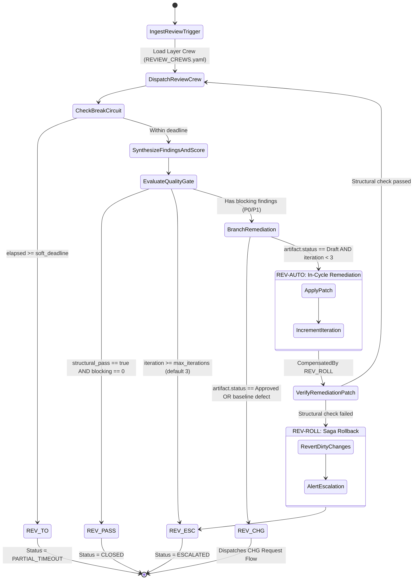

# Review Workflow Standard — Graph-Based Review Flows & SAGA Mechanics

## Document Control

| Field | Value |
|---|---|
| Version | 1.0 |
| Status | Approved |
| Last Updated | 2026-10-07 |
| Author | Framework Maintainer |
| Framework Version | 0.91.1 |
| Authority | `framework/governance/GOVERNANCE_WORKFLOW_STANDARD.md` |

This document establishes the normative standard for **graph-based review, remediation, and gating workflows** across the SDD framework. It specifies the declarative CNCF Serverless Workflow state machines (DSL v0.8 YAML), per-layer review crews, SAGA compensation mechanics, playbook evaluation graphs, and the deterministic handover protocol connecting review findings to authorizing Change Requests (CHGs).

---

## 1. Architectural Foundations

### 1.1 Declarative Purity & Zero Runtime Lock-in (D-0013 / GD-06)

In strict accordance with Principle **D-0013 (Spec Engine-Agnostic Purity)**, review flows are defined as pure, declarative state graphs targeting `specVersion: "0.8"` of the CNCF Serverless Workflow specification. The framework bundles zero runtime orchestrator code or vendor SDKs. Any downstream execution engine (LangGraph, Temporal, AWS Step Functions, or custom agent harnesses) ingests these declarative `.sw.yaml` definitions directly via state translation.

### 1.2 Two-Stage Review Architecture

Quality assurance in autonomous agent engineering operates across two distinct stages:

1. **Stage A: Pre-Implementation Specification Review (Layers 01–08, alongside 09_CHG)**
   - **Target**: Requirements, architecture specifications, design documents, ADRs, test plans, and change controls.
   - **Objective**: Eliminate ambiguity, ungrounded assumptions, missing failure modes, and contract misalignments *before* code is authored.
   - **Pass Criteria**: Deterministic structural linter clean (`structural_pass: true`) AND zero blocking issues (`blocking_findings: 0` / no P0/P1); advisory readiness score evaluated.

2. **Stage B: Post-Implementation PR Review (Pre-Merge)**
   - **Target**: Implementation code diffs, integration tests, IPLAN manifest transitions, and runtime test assertions.
   - **Objective**: Verify operational correctness, anti-mock compliance, branch hygiene, and regression avoidance.
   - **Pass Criteria**: Full test suites green (unit, integration, conformance), 4-lens rubric passed, zero unhandled edge cases in exercised paths.

---

## 2. Review SAGA Traversal Taxonomy

Every review run executes within a governed lifecycle saga conforming to [`REVIEW_SAGA.md`](REVIEW_SAGA.md). The progression is classified into six deterministic traversal codes:



| Code | Name | Traversal Path | Trigger / Condition | Terminal Outcome |
|:---:|---|---|---|---|
| **`REV-PASS`** | Clean Pass | `Review` $\rightarrow$ `Gate Check` $\rightarrow$ `Closed` | `structural_pass: true` AND `blocking == 0` | Approved / Downstream permitted |
| **`REV-AUTO`** | Autonomous Fix | `Review` $\rightarrow$ `Remediate` $\rightarrow$ `Re-Review` | In-cycle draft defect, `blocking > 0`, `iteration < 3` | Patched & re-evaluated |
| **`REV-CHG`** | CHG Handover | `Review RPT` $\rightarrow$ `CHG Request` $\rightarrow$ `Fix IPLAN` | Approved/baseline artifact defect requiring change control | Dispatches authorizing CHG |
| **`REV-ESC`** | Iteration Cap | `Loop Exhaustion` $\rightarrow$ `Escalate` | `iteration >= 3` without convergence | Maintainer alert / Halts loop |
| **`REV-TO`** | Soft Timeout | `Elapsed >= Soft Deadline` $\rightarrow$ `Checkpoint` | `elapsed_seconds >= soft_deadline_seconds` | Durable journal / Resume-ready |
| **`REV-ROLL`** | Saga Rollback | `Patch Broken` $\rightarrow$ `Rollback` $\rightarrow$ `Escalate` | Remediation patch breaks structural linter | State restored clean |

---

## 3. Layer Review Workflows & Crew Parity

Per [`REVIEW_CREWS.yaml`](REVIEW_CREWS.yaml), every layer defines an author persona (who drafts and applies fixes) and a specialized review crew whose weights sum to 100:

| Layer Code | Workflow ID | Declared Author | Review Crew & Persona Weights |
|---|---|---|---|
| **`01_BRD`** | `REV-01-BRD` (`brd-review-remediation.sw.yaml`) | `business_analyst` | `architect: 30`, `business_analyst: 30`, `auditor: 20`, `chaos_engineer: 12`, `security_engineer: 8` |
| **`02_PRD`** | `REV-02-PRD` (`prd-review-remediation.sw.yaml`) | `product_owner` | `product_owner: 30`, `architect: 25`, `tech_lead: 20`, `auditor: 10`, `chaos_engineer: 8`, `security_engineer: 7` |
| **`03_EARS`** | `REV-03-EARS` (`ears-review-remediation.sw.yaml`) | `requirements_specialist` | `requirements_specialist: 35`, `tech_lead: 25`, `qa_lead: 20`, `chaos_engineer: 12`, `security_engineer: 8` |
| **`04_BDD`** | `REV-04-BDD` (`bdd-review-remediation.sw.yaml`) | `qa_lead` | `qa_lead: 35`, `tech_lead: 25`, `chaos_engineer: 14`, `operator: 10`, `auditor: 10`, `security_engineer: 6` |
| **`05_ADR`** | `REV-05-ADR` (`adr-review-remediation.sw.yaml`) | `architect` | `architect: 35`, `tech_lead: 25`, `security_engineer: 12`, `operator: 10`, `auditor: 10`, `chaos_engineer: 8` |
| **`06_SPEC`** | `REV-06-SPEC` (`spec-review-remediation.sw.yaml`) | `architect` | `architect: 30`, `tech_lead: 30`, `integration_lead: 20`, `chaos_engineer: 10`, `security_engineer: 10` |
| **`07_TDD`** | `REV-07-TDD` (`tdd-review-remediation.sw.yaml`) | `qa_lead` | `qa_lead: 35`, `tech_lead: 25`, `chaos_engineer: 10`, `security_engineer: 10`, `operator: 10`, `auditor: 10` |
| **`08_IPLAN`** | `REV-08-IPLAN` (`iplan-review-remediation.sw.yaml`) | `tech_lead` | `tech_lead: 30`, `architect: 25`, `operator: 15`, `integration_lead: 12`, `auditor: 10`, `chaos_engineer: 8` |
| **`09_CHG`** | `REV-09-CHG` (`chg-review-remediation.sw.yaml`) | `integration_lead` | `integration_lead: 30`, `architect: 20`, `chaos_engineer: 15`, `operator: 15`, `auditor: 10`, `security_engineer: 10` |
| **`10_EVAL`** | `EVAL-WF` (`eval-verification-run.sw.yaml`) | `eval_author` | Verdict-graded via `10_IPVERIFY` playbooks (`evaluator`, `validator`, `verifier`, `report_generator`) |

---

## 4. SAGA Mechanics & Non-Blocking Rollback

Review workflows enforce three non-negotiable SAGA properties:

1. **Compensated Remediation (`compensatedBy`)**:
   The `EnterRemediationCycle` state applies mutating patches to artifact files. It MUST declare:
   ```yaml
   - name: EnterRemediationCycle
     type: operation
     compensatedBy: RollbackRemediationPatch
   ```
   If post-patch validation (`VerifyRemediationPatch`) fails structural linting (`sdd_doc_lint`), execution branches to `RollbackRemediationPatch`, reverting uncommitted changes and transitioning to `ESCALATED` with a clean working tree.

2. **Circuit Breaker CB-1 Arithmetic**:
   The default iteration cap of 3 cycles allows at most **2 remediation passes**:
   `Review 1` $\rightarrow$ `Fix 1` $\rightarrow$ `Review 2` $\rightarrow$ `Fix 2` $\rightarrow$ `Review 3` $\rightarrow$ `Escalate`.
   Reaching iteration 3 without convergence terminates autonomous looping.

3. **Wall-Clock Break-Circuit Checkpoints (`PARTIAL_TIMEOUT`)**:
   To avoid abrupt OS SIGTERM during long multi-agent dispatches, each stage checks elapsed wall-clock against `soft_deadline_seconds`. If exceeded, the workflow writes a durable `.saga-journal.json` checkpoint and exits cleanly.

---

## 5. Playbook Evaluation Graphs

Each of the 58 playbooks in `framework/playbooks/` represents an algorithmic evaluation DAG. Each playbook declares:
1. **Frontmatter**: `layer`, `lens`, `weight`, `agent`.
2. **Evidence Checks (`C1`–`CN`)**:
   - Each check carries an ID, condition, priority (`P0`/`P1`/`P2`/`P3`), and required evidence citation.
3. **Deductive Scoring Model**:
   - Initial score: 100.
   - P3 findings: 0 deduction (advisory, scores 90–99).
   - 1–2 P2 findings: -10 to -15 (scores 80–89).
   - 3+ P2 or 1 P1 finding: -20 to -30 (scores 70–79).
   - P0 finding or systemic failure: -31+ (scores < 70).

When an agent executes a lens branch, it evaluates each check sequentially or in parallel, accumulating located findings citing check IDs.

---

## 6. Review Report & CHG Remediation Handover

When a review run terminates with unresolved blocking findings on an approved baseline, it emits a standardized Review Report conforming to [`review_report.schema.json`](review_report.schema.json) and [`templates/REVIEW_REPORT-TEMPLATE.yaml`](templates/REVIEW_REPORT-TEMPLATE.yaml).

### Handover Protocol:
1. **Report Emission**:
   The synthesizer outputs `REV-RPT-NN.yaml` with `gate.passed: false` and populated `findings[]`.
2. **Handover Routing**:
   The report's `chg_handover` block specifies the target change route per [`CHG_REQUEST_FLOWS.md`](CHG_REQUEST_FLOWS.md):
   - Code defect $\rightarrow$ **`CODE2C`** (C1 Bugfix CHG + Bugfix IPLAN).
   - Non-normative doc/tool defect $\rightarrow$ **`DIR2C`** (C1 Direct CHG + Scoped IPLAN).
   - Normative specification redesign $\rightarrow$ **`SEED2C`** (C2/C3 CHG + SDD cascade).
3. **Traceability Closure**:
   The authorizing CHG references `source_review_report: REV-RPT-NN`. The fix IPLAN imports the finding IDs into its manifest. Verification requires re-running the layer review workflow until `gate.passed: true`.

---

## 7. Deterministic Graph Linting (`sdd_swf_lint`)

All declarative workflow files (`.sw.yaml`) and embedded workflow templates (`*-SWF-TEMPLATE.yaml`) are validated deterministically via:

```bash
python3 -m sdd_doc_lint.swf_lint <path>
```

### Enforced Rules:
- **`SWF-L001`**: CNCF Serverless Workflow DSL v0.8 root schema compliance.
- **`SWF-L002`**: State types restricted to approved set (`operation`, `switch`, `parallel`, `callback`, `inject`, `sleep`, `event`).
- **`SWF-L003`**: At least one reachable deterministic terminal state (`end: true` or `terminate: true`).
- **`SWF-L004`**: DAG reachability: all transitions and switch condition targets must resolve.
- **`SWF-L005`**: SAGA compensation integrity: `compensatedBy` must target valid `operation` states.
- **`SWF-L006`**: Parallel branches must have unique names and non-empty action lists.
- **`SWF-L007`**: Review crew parity: layer review workflows must match personas declared in `REVIEW_CREWS.yaml`.
