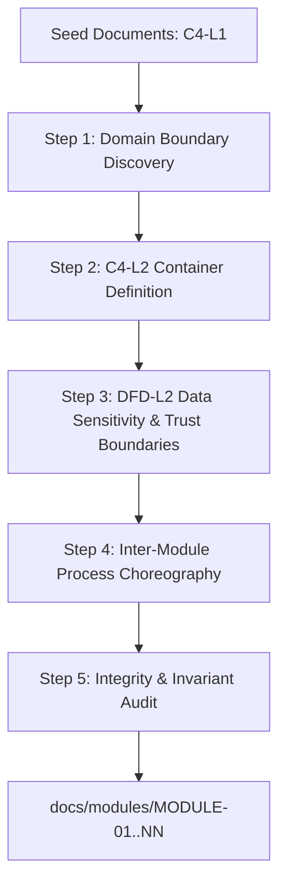

# Seed to Module Decomposition: Methodology & Governance

## Document Control

| Field | Value |
|-------|-------|
| Version | 1.0 |
| Status | Approved |
| Last Updated | 2026-10-05 |
| Author | Framework Maintainer |
| Framework Version | 0.81.0 |

Defines the normative methodology and governance rules for analyzing Tier 1 Seed documents
into Tier 2 Module specifications. Establishes the Triple-Lens modeling standard
(C4-L2 Container, DFD-L2 Data Movement & Sensitivity, and Sequence Choreography).

---

## 1. Purpose & Architectural Context

The SDD framework separates initial human intent from formal development execution:

```
Tier 1 Inputs: Seed Documents (<project>/seed/)
  │   • C4-L1 System Context: external actors, platforms, strategic intent, invariants
  │   • Frozen per version (GD-36 / SEED_CONTRACT.md R1)
  ▼
[Seed → Module Decomposition Flow] ◄── THIS SPECIFICATION
  │   • Decomposes broad seed vision into bounded architectural subsystems
  ▼
Tier 2 Domain Source: Module Layer (docs/modules/MODULE-NN_*)
  │   • C4-L2 Container: deployable services, datastores, dependencies
  │   • DFD-L2 Data Movement: trust boundaries, data sensitivity (PII/secrets)
  │   • Sequence Choreography: sync/async workflows, failure & timeout paths
  │   • Living domain source of truth (MODULE_LAYOUT.md / MODULE-TEMPLATE.md)
  ▼
Tier 2 SDD Execution: Formal 10-Layer Chain (docs/sdd/01_BRD → ...)
      • Refines L1/L2 domains into C4-L3 Component (SPEC) and C4-L4 Code
```

Without a rigorous decomposition flow, teams either leap directly from broad vision into code,
or author ambiguous modules that blur architectural boundaries and leak sensitive data.
This document governs that transition.

---

## 2. The Triple-Lens Modeling Standard

Every module in `docs/modules/MODULE-NN_*` represents an architectural subsystem or **C4-L2 Container**.
A module specification is not complete until analyzed through **three complementary lenses**:

```
                              ┌───────────────────────────────────┐
                              │       MODULE-NN (Container)       │
                              └───────────────────────────────────┘
                                                │
         ┌──────────────────────────────────────┼──────────────────────────────────────┐
         ▼                                      ▼                                      ▼
 1. C4-L2 Structure                    2. DFD-L2 Data Movement                3. Sequence / Process Flow
 "What are the containers?"            "Where does data flow & live?"         "How do processes execute?"
 ─────────────────────────            ──────────────────────────────         ───────────────────────────
 • Deployable units & services        • Data stores & transit routes         • End-to-end workflow steps
 • Internal & external APIs           • Trust & isolation boundaries         • Sync RPC vs Async events
 • Datastores & message brokers       • Sensitive data (PII, secrets, auth)  • Error recovery & timeouts
```

### Lens 1: Structural Architecture (C4-L2 Container)
- Identifies the runnable services, workers, APIs, databases, caches, and third-party SaaS integrations.
- Focuses on deployment and execution boundaries (not internal classes or functions, which belong in C4-L3 SPEC).

### Lens 2: Data Movement & Sensitivity (DFD-L2)
- Traces data entities as they enter the module, transform, get persisted, and exit to downstream systems.
- Mandates explicit **Trust Boundaries** (e.g., Public Internet, DMZ/Ingress, Private Subnet, Encrypted Vault).
- Enforces data classification (Public, Internal, Confidential, Restricted/PII) to ensure data protection by design.

### Lens 3: Process Choreography & Failure Handling (Sequence / Flow)
- Maps the dynamic, chronological interactions between containers for critical business transactions.
- Distinguishes synchronous calls (blocking HTTP/gRPC) from asynchronous messaging (queues, events).
- Mandates explicit exception branches (`alt` / `opt` in Mermaid) for timeouts, circuit-breaker trips, and degraded modes.

---

## 3. The 5-Step Decomposition Methodology

Architects and AI agents follow this 5-step sequence when decomposing Seed documents into modules:



### Step 1: Domain Boundary Discovery (Bounded Contexts)
1. Read the Seed documents (`<project>/seed/vision/`, `<project>/seed/architecture/`, `<project>/seed/agent-surface/`).
2. Identify high-cohesion, low-coupling capability clusters (e.g. Identity/Auth, Data Ingestion, Storage, Analytics, Observability).
3. Assign each bounded domain a canonical module identifier and slug: `MODULE-NN_slug` (e.g., `MODULE-01_server`, `MODULE-03_auth`).
4. Document the core responsibility, explicit in-scope items, and explicit out-of-scope boundaries handed off to peer modules.

### Step 2: Structural Container Modeling (C4-L2)
1. Deconstruct the domain into its discrete executable units:
   - Primary applications, API servers, background daemons, queue consumers.
   - Dedicated persistence engines (relational DB, document store, cache, object storage).
   - Upstream clients and external third-party services.
2. Render a native Mermaid `C4Container` or container flowchart tagged with `@diagram: c4-l2`.
3. Adhere to the rule: **Do NOT embed C4-L3 Component or C4-L4 Code details** in the module. Keep the focus strictly at container boundaries.

### Step 3: Data Movement, Trust Boundaries & Sensitivity Mapping (DFD-L2)
1. Trace the input streams, data transformations, and storage targets for the module.
2. Define explicit perimeters around security zones:
   - Untrusted Zone (Public Web, mobile clients, external webhooks).
   - Ingress / DMZ (Reverse proxies, API gateways, TLS termination).
   - Internal Core (Microservices, message queues, private VPC).
   - Restricted Vault (Hardware Security Modules, credential vaults, tokenizers).
3. Tag the diagram block with `@diagram: dfd-l2`.
4. Populate the **Data Sensitivity & Protection Matrix** classifying every data entity.

### Step 4: Inter-Module Process Choreography & Failure Paths (Sequence)
1. Identify the 2–3 mission-critical transactions traversing this module (e.g., User Login, Bulk Ingest, Transaction Settlement).
2. Model the chronological message flow using native Mermaid `sequenceDiagram` tagged with `@diagram: sequence-sync` or `@diagram: sequence-async`.
3. Require explicit error paths:
   - What happens when a downstream container is unreachable or returns a 5xx?
   - Is fallback to cache, queuing, or immediate fail-fast enforced?
   - How are retry storms and cascading failures prevented?

### Step 5: Integrity, Invariant & Traceability Audit
1. Verify that every invariant and non-goal stated in the Seed documents is mapped to at least one module's `constraints.md` or invariant section.
2. Confirm zero circular container dependencies across the module registry (`MODULE-00_index.md`).
3. Verify that all sensitive data fields (PII/secrets) have cryptographic transit and at-rest controls defined before sign-off.

---

## 4. Data Classification Taxonomy

All modules must classify data entities using this standard 4-tier taxonomy:

| Classification | Definition | Examples | Storage Requirement | Transit Requirement | Logging Policy |
|---|---|---|---|---|---|
| 🟢 **Public** | Information freely shareable outside the organization | Product marketing, public docs, release notes | Standard storage | HTTPS / TLS 1.2+ | Allowed |
| 🟡 **Internal** | Non-sensitive internal operational data | Service telemetry, internal correlation IDs, cluster metrics | Private subnet storage | TLS 1.3 / mTLS | Allowed |
| 🟠 **Confidential** | Proprietary business and customer data | Account profiles, transaction history, customer configurations | Encrypted at rest (AES-256) | TLS 1.3 / mTLS | Masked / Redacted |
| 🔴 **Restricted / PII** | Highly sensitive data subject to legal and regulatory penalties | Passwords, auth tokens, SSNs, credit cards, health records (HIPAA) | Dedicated HSM / Vault, Argon2id, envelope encryption | Strict mTLS + ephemeral payloads | **STRICTLY FORBIDDEN** (audit failure if logged) |

---

## 5. Lifecycle & Governance Rules

1. **Bootstrap Timing (F1)**:
   - During new project onboarding, the Seed-to-Module decomposition runs immediately after Seed drafting and BEFORE the first BRD is authored (`SEED_CONTRACT.md` R1).
2. **Seed Supersede Timing (F3 Phase 0b)**:
   - When a Seed document is superseded (e.g., architecture direction changes or new environmental realities emerge), the architect runs Phase 0b Module Synchronization following this 5-step methodology before any downstream SDD documents are amended.
3. **Template Mandate**:
   - Every module document must adhere to [`framework/templates/MODULE-TEMPLATE.md`](../templates/MODULE-TEMPLATE.md).
4. **Hard Review Gate**:
   - The module decomposition must achieve human architect sign-off (`Status: Active`) before development teams or AI agents author the downstream BRD, PRD, and SPEC layers.
