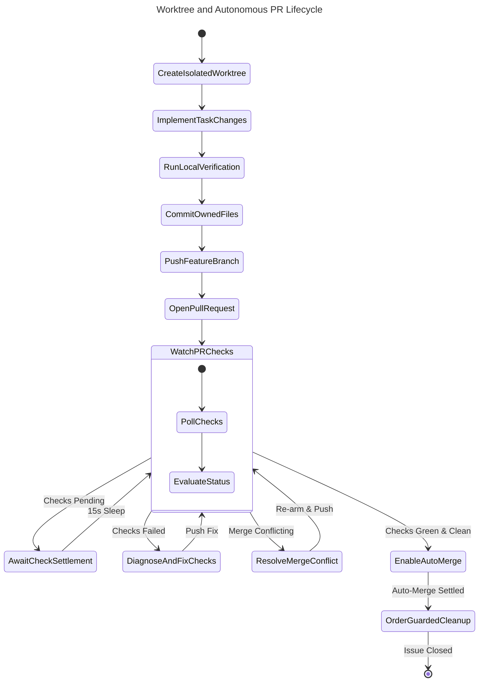

# Worktree Flow — `feature/*` → `dev`

## Document Control

| Field | Value |
|---|---|
| Version | 1.2 |
| Status | Approved |
| Last Updated | 2026-10-06 |
| Author | Framework Maintainer |
| Framework Version | 0.88.4 |

Task isolation and promotion for framework-consuming projects. Covers `dev`
integration only. `dev` → `staging` → `main` promotions are human-executed
and out of scope.

## 1. Invariants

1. The main checkout stays on `dev`. Feature work never executes in the main
   checkout.
2. One task maps to one worktree and one branch: `feature/<issue-or-chg>-<slug>`
   or `fix/<issue>-<slug>`.
3. Direct pushes to `dev`, `staging`, `main` are forbidden. Promotion is
   PR-only.
4. No CHG/IPLAN-gated code writes without an authorizing IPLAN in
   `In Progress` listing each target file in `file_manifest`. Bootstrap
   exemption: authoring the CHG/SDD/IPLAN chain itself in order.
5. No whole-tree git operations (`stash`, `checkout -- <dirs>`, branch
   switch, blanket `add -A`) in a tree with running subagents. Use
   file-scoped commands.
6. **Auto-Merge Re-Arming Mandate:** Any push of conflict resolution commits
   clears platform auto-merge arming. Agents must explicitly re-verify status
   checks and re-arm auto-merge.
7. **Zero Force-Push Invariant:** Rebasing pushed feature branches or force-pushing
   (`--force`, `--force-with-lease`) is strictly forbidden. Conflict resolution
   must use forward branch merges (`git merge origin/dev`).

## 2. Prerequisites

- Dependencies: `git >= 2.38` (worktree support), `gh` CLI (authenticated),
  network access to `origin`.
- Authorized work: active CHG (`Approved` or later) and IPLAN (`In Progress`)
  where applicable.
- Disk: each worktree duplicates working files. Remove worktrees after merge.

### 2.2 Multi-Worktree Port & Container Isolation

When multiple agent tasks run concurrently across separate worktrees on the same
host, shared local runtime resources can collide. Projects MUST isolate worktree
runtimes:
1. **Container Name Sandboxing:** Prepend project and task/worktree slug to
   container and container-orchestration project names (e.g.,
   `COMPOSE_PROJECT_NAME=<project>-<slug>`).
2. **Dynamic Port Offset:** Assign dynamic port offsets or distinct port ranges
   per worktree in environment configurations (e.g., `.env.local`) to prevent
   address/socket collisions during parallel integration and acceptance testing.
3. **Volume Isolation:** Never share ephemeral test databases or writable cache
   volumes between concurrent worktrees.

## 3. Procedure & State Machine Lifecycle

The following state machine governs the complete worktree and autonomous PR lifecycle, corresponding to normative workflow `workflows/worktree-pr-lifecycle.sw.yaml`:

<!-- @diagram: state-worktree-pr-lifecycle -->


### 3.1 Sync `dev` in main checkout

```bash
git fetch origin
git checkout dev
git pull --ff-only origin dev
git worktree list
```

If `pull --ff-only` fails, resolve divergence before creating a worktree. Do
not proceed on a stale base.

### 3.2 Create worktree and branch

```bash
git worktree add ../<project>-<issue> -b feature/<short-name> origin/dev
cd ../<project>-<issue>
git branch --show-current
```

Naming: `feature/<issue-or-chg>-<slug>` for features, `fix/<issue>-<slug>`
for defects. Verify branch output before the first write.

### 3.3 Implement in worktree

1. Execute IPLAN steps in order.
2. Update each `file_manifest` entry from `NOT_STARTED` to `DONE` (or
   `SKIPPED` with `_note`) as the file lands.
3. Stage owned files only. Never stage unrelated changes.

### 3.4 Verify in worktree

Run the project's own verification gates (conformance suite, linter,
acceptance harness — whatever the repo's governance names). If a gate is
skipped, record the command and reason in the PR body.

### 3.5 Push feature branch

```bash
git status --short
git add <owned-files-only>
git commit -m "<scope>: <what> (#N)"
git push -u origin feature/<short-name>
```

Run `git branch --show-current` before commit and before push. If HEAD is not
the feature branch, stop.

### 3.6 Open PR `feature/*` → `dev`

```bash
gh pr create --base dev --head feature/<short-name> --title "<scope>: <what>" --body-file -
```

PR body rules: include `Closes #N` or `Fixes #N` only on full resolution;
partial advances get a progress comment. Never write the phrase negated.

### 3.7 Autonomous PR Conflict Resolution Protocol

When a target branch (`dev`) advances while a feature PR is under review, merge
conflicts may occur. AI agents follow a strict two-class conflict taxonomy:

#### 3.7.1 Conflict Taxonomy

1. **Class 1: Deterministic / Additive Conflicts**
   - **Scope:** Append-only surfaces, documentation indices, changelogs, task
     trackers, non-overlapping manifest additions.
   - **Autonomous Authority:** AI agents are authorized to resolve Class 1
     conflicts autonomously in the worktree.
   - **Procedure:**
     ```bash
     git fetch origin dev
     git merge origin/dev
     # Resolve additive conflicts by preserving both entries in sorted or chronological order
     git add <resolved-files>
     git commit -m "chore: merge origin/dev to resolve additive conflict"
     git push origin feature/<short-name>
     ```
2. **Class 2: Semantic / Architectural Conflicts**
   - **Scope:** Interface signatures, concurrent business logic modifications,
     governance policy alterations, deleted vs modified files.
   - **Autonomous Authority:** AI agents MUST NOT guess or autonomously reconcile
     semantic conflicts.
   - **Procedure:** Immediately abort the merge (`git merge --abort`), capture the
     conflict diff, post an escalation comment on the PR, and stop.

#### 3.7.2 Auto-Merge Re-Arming Mandate

Pushing a conflict resolution commit clears any previously armed auto-merge status
on the host platform. After pushing the merge commit, the agent MUST:
1. Re-query PR status and verify all CI checks are running or green.
2. Explicitly re-arm auto-merge (`gh pr merge <PR> --auto --squash` or platform equivalent).
3. Confirm auto-merge is actively armed before ending execution.

#### 3.7.3 Circuit Breakers

- **CB-5.1 (Single-Attempt Limit):** An agent may attempt autonomous conflict
  resolution at most ONCE per PR. If the push results in subsequent conflicts or
  CI failure, the agent must stop and escalate.
- **CB-5.2 (Zero Semantic Guessing):** Any presence of conflicting algorithmic or
  domain logic triggers an immediate `git merge --abort` and human escalation.

### 3.8 After merge — cleanup (ORDER MATTERS)

```bash
cd <main-checkout>
git worktree remove ../<project>-<issue> --force
git fetch --prune origin
git checkout dev
git pull --ff-only origin dev
git branch -D feature/<short-name>
```

**Order guard:** `worktree remove` runs BEFORE branch delete. Deleting the
branch first orphans the worktree's metadata and the remove then fails.
Switch to `dev` and pull `origin/dev` before deleting the local branch.
Delete the remote branch on merge (`--delete-branch`). If `worktree remove` fails due to
uncommitted state, snapshot (copy to a scratch dir or patch export) before
forcing.

## 4. Failure modes

| Condition | Handling |
|---|---|
| `pull --ff-only` fails | Stop. Resolve divergence in main checkout. Do not base a worktree on a diverged `dev`. |
| Wrong branch at commit/push time | Stop. Never commit to `dev`/`staging`/`main`. |
| `worktree remove` reports dirty tree | Snapshot irreplaceable work first, then `--force`. |
| Concurrent subagents active | Use `git diff -- <owned files>` only. No whole-tree stat, stash, or branch switch. |
| Class 1 merge conflict | Fetch and merge `origin/dev`, resolve additively, push, and re-arm auto-merge. |
| Class 2 merge conflict | `git merge --abort` immediately; escalate to human. |
| Auto-merge disarmed post-push | Verify CI suite and explicitly re-arm auto-merge. |

## 5. Validation

1. `git worktree list` shows one entry per active task, zero after cleanup.
2. `git branch --show-current` in worktree returns the feature branch at
   commit and push time.
3. `git status --short` in main checkout is clean of feature changes
   throughout.
4. Merged PR targets `dev`, carries required CI gates, and references the
   authorizing CHG/IPLAN.
5. Pushed conflict resolutions are verified to have preserved branch lineage
   without force-pushes, and auto-merge is re-armed.

## 6. References

- `DOC_GOVERNANCE_CORE.md` §3.13 (IPLAN Gate), §4.1 (status propagation)
- `NOTICES.md` §Concurrency traps (no whole-tree ops), Rule 5 (archive)
- `SELF_LEARNING.md` (feedback-submit contract for process fixes)
