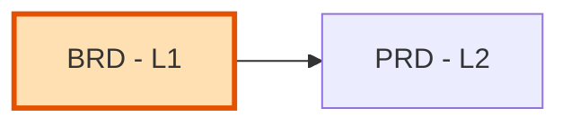

# BRD-00: Business Requirements Document Index

> **Index template.** Copy this file to `BRD-00_index.md` in a project and
> populate the registry as BRDs are created.

Master index of all Business Requirements Documents for the project.

---

## Position in Document Workflow

**Layer**: 1 (Business Requirements Layer)
**Downstream**: PRD (Layer 2)
**Traceability chain**: BRD → PRD → EARS → BDD → ADR → SPEC → TDD → IPLAN → Code

---

## Document Registry

| BRD ID | Module | Type | Status | PRD-Ready | Location |
|--------|--------|------|--------|-----------|----------|
| - | - | - | - | - | No BRDs created yet |

---

## Module Categories

Group BRDs into project-defined module categories (for example, reusable
foundation modules and business-specific domain modules). Replace the rows
below with the project's own module taxonomy.

| ID | Module Name | BRD | Status |
|----|-------------|-----|--------|
| [M1] | [Module name] | Pending | - |

---

## Planned BRDs

| ID | Title | Priority | Target Date | Notes |
|----|-------|----------|-------------|-------|
| BRD-01 | [First module] | High | TBD | - |

---

## Quick Links

- **PRD Layer**: [02_PRD](../02_PRD/)
- **Template**: [BRD-TEMPLATE.yaml](BRD-TEMPLATE.yaml)
- **README**: [README.md](README.md)

---

## Allocation Rules

- **Numbering**: Allocate sequentially starting at `01`; keep numbers stable
- **Module grouping**: Assign contiguous BRD ranges to each module category
- **Feature BRDs**: Continue sequence from last allocated number
- **Filename**: `BRD-NN_{descriptive_slug}.yaml` (platform BRDs: `BRD-NN_platform_{slug}.yaml`)

---

*Last Updated: YYYY-MM-DD*
