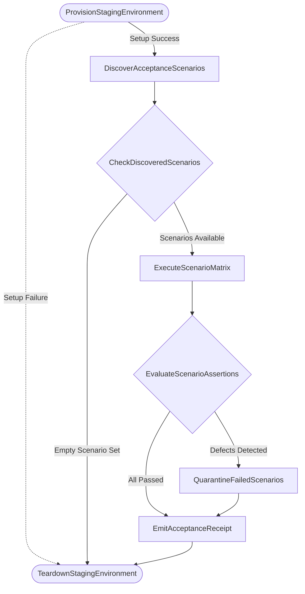

# BDD Workflow Specification Standard

## Document Control

| Field | Value |
|---|---|
| Version | 1.0 |
| Status | Approved |
| Last Updated | 2026-10-05 |
| Author | Framework Maintainer |
| Framework Version | 0.80.0 |

---

## 1. Architectural Motivation & Scope

Layer 04 (Behavior-Driven Development, BDD) bridges formal business and system requirements (Layer 03 EARS) into executable acceptance criteria that downstream technical specifications (Layer 06 SPEC) and test contracts (Layer 07 TDD) fulfill.

Historically, BDD scenarios in the framework were authored as flat lists of Given-When-Then string triplets within [`BDD-TEMPLATE.yaml`](./BDD-TEMPLATE.yaml). While optimal for simple, deterministic, single-turn interactions, static lists present acute limitations when modeling modern cloud-native systems:

1. **Complex Choreography**: Real-world user journeys involve asynchronous callbacks, event-driven stimuli, polling timeouts, and conditional branching that cannot be cleanly modeled in a flat sequence.
2. **Saga Compensation**: When a stateful scenario fails midway through a multi-step workflow, database fixtures and external mock states must be deterministically rolled back.
3. **Autonomous Agent Execution**: Autonomous coding agents and multi-agent harnesses (e.g., LangGraph, Temporal, custom state engines) require formal state graphs rather than unstructured text to execute and trace acceptance tests without procedural drift.

This specification establishes the **CNCF Serverless Workflow specification (v0.8 YAML)** as the standard for modeling complex, stateful BDD acceptance flows and their execution lifecycles in QA Staging.

---

## 2. The Hybrid Envelope Architecture

To maintain 100% backward compatibility with the framework's structural linter (`sdd_doc_lint`) and ID traceability conventions, stateful BDD workflows adopt the **Hybrid Envelope Architecture** introduced in GD-52:

```text
┌─────────────────────────────────────────────────────────────┐
│ SDD Document Envelope (Layer 04 BDD Standard)                │
│   - id / doc_id / title                                     │
│   - metadata (schema_version: "1.0", subtype: "workflow")   │
│   - document_control (version, author, target_release)       │
│   - feature (name, description, user_story)                 │
│   - traceability (tags, upstream: ears, downstream: tdd)    │
│                                                             │
│   ┌─────────────────────────────────────────────────────┐   │
│   │ workflow: (CNCF Serverless Workflow v0.8)           │   │
│   │   - id, name, version, specVersion: "0.8"           │   │
│   │   - start: SetupGivenPreconditions                  │   │
│   │   - states: [inject, operation, switch, callback]   │   │
│   │   - functions: [custom URN bindings]                │   │
│   └─────────────────────────────────────────────────────┘   │
└─────────────────────────────────────────────────────────────┘
```

The outer envelope preserves doc-level tags (`@bdd: BDD-NN`), EARS upstream links, and TDD pairing contracts, while the inner `workflow:` block provides a standard, machine-executable graph.

---

## 3. Mapping Given / When / Then to CNCF States

The BDD Given-When-Then paradigm maps directly onto CNCF Serverless Workflow state primitives:

| BDD Phase | CNCF State Type | Operational Semantics | Example |
|---|---|---|---|
| **GIVEN** (Precondition) | `inject` or `operation` | Injects state fixtures, provisions mock tokens, sets initial balances, or verifies precondition flags. Bound to `compensatedBy:` for automatic rollback. | `SetupGivenPreconditions` |
| **WHEN** (Action / Stimulus) | `operation` or `event` | Dispatches the API call, triggers an external event, or invokes the system function under test. | `DispatchWhenAction` |
| **THEN** (Assertion / Outcome) | `switch` | Evaluates return payloads, status codes, and latency against SLA thresholds (`@threshold:`). Routes to success or failure terminal states. | `VerifyThenExpectations` |
| **THEN FAIL** (Quarantine) | `inject` | Emits structured assertion mismatch telemetry and routes failed scenario IDs to defect tracking. | `RecordAssertionFailure` |
| **CLEANUP** (Rollback) | `operation` | Compensating action reversing any stateful changes made during the scenario run. | `RollbackStatefulChanges` |

---

## 4. Saga Compensation Mechanics

Stateful scenarios frequently mutate data in staging databases or external services. When an assertion fails or a timeout occurs, leaving dirty state causes cascade failures in subsequent tests.

In [`BDD-SWF-TEMPLATE.yaml`](./BDD-SWF-TEMPLATE.yaml), setup states declare a compensating rollback state:

```yaml
- name: SetupGivenPreconditions
  type: operation
  compensatedBy: RollbackStatefulChanges
  actions:
    - name: injectPreconditions
      functionRef:
        refName: fixtureSetupFunction
```

If the action or any subsequent verification fails, the workflow engine triggers `RollbackStatefulChanges` before reaching the terminal failure state, ensuring hermetic test execution.

---

## 5. QA Staging Acceptance Runner (`bdd-acceptance-run.sw.yaml`)

While individual BDD documents model feature acceptance criteria, the execution of the test suite is governed by [`bdd-acceptance-run.sw.yaml`](../../governance/workflows/bdd-acceptance-run.sw.yaml):



### Execution Lifecycle:
1. **Provision Staging**: Spins up isolated staging containers, injects baseline database fixtures, and configures external API mocks.
2. **Discover Scenarios**: Scans `docs/04_BDD/` extracting scenario IDs, priority tags (`p0-critical`, `p1-high`), and EARS traces.
3. **Execute Matrix**: Dispatches scenario workflows sequentially or in parallel, collecting response payloads and measuring execution times.
4. **Evaluate Assertions**: Validates outcomes against `then` expectations and `@threshold:` timing limits.
5. **Quarantine Failures**: For failing scenarios, captures isolated reproduction traces and marks downstream TDD pairs as failing.
6. **Emit Receipt**: Emits machine-readable `BDD-RPT-{DATE}.yaml` audit record.
7. **Teardown**: Executes teardown compensation, hermetically purging staging data.

---

## 6. Dual-Template Discipline

Authors choose between two canonical templates based on scenario complexity:

| Criteria | Standard [`BDD-TEMPLATE.yaml`](./BDD-TEMPLATE.yaml) | Hybrid [`BDD-SWF-TEMPLATE.yaml`](./BDD-SWF-TEMPLATE.yaml) |
|---|---|---|
| **Scenario Structure** | Atomic, single-turn interactions | Multi-step user journeys, distributed transactions |
| **Execution Flow** | Linear Given-When-Then | Branching, polling, event stimuli, retries |
| **State Mutation** | Read-only or ephemeral mocks | Stateful persistence requiring rollback |
| **Compensation** | Implicit / none | Explicit `compensatedBy:` rollback states |
| **Engine Target** | Pytest-BDD / Behave / Regex runner | LangGraph / Temporal / Agent workflow DAG |

Both formats enforce identical EARS upstream traceability and GD-08 TDD acceptance pairing invariants.
