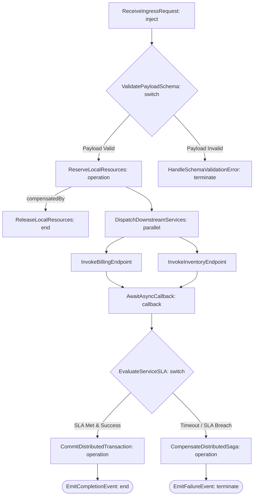

# SPEC Workflow Specification Standard: CNCF Serverless Workflow for Layer 06

## Document Control

| Field | Value |
|---|---|
| Version | 1.0 |
| Status | Approved |
| Last Updated | 2026-10-05 |
| Author | Framework Maintainer |
| Framework Version | 0.88.1 |

Establishes the normative standard for modeling, specifying, and orchestrating Layer 06 (Technical Specification / SPEC) distributed interaction sequences, event choreography, and saga rollback compensation using the CNCF Serverless Workflow v0.8 specification in YAML format within the SDD Hybrid Envelope Architecture.

---

## 1. Purpose & Architectural Context

In the 10-layer SDD specification, Layer 06 (SPEC) defines the public interface signatures, typed data models, state transitions, and behavioral contracts for software components at C4-L3 (Component level), bridging architectural decisions (Layer 05 ADR), behavioral acceptance criteria (Layer 04 BDD), and requirements (Layer 03 EARS) before downstream test suites (Layer 07 TDD) and implementation plans (Layer 08 IPLAN) are generated.

Historically, SPEC documents were authored exclusively as static YAML contracts in [`SPEC-TEMPLATE.yaml`](./SPEC-TEMPLATE.yaml). While ideal for monolithic, in-process libraries and pure algorithms, static specifications encounter severe limitations in modern distributed and cloud-native systems:

1. **Distributed Interaction & Choreography Sequences**: Microservices, event-driven backbones, and asynchronous messaging architectures require explicit sequencing across multiple services that static interface tables cannot formally express.
2. **Asynchronous Webhook & Callback Correlation**: Distributed interactions often involve long-running asynchronous workflows where a service dispatches a task and suspends until a correlated callback event arrives.
3. **Distributed Transaction Saga Rollback Compensation (`compensatedBy`)**: Multi-service operations cannot rely on ACID database transactions; when an intermediate service call fails or exceeds an SLA, the system must trigger deterministic backward recovery (compensating transactions) to restore data consistency.
4. **Machine-Executable Contracts for Autonomous Agents**: Autonomous AI coding agents require formal, machine-readable state machines to generate integration glue, retry policies, correlation filters, and error handlers without guessing or hallucinating distributed behavior.

---

## 2. Hybrid Envelope Architecture

To maintain complete backward compatibility with structural linters (`STRUCT01`, `TAG01`, and `sdd_doc_lint`), all CNCF-compliant SPEC documents adopt the **Hybrid Envelope Architecture**:

```text
┌────────────────────────────────────────────────────────────────────────┐
│  Layer 06 SPEC Document Envelope (SPEC-SWF-TEMPLATE.yaml)              │
├────────────────────────────────────────────────────────────────────────┤
│  • doc_id, metadata (schema_version: "1.0", layer: 6, c4_level: C4-L3) │
│  • document_control (subtype: workflow, author, component)             │
│  • component_overview (role, architectural decisions @adr)             │
│  • interfaces (public exports, method signatures, errors)              │
│  • data_models (typed schemas, payload structures)                     │
│  • behavior (validation rules @ears, state transitions @bdd)           │
├────────────────────────────────────────────────────────────────────────┤
│  workflow: (CNCF Serverless Workflow v0.8 YAML)                        │
│   ├── id, name, version, specVersion: "0.8"                             │
│   ├── events: [IngressRequestEvent, PartnerCallbackEvent]              │
│   ├── start: IngestRequest                                             │
│   └── states:                                                          │
│       ├── [Ingress]      inject (initialize correlation context)       │
│       ├── [Validation]   switch (validate payload against data models) │
│       ├── [LocalState]   operation (compensatedBy: CompensateLocal)    │
│       ├── [Dispatch]     parallel (concurrent downstream RPC/APIs)     │
│       ├── [Callback]     callback (await correlated async event)       │
│       ├── [SLA Verify]   switch (evaluate latency & error thresholds)  │
│       ├── [Saga Rollback] operation (coordinate backward recovery)     │
│       └── [Terminal]     operation (emit completion/failure event)     │
├────────────────────────────────────────────────────────────────────────┤
│  • implementation_notes (constraints, patterns, performance)          │
│  • tdd_contracts (@tdd: TDD-NN, test_files)                            │
│  • traceability (@spec, @adr, @bdd, @ears, @threshold)                 │
└────────────────────────────────────────────────────────────────────────┘
```

The outer envelope preserves all 8 core sections required by `sdd_doc_lint`, while the embedded `workflow:` section provides the executable choreography state machine.

---

## 3. Component Specification Mapping to CNCF State Machine Primitives

The core constructs of distributed component specifications map directly onto CNCF Serverless Workflow state primitives:

| Component Specification Construct | Purpose | CNCF State Type | Workflow Semantic Construct |
|---|---|---|---|
| **API Ingress / Event Consumption** | Ingest incoming request / event | `inject` or `event` | Initializes correlation context (`${ .correlation_id }`) and payload data |
| **Payload Schema Validation** | Validate incoming data against §4 models | `switch` | Branches to execution on success or error state on invalid schema |
| **Local State Mutation** | Apply local reserve/write action | `operation` | Declares `compensatedBy:` pointing to a local rollback state |
| **Concurrent Service Calls** | Invoke parallel microservices/APIs | `parallel` | Executes concurrent branches with `completionType: allOf` or `anyOf` |
| **Asynchronous Webhook Callback** | Wait for external async partner reply | `callback` | Suspends execution waiting for correlated CloudEvent with timeout |
| **SLA & Threshold Verification** | Evaluate latency & health metrics | `switch` | Evaluates `@threshold:` compliance before committing transaction |
| **Distributed Saga Compensation** | Roll back multi-service side effects | `operation` | Executes backward recovery compensations across downstream services |
| **Commit & Event Emission** | Finalize state & publish receipt | `operation` | Commits changes and emits terminal CloudEvent receipt |

---

## 4. Distributed Saga Rollback Compensation (`compensatedBy`)

In distributed architectures, atomic multi-step mutations across independent services cannot be guaranteed by local database transactions. When an interaction alters local or downstream state, the workflow must declare a compensating state using `compensatedBy`:

```yaml
- name: ReserveLocalResources
  type: operation
  description: "Allocates local reservation locks with rollback compensation"
  compensatedBy: ReleaseLocalResources
  actions:
    - name: executeReservation
      functionRef:
        refName: resourceManager
        arguments:
          correlationId: "${ .correlation_id }"
  transition: DispatchDownstreamServices

- name: ReleaseLocalResources
  type: operation
  description: "Compensating undo action releasing local reservation locks"
  actions:
    - name: releaseReservation
      functionRef:
        refName: resourceManager
        arguments:
          correlationId: "${ .correlation_id }"
  end: true
```

If downstream dispatch times out, external partners reject the callback, or SLA thresholds are violated, the orchestrator triggers backward recovery to undo changes deterministically.

---

## 5. Distributed Choreography Contract Runner (`spec-choreography-contract.sw.yaml`)

The canonical state machine for distributed component choreography is codified in [`spec-choreography-contract.sw.yaml`](../../governance/workflows/spec-choreography-contract.sw.yaml):



---

## 6. Dual-Template Selection Discipline

Authors choose between the standard static template and the workflow-enabled hybrid template based on component architecture:

| Selection Criteria | Standard [`SPEC-TEMPLATE.yaml`](./SPEC-TEMPLATE.yaml) | Hybrid [`SPEC-SWF-TEMPLATE.yaml`](./SPEC-SWF-TEMPLATE.yaml) |
|---|---|---|
| **Architecture Scope** | In-process component, utility library, pure algorithmic model | Distributed microservice, event-driven subsystem, multi-party saga |
| **Interaction Nature** | Synchronous method calls, standard function exports | Asynchronous callbacks, webhooks, parallel service invocations |
| **Failure Recovery** | Local exception handling (`try/catch`) | Distributed saga rollback compensation (`compensatedBy`) |
| **SLA & Latency** | Static latency targets in prose | Declarative SLA evaluation states tied to `@threshold:` metrics |
| **Subtype Declaration** | Standard / omitted | `subtype: workflow` in `document_control` |
| **Consumer Target** | Single-language compilers, static type checkers | AI coding agents, LangGraph DAG orchestrators, distributed runtimes |

---

## 7. Graph Integrity Rules

1. **Deterministic State Transitions**: Every state transition must be uniquely determined by incoming payload attributes, CloudEvent types, or explicit switch conditions.
2. **Correlation Token Preservation**: All asynchronous events, callbacks, and saga compensation invocations MUST carry and propagate a unique `correlation_id`.
3. **Compensable Mutation Invariant**: Any state that performs external writes or reservations prior to final commit MUST designate a valid `compensatedBy:` state.
4. **Traceability Preservation**: Specification interfaces MUST maintain explicit traceability to upstream requirements (`@ears`), acceptance scenarios (`@bdd`), and architectural decisions (`@adr`).
5. **Engine-Agnostic Purity**: Workflow specifications must remain declarative, portable, and free of vendor runtime dependencies ([D-0013](../../governance/DECISIONS.md)).

---

## 8. Zero-Runtime LangGraph & Agent Adapter Pattern

Declarative SPEC choreography workflows compile dynamically into LangGraph state graphs or agent tool orchestration pipelines without requiring runtime code inside the framework:

```python
# Conceptual zero-runtime adapter
from langgraph.graph import StateGraph, START, END

def compile_spec_choreography(workflow_yaml: dict) -> StateGraph:
    graph = StateGraph(dict)
    for state in workflow_yaml["states"]:
        graph.add_node(state["name"], resolve_state_handler(state))
    # Wire ingress, parallel branches, async callbacks, and saga compensations
    return graph.compile()
```
