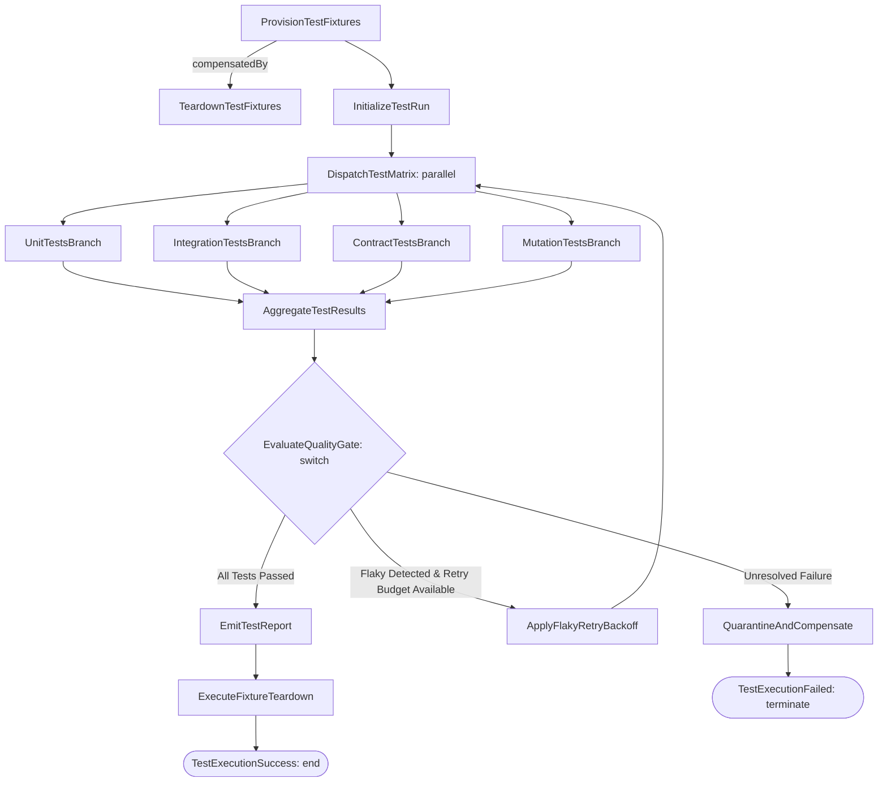

# TDD Workflow Specification Standard: CNCF Serverless Workflow for Layer 07

## Document Control

| Field | Value |
|---|---|
| Version | 1.1 |
| Status | Approved |
| Last Updated | 2026-10-06 |
| Author | Framework Maintainer |
| Framework Version | 0.88.0 |

Establishes the normative standard for modeling, validating, and executing Layer 07 (Test-Driven Development / TDD) test suites and runners using the CNCF Serverless Workflow v0.8 specification in YAML format within the SDD Hybrid Envelope Architecture.

---

## 1. Purpose & Architectural Context

In the 10-layer SDD specification, Layer 07 (TDD) defines test cases that validate technical specifications (Layer 06 SPEC) and pair with behavioral acceptance scenarios (Layer 04 BDD, per GD-08).

Historically, TDD documents in the framework were authored as flat lists of test case definitions within [`TDD-TEMPLATE.yaml`](./TDD-TEMPLATE.yaml). While effective for isolated, stateless unit tests, static checklists present acute limitations when orchestrating modern cloud-native testing:

1. **Multi-Tier Execution Coordination**: Modern testing requires structured execution across distinct tiers (Unit $\rightarrow$ Integration $\rightarrow$ Contract $\rightarrow$ Mutation), each with distinct concurrency limits and preconditions.
2. **Fixture Saga Compensation (`compensatedBy`)**: Integration and E2E tests provision external dependencies (containers, databases, mock endpoints). When assertions fail or timeouts occur, dirty fixtures cause cascading test contamination without deterministic teardown compensation.
3. **Flaky Test Resilience**: Ephemeral network jitter or race conditions produce false failures. Static templates cannot declare retry budgets, jittered exponential backoffs, or defect quarantine procedures.
4. **Machine Execution for Autonomous Agents**: Coding agents require explicit dependency graphs and deterministic transition conditions to diagnose and remediate test failures autonomously.

---

## 2. Hybrid Envelope Architecture

To maintain complete backward compatibility with structural linters (`STRUCT01`, `TAG01`, and `sdd_doc_lint`), all CNCF-compliant TDD documents adopt the **Hybrid Envelope Architecture**:

```text
┌────────────────────────────────────────────────────────────────────────┐
│  Layer 07 TDD Document Envelope (TDD-SWF-TEMPLATE.yaml)                │
├────────────────────────────────────────────────────────────────────────┤
│  • doc_id, metadata (schema_version: "1.0", layer: 7)                  │
│  • document_control (subtype: workflow, source_spec: "@spec: SPEC-NN") │
│  • test_strategy (isolation_strategy, flaky_policy)                   │
│  • bdd_scenario_mapping (GD-08 acceptance pairing)                     │
│  • test_cases (declarative test definitions)                           │
├────────────────────────────────────────────────────────────────────────┤
│  workflow: (CNCF Serverless Workflow v0.8 YAML)                        │
│   ├── id, name, version, specVersion: "0.8"                             │
│   ├── start: ArrangeTestFixtures                                       │
│   └── states:                                                          │
│       ├── [Arrange] operation (compensatedBy: TeardownFixtures)        │
│       ├── [Act]     operation (runTestSuite)                           │
│       ├── [Assert]  switch (AllPassed vs FlakyRetry vs Quarantine)     │
│       ├── [Retry]   operation (ApplyFlakyRetryBackoff)                 │
│       ├── [Rollback] operation (TeardownFixturesCompensation)          │
│       └── [Terminal] inject (Success / FailedQuarantined)               │
├────────────────────────────────────────────────────────────────────────┤
│  • traceability (@spec, @bdd, @adr tags)                               │
└────────────────────────────────────────────────────────────────────────┘
```

The outer envelope preserves standard metadata and section sets, while the inner `workflow:` mapping houses the executable state machine.

---

## 3. Arrange-Act-Assert Mapping to CNCF State Machine Primitives

The standard Arrange-Act-Assert testing pattern maps directly onto CNCF Serverless Workflow state primitives:

| Testing Phase | Purpose | CNCF State Type | Workflow Construct |
|---|---|---|---|
| **Arrange** | Provision containers, seeds, and mocks | `operation` or `inject` | Declares `compensatedBy:` pointing to a teardown state |
| **Act** | Execute test runner against target | `operation` | Invokes test runner actions with arguments |
| **Assert** | Evaluate test outcomes & thresholds | `switch` | Evaluates `.failures == 0` and `@threshold:` metrics |
| **Retry** | Flaky failure backoff | `operation` | Applies exponential backoff and increments retry count |
| **Teardown** | Hermetic fixture cleanup | `operation` | Rollback compensation or normal fixture cleanup |

---

## 4. Test Fixture Saga Rollback Compensation (`compensatedBy`)

Stateful test suites that allocate databases, containers, or network mocks must declare a compensating teardown state:

```yaml
- name: ArrangeTestFixtures
  type: operation
  description: "Provisions test containers, seed data, and mock services"
  compensatedBy: TeardownFixturesCompensation
  actions:
    - name: setupFixtures
      functionRef:
        refName: fixtureProvisioner
  transition: ActExecuteTests
```

When an unhandled exception or assertion failure occurs during execution, the orchestrator triggers `TeardownFixturesCompensation` to guarantee that no dirty state contaminates subsequent test suites.

---

## 5. Test Failure Taxonomy & Cross-Layer Invariants

To avoid misclassifying environment problems as code regressions and to ensure strict traceability, conforming test runners and agents enforce a two-tier failure taxonomy and cross-layer consistency rules:

### 5.1 Failure Taxonomy (`failed` vs `infra_error`)

| Failure Class | Root Cause | Diagnosis Signal | Agent Action |
|---|---|---|---|
| **`failed` (Assertion / Contract Failure)** | Application logic regression, unmet precondition, unexpected return value, schema violation | Assertion error, test framework failure diff, 4xx HTTP response | Triaged by DEV persona; investigate code logic, review SPEC/EARS contracts, apply targeted bugfix |
| **`infra_error` (Environmental / Harness Failure)** | Database down, container unreachable, port collision (`EADDRINUSE`), missing credentials, runner timeout | Connection refused, process killed (SIGKILL/SIGTERM), disk full, socket error | Triaged by SDET or environment supervisor; verify compose services, inspect container logs, retry once without code edits |

### 5.2 TDD $\leftrightarrow$ IPLAN Cross-Layer Consistency Invariants

1. **Status Propagation Alignment:** A TDD test case cannot transition to `passed` in verification artifacts if the corresponding implementation step in the active IPLAN is `NOT_STARTED` or failing.
2. **Strict File Ownership:** Test files declared in Layer 07 TDD MUST map directly to file entries in the authorizing IPLAN `file_manifest` with `type: test`.
3. **Signature & Identifier Agreement:** Function names, route endpoints, and parameter types tested in TDD cases must match character-for-character with Layer 06 SPEC contracts and IPLAN implementation task specifications.

## 6. Automated Test Execution Suite Runner (`tdd-test-execution.sw.yaml`)

While individual TDD documents specify component tests, suite-level execution is governed by [`tdd-test-execution.sw.yaml`](../../governance/workflows/tdd-test-execution.sw.yaml):



---

## 7. Dual-Template Selection Discipline

Authors choose between two canonical templates based on test complexity:

| Criteria | Standard [`TDD-TEMPLATE.yaml`](./TDD-TEMPLATE.yaml) | Hybrid [`TDD-SWF-TEMPLATE.yaml`](./TDD-SWF-TEMPLATE.yaml) |
|---|---|---|
| **Test Case Type** | Pure functions, isolated unit tests, static mocks | Multi-tier tests, integration with external containers, databases |
| **Execution Flow** | Flat, sequential test execution | Concurrent branches, retry backoffs, conditional gates |
| **Resource Cleanup** | In-process garbage collection / fixtures | First-class saga compensation (`compensatedBy`) |
| **Subtype Declaration** | Standard / omitted | `subtype: workflow` in `document_control` |
| **Orchestrator Fit** | Standard test runners (`pytest`, `jest`, `cargo test`) | Autonomous AI coding agents, LangGraph DAG runners, CI pipelines |

---

## 8. Graph Integrity Rules

1. **Acyclicity (DAG Guarantee)**: Main execution lines must be strictly acyclic. The only allowed backward transition is the explicit flaky retry loop bounded by `max_retries`.
2. **Deterministic Terminal States**: Every execution path must reach either a success terminal state (`end: true`) or a quarantined failure state (`end: { terminate: true }`).
3. **Compensable Fixture Guarantee**: Every state allocating external resources MUST specify a valid `compensatedBy:` target state.
4. **Traceability Preservation**: Acceptance pairings (`bdd_ref`) and specification links (`spec_ref`) MUST be preserved across all workflow states.
5. **Engine Independence**: Workflow definitions must not depend on proprietary vendor SDKs ([D-0013](../../governance/DECISIONS.md)).

---

## 9. Zero-Runtime LangGraph Adapter Pattern

Declarative TDD workflows compile dynamically into LangGraph state graphs without bundling runtime code:

```python
# Conceptual zero-runtime transformation
from langgraph.graph import StateGraph, START, END

def compile_tdd_workflow(swf_data: dict) -> StateGraph:
    graph = StateGraph(dict)
    for state in swf_data["states"]:
        graph.add_node(state["name"], make_handler(state))
    # Wire transitions, conditional branches, and saga compensations
    return graph.compile()
```

---

## 10. Review Log

- **2026-10-05 — Pass 1 (Initial Ratification)**:
  - Ratified hybrid envelope architecture, Arrange-Act-Assert mapping, and suite runner workflow (`tdd-test-execution.sw.yaml`).
- **2026-10-06 — Pass 2 (Failure Taxonomy & IPLAN Invariants)**:
  - *Gap found*: Lack of formal distinction between application assertion failures and infrastructure crashes, causing agents to attempt code fixes for database timeouts. Missing cross-layer consistency checks with IPLAN.
  - *Fix*: Codified Section 5 Test Failure Taxonomy (`failed` vs `infra_error`) and Section 5.2 TDD $\leftrightarrow$ IPLAN Cross-Layer Consistency Invariants.
