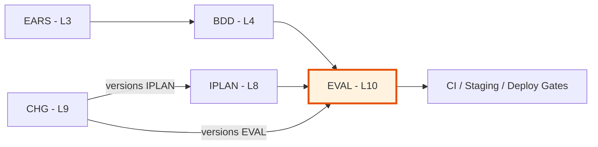

# EVAL-00: Evaluation & QA Governance Index

> **Index template.** Copy this file to `EVAL-00_index.md` in a project and
> populate the registry as evaluation documents are created.

## Position in Document Workflow

**Layer**: 10 (Evaluation & QA Governance)
**Note**: Layer 9 is CHG (Change Record — governance overlay). EVAL is L10.
**Upstream (necessary)**: IPLAN (L8) — 1:1 mapping
**Downstream**: Code, CI/CD pipelines, deployment gates
**Traceability chain**: IPLAN → EVAL → RPT → verdict

### EVAL Purpose

- **Input**: IPLAN execution plan + relevant BDD/TDD sources
- **Output**: Eval strategy, iterated eval reports (RPT), PASS verdict
- **Consumer**: QA engineers, CI/CD pipelines, deployment gates

---

## File Format

EVAL uses **`.yaml` files** (unified YAML template pattern).

**Templates**:
- [EVAL-TEMPLATE.yaml](./EVAL-TEMPLATE.yaml) — per-IPLAN strategy
- [EVAL-REPORT-TEMPLATE.yaml](./EVAL-REPORT-TEMPLATE.yaml) — eval report

---

## Allocation Rules

- **Numbering**: Sequential starting at `01` — matches owning IPLAN number
- **1:1 mapping**: EVAL-01 owns IPLAN-01, EVAL-02 owns IPLAN-02, etc.
- **Keep numbers stable**: Never reuse or renumber
- **Directory**: `EVAL-{NN}/`
- **Document**: `EVAL-{NN}/EVAL-{NN}.yaml`
- **Reports**: `EVAL-{NN}/reports/EVAL-{NN}-RPT-{NNN}.yaml`
- **Upstream trace**: Required — every test case MUST link to its source
- **Eval cycle**: Iterative until PASS — reports are immutable snapshots

---

## Document Registry

| ID | Owning IPLAN | Track | IPLAN Version | Latest Verdict | Cycles | Open Findings | Status | Latest Updated |
|----|-------------|-------|---------------|----------------|--------|---------------|--------|---------------|
| - | - | - | - | - | - | - | - | No EVAL documents created yet |

## Planned

| ID | Owning IPLAN | Track | Priority | Notes |
|----|-------------|-------|----------|-------|
| EVAL-NN | IPLAN-NN | unit_smoke | High/Med/Low | ... |

---

## Usage Guidelines

### Creating a New EVAL Document

1. **Wait for IPLAN Completed**: EVAL is created after IPLAN reaches "Completed" status
2. **Copy template**: `EVAL-TEMPLATE.yaml` → `EVAL-{NN}/EVAL-{NN}.yaml`
3. **Set owning_iplan**: Links to the IPLAN (1:1)
4. **Extract scope**: From IPLAN's scope and relevant BDD/TDD sources
5. **Map test cases**: Clean IDs — `EVAL-{NN}.BDD-{NN}.TC-{NN}.{NN}`
6. **Build coverage matrix**: Bidirectional traceability
7. **Set thresholds**: From PRD and project standards
8. **Update this index**: Add entry to document registry

### Running Eval Cycles

1. **Initial eval** (cycle 1): Run tests, create RPT, set verdict
2. **If FAIL**: Fix findings, run again (cycle 2, trigger: bug_fix_verification)
3. **Repeat**: Until verdict = PASS
4. **Verify**: Mark IPLAN as Verified when PASS

### IPLAN Versioning

When a CHG bumps an IPLAN version:
1. **Archive old EVAL**: Move to `09-CHG/archive/{CHG-ID}/10_EVAL/`
2. **Create new EVAL**: New version, new test cases if scope changed
3. **Reset cycle counter**: New EVAL starts at cycle 1
4. **Update this index**: New entry for new EVAL version

---

## Validation Checklist

- [ ] All EVAL directories follow naming: `EVAL-{NN}/`
- [ ] All EVAL documents follow naming: `EVAL-{NN}.yaml`
- [ ] All RPT files follow naming: `EVAL-{NN}-RPT-{NNN}.yaml`
- [ ] Every test case has a source_id linking to BDD scenario or TDD test case
- [ ] Coverage matrix covers 100% of IPLAN-relevant scenarios
- [ ] Quality thresholds match PRD-declared thresholds
- [ ] Each EVAL has owning_iplan set (1:1 mapping)
- [ ] Each RPT is self-contained (no external file deps in findings)
- [ ] This index is up-to-date with all EVAL files and latest verdicts

---

## Traceability

### Upstream Sources

| Source Type | Document ID | Relationship |
|-------------|-------------|--------------|
| IPLAN | IPLAN-NN | Execution plan (1:1 mapping) |
| TDD | TDD-NN | Test case definitions (from IPLAN) |
| BDD | BDD-NN | Acceptance scenarios (from IPLAN scope) |
| EARS | EARS-NN | Formal requirements (transitive via IPLAN) |

### Downstream Consumers

| Consumer Type | Document ID | Relationship |
|---------------|-------------|--------------|
| EVAL-RPT | EVAL-{NN}-RPT-{NNN} | Eval reports (immutable snapshots) |
| CI/CD | github-actions | Pipeline gates enforce test criteria |
| Deployment | docker-compose | Staging verification runs functional tests |

---

## Related Documents

- **Template (Strategy)**: [EVAL-TEMPLATE.yaml](./EVAL-TEMPLATE.yaml)
- **Template (Report)**: [EVAL-REPORT-TEMPLATE.yaml](./EVAL-REPORT-TEMPLATE.yaml)
- **README**: [README.md](./README.md)
- **Upstream (IPLAN)**: [08_IPLAN](../08_IPLAN/) — Execution plans
- **Upstream (TDD)**: [07_TDD](../07_TDD/) — Test case definitions
- **Upstream (BDD)**: [04_BDD](../04_BDD/) — Acceptance scenarios
- **Upstream (EARS)**: [03_EARS](../03_EARS/) — Formal requirements

---

**Last Updated**: YYYY-MM-DD
**Maintainer**: [Project Team]
