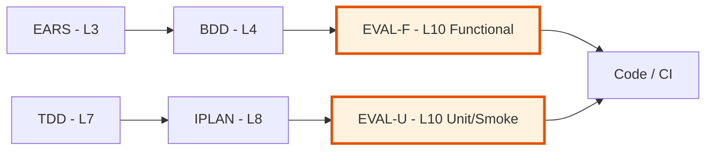

# EVAL-00: Evaluation & QA Governance Index

> **Index template.** Copy this file to `EVAL-00_index.md` in a project and
> populate the registry as evaluation documents are created.

## Position in Document Workflow

**Layer**: 10 (Evaluation & QA Governance)
**Note**: Layer 9 is CHG (Change Record — governance overlay). EVAL is L10.
**Upstream (necessary)**: EARS (L3), BDD (L4) for functional track; TDD (L7), IPLAN (L8) for unit/smoke track
**Downstream**: Code, CI/CD pipelines, deployment gates
**Traceability chain**: EARS → BDD → EVAL-F → Integration/E2E tests
**Traceability chain**: TDD → IPLAN → EVAL-U → Unit/Smoke tests

### EVAL Purpose

- **Input (Functional)**: EARS formal requirements + BDD acceptance scenarios
- **Input (Unit/Smoke)**: TDD test case definitions + IPLAN execution plans
- **Output**: Evaluation strategies with coverage matrices, quality thresholds, and execution plans
- **Consumer**: QA engineers, CI/CD pipelines, deployment gates

---

## File Format

EVAL uses **`.yaml` files** (unified YAML template pattern).

**Template**: [EVAL-TEMPLATE.yaml](./EVAL-TEMPLATE.yaml)

---

## Allocation Rules

- **Numbering**: Allocate sequentially starting at `01` (e.g., `EVAL-01`, `EVAL-02`)
- **Keep numbers stable**: Never reuse or renumber
- **Filename**: `EVAL-NN_{descriptive_slug}.yaml`
- **One evaluation scope per file**: Each EVAL covers one testing track for a defined set of upstream sources
- **Upstream trace**: Required — every test case MUST link to its source (BDD scenario or TDD test case)
- **Evaluation-Ready score**: >=90/100 required before deployment gate activation

---

## Document Registry

| ID | Strategy | Track | Upstream Sources | Status | Last Updated |
|----|----------|-------|------------------|--------|--------------|
| - | - | - | - | - | No EVAL documents created yet |

## Planned

| ID | Strategy | Track | Upstream Sources | Priority | Notes |
|----|----------|-------|------------------|----------|-------|
| EVAL-XX | … | functional | EARS-YY, BDD-YY | High/Med/Low | … |

---

## Usage Guidelines

### Creating a New EVAL Document

1. **Generate from template**: Copy `EVAL-TEMPLATE.yaml` into a new `EVAL-NN` file
2. **Assign sequential ID**: `EVAL-01`, `EVAL-02`, etc.
3. **Classify the track**: functional (EARS/BDD) or unit/smoke (TDD/IPLAN)
4. **Define scope**: list specific upstream source documents
5. **Populate test design**: map each upstream scenario to concrete test cases
6. **Build coverage matrix**: bidirectional traceability from source to implementation
7. **Set quality thresholds**: derived from PRD thresholds and project standards
8. **Define execution plan**: CI pipeline steps, staging verification, deployment gates
9. **Update this index**: Add entry to the document registry

### Track Selection

| Scenario | Track | Why |
|----------|-------|-----|
| Validating user-facing behavior works end-to-end | functional | EARS/BDD define user journeys |
| Verifying individual functions are correct | unit_smoke | TDD/IPLAN define function contracts |
| Validating API contracts between services | functional | Cross-component = integration |
| Checking health endpoints in CI | unit_smoke | Fast, isolated, CI-runnable |
| Performance benchmarking | functional | Requires full stack in staging |
| Code coverage enforcement | unit_smoke | Per-function, CI-runnable |

---

## Validation Checklist

- [ ] All EVAL files follow naming: `EVAL-NN_{slug}.yaml`
- [ ] Every test case has a source_id linking to BDD scenario or TDD test case
- [ ] Coverage matrix covers 100% of upstream scenarios
- [ ] Quality thresholds match PRD-declared thresholds
- [ ] Execution plan specifies CI and/or staging environment
- [ ] Evidence retention policy defined
- [ ] This index is up-to-date with all EVAL files
- [ ] Evaluation-Ready score >=90/100 confirmed

---

## Traceability

### Upstream Sources

| Source Type | Document ID | Relationship |
|-------------|-------------|--------------|
| EARS | EARS-NN | Formal requirements (functional track) |
| BDD | BDD-NN | Acceptance scenarios (functional track) |
| TDD | TDD-NN | Test case definitions (unit/smoke track) |
| IPLAN | IPLAN-NN | Execution plans (unit/smoke track) |

### Downstream Consumers

| Consumer Type | Document ID | Relationship |
|---------------|-------------|--------------|
| CI/CD | github-actions | Pipeline gates enforce evaluation criteria |
| Deployment | docker-compose | Staging verification runs evaluation strategies |
| Monitoring | observability | Test evidence retained for audit |

---

## Related Documents

- **Template**: [EVAL-TEMPLATE.yaml](./EVAL-TEMPLATE.yaml)
- **README**: [README.md](./README.md)
- **Upstream (Functional)**: [03_EARS](../03_EARS/) — Formal requirements
- **Upstream (Functional)**: [04_BDD](../04_BDD/) — Acceptance scenarios
- **Upstream (Unit/Smoke)**: [07_TDD](../07_TDD/) — Test case definitions
- **Upstream (Unit/Smoke)**: [08_IPLAN](../08_IPLAN/) — Execution plans

---

**Last Updated**: YYYY-MM-DD
**Maintainer**: [Project Team]
