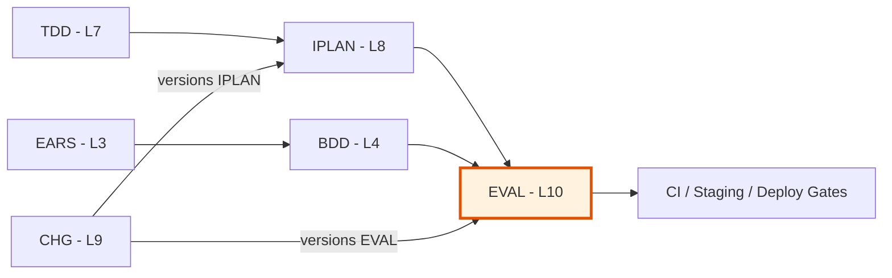

# Evaluation Layer (L10) — Testing & QA Governance

## Document Control

| Field | Value |
|-------|-------|
| Version | 2.0 |
| Status | Approved |
| Last Updated | 2026-10-27 |
| Author | Framework Maintainer |
| Framework Version | 0.53.1 |

## Overview

The evaluation layer defines how BeeLocal's test strategy is governed, measured, and reported.
It bridges the SDD document chain (EARS/BDD/TDD/IPLAN) to concrete testing execution,
providing a traceable path from requirements through test design to coverage evidence.

**Core principle**: Each IPLAN owns exactly one EVAL document (1:1 mapping). The EVAL
documents the specific test cases for that IPLAN's scope. EVAL version tracks with IPLAN
version — when a CHG bumps the IPLAN, the EVAL versions with it.

**Workflow**: IPLAN Completed → Create EVAL → Run eval cycles (initial → fix → re-run) → PASS → IPLAN Verified

## Architecture

### Per-IPLAN EVAL (1:1 mapping)

```
IPLAN-01 (Platform Port Boundary)
  └── EVAL-01/EVAL-01.yaml          # strategy: what to test for IPLAN-01
      └── reports/
          ├── EVAL-01-RPT-001.yaml   # cycle 1: FAIL (76.5%)
          ├── EVAL-01-RPT-002.yaml   # cycle 2: FAIL (88.9%)
          └── EVAL-01-RPT-003.yaml   # cycle 3: PASS (100%)

IPLAN-02 (Auth Privy JWT)
  └── EVAL-02/EVAL-02.yaml          # strategy: what to test for IPLAN-02
      └── reports/
          └── EVAL-02-RPT-001.yaml   # cycle 1: PASS (100%)
```

### Eval Cycle Workflow

```
┌─────────────┐     ┌──────────────┐     ┌──────────────┐
│  IPLAN       │────▶│  EVAL Doc    │────▶│  RPT Cycle 1 │
│  Completed   │     │  Created     │     │  (initial)   │
└─────────────┘     └──────────────┘     └──────┬───────┘
                                                 │
                              ┌──────────────────┘
                              ▼
                    ┌──────────────────┐
                    │  PASS?           │
                    ├──────┬───────────┤
                    │  YES │    NO     │
                    │      │           │
                    ▼      │           ▼
              ┌──────────┐ │   ┌──────────────────┐
              │ IPLAN    │ │   │  Fix Findings     │
              │ Verified │ │   │  (code changes)   │
              └──────────┘ │   └────────┬─────────┘
                           │            │
                           │            ▼
                           │   ┌──────────────────┐
                           │   │  RPT Cycle N+1   │
                           │   │  (bug_fix_verify)│
                           │   └────────┬─────────┘
                           │            │
                           └────────────┘
```

### Trigger Types

| Trigger | When | Example |
|---------|------|---------|
| `initial_eval` | First time evaluating this IPLAN version | IPLAN-01 reaches Completed |
| `bug_fix_verification` | Re-run after code fixes for findings | After fixing F-001, F-002 |
| `chg_verification` | Re-run after a CHG modified the IPLAN | CHG-09 bumps IPLAN-01 to v3.0 |
| `scheduled` | Periodic regression check | Weekly stability check |
| `pre_deploy` | Gate check before branch promotion | Staging → main promotion |

## File Format

EVAL uses **`.yaml` files** (unified YAML template pattern).

**Templates**:
- `EVAL-TEMPLATE.yaml` — per-IPLAN evaluation strategy document
- `EVAL-REPORT-TEMPLATE.yaml` — self-contained evaluation report
- `EVAL-00_index.TEMPLATE.md` — master index template

## Layer Position



**Layer**: 10 (Evaluation & QA Governance)
**Note**: Layer 9 is CHG (Change Record — governance overlay). EVAL is L10.
**Upstream (necessary)**: EARS (L3), BDD (L4), TDD (L7), IPLAN (L8)
**Downstream**: Code, CI/CD pipelines, deployment gates
**Traceability**: IPLAN → EVAL → RPT → verdict

## Directory Structure

```
docs/sdd/10_EVAL/
  EVAL-00_index.md                          # master index
  EVAL-01/                                  # owns IPLAN-01
    EVAL-01.yaml                            # active strategy document
    reports/
      EVAL-01-RPT-001.yaml                  # cycle 1
      EVAL-01-RPT-002.yaml                  # cycle 2
  EVAL-02/                                  # owns IPLAN-02
    EVAL-02.yaml
    reports/
      EVAL-02-RPT-001.yaml
  ...
```

## Naming Conventions

| Element | Format | Example |
|---------|--------|---------|
| EVAL directory | `EVAL-{NN}/` | `EVAL-01/` |
| EVAL document | `EVAL-{NN}.yaml` | `EVAL-01.yaml` |
| EVAL report | `EVAL-{NN}-RPT-{NNN}.yaml` | `EVAL-01-RPT-001.yaml` |
| Test case ID | `EVAL.NN.SS.xxxx` | `EVAL.01.04.4d64` |

**Rules**:
- `{NN}` is a zero-padded sequential number (01, 02, ... 99)
- `{hash}` is a 4-character content-derived identifier from the TDD
- Test case IDs are stable across eval cycles — they identify the test case, not a specific run
- Report IDs include the cycle number: RPT-001, RPT-002, ...
- **One source per test case** — each test case maps to exactly one upstream element (one source_type + one source_id). Never mix BDD, TDD, EARS, or other sources in a single test case. Create as many test cases as needed.

## Version Bumping Rules

| What changes | What happens |
|---|---|
| IPLAN gets a CHG bump (code changes, same scope) | EVAL stays same version, new RPT cycle |
| IPLAN scope changes (new files, new features) | EVAL bumps version, archive old EVAL + reports |
| BDD/TDD upstream changes | EVAL bumps version if it changes what's tested |

## CHG Archive Convention

When a CHG bumps an EVAL version:

```
docs/sdd/09-CHG/archive/{CHG-ID}/10_EVAL/
  EVAL-01/
    EVAL-01.yaml                      # archived old version
    reports/
      EVAL-01-RPT-001.yaml            # archived reports too
      EVAL-01-RPT-002.yaml
```

The active `EVAL-01/EVAL-01.yaml` becomes the new version. Old reports stay archived with it.

## Evaluation Tracks

### Track 1: Functional Testing (EVAL-F)

- **Source**: EARS (L3) formal requirements → BDD (L4) acceptance scenarios
- **Scope**: End-to-end user journeys, cross-component integration, API contract validation
- **Environment**: Staging only (not CI pipeline)
- **Artifacts**: Integration test suites, E2E automation, BDD-to-test traceability matrices
- **Gate**: All BDD scenarios mapped to ≥1 integration or E2E test case

### Track 2: Unit/Smoke Testing (EVAL-U)

- **Source**: TDD (L7) test case definitions → IPLAN (L8) execution plans
- **Scope**: Individual function behavior, data model validation, boundary conditions, smoke health checks
- **Environment**: CI pipeline (every push/PR)
- **Artifacts**: Unit test suites, smoke test scripts, coverage reports
- **Gate**: All TDD test cases implemented, coverage thresholds met, smoke tests passing

## EVAL Document Structure

Each `EVAL-{NN}.yaml` contains:

1. **Document Control** — owning IPLAN, version, status, revision history
2. **Evaluation Scope** — which IPLAN scope, relevant BDD/TDD, coverage target
3. **Test Design** — test cases derived from upstream scenarios
4. **Coverage Matrix** — traceability from source to test
5. **Quality Thresholds** — pass/fail criteria, coverage targets
6. **Execution Plan** — how, when, and where tests run

## EVAL Report Structure

Each `EVAL-{NN}-RPT-{NNN}.yaml` contains (self-contained, no external deps):

1. **Document Control** — cycle number, trigger, status, baseline reference
2. **IPLAN Context** — snapshot of IPLAN state at eval time
3. **Results** — pass/fail counts, by severity, by regression status
4. **Findings** — one per failure, with all context inline
5. **Resolved This Cycle** — findings fixed since previous cycle
6. **Coverage** — what was tested vs what exists
7. **Quality Thresholds** — actual vs target with gate verdict
8. **Verdict** — overall judgment with reasoning
9. **Evidence** — CI URLs, artifacts, retention
10. **Linkage** — eval ID, IPLAN ID, upstream references

## Cross-Cutting Strategy Documents (Deprecated)

The monolithic strategy documents are **deprecated** as of v2.0. They are retained for
reference only. Test strategy is now per-IPLAN in `EVAL-{NN}/EVAL-{NN}.yaml`.

| Document | Track | Purpose | Status |
|----------|-------|---------|--------|
| `EVAL-01_functional_strategy.yaml` | Functional | Test type decision tree, staging execution phases, verdict criteria | Deprecated |
| `EVAL-02_unit_smoke_strategy.yaml` | Unit/Smoke | CI pipeline execution, smoke test definitions, deployment gates | Deprecated |

**Migration**: Each IPLAN now owns its EVAL document. When creating a new EVAL, extract
relevant test cases from these monolithic files into the per-IPLAN EVAL. The per-IPLAN
documents define *what* to test for their specific IPLAN scope.

## Files

| File | Purpose |
|------|---------|
| `EVAL-TEMPLATE.yaml` | Per-IPLAN evaluation strategy template |
| `EVAL-REPORT-TEMPLATE.yaml` | Self-contained evaluation report template |
| `EVAL-00_index.TEMPLATE.md` | Master index template |
