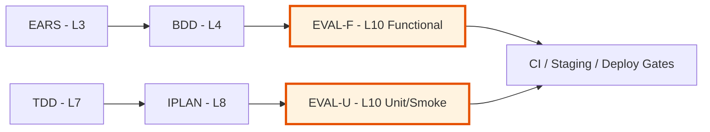

# Evaluation Layer (L10) — Testing & QA Governance

## Document Control

| Field | Value |
|-------|-------|
| Version | 1.0 |
| Status | Approved |
| Last Updated | 2026-09-07 |
| Author | Framework Maintainer |
| Framework Version | 0.53.0 |


## Overview

The evaluation layer defines how BeeLocal's test strategy is governed, measured, and reported.
It bridges the SDD document chain (EARS/BDD/TDD/IPLAN) to concrete testing execution,
providing a traceable path from requirements through test design to coverage evidence.

**Workflow**: EARS → BDD → **EVAL (functional)** | TDD → IPLAN → **EVAL (unit/smoke)**

## Strategy Architecture

The evaluation layer splits into two independent test tracks:

```
┌─────────────────────────────────────────────────────────────────┐
│                    EVALUATION LAYER (L10)                       │
├────────────────────────────────┬────────────────────────────────┤
│   Functional Testing Track     │   Unit/Smoke Testing Track     │
│   (EARS + BDD → EVAL-F)       │   (TDD + IPLAN → EVAL-U)      │
├────────────────────────────────┼────────────────────────────────┤
│                                │                                │
│   EARS (L3) formal reqs        │   TDD (L7) test case defs     │
│        ↓                       │        ↓                       │
│   BDD (L4) acceptance scens    │   IPLAN (L8) execution plans   │
│        ↓                       │        ↓                       │
│   EVAL-F: functional eval      │   EVAL-U: unit/smoke eval      │
│        ↓                       │        ↓                       │
│   Integration + E2E tests      │   Unit + Smoke tests           │
│        ↓                       │        ↓                       │
│   Staging verification         │   CI pipeline gates            │
│                                │                                │
└────────────────────────────────┴────────────────────────────────┘
```

## File Format

EVAL uses **`.yaml` files** (unified YAML template pattern).

**Template**: `EVAL-TEMPLATE.yaml`
**Index template**: `EVAL-00_index.TEMPLATE.md`

## Layer Position



**Layer**: 10 (Evaluation & QA Governance)
**Note**: Layer 9 is CHG (Change Record — governance overlay). EVAL is L10.
**Upstream (necessary)**: EARS (L3), BDD (L4), TDD (L7), IPLAN (L8)
**Downstream**: Code, CI/CD pipelines, deployment gates
**Traceability**: EARS → BDD → EVAL-F → Integration/E2E tests
**Traceability**: TDD → IPLAN → EVAL-U → Unit/Smoke tests

## Files

| File | Purpose |
|------|---------|
| `EVAL-TEMPLATE.yaml` | Full template with evaluation strategy guidance |
| `EVAL-00_index.TEMPLATE.md` | Index template — tracks evaluation documents per project |

## Evaluation Tracks

### Track 1: Functional Testing (EVAL-F)

- **Source**: EARS (L3) formal requirements → BDD (L4) acceptance scenarios
- **Scope**: End-to-end user journeys, cross-component integration, API contract validation
- **Environment**: Staging only (not CI pipeline)
- **Artifacts**: Integration test suites, E2E automation, BDD-to-test traceability matrices
- **Gate**: All BDD scenarios mapped to ≥1 integration or E2E test case

### Track 2: Unit/Smoke Testing (EVAL-U)

- **Source**: TDD (L7) test case definitions → IPLAN (L8) execution plans
- **Scope**: Individual function behavior, data model validation, boundary conditions, smoke health checks
- **Environment**: CI pipeline (every push/PR)
- **Artifacts**: Unit test suites, smoke test scripts, coverage reports
- **Gate**: All TDD test cases implemented, coverage thresholds met, smoke tests passing

## Evaluation Document Structure

Each `EVAL-NN` document contains:

1. **Document Control** — version, status, approval, revision history
2. **Evaluation Scope** — which upstream layers it covers
3. **Test Design** — test cases derived from upstream scenarios/requirements
4. **Coverage Matrix** — traceability from source to test
5. **Quality Thresholds** — pass/fail criteria, coverage targets, verdict criteria
6. **Execution Plan** — how, when, and where tests run (including phased execution)
7. **Required Environment** — infrastructure prerequisites for test execution
8. **Test Data Setup** — SQL/scripts for test data preparation and cleanup
9. **Coverage Tracking** — operational metrics, endpoint coverage, gap analysis

## Naming Conventions

| Element | Format | Example |
|---------|--------|---------|
| Document | `EVAL-NN_{slug}.yaml` | `EVAL-01_functional_strategy.yaml` |
| Test Case ID | `EVAL.NN.04.xxxx` | `EVAL.01.04.a7b3` |
| Coverage Entry | `cov_{source_id}` | `cov_BDD.02.03.6e26` |
