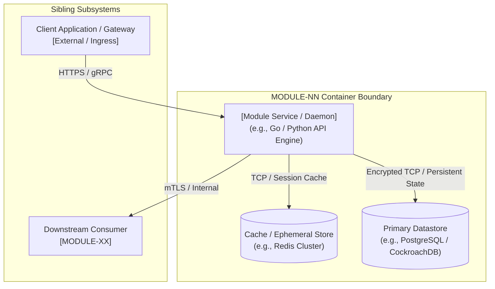
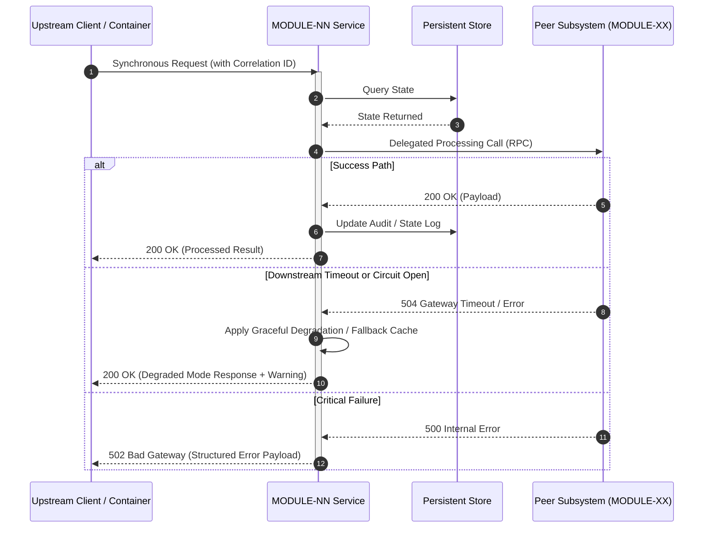

---
document_control:
  title: "Module Specification: [Module Name]"
  version: "1.0.0"
  type: "MODULE"
  module_id: "MODULE-NN"
  status: "Draft" # Draft | Active | Deprecated | Superseded
  owners:
    - "[Architect or Tech Lead Name / Role]"
  c4_level: "c4-l2"
  data_classification: "[Highest sensitivity level, e.g. Restricted / PII]"
  last_updated: "YYYY-MM-DD"
  description: "Architectural container specification, data flow, trust boundaries, and process choreography."
---

# MODULE-NN: [Module Name]

## Document Overview
Provides the authoritative architectural specification for `MODULE-NN`. Codified using the
Triple-Lens modeling standard ([`framework/governance/SEED_TO_MODULE_DECOMPOSITION.md`](../governance/SEED_TO_MODULE_DECOMPOSITION.md))
and module directory conventions ([`framework/governance/MODULE_LAYOUT.md`](../governance/MODULE_LAYOUT.md)).

---

## 1. Domain Overview & Scope Boundaries

### 1.1 Core Responsibility
[Single concise paragraph stating the primary architectural purpose of this module.]

### 1.2 Boundary Definition
- **In-Scope Capabilities**:
  - [Capability 1: e.g., Token issuance and validation]
  - [Capability 2: e.g., Multi-factor authentication challenges]
- **Out-of-Scope Hand-offs**:
  - [Hand-off 1: e.g., User profile storage is delegated to MODULE-02_users]
  - [Hand-off 2: e.g., Audit event indexing is delegated to MODULE-12_observability]

### 1.3 Upstream Seed Traceability
- **Seed Domain**: `seed/<domain>.md`
- **Vision Reference**: "[Quote or summarize corresponding seed intent]"
- **Absorbed Trade-offs**: "[Summarize why this container architecture was selected over alternatives explored in seed]"

---

## 2. Structural Architecture (C4-L2 Container)

<!-- Intent Header:
     diagram_type: c4
     level: l2
     scope_boundary: MODULE-NN container boundary
     upstream_refs: seed/<domain>.md
     downstream_refs: docs/sdd/02_PRD/
-->
@diagram: c4-l2



---

## 3. Data Movement, Trust Boundaries & Sensitivity (DFD-L2)

### 3.1 Data Flow Diagram
<!-- Intent Header:
     diagram_type: dfd
     level: l2
     scope_boundary: MODULE-NN trust and data movement boundaries
     upstream_refs: seed/<domain>.md
     downstream_refs: docs/sdd/06_SPEC/
-->
@diagram: dfd-l2

```mermaid
flowchart LR
    subgraph UntrustedZone["Untrusted Network (Public Internet)"]
        User(["End User / External Client"])
    end

    subgraph DMZ["DMZ / Ingress Boundary (TLS Termination)"]
        Gateway["API Gateway / Reverse Proxy"]
    end

    subgraph SecureCore["Secure Internal VPC (Private Subnet)"]
        AppContainer["MODULE-NN Application Container"]
        LocalStore[("Private Persistent Store")]
    end

    subgraph IsolatedVault["Restricted Enclave (Hardware Security Boundary)"]
        SecretVault[("Secrets Vault / HSM")]
    end

    User -->|Bearer Token [Restricted]| Gateway
    Gateway -->|Validated Claims [Confidential]| AppContainer
    AppContainer -->|State Persistence [Confidential]| LocalStore
    AppContainer -->|Key Encryption Request [Restricted]| SecretVault
```

### 3.2 Data Sensitivity & Protection Matrix

Classify all data entities passing through or stored within this module per
[`SEED_TO_MODULE_DECOMPOSITION.md`](../governance/SEED_TO_MODULE_DECOMPOSITION.md) §4:

| Data Entity | Classification | Storage Location | In Transit | At Rest | Retention / Deletion Policy |
|---|---|---|---|---|---|
| User Credentials | 🔴 Restricted / PII | Secrets Vault / DB | TLS 1.3 | Argon2id Hash | Purged immediately on account deletion |
| Session Token | 🟠 Confidential | Memory / Cache | TLS 1.3 | AES-256 GCM | 24 Hours TTL |
| Operational Metrics | 🟡 Internal | Observability DB | TLS 1.3 | Encrypted Volume | 90 Days rolling retention |
| Public API Metadata | 🟢 Public | Static Storage | HTTPS | Standard | Permanent until deprecated |

---

## 4. Inter-Module Process Choreography & Failure Handling

<!-- Intent Header:
     diagram_type: sequence
     level: l2
     scope_boundary: Primary inter-module transaction lifecycle
     upstream_refs: seed/<domain>.md
     downstream_refs: docs/sdd/02_PRD/, docs/sdd/06_SPEC/
-->
@diagram: sequence-sync



---

## 5. Subsystem Invariants & Constraints

- `[INV-01]`: [Non-negotiable architectural invariant, e.g., All incoming requests must provide an authenticated correlation ID.]
- `[INV-02]`: [Data protection invariant, e.g., Restricted PII fields must never be logged or output to trace spans.]
- `[INV-03]`: [Reliability invariant, e.g., External dependencies must be wrapped in circuit-breakers with a max 250ms timeout.]
- `[INV-04]`: [Storage constraint, e.g., Database transactions must be strictly isolated and idempotent.]
