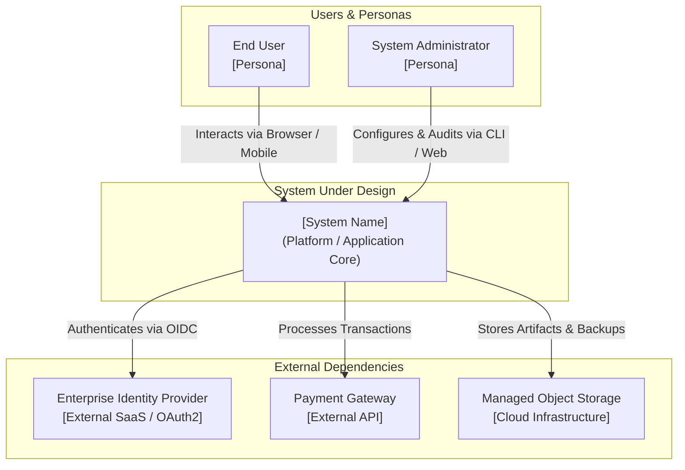

---
document_control:
  document_id: "SEED-<slug>"                     # e.g., SEED-auth-architecture
  version: "1.2"                                 # SemVer (must be near top for regex parse)
  status: Approved                               # Draft | Approved | Superseded
  author: "human: <architect/stakeholder> (+ ai-agent: <id>)"
  created_date: "YYYY-MM-DD"
  last_updated: "YYYY-MM-DD"
  framework_version: "0.90.2"
  c4_level: "c4-l1"
  supersedes: []                                 # e.g., ["seed/architecture/auth.md v1.0 (docs/sdd/09-CHG/archive/CHG-NN/seed/auth-v1.0.md)"]
  revision_history:
    - version: "1.2"
      date: "YYYY-MM-DD"
      author: "human: <name>"
      chg_ref: "CHG-73"
      description: "Synchronize seed tier contract callout with SEED2C (F3) graph nomenclature"
    - version: "1.1"
      date: "YYYY-MM-DD"
      author: "human: <name>"
      chg_ref: "CHG-54"
      description: "Incorporate C4-L1 System Context and DFD-L1 data flow boundary diagrams"
    - version: "1.0"
      date: "YYYY-MM-DD"
      author: "human: <name>"
      chg_ref: "None (initial seed)"             # or CHG-ID if created/superseded post-first-BRD
      description: "Initial foundational architecture and vision"
---

# SEED: <Title / Domain Name>

> **Seed Tier Contract ([`SEED_CONTRACT.md`](../governance/SEED_CONTRACT.md)):**  
> Seed documents reside at `<project>/seed/` (Tier 1 Inputs). They are **not** SDD chain artifacts, carry no element IDs, and are frozen per version once absorbed. Changed assumptions are superseded (`vN → vN+1`) via SEED2C (F3) Change Requests (Phase 0a `seed_scope`). Decomposes into C4-L2 modules via [`SEED_TO_MODULE_DECOMPOSITION.md`](../governance/SEED_TO_MODULE_DECOMPOSITION.md).

---

## 1. Intent & "True North" Vision
- **Problem Statement:** What fundamental user, business, or operational problem are we solving?
- **Desired Destination:** What does the end state look like once fully realized?
- **Core Value Proposition:** Who benefits and why is this solution compelling?

---

## 2. Environmental Realities & Constraints
- **Business Context:** Target markets, resource boundaries, critical timeline assumptions.
- **Technology & Infrastructure Baseline:** Existing platforms, external dependencies, system boundaries.
- **Regulatory, Compliance & Security Drivers:** Data residency, privacy constraints, compliance baselines.

---

## 3. System Context & External Environment (C4-L1 & DFD-L1)

### 3.1 C4-L1 System Context Diagram
<!-- Intent Header:
     diagram_type: c4
     level: l1
     scope_boundary: System boundary in external environment
     upstream_refs: Stakeholder vision & business drivers
     downstream_refs: docs/sdd/01_BRD/, docs/modules/
-->
@diagram: c4-l1



### 3.2 DFD-L1 External Data Flow Diagram
<!-- Intent Header:
     diagram_type: dfd
     level: l1
     scope_boundary: Top-level data movement across system boundary
     upstream_refs: Environmental realities & regulatory constraints
     downstream_refs: docs/sdd/01_BRD/
-->
@diagram: dfd-l1

```mermaid
flowchart LR
    User(["End User"]) -->|Requests & Inputs [Public/Confidential]| System["[System Name]"]
    System -->|Responses & Notifications [Public]| User
    System -->|Audit Logs & State Telemetry [Internal]| Admin(["Auditor / Admin"])
    System -->|Encrypted Financial Payloads [Restricted]| PaymentSvc["External Payment Gateway"]
    PaymentSvc -->|Settlement Confirmation [Confidential]| System
```

---

## 4. Options Considered & Trade-Off Analysis
> *Note: Seed docs preserve the trade-off exploration. The formal choice is recorded downstream in the SDD ADR.*

### Option A: <Approach Name>
- **Description:** Summary of how this approach works.
- **Pros:** Key advantages and capabilities unlocked.
- **Cons & Risks:** Trade-offs, operational burdens, failure modes.

### Option B: <Approach Name> (Selected / Recommended)
- **Description:** Summary of how this approach works.
- **Pros:** Why this best satisfies the project requirements and constraints.
- **Cons & Risks:** Known trade-offs accepted.

---

## 5. Architectural Principles & Non-Negotiable Invariants
- **Guiding Principles:** Fundamental design rules (e.g., *vendor-neutral telemetry*, *offline-first sync*, *zero-trust perimeter*).
- **Invariants:** Core technical boundaries that downstream SDD layers (`BRD` through `SPEC`) must not violate without an explicit supersede.

---

## 6. Explicit Non-Goals & Out-of-Scope
- Explicitly state what this initiative will **not** attempt to solve, preventing downstream scope creep.

---

## 7. Seed Claims for SDD Absorption (Handoff to BRD & Modules)
State discrete, high-level assertions in natural language for the Business Analyst to map into the BRD [`seed_disposition:`](../layers/01_BRD/BRD-TEMPLATE.yaml) table and for the Architect to decompose into modules per [`SEED_TO_MODULE_DECOMPOSITION.md`](../governance/SEED_TO_MODULE_DECOMPOSITION.md).

> **CRITICAL RULE:** Do NOT assign synthetic or pseudo-element IDs (e.g., `[CLAIM-01]`, `SEED.01`) to seed assertions. Seed claims are natural-language assertions absorbed by quoting their text directly in the BRD ledger.

- "Every issued short code must be unique across the platform."
- "Visitors must be able to follow links without creating an account."
- "High-throughput telemetry ingestion must tolerate temporary cloud provider disconnections."
