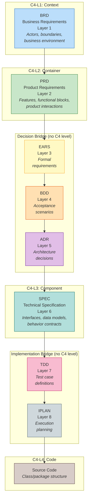

# SDD v3.2 — Streamlined Specification-Driven Development

## Overview

SDD v3.2 is an **8-layer documentation-to-code framework** that produces implementation-ready technical specifications from business requirements. Each layer is a single YAML document type with cumulative traceability.

```
BRD → PRD → EARS → BDD → ADR → SPEC → TDD → IPLAN → Code
```

## Why v3?

Earlier framework revisions used a deeper document chain and broader template surface area. v3.2 uses 8 document layers plus code, reducing documentation surface area while maintaining full traceability with logical layer ordering.

## C4 Architecture Model

SDD v3.2 layers align with the C4 model at 4 zoom levels, with two bridge groups connecting them:



| C4 Level | SDD | Artifact | Diagram Tags | Description |
|----------|-----|----------|-------------|-------------|
| **C4-L1 Context** | L1 | BRD | `@diagram: c4-l1` `@diagram: dfd-l1` | System context: actors, boundaries |
| **C4-L2 Container** | L2 | PRD | `@diagram: c4-l2` `@diagram: dfd-l2` `@diagram: sequence-sync` | Product containers, features |
| **Decision Bridge** | L3-L5 | EARS, BDD, ADR | _(none)_ | Requirements → scenarios → decisions |
| **C4-L3 Component** | L6 | SPEC | `@diagram: c4-l3` `@diagram: dfd-l3` | Interfaces, data models |
| **Impl Bridge** | L7-L8 | TDD, IPLAN | _(none)_ | Test definitions → execution |
| **C4-L4 Code** | — | Source Code | `@diagram: c4-l4` | Class/package structure |

## Layer Structure

```
ucx_flow_v3/
├── README.md
├── LAYER_REGISTRY.yaml             # Authoritative layer definitions
├── SPEC_DRIVEN_DEVELOPMENT_GUIDE.md
├── ID_NAMING_STANDARDS.md
├── TRACEABILITY.md
├── DIAGRAM_STANDARDS.md
├── THRESHOLD_NAMING_RULES.md
├── TESTING_STRATEGY_TDD.md
├── QUICK_REFERENCE.md
├── 01_BRD/                         # Business Requirements
│   ├── BRD-TEMPLATE.yaml
│   └── BRD-00_index.md
├── 02_PRD/                         # Product Requirements
│   ├── PRD-TEMPLATE.yaml
│   └── PRD-00_index.md
├── 03_EARS/                        # Formal Requirements
│   ├── EARS-TEMPLATE.yaml
│   └── EARS-00_index.md
├── 04_BDD/                         # Behavior-Driven Development
│   ├── BDD-TEMPLATE.yaml
│   └── BDD-00_index.md
├── 05_ADR/                         # Architecture Decision Records
│   ├── ADR-TEMPLATE.yaml
│   └── ADR-00_index.md
├── 06_SPEC/                        # Technical Specification
│   ├── SPEC-TEMPLATE.yaml
│   └── SPEC-00_index.md
├── 07_TDD/                         # Test-Driven Development Guide
│   ├── TDD-TEMPLATE.yaml
│   └── TDD-00_index.md
├── 08_IPLAN/                       # Implementation Plan
│   ├── IPLAN-TEMPLATE.yaml
│   └── IPLAN-00_index.yaml
├── CHG/                            # Change Management (governance overlay)
│   ├── README.md
│   ├── CHG-00_index.md
│   ├── CHG-TEMPLATE.yaml
│   ├── gates/                      # Gate definitions
│   │   ├── GATE-01_BUSINESS_PRODUCT.md
│   │   ├── GATE-03_REQUIREMENTS_ARCHITECTURE.md
│   │   ├── GATE-06_DESIGN_TEST.md
│   │   ├── GATE-08_IPLAN.md
│   │   ├── GATE-CODE_IMPLEMENTATION.md
│   │   ├── GATE_INTERACTION_DIAGRAM.md
│   │   └── GATE_ERROR_CATALOG.md
│   └── templates/
│       ├── GATE_APPROVAL_FORM.md
│       └── POST_MORTEM-TEMPLATE.md
└── plans/
    └── CHG_MIGRATION_PLAN.md
```

## Quick Start

1. **Set up**: Copy this directory to your project as `ucx_flow_v3/`
2. **Create BRD**: `cp 01_BRD/BRD-TEMPLATE.yaml 01_BRD/BRD-01.yaml` and fill in business requirements
3. **Follow the chain**: Generate PRD from BRD, EARS from PRD, BDD from EARS, etc.
4. **Generate tests then code**: SPEC defines the component contract → TDD defines test cases → IPLAN orchestrates implementation
5. **Recommended agent split**: Hermes runs BRD→IPLAN lifecycle; Claude Code, Codex, or another code-generation agent implements source code from approved IPLANs
6. **Issue-fix loop**: Hermes triages observability-driven issues; issues in `ai:ready` are fixed and deployed by execution agents; Hermes verifies post-deployment evidence and closes issues

## UCX Hermes Review/Remediation Runtime Notes

When this SDD chain is executed through UCX Hermes (`ucx_hermes`):

- Review supports `prompt_only` and `saga_parallel` modes.
- Saga mode can execute branch-level LLM fan-out/fan-in when `saga_branch_llm_enabled` is enabled.
- Rollout defaults can be phase-driven via `UCX_REVIEW_SAGA_BRANCH_LLM_PHASE` (`A/B` off, `C` on without explicit flag).
- Debug raw branch output persistence is opt-in with `UCX_REVIEW_DEBUG_RAW_OUTPUTS=true`; persisted raw content is redacted.
- Default review saga branch executor is `api/openrouter`.
- Default remediation executor when omitted is `api/claude-sonnet`.
- Default generation controls are `temperature=0.2`, `top_p=0.9`, `top_k` unset, `max_output_tokens=4000`.

## Layer Flow

| Step | From | To | Readiness Gate |
|------|------|----|---------------|
| 1 | — | BRD | — |
| 2 | BRD | PRD | PRD-Ready >=90 |
| 3 | PRD | EARS | EARS-Ready >=90 |
| 4 | EARS | BDD | BDD-Ready >=90 |
| 5 | BDD | ADR | ADR-Ready >=90 |
| 6 | ADR | SPEC | SPEC-Ready >=90 |
| 7 | SPEC | TDD | TDD-Ready >=90 |
| 8 | TDD | IPLAN | IPLAN-Ready >=90 |
| 9 | IPLAN | Code | EXEC-Ready >=90 |

## v3.2 Baseline

See [CHG_MIGRATION_PLAN.md](plans/CHG_MIGRATION_PLAN.md) for detailed historical migration records.

| Area | v3.2 Baseline | Notes |
|----|-----|--------|
| Layer model | 8 document layers + code | BRD→PRD→EARS→BDD→ADR→SPEC→TDD→IPLAN→Code |
| Test definition | Unified TDD layer | Test case definitions embedded in TDD template |
| Specification model | Unified SPEC layer | Single component-contract template |
| Traceability | 8 cumulative tags max | Progressive upstream inheritance through IPLAN |
| Execution planning | IPLAN layer | Session handoff and implementation sequencing |
