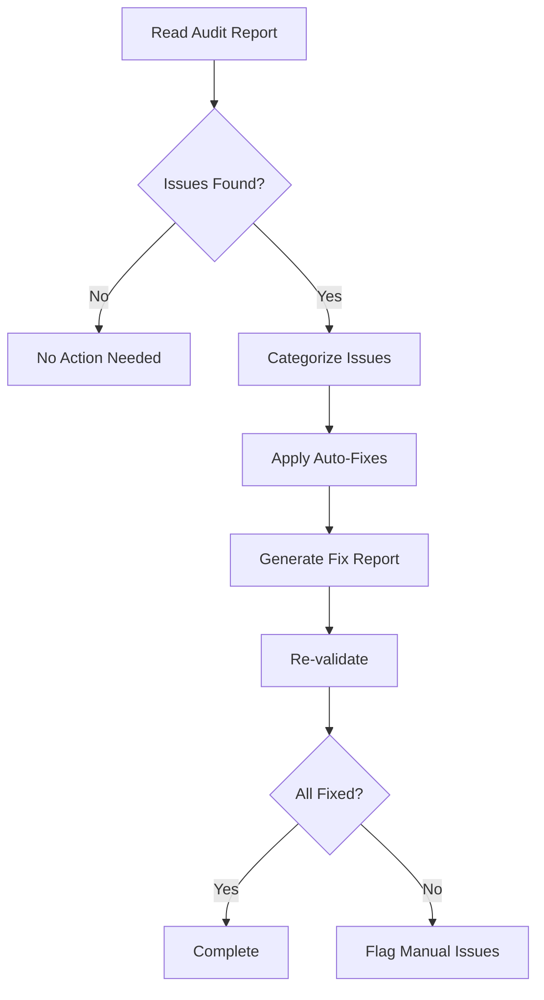

# doc-cspec-fixer

## Purpose

Automated **fix skill** that reads the latest review report and applies fixes
to component-focused SPEC (Layer 6) documents. It bridges the gap between
`doc-cspec-reviewer` (which identifies issues) and the corrected SPEC, enabling
iterative improvement cycles.

This skill is a **SPEC (Layer 6) specialization** operating on the
component-design focus of SPEC. It does **not** define a separate artifact,
template, or element-code; the canonical artifact contract is
`framework/layers/06_SPEC/SPEC-TEMPLATE.yaml` (see `../doc-spec/`).

**Layer**: 6 (SPEC — component focus)

**Upstream**: SPEC document, Review Report (`SPEC-NN.A_audit_report_vNNN.md`)

**Downstream**: Fixed SPEC, Fix Report (`SPEC-NN.F_fix_report_vNNN.md`)

---

## When to Use

Use `doc-cspec-fixer` when:
- **After Review**: Run after `doc-cspec-reviewer` identifies issues
- **Iterative Improvement**: Part of Review → Fix → Review cycle
- **Behavior-Contract Alignment**: Fix behavior/validation contract issues
- **YAML Structure Issues**: SPEC contains malformed YAML blocks

**Do NOT use when**:
- No review report exists (run `doc-cspec-reviewer` first)
- Issues require manual architectural decisions
- The upstream ADR decision itself needs modification

---

## Fixable Issue Types

### Automatic Fixes

| Issue Type | Fix Action |
|------------|------------|
| Missing `document_type` | Add `document_type: spec-document` |
| Missing `layer` | Add `layer: 6` |
| Broken internal links | Update to correct paths |
| Missing traceability tags | Add required upstream tags |
| YAML syntax errors | Fix formatting issues |
| Incomplete metadata | Add required fields |

### Semi-Automatic Fixes (Require Confirmation)

| Issue Type | Fix Action |
|------------|------------|
| Missing interface definitions | Generate skeleton from upstream sources |
| Incomplete TDD contract mapping | Generate test contract placeholders |
| Missing algorithm details | Add TODO markers |

### Manual Review Required

| Issue Type | Action |
|------------|--------|
| Architectural changes | Flag for human review |
| Behavior-contract mismatches | Escalate to ADR/SPEC owner |
| Business logic errors | Requires domain expertise |

---

## Execution Flow



---

## Fix Report Format

```markdown
# SPEC-NN Fix Report (component focus)

## Summary
- **Document**: SPEC-NN_{slug}
- **Fix Date**: YYYY-MM-DD
- **Source Report**: SPEC-NN.A_audit_report_v001.md
- **Issues Fixed**: N
- **Issues Remaining**: N

## Fixes Applied

### Fix 1: [Issue Title]
- **Type**: [Auto/Semi-Auto]
- **Location**: [section/path]
- **Before**: [old value]
- **After**: [new value]

## Remaining Issues

### Issue 1: [Issue Title]
- **Reason**: Requires manual review
- **Recommendation**: [action needed]

## Validation
- **Post-Fix TDD-Ready Score**: NN%
- **Status**: PASS/FAIL
```

---

## Output Files

| File | Purpose |
|------|---------|
| Updated SPEC YAML | Fixed document |
| `SPEC-NN.F_fix_report_vNNN.md` | Fix report documenting changes |

---

## Integration

### With Reviewer
```
doc-cspec-reviewer → SPEC-NN.A_audit_report.md → doc-cspec-fixer → Fixed SPEC
```

### Iterative Loop
```
SPEC → reviewer → audit_report → fixer → fixed_SPEC → reviewer → ...
```

Maximum iterations: 3 (to prevent infinite loops)

---

## References

- Canonical SPEC artifact contract: `framework/layers/06_SPEC/SPEC-TEMPLATE.yaml`
- Layer overview: `framework/layers/06_SPEC/README.md`
- Governance / ID & naming standards: `framework/governance/`
- Parent SPEC skill: `../doc-spec/`
