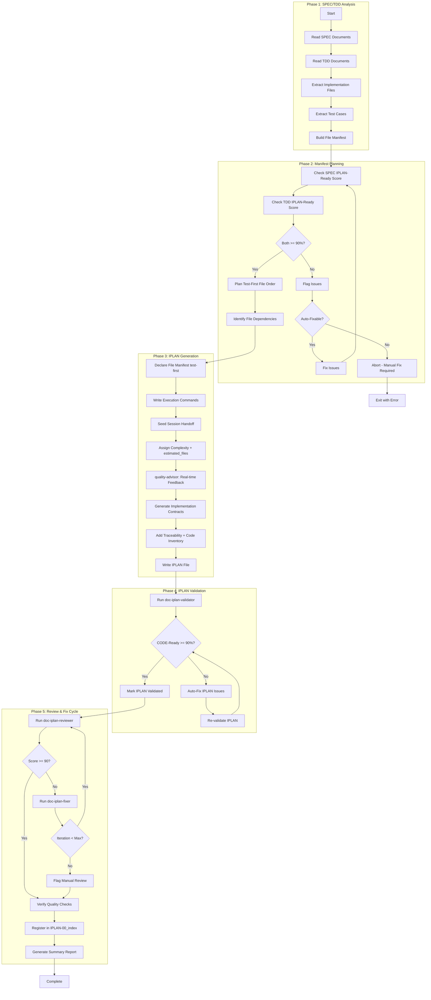
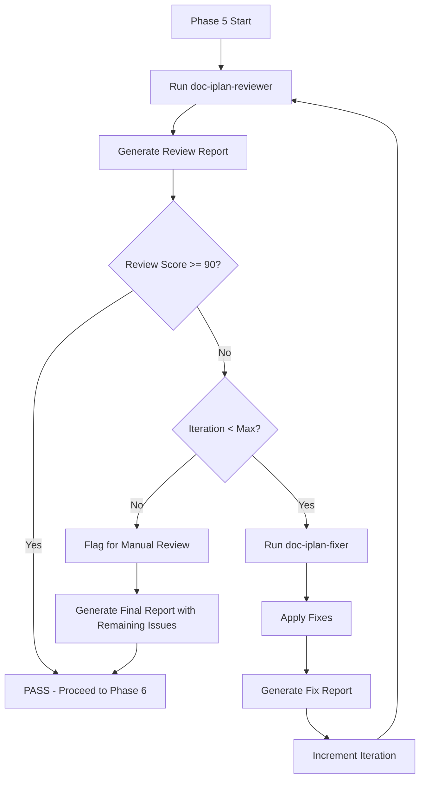
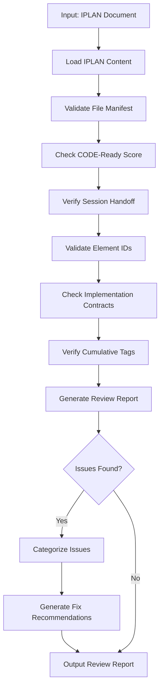
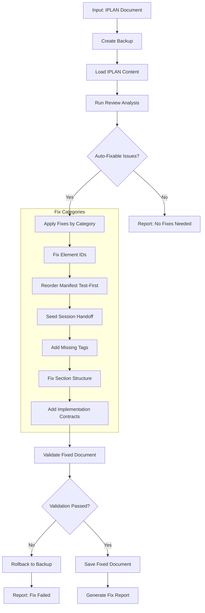

# doc-iplan-autopilot

## Purpose

Automated **Implementation Plan (IPLAN)** generation pipeline that processes SPEC and TDD documents to produce an executable, session-resumable file manifest for implementation with CODE-Ready scoring.

**Layer**: 8 (Final documentation layer before code)

**Upstream**: SPEC (Layer 6), TDD (Layer 7)

**Downstream**: Code (execution layer)

---

## Input Contract (IPLAN-004 Standard)

- Supported modes:
  - `--ref <path>`
  - `--prompt "<text>"`
  - `--iplan <path|IPLAN-NN>`
- Precedence: `--iplan > --ref > --prompt`
- IPLAN resolution order:
  1. Use explicit file path when it exists
  2. Resolve `docs/08_IPLAN/IPLAN-NN*.yaml`
  3. Resolve `governance/plans/IPLAN-NN*.yaml`
  4. If multiple matches exist, fail with disambiguation request
- Merge conflict rule:
  - Objective/scope conflicts between primary and supplemental sources are blocking and require user clarification.

---

## Skill Dependencies

| Skill | Purpose | Phase |
|-------|---------|-------|
| `doc-naming` | Element ID format (`IPLAN-NN`, `TDD.NN.SS.xxxx`, `SPEC-NN`) | All Phases |
| `doc-spec-validator` | Validate SPEC IPLAN-Ready score | Phase 2 |
| `doc-tdd-validator` | Validate TDD IPLAN-Ready score | Phase 2 |
| `doc-iplan` | IPLAN creation rules, file-manifest format | Phase 3 |
| `quality-advisor` | Real-time quality feedback | Phase 3 |
| `doc-iplan-validator` | Validation with CODE-Ready scoring | Phase 4 |
| `doc-iplan-audit` | Unified validator + reviewer wrapper output | Phase 5: Audit |
| `doc-iplan-reviewer` | Content review, link validation, quality scoring | Phase 5: Review |
| `doc-iplan-fixer` | Apply fixes from audit/review report, create missing files | Phase 5: Fix |

---

## Document Type Contract (MANDATORY)

When generating IPLAN document instances, the autopilot MUST:

1. **Read** `document_type` from template:
   - Source: `framework/layers/08_IPLAN/IPLAN-TEMPLATE.yaml`
   - Field: `metadata.document_type: "iplan-document"`

2. **Set** `document_type` in generated document metadata:
   ```yaml
   metadata:
     document_type: iplan-document    # NOT "template"
     artifact_type: IPLAN
     layer: 8
   ```

3. **Validation**: Generated documents MUST have `document_type: iplan-document`
   - Templates have `document_type: template`
   - Instances have `document_type: iplan-document`
   - Schema validates both values

**Error Handling**: If `document_type` is missing from template, default to `iplan-document`.

---

## Smart Document Detection

The autopilot automatically determines the action based on the input document type.

### Input Type Recognition (Multiple Upstreams)

IPLAN can be derived from SPEC and/or TDD:

| Input | Detected As | Action |
|-------|-------------|--------|
| `IPLAN-NN` | Self type | Review existing IPLAN document |
| `SPEC-NN` | Primary upstream | Generate if missing, review if exists |
| `TDD-NN` | Primary upstream | Generate if missing, review if exists |

### Detection Algorithm

```
1. Parse input: Extract TYPE and NN from "{TYPE}-{NN}"
2. Determine action:
   - IF TYPE == "IPLAN": Review Mode
   - ELSE IF TYPE in ["SPEC", "TDD"]: Generate/Find Mode
   - ELSE: Error (invalid type for this autopilot)
3. For Generate/Find Mode:
   - Check: Does IPLAN-{NN} exist in docs/08_IPLAN/?
   - IF exists: Switch to Review Mode for IPLAN-{NN}
   - ELSE: Proceed with Generation from {TYPE}-{NN}
```

### File Existence Check

```bash
# Check for nested folder structure (mandatory)
ls docs/08_IPLAN/IPLAN-{NN}_*/
```

### Examples

```bash
# Review mode (same type - IPLAN input)
/doc-iplan-autopilot IPLAN-01         # Reviews existing IPLAN-01

# Generate/Find mode (upstream types)
/doc-iplan-autopilot SPEC-01          # Generates IPLAN-01 if missing, or reviews existing IPLAN-01
/doc-iplan-autopilot TDD-01           # Generates IPLAN-01 if missing, or reviews existing IPLAN-01

# Multiple inputs
/doc-iplan-autopilot SPEC-01,SPEC-02  # Generates/reviews IPLAN-01 and IPLAN-02
/doc-iplan-autopilot IPLAN-01,IPLAN-02 # Reviews IPLAN-01 and IPLAN-02
```

### Action Determination Output

```
Input: SPEC-01
├── Detected Type: SPEC (primary upstream)
├── Expected IPLAN: IPLAN-01
├── IPLAN Exists: Yes → docs/08_IPLAN/IPLAN-01_f1_iam/
└── Action: REVIEW MODE - Running doc-iplan-reviewer on IPLAN-01

Input: TDD-05
├── Detected Type: TDD (primary upstream)
├── Expected IPLAN: IPLAN-05
├── IPLAN Exists: No
└── Action: GENERATE MODE - Creating IPLAN-05 from TDD-05

Input: IPLAN-03
├── Detected Type: IPLAN (self)
└── Action: REVIEW MODE - Running doc-iplan-reviewer on IPLAN-03
```

---

## Workflow Overview



---

## IPLAN Structure

### Document & Element ID Format

| Reference | Format | Example |
|-----------|--------|---------|
| IPLAN document | `IPLAN-NN` (document-level dash reference) | `IPLAN-01` |
| SPEC document | `SPEC-NN` (document-level dash reference) | `SPEC-01` |
| ADR document | `ADR-NN` (document-level dash reference) | `ADR-03` |
| TDD test case | `TDD.NN.SS.xxxx` (4-segment, 4-hex hash) | `TDD.01.04.a3c1` |

IPLAN is referenced at the document level — there is no hierarchical element-ID hash for an IPLAN itself.

### Complexity Levels

| Complexity | Description |
|------------|-------------|
| 1 | Single file |
| 2-3 | Small component (a few files) |
| 4 | Multi-file component with shared interfaces |
| 5 | Architectural changes spanning subsystems |

---

## IPLAN Document Structure

The IPLAN is a YAML document with six sections matching `IPLAN-TEMPLATE.yaml`.

```yaml
# IPLAN-01_data_validation.yaml
metadata:
  schema_version: "1.0"
  document_type: iplan-document
  layer: 8

# Section 1: Document Control
document_control:
  iplan_id: "IPLAN-01"
  source_spec: "@spec: SPEC-01"
  status: Draft            # Draft | In Progress | Completed
  complexity: 3
  estimated_files: 3
  session_count: 0

# Section 2: File Manifest (test-first order)
file_manifest:
  files:
    - path: "tests/unit/test_data_validator.py"
      order: 1
      status: NOT_STARTED  # NOT_STARTED | IN_PROGRESS | DONE | PARTIAL
      session: null
      verified: false
    - path: "src/services/data_validator.py"
      order: 2
      status: NOT_STARTED
      session: null
      verified: false

# Section 3: Execution Commands
execution_commands:
  setup: ["mkdir -p src/services tests/unit"]
  implementation: ["# Create test first (TDD): tests/unit/test_data_validator.py"]
  validation: ["python -m pytest tests/ -v --cov=src/services"]

# Section 4: Implementation Contracts
# Section 5: Session Handoff (stateless executor protocol)
# Section 6: Traceability & Code Inventory
traceability:
  upstream:
    spec_references: ["@spec: SPEC-01"]
    tdd_references: ["@tdd: TDD.01.04.a3c1"]
```

---

## Implementation Contracts

Per `IMPLEMENTATION_CONTRACTS_GUIDE.md`, generate contracts when:
- The file manifest has 3+ files depending on shared interfaces
- Shared interfaces span multiple executor sessions
- Complex state machines or exception hierarchies

**Contract Types**:
1. Protocol Interfaces
2. Exception Hierarchies
3. State Machine Contracts
4. Data Models
5. Dependency Injection Interfaces

Contracts live inside the IPLAN's `implementation_contracts` section (no separate contract files). State "No implementation contracts" when fewer than 3 files share interfaces.

---

## Phase 5: Review & Fix Cycle (v2.3)

Iterative review and fix cycle to ensure IPLAN quality before completion.



### 5.1 Initial Review

Run `doc-iplan-reviewer` to identify issues.

```bash
/doc-iplan-reviewer IPLAN-NN
```

**Output**: `IPLAN-NN.R_review_report_v001.md`

### 5.2 Fix Cycle

If review score < 90%, invoke `doc-iplan-fixer`.

```bash
/doc-iplan-fixer IPLAN-NN --revalidate
```

**Fix Categories**:

| Category | Fixes Applied |
|----------|---------------|
| Missing Sections | Add missing file manifest, session handoff, contracts sections |
| Element IDs | Convert legacy patterns to `IPLAN-NN` / `TDD.NN.SS.xxxx` / `SPEC-NN` |
| File Manifest | Reorder to test-first; add missing status markers |
| Session Handoff | Seed `next_session_directive` from template |
| Implementation Contracts | Generate when 3+ files share interfaces |
| Traceability | Update cumulative tags (7 upstream layers) |

**Output**: `IPLAN-NN.F_fix_report_v001.md`

### 5.3 Re-Review

After fixes, automatically re-run reviewer.

```bash
/doc-iplan-reviewer IPLAN-NN
```

**Output**: `IPLAN-NN.R_review_report_v002.md`

### 5.4 Iteration Control

| Parameter | Default | Description |
|-----------|---------|-------------|
| `max_iterations` | 3 | Maximum fix-review cycles |
| `target_score` | 90 | Minimum passing score |
| `stop_on_manual` | false | Stop if only manual issues remain |

**Iteration Example**:

```
Iteration 1:
  Review v001: Score 75 (3 errors, 5 warnings)
  Fix v001: Fixed 6 issues, reordered manifest test-first

Iteration 2:
  Review v002: Score 92 (0 errors, 2 warnings)
  Status: PASS (score >= 90)
```

### 5.5 Quality Checks (Post-Fix)

After passing the fix cycle:

1. **File Manifest Completeness**:
   - Tests precede implementation files (test-first order)
   - Each file has a status marker and `verified` flag
   - Complexity and `estimated_files` recorded

2. **Session Handoff Validity**:
   - `session_handoff.sessions` present with `next_session_directive`
   - Handoff markers valid (NOT_STARTED | IN_PROGRESS | DONE | PARTIAL)

3. **Element ID Compliance** (per `doc-naming` skill):
   - Document ID uses `IPLAN-NN` format
   - `@tdd` references use `TDD.NN.SS.xxxx`; `@spec` uses `SPEC-NN`
   - No legacy patterns (TASK-XXX, TODO-XXX, TI-XXX)

4. **CODE-Ready Report**:
   ```
   CODE-Ready Score Breakdown
   ==========================
   File Manifest Completeness:  24/25 (test-first, status markers)
   Execution Commands:          20/20 (setup/impl/validation)
   Session Handoff:             15/15 (seeded, next_session_directive)
   Implementation Contracts:    14/15 (contracts where needed)
   Traceability Tags:           15/15 (all 7 upstream tags present)
   SPEC/TDD Alignment:          10/10 (references valid)
   ----------------------------
   Total CODE-Ready Score:      98/100 (Target: >= 90)
   Status: READY FOR CODE IMPLEMENTATION
   ```

5. **Index Registration**:
   - Permanent IPLAN registered in `docs/08_IPLAN/IPLAN-00_index.yaml`
   - `metadata.total_plans` updated; placed in correct `execution_path` tier

---

## Cumulative Tags (7 Upstream Layers)

```yaml
@brd: BRD.01.01.0103
@prd: PRD.01.07.0702
@ears: EARS.01.03.2501
@bdd: BDD.01.03.1401
@adr: ADR-03
@spec: SPEC-01
@tdd: TDD.01.04.a3c1
```

Reference only documents that genuinely exist; use `null` only when the upstream artifact type does not exist.

---

## Configuration

### Default Configuration

```yaml
iplan_autopilot:
  version: "1.0"

  scoring:
    iplan_ready_min: 90
    code_ready_min: 90
    strict_mode: false

  execution:
    max_parallel: 3        # HARD LIMIT - do not exceed
    chunk_size: 3          # Documents per chunk
    pause_between_chunks: true
    auto_fix: true
    continue_on_error: false
    timeout_per_spec: 180  # seconds

  output:
    report_format: markdown

  validation:
    skip_validation: false
    fix_iterations_max: 3

  contracts:
    generate_when_files_gte: 3
    include_protocol_interfaces: true
    include_exception_hierarchies: true
    include_state_machines: true
```

---

## Execution Modes

### Mode 1: Generate Mode (Default)

Standard IPLAN generation from SPEC/TDD documents (see Workflow Overview above).

### Mode 2: Review Mode (v2.1)

Validate existing IPLAN documents without modification. Generates quality report with actionable recommendations.

**Command**:
```bash
# Review single IPLAN
/doc-iplan-autopilot IPLAN-01 --review

# Review all IPLANs in directory
/doc-iplan-autopilot docs/08_IPLAN/ --review --all

# Review with detailed report
/doc-iplan-autopilot IPLAN-01 --review --verbose
```

**Review Process**:



**Review Report Template**:

```markdown
# IPLAN Review Report: IPLAN-NN_{slug}

## Summary
- **CODE-Ready Score**: NN% (✅/🟡/❌)
- **Total Issues**: N (E errors, W warnings)
- **Auto-Fixable**: N issues
- **Manual Review**: N issues

## Score Breakdown
| Category | Score | Max | Status |
|----------|-------|-----|--------|
| File Manifest Completeness | NN | 25 | ✅/🟡/❌ |
| Execution Commands | NN | 20 | ✅/🟡/❌ |
| Session Handoff | NN | 15 | ✅/🟡/❌ |
| Implementation Contracts | NN | 15 | ✅/🟡/❌ |
| Traceability Tags | NN | 15 | ✅/🟡/❌ |
| SPEC/TDD Alignment | NN | 10 | ✅/🟡/❌ |

## Issues by Category

### Auto-Fixable Issues
| Issue | Location | Fix Action |
|-------|----------|------------|
| Legacy ID pattern | Line 45 | Convert TASK-001 → file manifest entry |
| Implementation before test | Manifest | Reorder to test-first |

### Manual Review Required
| Issue | Location | Recommendation |
|-------|----------|----------------|
| Missing session handoff | session_handoff | Seed first session entry |
| Missing complexity | document_control | Add complexity + estimated_files |
```

**Score Indicators**:
- ✅ Green (>=90%): CODE-Ready
- 🟡 Yellow (70-89%): Needs improvement
- ❌ Red (<70%): Significant issues

**Review Configuration**:

```yaml
review_mode:
  enabled: true
  checks:
    - file_manifest        # Tests precede implementation, status markers present
    - session_handoff      # Seeded with next_session_directive
    - execution_commands   # setup / implementation / validation present
    - implementation_contracts # Contracts when 3+ files share interfaces
    - cumulative_tags      # 7 upstream tags present
    - element_ids          # IPLAN-NN, TDD.NN.SS.xxxx, SPEC-NN format
    - spec_alignment       # IPLAN traces to SPEC/TDD
  output:
    format: markdown       # markdown, json, html
    include_recommendations: true
    include_fix_commands: true
```

### Mode 3: Fix Mode (v2.1)

Auto-repair existing IPLAN documents with backup and content preservation.

**Command**:
```bash
# Fix single IPLAN
/doc-iplan-autopilot IPLAN-01 --fix

# Fix with backup
/doc-iplan-autopilot IPLAN-01 --fix --backup

# Fix all IPLANs
/doc-iplan-autopilot docs/08_IPLAN/ --fix --all

# Fix specific categories only
/doc-iplan-autopilot IPLAN-01 --fix --only element_ids,tags

# Dry-run fix (preview changes)
/doc-iplan-autopilot IPLAN-01 --fix --dry-run
```

**Fix Process**:



**IPLAN-Specific Fix Categories**:

| Category | Description | Auto-Fix Actions |
|----------|-------------|------------------|
| `element_ids` | Element ID format | Convert legacy patterns to `IPLAN-NN` / `TDD.NN.SS.xxxx` / `SPEC-NN` |
| `file_manifest` | File ordering | Reorder to test-first; add missing status markers |
| `session_handoff` | Stateless executor protocol | Seed sessions with `next_session_directive` |
| `cumulative_tags` | Traceability tags | Add missing 7 upstream tags |
| `sections` | Section structure | Add missing manifest, handoff, contracts sections |
| `contracts` | Implementation contracts | Generate when 3+ files share interfaces |
| `circular_deps` | Circular file dependencies | Flag only (manual restructure required) |

**Element ID Migration**:

| Legacy Pattern | New Format | Example |
|----------------|------------|---------|
| TASK-NNN | file manifest entry | TASK-001 → manifest `order: 1` |
| TODO-NNN | file manifest entry | TODO-005 → manifest `order: 5` |
| TI-NNN | file manifest entry | TI-001 → manifest entry |
| ITEM-NNN | file manifest entry | ITEM-010 → manifest entry |

**Content Preservation Rules**:

| Content Type | Preservation Rule |
|--------------|-------------------|
| Custom file descriptions | Never delete, only enhance metadata |
| File dependency relationships | Preserve logic, update format |
| Complexity assignments | Preserve values, normalize format |
| Implementation contracts | Preserve all contract code |
| Session handoff history | Preserve all prior session entries |
| SPEC/TDD references | Validate and update format only |

**Fix Configuration**:

```yaml
fix_mode:
  enabled: true
  backup:
    enabled: true
    location: "tmp/backups/"
    timestamp: true
  fix_categories:
    element_ids: true       # Convert legacy ID patterns
    file_manifest: true     # Reorder test-first, add status markers
    session_handoff: true   # Seed next_session_directive
    cumulative_tags: true   # Add 7 required upstream tags
    sections: true          # Add missing sections
    contracts: true         # Generate when criteria met
    circular_deps: false    # Manual only (flag but don't auto-fix)
  validation:
    post_fix: true          # Validate after fixes
    rollback_on_fail: true  # Restore backup if validation fails
  preserve:
    file_descriptions: true
    dependency_logic: true
    complexity_values: true
    contract_code: true
    session_history: true
```

**Fix Report Template**:

```markdown
# IPLAN Fix Report: IPLAN-NN_{slug}

## Summary
- **Backup Created**: tmp/backups/IPLAN-NN_{slug}_20260209_143022.yaml
- **Issues Fixed**: N of M auto-fixable issues
- **Manual Review**: N issues flagged

## Fixes Applied

### Element ID Migration
| Original | Fixed | Location |
|----------|-------|----------|
| @tdd: TDD.01.40 | @tdd: TDD.01.04.a3c1 | Line 45 |
| TASK-001 | manifest order: 1 | Line 78 |

### File Manifest Reordered (Test-First)
- Moved test files ahead of implementation files
- Total files: 12, tests-first order enforced

### Cumulative Tags Added
- @ears: EARS.01.03.2501 (added)
- @adr: ADR-03 (added)
- @tdd: TDD.01.04.a3c1 (added)

### Implementation Contracts Generated
- Protocol interface: `IDataProcessor` (5 files share this interface)
- Exception hierarchy: `ValidationError` family

## Manual Review Required

### Circular File Dependencies
| Cycle | Files Involved | Recommendation |
|-------|----------------|----------------|
| Cycle 1 | mod_a → mod_b → mod_a | Restructure: extract shared interface |

## Validation Results
- **CODE-Ready Score**: Before: 72% → After: 94%
- **Validation Errors**: Before: 8 → After: 0
- **Status**: ✅ All auto-fixes validated
```

**Command Line Options** (Review/Fix Modes):

| Option | Default | Description |
|--------|---------|-------------|
| `--review` | false | Run review mode only |
| `--fix` | false | Run fix mode |
| `--backup` | true | Create backup before fixing |
| `--dry-run` | false | Preview fixes without applying |
| `--only` | all | Comma-separated fix categories |
| `--verbose` | false | Detailed output |
| `--all` | false | Process all IPLANs in directory |
| `--output-format` | markdown | Report format (markdown, json) |
| `--regenerate-contracts` | false | Force regenerate implementation contracts |

---

## Context Management

### Chunked Parallel Execution (MANDATORY)

**CRITICAL**: To prevent conversation context overflow errors ("Prompt is too long", "Conversation too long"), all autopilot operations MUST follow chunked execution rules:

**Chunk Size Limit**: Maximum 3 documents per chunk

**Chunking Rules**:

1. **Chunk Formation**: Group SPEC/TDD-derived IPLAN documents into chunks of maximum 3 at a time
2. **Sequential Chunk Processing**: Process one chunk at a time, completing all documents in a chunk before starting the next
3. **Context Pause**: After completing each chunk, provide a summary and pause for user acknowledgment
4. **Progress Tracking**: Display chunk progress (e.g., "Chunk 2/4: Processing IPLAN-04, IPLAN-05, IPLAN-06...")

**Why Chunking is Required**:

- Prevents "Conversation too long" errors during batch processing
- Allows context compaction between chunks
- Enables recovery from failures without losing all progress
- Provides natural checkpoints for user review

**Chunk Completion Template**:

```markdown
## Chunk N/M Complete

Generated:
- IPLAN-XX: CODE-Ready Score 94%
- IPLAN-YY: CODE-Ready Score 92%
- IPLAN-ZZ: CODE-Ready Score 95%

Proceeding to next chunk...
```

---

## Permanent vs Temporary Plans

| | Permanent IPLAN (`IPLAN-NN_{slug}.yaml`) | Temporary IPLAN (`tmp/TMP-IPLAN-*.yaml`) |
|---|---|---|
| **Purpose** | Implement a SPEC component via TDD test cases | Bugfix, correction, investigation — no new functionality |
| **Requires TDD** | Yes — one IPLAN per TDD | No — standalone |
| **Registered in index?** | Yes — `IPLAN-00_index.yaml` | No |
| **Triggers audit trail?** | Yes — code inventory, session log | No — disposable |
| **Deleted when?** | Never — historical record (use ABANDONED) | Within 7 days of DONE/ABANDONED |
| **Naming** | `IPLAN-NN_{slug}.yaml` (NN sequential, never reused) | `TMP-IPLAN-YYYY-MM-DD_{slug}.yaml` |

This autopilot only generates **permanent** IPLANs (one per SPEC/TDD component). Temporary bugfix plans are authored manually via `doc-iplan` and are not registered in the index.

---

## Related Resources

- **IPLAN Skill**: `../doc-iplan/SKILL.md`
- **IPLAN Validator**: `../doc-iplan-validator/SKILL.md`
- **Naming Standards**: `../doc-naming/SKILL.md`
- **Quality Advisor**: `../quality-advisor/SKILL.md`
- **IPLAN Template**: `framework/layers/08_IPLAN/IPLAN-TEMPLATE.yaml`
- **Index Template**: `framework/layers/08_IPLAN/IPLAN-00_index.TEMPLATE.yaml`
- **Layer Contract**: `framework/layers/08_IPLAN/README.md`
- **ID & Tag Standards**: `framework/governance/ID_NAMING_STANDARDS.md`

---

## Review Document Standards (v2.2)

Review reports generated by this skill are formal project documents and MUST comply with shared standards.

**Reference**: See `REVIEW_DOCUMENT_STANDARDS.md` in the skills directory for complete requirements.

**Key Requirements**:

1. **Storage Location**: Same folder as the reviewed IPLAN document
2. **File Naming**: `IPLAN-NN.R_review_report_vNNN.md` (legacy) or `IPLAN-NN.A_audit_report_vNNN.md` (preferred)
3. **YAML Frontmatter**: Required with `artifact_type: IPLAN-REVIEW`, `layer: 8`
4. **Score Field**: `code_ready_score_claimed` / `code_ready_score_validated`
5. **Parent Reference**: Must link to parent IPLAN document

**Example Location** (ALWAYS use nested folders):

```
docs/08_IPLAN/IPLAN-03_f3_observability/
├── IPLAN-03_f3_observability.yaml        # ← Main document
├── IPLAN-03.R_review_report_v001.md      # ← Review report
├── IPLAN-03.F_fix_report_v001.md         # ← Fix report
└── .drift_cache.json                      # ← Drift cache
```

**Nested Folder Rule**: ALL IPLANs use nested folders (`IPLAN-NN_{slug}/`) regardless of size. This keeps companion files (review reports, fix reports, drift cache) organized with their parent document.

---

## Version History

| Version | Date | Changes |
|---------|------|---------|
| 3.0 | 2026-05-22 | **8-layer migration**: Renamed to `doc-iplan-autopilot`; remapped to IPLAN (Layer 8) from SPEC (L6) + TDD (L7) upstream; aligned generation to the IPLAN model (file manifest, execution commands, session handoff, implementation contracts, traceability + code inventory) per `IPLAN-TEMPLATE.yaml`; element IDs to `IPLAN-NN` / `TDD.NN.SS.xxxx` / `SPEC-NN`; replaced runtime script references with declarative checklists; index registration replaces traceability-matrix step |
| 2.4 | 2026-02-11 | **Smart Document Detection**: Added automatic document type recognition; Self-type input triggers review mode; Multiple upstream-type inputs trigger generate-if-missing or find-and-review; Updated input patterns table with type-based actions |
| 2.3 | 2026-02-10 | **Review & Fix Cycle**: Replaced Phase 5 with iterative Review -> Fix cycle using reviewer and fixer skills; Added fixer skill dependency; Added iteration control (max 3 cycles); Added quality checks (manifest completeness, session handoff validity, element ID compliance, CODE-Ready report); Added index registration step |
| 2.2 | 2026-02-10 | Added Review Document Standards section; Review reports now stored alongside reviewed documents with proper YAML frontmatter and parent references |
| 2.1 | 2026-02-09 | Added Mode 2: Review Mode for validation-only analysis with visual score indicators; Added Mode 3: Fix Mode for auto-repair with backup and content preservation; Element ID migration; Implementation contracts auto-generation |
| 1.0 | 2026-02-08 | Initial skill creation with 5-phase workflow; Integrated doc-naming, quality-advisor, validator; Added implementation contracts support |
