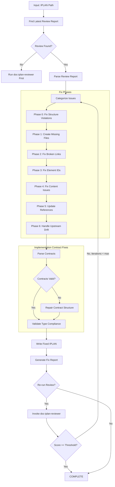
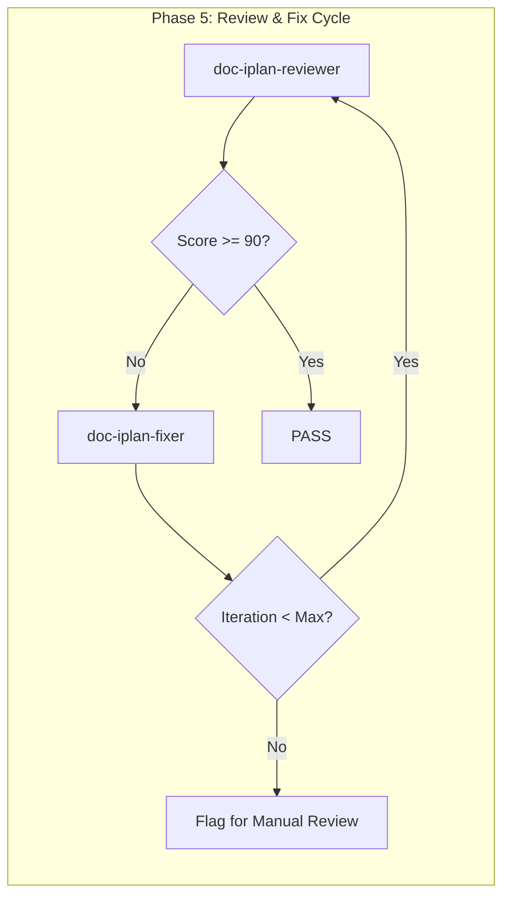

# doc-iplan-fixer

## Purpose

Automated **fix skill** that reads the latest audit/review report and applies fixes to IPLAN (Implementation Plan) documents. This skill bridges the gap between `doc-iplan-reviewer` / `doc-iplan-audit` findings and the corrected IPLAN, enabling iterative improvement cycles.

**Layer**: 8 (IPLAN Quality Improvement)

**Upstream**: SPEC documents, TDD documents, IPLAN document, Audit/Review Report (`IPLAN-NN.A_audit_report_vNNN.md` preferred; `IPLAN-NN.R_review_report_vNNN.md` legacy-compatible)

**Downstream**: Fixed IPLAN, Fix Report (`IPLAN-NN.F_fix_report_vNNN.md`)

---

## When to Use This Skill

Use `doc-iplan-fixer` when:

- **After Review**: Run after `doc-iplan-reviewer` identifies issues
- **Iterative Improvement**: Part of Review -> Fix -> Review cycle
- **Automated Pipeline**: CI/CD integration for quality gates
- **Batch Fixes**: Apply fixes to multiple IPLANs based on review reports
- **Implementation Contract Issues**: Contracts have incomplete or malformed structure
- **Manifest / Handoff Repair**: File manifest is out of test-first order, or session handoff is missing/stale

**Do NOT use when**:
- No review report exists (run `doc-iplan-reviewer` first)
- Creating new IPLANs (use `doc-iplan` or `doc-iplan-autopilot`)
- Only need validation (use `doc-iplan-validator`)

---

## Skill Dependencies

| Skill | Purpose | When Used |
|-------|---------|-----------|
| `doc-iplan-reviewer` | Source of issues to fix | Input (reads review report) |
| `doc-naming` | Element ID standards | Fix element IDs |
| `doc-iplan` | IPLAN creation rules | Create missing sections |
| `doc-spec` | SPEC traceability | Validate upstream links |
| `doc-tdd` | TDD traceability | Validate test links |

---

## Workflow Overview



---

## Fix Phases

### Phase 0: Fix Structure Violations (CRITICAL)

Fixes IPLAN documents that are not stored at their canonical location. This phase runs FIRST because all subsequent phases depend on correct file placement.

**Naming & Location Rule**: Permanent IPLANs are `IPLAN-NN_{slug}.yaml` directly under `docs/08_IPLAN/`. Temporary bugfix plans live under `docs/08_IPLAN/tmp/TMP-IPLAN-YYYY-MM-DD_{slug}.yaml` and are NOT registered in the index.

**Required Structure**:
| IPLAN Type | Required Location |
|------------|-------------------|
| Permanent | `docs/08_IPLAN/IPLAN-NN_{slug}.yaml` |
| Temporary | `docs/08_IPLAN/tmp/TMP-IPLAN-YYYY-MM-DD_{slug}.yaml` |

**Fix Actions**:

| Issue Code | Issue | Fix Action |
|------------|-------|------------|
| REV-STR001 | IPLAN not at canonical location | Move file, update all links |
| REV-STR002 | Filename doesn't match IPLAN ID | Rename file to match `IPLAN-NN_{slug}.yaml` |
| REV-STR003 | Temporary plan registered in index | Move to `tmp/`, remove from `IPLAN-00_index.yaml` |

**Structure Fix Workflow**:

```python
def fix_iplan_structure(iplan_path: str) -> list[Fix]:
    """Fix IPLAN structure / placement violations."""
    fixes = []

    filename = os.path.basename(iplan_path)
    parent_folder = os.path.dirname(iplan_path)

    # Extract IPLAN ID and slug from filename
    match = re.match(r'IPLAN-(\d+)_([^/]+)\.yaml', filename)
    if not match:
        return []  # Cannot auto-fix invalid filename

    iplan_id = match.group(1)
    slug = match.group(2)
    expected_dir = "docs/08_IPLAN"

    # Check if already at canonical location
    if os.path.basename(parent_folder) != "08_IPLAN":
        # Move file to canonical IPLAN directory
        new_path = os.path.join(expected_dir, filename)
        os.makedirs(expected_dir, exist_ok=True)
        shutil.move(iplan_path, new_path)
        fixes.append(f"Moved {iplan_path} to {new_path}")

        # Update upstream links in moved file
        content = Path(new_path).read_text()
        updated_content = content.replace('../07_TDD/', '../07_TDD/')
        updated_content = updated_content.replace('../06_SPEC/', '../06_SPEC/')
        Path(new_path).write_text(updated_content)
        fixes.append("Normalized relative links for canonical IPLAN location")

    return fixes
```

**Link Path Updates After Move**:

| Original Path | Updated Path |
|---------------|--------------|
| `../06_SPEC/SPEC-01_slug/SPEC-01.yaml` | `../06_SPEC/SPEC-01_slug/SPEC-01.yaml` |
| `../07_TDD/TDD-01_slug/TDD-01.yaml` | `../07_TDD/TDD-01_slug/TDD-01.yaml` |

---

### Phase 1: Create Missing Files

Creates files that are referenced but don't exist, and seeds missing IPLAN sections.

**Scope**:

| Missing File / Section | Action | Template Used |
|------------------------|--------|---------------|
| `file_manifest` section | Seed from TDD test-first order | IPLAN-TEMPLATE Section 2 |
| `session_handoff` section | Seed initial session entry | IPLAN-TEMPLATE Section 5 |
| `code_inventory` section | Seed empty audit trail | IPLAN-TEMPLATE Section 6 |
| Manifest test/impl files | Create stub at declared path | Test-first stub |
| Reference docs | Create placeholder | BRD-REF / ADR-REF only |

**File Manifest Seed Template**:

```yaml
# IPLAN-NN: File Manifest (test-first order)
# Auto-generated by doc-iplan-fixer - requires completion
file_manifest:
  files:
    - path: "tests/unit/test_[module].py"
      order: 1
      status: NOT_STARTED   # NOT_STARTED | IN_PROGRESS | DONE | PARTIAL
      session: null
      verified: false
    - path: "src/[module]/[component].py"
      order: 2
      status: NOT_STARTED
      session: null
      verified: false
    - path: "tests/integration/test_[module].py"
      order: 3
      status: NOT_STARTED
      session: null
      verified: false
```

**Session Handoff Seed Template**:

```yaml
# IPLAN-NN: Session Handoff
# Auto-generated by doc-iplan-fixer - requires completion
session_handoff:
  sessions:
    - date: "YYYY-MM-DD"
      agent: "[AI agent / session identifier]"
      files_touched: []
      partial_work: ""
      blockers: ""
      next_session_directive: "Begin with file_manifest order 1 (test-first)"
      validation_results:
        tests_passing: false   # true | false | null
        coverage: null         # percentage or null
        lint_clean: false
```

**Implementation Contracts Seed Template**:

Type interfaces, exception hierarchies, and state machines live INSIDE the IPLAN (no separate contract files). Required only when 3+ manifest files depend on shared interfaces.

```yaml
# IPLAN-NN: Implementation Contracts
# Auto-generated by doc-iplan-fixer - requires completion
implementation_contracts:
  provided:
    contracts: []     # interfaces this IPLAN exposes
  consumed:
    dependencies: []  # interfaces this IPLAN depends on
```

When the manifest has 3+ interdependent files, the contracts express the shared interfaces directly. Example contract bodies the fixer may insert as placeholders:

```python
# Section 4: Protocol Interfaces
from typing import Protocol, runtime_checkable


@runtime_checkable
class ExampleProtocol(Protocol):
    """Protocol interface placeholder.

    TODO: Define actual protocol methods based on SPEC requirements.
    @spec: SPEC-NN
    """

    def execute(self, input_data: dict) -> dict:
        """Execute the main operation.

        Args:
            input_data: Input parameters

        Returns:
            Operation result
        """
        ...


# Section 4: Exception Hierarchies
class IplanBaseException(Exception):
    """Base exception for IPLAN-NN operations."""

    def __init__(self, message: str, error_code: str = "ERR-000"):
        self.message = message
        self.error_code = error_code
        self.retry_allowed = False
        super().__init__(self.message)


class ValidationError(IplanBaseException):
    """Raised when validation fails."""

    def __init__(self, message: str, field: str = None):
        super().__init__(message, "ERR-VAL-001")
        self.field = field


# Section 4: State Machine Contracts
from enum import Enum, auto


class ExecutionState(Enum):
    """File-creation state machine for the manifest."""

    NOT_STARTED = auto()
    IN_PROGRESS = auto()
    PARTIAL = auto()
    DONE = auto()


# Valid state transitions
STATE_TRANSITIONS = {
    ExecutionState.NOT_STARTED: [ExecutionState.IN_PROGRESS],
    ExecutionState.IN_PROGRESS: [ExecutionState.DONE, ExecutionState.PARTIAL],
    ExecutionState.PARTIAL: [ExecutionState.IN_PROGRESS],
    ExecutionState.DONE: [],  # Terminal state
}
```

---

### Phase 2: Fix Broken Links

Updates links to point to correct locations.

**Fix Actions**:

| Issue Code | Issue | Fix Action |
|------------|-------|------------|
| REV-L001 | Broken internal link | Update path or create target file |
| REV-L002 | External link unreachable | Add warning comment, keep link |
| REV-L003 | Absolute path used | Convert to relative path |
| REV-L010 | SPEC reference broken | Update SPEC path |
| REV-L011 | TDD reference broken | Update TDD path |
| REV-L012 | Manifest path malformed | Fix file_manifest path |

**Path Resolution Logic**:

```python
def fix_link_path(iplan_location: str, target_path: str) -> str:
    """Calculate correct relative path based on IPLAN location."""

    # IPLAN files: docs/08_IPLAN/IPLAN-NN_{slug}.yaml
    # Upstream SPEC: docs/06_SPEC/
    # Upstream TDD:  docs/07_TDD/

    if is_manifest_path(target_path):
        return normalize_manifest_path(iplan_location, target_path)
    elif is_spec_reference(target_path):
        return fix_spec_ref(iplan_location, target_path)
    elif is_tdd_reference(target_path):
        return fix_tdd_ref(iplan_location, target_path)
    else:
        return calculate_relative_path(iplan_location, target_path)
```

---

### Phase 3: Fix Element IDs

Converts invalid IDs to the canonical 8-layer format.

**Conversion Rules**:

| Pattern | Issue | Conversion |
|---------|-------|------------|
| `IPLAN.NN.SS.xxxx` | IPLAN given a hierarchical element ID | Convert to document-level `IPLAN-NN` |
| `IPLAN-NNN` | Three-digit ID | Re-number to two-digit `IPLAN-NN` |
| `TDD.NN.SS` | Missing 4-hex hash | Add content hash -> `TDD.NN.SS.xxxx` |
| `SPEC.NN.SS.xxxx` | SPEC given a hierarchical ID | Convert to document-level `SPEC-NN` |

**ID Format Mapping** (IPLAN-specific):

| Reference | Canonical Format | Example |
|-----------|------------------|---------|
| IPLAN document | `IPLAN-NN` (document-level dash) | `IPLAN-01` |
| SPEC document | `SPEC-NN` (document-level dash) | `SPEC-01` |
| ADR document | `ADR-NN` (document-level dash) | `ADR-03` |
| TDD test case | `TDD.NN.SS.xxxx` (4-segment, 4-hex hash) | `TDD.01.04.a3c1` |

> IPLAN itself is referenced at the document level — there is no hierarchical element-ID hash for an IPLAN. The authoritative rules live in `framework/governance/ID_NAMING_STANDARDS.md`.

**Regex Patterns**:

```python
# Find an IPLAN incorrectly given a hierarchical element ID (must be document-level)
invalid_iplan_element = r'IPLAN\.(\d{2})\.(\d{2})\.([0-9a-f]{4})'

# Find three-digit IPLAN IDs (must be two-digit)
legacy_iplan_id = r'IPLAN-(\d{3,})\b'

# Find TDD references missing the 4-hex content hash
incomplete_tdd_ref = r'TDD\.(\d{2})\.(\d{2})(?!\.[0-9a-f]{4})'
```

---

### Phase 4: Fix Content Issues

Addresses placeholders and incomplete content.

**Fix Actions**:

| Issue Code | Issue | Fix Action |
|------------|-------|------------|
| REV-P001 | `[TODO]` placeholder | Flag for manual completion (cannot auto-fix) |
| REV-P002 | `[TBD]` placeholder | Flag for manual completion (cannot auto-fix) |
| REV-P003 | Template date `YYYY-MM-DD` | Replace with current date |
| REV-P004 | Template name `[Author]` | Replace with metadata author or flag |
| REV-P005 | Empty section | Add minimum template content |
| REV-C001 | Missing Protocol signature | Add placeholder method signature |
| REV-C002 | Missing exception hierarchy | Add base exception class |
| REV-C003 | Invalid state transitions | Add transition validation |

**Auto-Replacements**:

```python
replacements = {
    'YYYY-MM-DDTHH:MM:SS': datetime.now().strftime('%Y-%m-%dT%H:%M:%S'),
    'YYYY-MM-DD': datetime.now().strftime('%Y-%m-%d'),
    'MM/DD/YYYY': datetime.now().strftime('%m/%d/%Y'),
    '[Current date]': datetime.now().strftime('%Y-%m-%dT%H:%M:%S'),
}
```

**Contract Structure Repair**:

| Missing Element | Added Template |
|-----------------|----------------|
| Protocol methods | `def method(self) -> None: ...` |
| Exception base | `class BaseException(Exception): pass` |
| State enum | `class State(Enum): NOT_STARTED = auto()` |
| Data model | `@dataclass class Model: id: str` |

---

### Phase 5: Update References

Ensures traceability and cross-references are correct.

**Fix Actions**:

| Issue | Fix Action |
|-------|------------|
| Missing `@spec:` reference | Add SPEC traceability tag |
| Missing `@tdd:` reference | Add TDD traceability tag |
| Incorrect upstream path | Update to correct relative path |
| Missing traceability entry | Add to `traceability.upstream` |
| Missing code inventory entry | Add to `traceability.code_inventory` |

**SPEC/TDD Traceability Fix**:

```yaml
# Before
traceability:
  upstream:
    spec_references: []
    tdd_references: []

# After
traceability:
  upstream:
    spec_references:
      - "@spec: SPEC-01"
    tdd_references:
      - "@tdd: TDD.01.04.a3c1"
```

---

### Phase 6: Handle Upstream Drift (Auto-Merge)

Addresses issues where upstream SPEC/TDD documents have changed since IPLAN creation using a tiered auto-merge system.

#### 6.0.1 Hash Validation Fixes

**FIX-H001: Invalid Hash Placeholder**

Trigger: Hash contains placeholder instead of SHA-256

Fix:
```bash
sha256sum <upstream_file_path> | cut -d' ' -f1
```
Update cache with: `sha256:<64_hex_output>`

**FIX-H002: Missing Hash Prefix**

Trigger: 64 hex chars but missing `sha256:` prefix

Fix: Prepend `sha256:` to value

**FIX-H003: Upstream File Not Found**

Trigger: Cannot compute hash (file missing)

Fix: Set `drift_detected: true`, add to manual review

| Code | Description | Auto-Fix | Severity |
|------|-------------|----------|----------|
| FIX-H001 | Replace placeholder hash with actual SHA-256 | Yes | Error |
| FIX-H002 | Add missing sha256: prefix | Yes | Warning |
| FIX-H003 | Upstream file not found | Partial | Error |

---

**Upstream/Downstream Context**:

| Direction | Artifacts | Relationship |
|-----------|-----------|--------------|
| Upstream | SPEC, TDD | Source of specifications and test design |
| Downstream | Code | Implementation artifacts that depend on IPLAN |

#### Tiered Auto-Merge Thresholds

The auto-merge system uses three tiers based on the percentage of change detected in upstream documents.

| Tier | Change % | Action | Version Bump | Human Review |
|------|----------|--------|--------------|--------------|
| **Tier 1** | < 5% | Auto-merge new manifest entries | Patch (x.x.+1) | No |
| **Tier 2** | 5-15% | Auto-merge with detailed changelog | Minor (x.+1.0) | Optional |
| **Tier 3** | > 15% | Archive current, trigger regeneration | Major (+1.0.0) | Required |

#### Change Percentage Calculation

```python
def calculate_change_percentage(
    upstream_doc: str,
    iplan_doc: str,
    drift_cache: dict
) -> float:
    """Calculate upstream change percentage affecting the IPLAN.

    Args:
        upstream_doc: Path to SPEC or TDD document
        iplan_doc: Path to IPLAN document
        drift_cache: Previous drift state from .drift_cache.json

    Returns:
        Change percentage (0.0 to 100.0)
    """
    # Count affected elements
    current_refs = extract_upstream_references(iplan_doc)
    cached_refs = drift_cache.get('references', {})

    # Calculate changes
    added_refs = set(current_refs) - set(cached_refs)
    removed_refs = set(cached_refs) - set(current_refs)
    modified_refs = [r for r in current_refs
                     if r in cached_refs and current_refs[r] != cached_refs[r]]

    total_refs = max(len(current_refs), len(cached_refs), 1)
    changed_refs = len(added_refs) + len(removed_refs) + len(modified_refs)

    return (changed_refs / total_refs) * 100
```

#### Manifest Entry ID Pattern

Auto-added manifest files follow the IPLAN module/sequence convention: `FILE-NN-SSS`

| Component | Description | Example |
|-----------|-------------|---------|
| `NN` | Module number (from IPLAN-NN) | `01`, `02`, `15` |
| `SSS` | Sequence number within module | `001`, `002`, `999` |

**Full Pattern**: `FILE-{module:02d}-{sequence:03d}`

**Examples**:
- `FILE-01-001`: First manifest file in module 01
- `FILE-03-042`: 42nd manifest file in module 03
- `FILE-15-007`: 7th manifest file in module 15

```python
def generate_manifest_id(module_number: int, existing_files: list[str]) -> str:
    """Generate next available manifest entry ID for a module.

    Args:
        module_number: The IPLAN module number (NN from IPLAN-NN)
        existing_files: List of existing manifest entry IDs in the module

    Returns:
        Next available manifest ID in format FILE-NN-SSS
    """
    # Extract sequence numbers from existing manifest entries
    pattern = re.compile(rf'FILE-{module_number:02d}-(\d{{3}})')
    sequences = [int(m.group(1)) for f in existing_files
                 if (m := pattern.match(f))]

    next_seq = max(sequences, default=0) + 1
    return f"FILE-{module_number:02d}-{next_seq:03d}"
```

#### No Deletion Policy

Manifest entries are NEVER deleted. Instead, they are marked as `[CANCELLED]` with a reason.

**Rationale**: Preserves the audit trail, prevents orphaned downstream references, maintains traceability.

```yaml
# Before: Active manifest entry
- id: FILE-01-003
  path: "src/auth/rate_limit.py"
  spec_ref: "@spec: SPEC-01"
  status: NOT_STARTED

# After: Cancelled manifest entry
- id: FILE-01-003
  path: "src/auth/rate_limit.py"
  spec_ref: "@spec: SPEC-01"
  status: CANCELLED
  cancelled: "2026-02-10"
  cancel_reason: "Upstream SPEC-01 removed rate limiting requirement (REV-D007)"
  original_status: NOT_STARTED
# Cancellation preserves all original fields above
```

**Cancellation Metadata**:

| Field | Description |
|-------|-------------|
| `status` | Changed to `CANCELLED` |
| `cancelled` | Date of cancellation (YYYY-MM-DD) |
| `cancel_reason` | Why entry was cancelled (with issue code) |
| `original_status` | Preserved for audit trail |

#### Tier 1: Auto-Merge (< 5% Change)

Minor changes are automatically merged without human intervention.

**Actions**:
1. Generate new manifest entry IDs for added requirements
2. Update existing references to new upstream versions
3. Increment patch version (e.g., 1.0.0 -> 1.0.1)
4. Update drift cache

```python
def tier1_auto_merge(iplan_doc: str, upstream_changes: dict) -> MergeResult:
    """Auto-merge minor upstream changes.

    Args:
        iplan_doc: Path to IPLAN document
        upstream_changes: Dict of detected changes

    Returns:
        MergeResult with applied changes
    """
    result = MergeResult()

    # Add new manifest files for new specifications
    for spec_ref in upstream_changes.get('added', []):
        file_id = generate_manifest_id(get_module_number(iplan_doc), get_existing_files(iplan_doc))
        new_file = create_manifest_entry_from_spec(spec_ref, file_id)
        result.files_added.append(new_file)

    # Update version references
    for ref in upstream_changes.get('version_changed', []):
        update_spec_reference(iplan_doc, ref['old'], ref['new'])
        result.refs_updated.append(ref)

    # Increment patch version
    result.new_version = increment_patch_version(get_iplan_version(iplan_doc))

    return result
```

#### Tier 2: Auto-Merge with Changelog (5-15% Change)

Moderate changes are merged with detailed documentation.

**Actions**:
1. All Tier 1 actions
2. Generate detailed changelog entry
3. Mark affected manifest entries with `[DRIFT-REVIEWED]` marker
4. Increment minor version (e.g., 1.0.1 -> 1.1.0)
5. Update code inventory links
6. Flag for optional human review

**Changelog Format**:

```markdown
## Changelog

### v1.1.0 (2026-02-10) - Upstream Drift Merge

**Merge Type**: Tier 2 Auto-Merge (8.3% change)
**Upstream Documents**: SPEC-01.yaml, TDD-01.yaml

#### Manifest Files Added
| ID | Path | Source |
|----|------|--------|
| FILE-01-015 | src/auth/oauth2_pkce.py | SPEC-01.auth.oauth2_pkce (added 2026-02-09) |
| FILE-01-016 | src/auth/token_refresh.py | SPEC-01.auth.token_refresh (added 2026-02-09) |

#### Manifest Files Modified
| ID | Change | Reason |
|----|--------|--------|
| FILE-01-003 | Updated test-first ordering | SPEC-01.auth.session updated |

#### References Updated
| Old Reference | New Reference |
|---------------|---------------|
| SPEC-01.yaml@v1.2.0 | SPEC-01.yaml@v1.3.0 |
| TDD-01.yaml@v1.1.0 | TDD-01.yaml@v1.2.0 |

#### Implementation Contracts Affected
| Contract | Change |
|----------|--------|
| AuthProtocol | New method: `refresh_token()` |
| TokenModel | New field: `refresh_expires_at` |
```

#### Tier 3: Archive and Regenerate (> 15% Change)

Major changes require archiving and regeneration.

**Actions**:
1. Create archive manifest
2. Archive current IPLAN version
3. Trigger full IPLAN regeneration via `doc-iplan-autopilot`
4. Increment major version (e.g., 1.1.0 -> 2.0.0)
5. Require human review before finalization

**Archive Manifest Format**:

```yaml
# IPLAN-NN_archive_manifest_vNNN.yaml
archive:
  document: IPLAN-01
  archived_version: "1.1.0"
  archive_date: "2026-02-10T16:00:00"
  archive_reason: "Tier 3 upstream drift (23.5% change)"
  archive_location: "archive/IPLAN-01_v1.1.0/"

drift_summary:
  total_change_percentage: 23.5
  upstream_documents:
    - document: SPEC-01.yaml
      previous_version: "1.3.0"
      current_version: "2.0.0"
      change_percentage: 18.2
    - document: TDD-01.yaml
      previous_version: "1.2.0"
      current_version: "1.5.0"
      change_percentage: 12.1

affected_manifest_files:
  total: 42
  cancelled: 8
  modified: 15
  unchanged: 19

implementation_contracts:
  protocols_affected: 3
  exceptions_affected: 1
  state_machines_affected: 2
  data_models_affected: 4

downstream_impact:
  code_files:
    - src/auth/handler.py: "Interface changes required"
    - src/auth/models.py: "Data model updates required"

regeneration:
  trigger_skill: doc-iplan-autopilot
  trigger_args: "SPEC-01 --force-regenerate"
  new_version: "2.0.0"
  human_review_required: true
```

#### Enhanced Drift Cache

The drift cache tracks merge history and upstream state.

**File**: `.drift_cache.json` (in IPLAN directory)

```json
{
  "iplan_document": "IPLAN-01",
  "cache_version": "2.0",
  "last_updated": "2026-02-10T16:00:00",
  "current_version": "1.1.0",

  "upstream_state": {
    "SPEC-01.yaml": {
      "version": "1.3.0",
      "hash": "sha256:abc123...",
      "last_checked": "2026-02-10T16:00:00",
      "sections_referenced": [
        "SPEC-01.auth.handler",
        "SPEC-01.auth.session",
        "SPEC-01.auth.oauth2_pkce"
      ]
    },
    "TDD-01.yaml": {
      "version": "1.2.0",
      "hash": "sha256:def456...",
      "last_checked": "2026-02-10T16:00:00",
      "test_cases_referenced": [
        "TDD.01.04.a3c1",
        "TDD.01.04.b2d2"
      ]
    }
  },

  "merge_history": [
    {
      "date": "2026-02-08T10:00:00",
      "tier": 1,
      "change_percentage": 2.3,
      "version_before": "1.0.0",
      "version_after": "1.0.1",
      "files_added": ["FILE-01-012"],
      "files_modified": [],
      "files_cancelled": []
    },
    {
      "date": "2026-02-10T16:00:00",
      "tier": 2,
      "change_percentage": 8.3,
      "version_before": "1.0.1",
      "version_after": "1.1.0",
      "files_added": ["FILE-01-015", "FILE-01-016"],
      "files_modified": ["FILE-01-003"],
      "files_cancelled": [],
      "changelog_entry": "v1.1.0"
    }
  ],

  "manifest_registry": {
    "FILE-01-001": {"status": "DONE", "spec_ref": "SPEC-01.auth.init"},
    "FILE-01-002": {"status": "IN_PROGRESS", "spec_ref": "SPEC-01.auth.login"},
    "FILE-01-003": {"status": "NOT_STARTED", "spec_ref": "SPEC-01.auth.session"},
    "FILE-01-012": {"status": "NOT_STARTED", "spec_ref": "SPEC-01.auth.logout"},
    "FILE-01-015": {"status": "NOT_STARTED", "spec_ref": "SPEC-01.auth.oauth2_pkce"},
    "FILE-01-016": {"status": "NOT_STARTED", "spec_ref": "SPEC-01.auth.token_refresh"}
  },

  "implementation_contracts": {
    "protocols": ["AuthProtocol", "SessionProtocol"],
    "exceptions": ["AuthException", "SessionException"],
    "state_machines": ["AuthState", "SessionState"],
    "data_models": ["UserModel", "TokenModel", "SessionModel"]
  }
}
```

#### Handling Manifest Dependencies

When upstream drift affects manifest entries with dependencies, the auto-merge system handles cascading updates.

```python
def handle_manifest_dependencies(
    affected_file: str,
    manifest_graph: dict,
    change_type: str
) -> list[str]:
    """Propagate changes through the manifest dependency graph.

    Args:
        affected_file: Manifest entry ID that was modified/cancelled
        manifest_graph: Dict mapping manifest IDs to their dependencies
        change_type: 'modified' or 'cancelled'

    Returns:
        List of downstream manifest entries requiring update
    """
    downstream_files = []

    # Find manifest entries that depend on the affected file
    for file_id, deps in manifest_graph.items():
        if affected_file in deps.get('blocked_by', []):
            downstream_files.append(file_id)

            if change_type == 'cancelled':
                # Remove dependency, add warning
                add_manifest_warning(file_id,
                    f"Dependency {affected_file} was cancelled")
            elif change_type == 'modified':
                # Mark for review
                add_manifest_marker(file_id, '[UPSTREAM-MODIFIED]')

    return downstream_files
```

#### Handling Implementation Contracts

When upstream drift affects implementation contracts, the auto-merge system updates contract definitions.

```python
def update_implementation_contracts(
    contracts: dict,
    upstream_changes: dict
) -> ContractUpdateResult:
    """Update implementation contracts based on upstream drift.

    Args:
        contracts: Current contract definitions
        upstream_changes: Detected upstream changes

    Returns:
        ContractUpdateResult with changes applied
    """
    result = ContractUpdateResult()

    for spec_change in upstream_changes.get('spec_changes', []):
        # Check if change affects a protocol
        if affects_protocol(spec_change, contracts['protocols']):
            protocol = get_affected_protocol(spec_change)
            if spec_change['type'] == 'method_added':
                add_protocol_method(protocol, spec_change['method'])
                result.protocols_modified.append(protocol)
            elif spec_change['type'] == 'method_signature_changed':
                update_protocol_signature(protocol, spec_change)
                result.protocols_modified.append(protocol)

        # Check if change affects a data model
        if affects_data_model(spec_change, contracts['data_models']):
            model = get_affected_model(spec_change)
            if spec_change['type'] == 'field_added':
                add_model_field(model, spec_change['field'])
                result.models_modified.append(model)

    return result
```

#### Drift Issue Codes

| Code | Severity | Description | Auto-Fix | Tier |
|------|----------|-------------|----------|------|
| REV-D001 | Info | Upstream version incremented | Yes | 1 |
| REV-D002 | Warning | Minor specification content changed (< 5%) | Yes | 1 |
| REV-D003 | Warning | Moderate specification change (5-15%) | Yes | 2 |
| REV-D004 | Warning | New specifications added to upstream | Yes | 1-2 |
| REV-D005 | Error | Specifications removed from upstream | Yes (cancel) | 2 |
| REV-D006 | Error | Major upstream modification (> 15%) | Partial | 3 |
| REV-D007 | Error | Breaking change to implementation contract | Partial | 3 |
| REV-D008 | Info | Manifest dependency graph affected | Yes | 1-2 |

#### Fix Actions Summary

| Tier | Issue Codes | Auto-Fix Action |
|------|-------------|-----------------|
| 1 | REV-D001, REV-D002, REV-D004 (minor) | Auto-merge, patch version |
| 2 | REV-D003, REV-D004 (moderate), REV-D005, REV-D008 | Auto-merge with changelog, minor version |
| 3 | REV-D006, REV-D007 | Archive, regenerate, major version |

---

## Implementation Contract Fixes

IPLAN documents embed implementation contracts in Section 4 (Implementation Contracts). This section details specific contract repair strategies. Contracts live inside the IPLAN itself — there are no separate contract files.

### Contract Detection

```python
def find_contracts(content: str) -> dict:
    """Find all contracts embedded in IPLAN content."""
    contracts = {
        'protocols': [],
        'exceptions': [],
        'state_machines': [],
        'data_models': []
    }

    # Find Python code blocks containing contracts
    code_blocks = re.findall(r'```python\n(.*?)```', content, re.DOTALL)

    for block in code_blocks:
        if 'class' in block and 'Protocol' in block:
            contracts['protocols'].append(block)
        if 'Exception' in block or 'Error' in block:
            contracts['exceptions'].append(block)
        if 'Enum' in block and 'State' in block.lower():
            contracts['state_machines'].append(block)
        if '@dataclass' in block or 'TypedDict' in block:
            contracts['data_models'].append(block)

    return contracts
```

### Contract Type Requirements

| Contract Type | Required Elements |
|---------------|-------------------|
| Protocol | `@runtime_checkable`, method signatures with type hints |
| Exception | Base class, error_code, retry semantics |
| State Machine | `Enum` class, `STATE_TRANSITIONS` dict |
| Data Model | Type annotations, `validate()` method |

### Contract Repair Actions

| Issue | Repair Action |
|-------|---------------|
| Missing `@runtime_checkable` | Add decorator to Protocol |
| Missing type hints | Add `-> None` default return type |
| Missing error_code | Add `error_code` attribute to exception |
| Invalid state transitions | Add missing states to transition dict |
| Missing dataclass decorator | Add `@dataclass` decorator |
| Missing validate method | Add placeholder validate method |

### Contract Template Sections

**Section 4: Protocol Interfaces**

```python
@runtime_checkable
class ProtocolName(Protocol):
    """Protocol description.

    @spec: SPEC-NN
    """

    def method_name(self, param: Type) -> ReturnType:
        """Method description."""
        ...
```

**Section 4: Exception Hierarchy**

```python
class ModuleBaseException(Exception):
    """Base exception for module.

    Attributes:
        message: Error message
        error_code: Unique error identifier
        retry_allowed: Whether operation can be retried
    """

    def __init__(self, message: str, error_code: str = "ERR-000"):
        self.message = message
        self.error_code = error_code
        self.retry_allowed = False
        super().__init__(self.message)
```

**Section 4: State Machine**

```python
class EntityState(Enum):
    """State machine for Entity.

    @spec: SPEC-NN
    """

    INITIAL = auto()
    PROCESSING = auto()
    COMPLETED = auto()
    FAILED = auto()


STATE_TRANSITIONS: dict[EntityState, list[EntityState]] = {
    EntityState.INITIAL: [EntityState.PROCESSING],
    EntityState.PROCESSING: [EntityState.COMPLETED, EntityState.FAILED],
    EntityState.COMPLETED: [],  # Terminal
    EntityState.FAILED: [EntityState.INITIAL],  # Retry
}
```

**Section 4: Data Model**

```python
@dataclass
class EntityModel:
    """Data model for Entity.

    @spec: SPEC-NN
    """

    id: str
    name: str
    status: EntityState = EntityState.INITIAL
    created_at: datetime = field(default_factory=datetime.utcnow)

    def validate(self) -> bool:
        """Validate model data."""
        if not self.id or not self.name:
            return False
        return True
```

---

## Command Usage

### Basic Usage

```bash
# Fix IPLAN based on latest review
/doc-iplan-fixer IPLAN-01

# Fix with explicit review report
/doc-iplan-fixer IPLAN-01 --review-report IPLAN-01.R_review_report_v001.md

# Fix and re-run review
/doc-iplan-fixer IPLAN-01 --revalidate

# Fix with iteration limit
/doc-iplan-fixer IPLAN-01 --revalidate --max-iterations 3

# Fix contracts only
/doc-iplan-fixer IPLAN-01 --fix-types contracts

# Handle upstream drift with auto-merge
/doc-iplan-fixer IPLAN-01 --fix-types drift

# Force Tier 2 merge with changelog
/doc-iplan-fixer IPLAN-01 --fix-types drift --auto-merge-tier 2

# Custom tier thresholds
/doc-iplan-fixer IPLAN-01 --tier1-threshold 3 --tier2-threshold 10

# Force regeneration (Tier 3) for major upstream changes
/doc-iplan-fixer IPLAN-01 --force-regenerate

# Preview drift merge without applying
/doc-iplan-fixer IPLAN-01 --fix-types drift --dry-run
```

### Options

| Option | Default | Description |
|--------|---------|-------------|
| `--review-report` | latest | Specific review report to use |
| `--revalidate` | false | Run reviewer after fixes |
| `--max-iterations` | 3 | Max fix-review cycles |
| `--fix-types` | all | Specific fix types (comma-separated) |
| `--create-missing` | true | Create missing manifest sections / target files |
| `--backup` | true | Backup IPLAN before fixing |
| `--dry-run` | false | Preview fixes without applying |
| `--validate-contracts` | true | Validate contract structure after fixes |
| `--type-check` | false | Run mypy on contract code blocks |
| `--acknowledge-drift` | false | Interactive drift acknowledgment mode |
| `--update-drift-cache` | true | Update .drift_cache.json after fixes |
| `--auto-merge-tier` | auto | Force specific tier (1, 2, 3) or auto-detect |
| `--tier1-threshold` | 5 | Maximum change % for Tier 1 auto-merge |
| `--tier2-threshold` | 15 | Maximum change % for Tier 2 auto-merge |
| `--skip-archive` | false | Skip archive creation for Tier 3 (not recommended) |
| `--force-regenerate` | false | Force Tier 3 regeneration regardless of change % |
| `--preserve-cancelled` | true | Keep cancelled manifest entries in document |
| `--generate-changelog` | true | Generate changelog for Tier 2+ merges |
| `--notify-downstream` | true | Flag downstream Code for updates |

### Fix Types

| Type | Description |
|------|-------------|
| `missing_files` | Create missing manifest sections / target files |
| `broken_links` | Fix link paths and manifest path references |
| `element_ids` | Convert invalid/legacy IDs (`IPLAN-NN`, `TDD.NN.SS.xxxx`) |
| `content` | Fix placeholders, dates, names |
| `references` | Update SPEC/TDD traceability and cross-references |
| `drift` | Handle upstream drift with tiered auto-merge (Tier 1-3) |
| `contracts` | Fix implementation contract structure issues |
| `all` | All fix types (default) |

### Drift Fix Sub-Options

| Sub-Option | Description |
|------------|-------------|
| `drift:detect` | Only detect drift, do not apply fixes |
| `drift:tier1` | Apply only Tier 1 (< 5%) auto-merges |
| `drift:tier2` | Apply Tier 1 and Tier 2 (5-15%) auto-merges |
| `drift:tier3` | Full drift handling including archive/regenerate |
| `drift:changelog` | Generate changelog without applying merges |

---

## Output Artifacts

### Fix Report

**Location Rule**: Permanent IPLANs are `IPLAN-NN_{slug}.yaml` under `docs/08_IPLAN/`. Fix reports are stored alongside the IPLAN document.

**File Naming**: `IPLAN-NN.F_fix_report_vNNN.md`

**Location**: `docs/08_IPLAN/`

**Structure**:

```markdown
---
title: "IPLAN-NN.F: Fix Report v001"
tags:
  - iplan
  - fix-report
  - quality-assurance
custom_fields:
  document_type: fix-report
  artifact_type: IPLAN-FIX
  layer: 8
  parent_doc: IPLAN-NN
  source_review: IPLAN-NN.R_review_report_v001.md
  fix_date: "YYYY-MM-DDTHH:MM:SS"
  fix_tool: doc-iplan-fixer
  fix_version: "1.0"
---

# IPLAN-NN Fix Report v001

## Summary

| Metric | Value |
|--------|-------|
| Source Review | IPLAN-NN.R_review_report_v001.md |
| Issues in Review | 22 |
| Issues Fixed | 18 |
| Issues Remaining | 4 (manual review required) |
| Sections Created | 2 |
| Files Modified | 1 |
| Contracts Repaired | 6 |

## Sections Created

| Section | Type | Location |
|---------|------|----------|
| file_manifest | Section 2 | IPLAN-01_data_validation.yaml |
| session_handoff | Section 5 | IPLAN-01_data_validation.yaml |

## Contract Structure Repairs

| Contract | Type | Issue | Repair Applied |
|----------|------|-------|----------------|
| AuthProtocol | Protocol | Missing @runtime_checkable | Added decorator |
| ValidationError | Exception | Missing error_code | Added attribute |
| ExecutionState | State Machine | Invalid transitions | Fixed transition dict |
| UserModel | Data Model | Missing validate() | Added method |
| ProcessProtocol | Protocol | Missing type hints | Added return types |
| ConfigError | Exception | Missing retry semantics | Added retry_allowed |

## Fixes Applied

| # | Issue Code | Issue | Fix Applied | File |
|---|------------|-------|-------------|------|
| 1 | REV-N004 | Invalid element ID | Converted to document-level IPLAN-01 | IPLAN-01.yaml |
| 2 | REV-C001 | Missing Protocol signature | Added placeholder | IPLAN-01.yaml |
| 3 | REV-L003 | Absolute path used | Converted to relative | IPLAN-01.yaml |

## Issues Requiring Manual Review

| # | Issue Code | Issue | Location | Reason |
|---|------------|-------|----------|--------|
| 1 | REV-P001 | [TODO] placeholder | IPLAN-01.yaml:L78 | Implementation logic needed |
| 2 | REV-D002 | SPEC content changed | SPEC-01.auth | Review specification update |

## Upstream Drift Summary

| Upstream Document | Reference | Modified | IPLAN Updated | Days Stale | Action Required |
|-------------------|-----------|----------|---------------|------------|-----------------|
| SPEC-01.yaml | IPLAN-01:L57 | 2026-02-08 | 2026-02-05 | 3 | Review for changes |
| TDD-01.yaml | IPLAN-01:L92 | 2026-02-09 | 2026-02-05 | 4 | Review for changes |

## Type Check Results

| Contract | mypy Status | Issues |
|----------|-------------|--------|
| AuthProtocol | Pass | None |
| ValidationError | Pass | None |
| ExecutionState | Warning | Missing annotation on line 45 |

## Validation After Fix

| Metric | Before | After | Delta |
|--------|--------|-------|-------|
| Review Score | 80 | 93 | +13 |
| Errors | 7 | 0 | -7 |
| Warnings | 9 | 4 | -5 |
| Valid Contracts | 8/14 | 14/14 | +6 |

## Next Steps

1. Complete [TODO] placeholders in the file manifest / contracts
2. Review upstream SPEC/TDD drift
3. Implement manifest files test-first, updating session handoff + code inventory
4. Run `/doc-iplan-reviewer IPLAN-01` to verify fixes
5. Run mypy on contracts to ensure type compliance
```

---

## Integration with Autopilot

This skill is invoked by `doc-iplan-autopilot` in the Review -> Fix cycle:



**Autopilot Integration Points**:

| Phase | Action | Skill |
|-------|--------|-------|
| Phase 5a | Run initial review | `doc-iplan-reviewer` |
| Phase 5b | Apply fixes if issues found | `doc-iplan-fixer` |
| Phase 5c | Re-run review | `doc-iplan-reviewer` |
| Phase 5d | Repeat until pass or max iterations | Loop |

---

## Error Handling

### Recovery Actions

| Error | Action |
|-------|--------|
| Review report not found | Prompt to run `doc-iplan-reviewer` first |
| Cannot create file (permissions) | Log error, continue with other fixes |
| Cannot parse review report | Abort with clear error message |
| Contract parse error | Attempt repair, flag if unrecoverable |
| mypy validation failure | Log warning, continue with fixes |
| Max iterations exceeded | Generate report, flag for manual review |

### Backup Strategy

Before applying any fixes:

1. Create backup in `tmp/backup/IPLAN-NN_YYYYMMDD_HHMMSS/`
2. Copy the IPLAN file to the backup location
3. Apply fixes to the original file
4. If error during fix, restore from backup

---

## Related Skills

| Skill | Relationship |
|-------|--------------|
| `doc-iplan-reviewer` | Provides review report (input) |
| `doc-iplan-autopilot` | Orchestrates Review -> Fix cycle |
| `doc-iplan-validator` | Structural validation |
| `doc-naming` | Element ID standards |
| `doc-iplan` | IPLAN creation rules |
| `doc-spec` | SPEC upstream traceability |
| `doc-tdd` | TDD upstream traceability |

---

## Validation

The plugin skill *is* the validator — the framework ships no runtime validation scripts. Apply the declarative checklist below; the authoritative rule sources are `framework/layers/08_IPLAN/README.md` and `framework/governance/ID_NAMING_STANDARDS.md`.

### Post-Fix Checklist

- [ ] `metadata.layer: 8` and `document_type: iplan-document`
- [ ] Document Control complete (iplan_id, source_spec, status, dates)
- [ ] File Manifest lists tests before implementation (test-first)
- [ ] Each manifest file has a status marker and `verified` flag
- [ ] Execution commands cover setup / implementation / validation
- [ ] Implementation Contracts declared (or "No implementation contracts")
- [ ] Session Handoff seeded with a `next_session_directive`
- [ ] Traceability upstream references (`@spec`, `@tdd`, …) point to existing docs
- [ ] `code_inventory` ready to record created/modified files
- [ ] IDs in canonical format (`IPLAN-NN`, `SPEC-NN`, `TDD.NN.SS.xxxx`)
- [ ] Permanent plan registered in `IPLAN-00_index.yaml`; temporary plan under `tmp/`

---

## Version History

| Version | Date | Changes |
|---------|------|---------|
| 2.1 | 2026-05-22 | Migrated to the 8-layer model as the IPLAN (Layer 8) fixer; SPEC is now Layer 6, TDD Layer 7, IPLAN Layer 8; remapped element IDs to `IPLAN-NN` / `TDD.NN.SS.xxxx`; replaced legacy validation-script references with the declarative checklist + pointers to `framework/layers/08_IPLAN/README.md` and `framework/governance/`; realigned content to the IPLAN model (file manifest, session handoff, code inventory) |
| 2.0 | 2026-02-10 | Enhanced Phase 6 with tiered auto-merge system; Tier 1 (< 5%) auto-merge with patch version; Tier 2 (5-15%) auto-merge with changelog and minor version; Tier 3 (> 15%) archive and regenerate with major version; No deletion policy (mark as [CANCELLED]); Archive manifest creation for Tier 3; Enhanced drift cache with merge history; Manifest dependency propagation; Implementation contract update handling; New drift issue codes (REV-D001 through REV-D008) |
| 1.0 | 2026-02-10 | Initial skill creation; 6-phase fix workflow; Implementation contract repair (Protocol, Exception, State Machine, Data Model); Section seeding and missing-file creation; ID conversion; SPEC/TDD drift handling; Optional mypy type checking; Integration with autopilot Review->Fix cycle |

## Implementation Plan Consistency (IPLAN-004)

- Treat plan-derived outputs as valid source mode and verify intent preservation from implementation plan scope/objectives.
- Validate upstream autopilot precedence assumption: `--iplan > --ref > --prompt`.
- Flag objective/scope conflicts between plan context and artifact output as blocking issues requiring clarification.
- Do not introduce legacy fallback paths such as `docs-v2.0/00_REF`.
