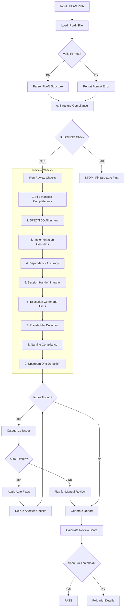
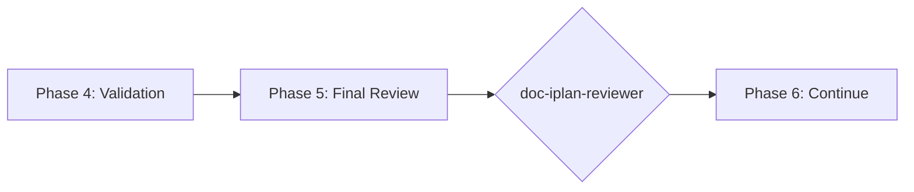

# doc-iplan-reviewer

## Purpose

Comprehensive **content review and quality assurance** for Implementation Plan (IPLAN) documents. This skill performs deep content analysis beyond structural validation, checking file-manifest completeness, SPEC/TDD alignment, implementation contracts, session-handoff integrity, dependency accuracy, and identifying issues that require manual review.

**Layer**: 8 (IPLAN Quality Assurance)

**Upstream**: IPLAN (from `doc-iplan-autopilot` or `doc-iplan`)

**Downstream**: None (final QA gate before code implementation)

---

## When to Use This Skill

Use `doc-iplan-reviewer` when:

- **After IPLAN Generation**: Run immediately after `doc-iplan-autopilot` completes
- **Manual IPLAN Edits**: After making manual changes to an IPLAN
- **Pre-Implementation**: Before starting code implementation
- **Session Planning**: When assessing readiness for the next executor session
- **Periodic Review**: Regular quality checks on existing IPLANs

**Do NOT use when**:
- IPLAN does not exist yet (use `doc-iplan` or `doc-iplan-autopilot` first)
- Need structural/schema validation only (use `doc-iplan-validator`)
- Generating new IPLAN content (use `doc-iplan`)

---

## Skill vs Validator: Key Differences

| Aspect | `doc-iplan-validator` | `doc-iplan-reviewer` |
|--------|----------------------|---------------------|
| **Focus** | Schema compliance, Code-Ready score | Content quality, implementation readiness |
| **Checks** | Required sections, format | File-manifest atomicity, dependency accuracy |
| **Auto-Fix** | Structural issues only | Content issues (formatting) |
| **Output** | Code-Ready score (numeric) | Review score + issue list |
| **Phase** | Phase 4 (Validation) | Phase 5 (Final Review) |
| **Blocking** | Code-Ready < threshold blocks | Review score < threshold flags |

---

## Review Workflow



---

## Review Checks

### 0. Structure Compliance (12/12) - BLOCKING

Validates the IPLAN follows the mandatory nested folder rule.

**Nested Folder Rule**: ALL IPLAN documents MUST be in nested folders.

**Required Structure**:

| IPLAN Type | Required Location |
|------------|-------------------|
| Permanent | `docs/08_IPLAN/IPLAN-NN_{slug}/IPLAN-NN_{slug}.yaml` |

**Error Codes**:

| Code | Severity | Description |
|------|----------|-------------|
| REV-STR001 | Error | IPLAN not in nested folder (BLOCKING) |
| REV-STR002 | Error | Folder name doesn't match IPLAN ID |
| REV-STR003 | Warning | File name doesn't match folder name |

**This check is BLOCKING** - the IPLAN must pass structure validation before other checks proceed.

---

### 1. File Manifest Completeness

Validates the file manifest declares every file with required elements.

**Required Elements** (per `file_manifest.files` entry):
- Path
- Order (test-first sequencing)
- Status marker (NOT_STARTED | IN_PROGRESS | DONE | PARTIAL)
- Session attribution
- Verified flag

**Error Codes**:

| Code | Severity | Description |
|------|----------|-------------|
| REV-TC001 | Error | Manifest file entry missing required element |
| REV-TC002 | Warning | Test file not ordered before its implementation file |
| REV-TC003 | Warning | Status marker not assigned |
| REV-TC004 | Info | Verified flag missing |

---

### 2. SPEC/TDD Alignment

Validates the IPLAN traces to upstream SPEC and TDD contracts.

**Scope**:
- Every manifest file maps to a SPEC component/method or TDD test case
- Full SPEC/TDD coverage achieved
- No orphaned files
- File creation order is logical (test-first)

**Error Codes**:

| Code | Severity | Description |
|------|----------|-------------|
| REV-SA001 | Error | Manifest file without SPEC/TDD source |
| REV-SA002 | Warning | SPEC/TDD component not covered |
| REV-SA003 | Warning | Orphaned file detected |
| REV-SA004 | Info | File creation order may need adjustment |

---

### 3. Implementation Contracts

Validates the `implementation_contracts` section (Section 4 of the template).

**Scope**:
- Protocol interfaces defined
- Exception hierarchies documented
- State machine contracts present
- Data models specified
- DI interfaces defined

**Error Codes**:

| Code | Severity | Description |
|------|----------|-------------|
| REV-IC001 | Warning | Protocol interface missing |
| REV-IC002 | Warning | Exception hierarchy not documented |
| REV-IC003 | Info | State machine contract missing |
| REV-IC004 | Info | DI interface not defined |

> Contracts are required when 3+ manifest files depend on shared interfaces; state "No implementation contracts" otherwise.

---

### 4. Dependency Accuracy

Validates manifest and contract dependencies are correct.

**Scope**:
- Consumed dependencies exist
- No circular dependencies
- Blocking dependencies identified
- External dependencies documented

**Error Codes**:

| Code | Severity | Description |
|------|----------|-------------|
| REV-DA001 | Error | Dependency does not exist |
| REV-DA002 | Error | Circular dependency detected |
| REV-DA003 | Warning | Blocking dependency not marked |
| REV-DA004 | Info | External dependency not documented |

---

### 5. Session Handoff Integrity

Validates the `session_handoff` section supports stateless executor resumption.

**Scope**:
- Each session entry records files_touched with status markers
- `partial_work` described when a step ended mid-file
- `next_session_directive` cites a concrete file + step
- `validation_results` populated per session

**Error Codes**:

| Code | Severity | Description |
|------|----------|-------------|
| REV-TA001 | Warning | Session entry missing next_session_directive |
| REV-TA002 | Warning | PARTIAL status without partial_work description |
| REV-TA003 | Info | validation_results not populated |
| REV-TA004 | Info | Session attribution missing on touched file |

---

### 6. Execution Command Hints

Validates AI-friendly execution guidance in `execution_commands`.

**Scope**:
- File paths specified
- Setup/implementation/validation commands provided
- Runnable bash commands (not prose placeholders)
- Test patterns documented

**Error Codes**:

| Code | Severity | Description |
|------|----------|-------------|
| REV-AI001 | Warning | File path not specified |
| REV-AI002 | Info | Setup command not provided |
| REV-AI003 | Info | Validation command not provided |
| REV-AI004 | Info | Test patterns not documented |

---

### 7. Placeholder Detection

Identifies incomplete content requiring replacement.

**Error Codes**:

| Code | Severity | Description |
|------|----------|-------------|
| REV-P001 | Error | [TODO] placeholder found |
| REV-P002 | Error | [TBD] placeholder found |
| REV-P003 | Warning | Template value not replaced |

---

### 8. Naming Compliance

Validates element IDs follow `doc-naming` standards.

**Scope**:
- Document-level IPLAN references use `IPLAN-NN` (dash) format
- Upstream tags use the correct notation (`SPEC-NN`, `TDD.NN.SS.xxxx`)
- IPLAN naming convention (`IPLAN-NN_{slug}.yaml`)

**Error Codes**:

| Code | Severity | Description |
|------|----------|-------------|
| REV-N001 | Error | Invalid IPLAN reference format |
| REV-N002 | Error | Upstream tag notation not valid |
| REV-N003 | Error | Legacy pattern detected |

---

### 9. Upstream Drift Detection (Mandatory Cache)

Detects when upstream SPEC and TDD documents have been modified after the IPLAN was created or last updated.

**The drift cache is mandatory.** All drift detection operations require cache initialization and maintenance.

**Purpose**: Identifies stale IPLAN content that may not reflect current SPEC and TDD documentation. When SPEC documents (methods, interfaces, components) or TDD documents (test cases, coverage requirements) change, the IPLAN may need updates to maintain implementation alignment.

**Scope**:
- `@spec:` tag targets (SPEC documents)
- `@tdd:` tag targets (TDD documents)
- Traceability section upstream artifact links
- Any links to `../06_SPEC/` or `../07_TDD/` source documents

---

#### Drift Cache File (MANDATORY)

**Location**: `docs/08_IPLAN/.drift_cache.json`

**Schema**:

```json
{
  "schema_version": "1.0",
  "cache_created": "2026-05-22T17:00:00Z",
  "cache_updated": "2026-05-22T17:00:00Z",
  "iplan_files": {
    "IPLAN-03_f3_observability.yaml": {
      "iplan_version": "1.0",
      "iplan_updated": "2026-05-22T14:30:00",
      "last_review": "2026-05-22T17:00:00",
      "upstream_hashes": {
        "../../06_SPEC/SPEC-03.yaml": "a1b2c3d4e5f6g7h8i9j0k1l2m3n4o5p6q7r8s9t0",
        "../../06_SPEC/SPEC-03.yaml#methods": "b2c3d4e5f6g7h8i9j0k1l2m3n4o5p6q7r8s9t0u1",
        "../../06_SPEC/SPEC-03.yaml#components": "c3d4e5f6g7h8i9j0k1l2m3n4o5p6q7r8s9t0u1v2",
        "../../07_TDD/TDD-03.yaml": "d4e5f6g7h8i9j0k1l2m3n4o5p6q7r8s9t0u1v2w3",
        "../../07_TDD/TDD-03.yaml#test_cases": "e5f6g7h8i9j0k1l2m3n4o5p6q7r8s9t0u1v2w3x4"
      },
      "upstream_mtimes": {
        "../../06_SPEC/SPEC-03.yaml": "2026-05-20T10:15:00",
        "../../07_TDD/TDD-03.yaml": "2026-05-21T16:45:00"
      }
    }
  }
}
```

**Cache Management**:
- Cache file is created on first review if not present
- Cache is updated after each successful review
- Missing cache triggers REV-D006 error
- Corrupted cache triggers cache rebuild with warning

---

#### Three-Phase Detection Algorithm

**Phase 1: Cache Validation**

```
1. Check if .drift_cache.json exists
   - If missing → ERROR REV-D006: "Drift cache not initialized"
   - If corrupted → Rebuild cache, emit WARNING

2. Validate cache schema version
   - If outdated → Migrate cache to current schema

3. Load IPLAN entry from cache
   - If IPLAN not in cache → Initialize entry
```

**Phase 2: Reference Extraction**

```
1. Extract all upstream references from the IPLAN:
   - @spec: tags → [path, section anchor]
   - @tdd: tags → [path, section anchor]
   - Links to ../06_SPEC/ → [path]
   - Links to ../07_TDD/ → [path]
   - Traceability table upstream artifacts → [path]

2. For each upstream reference:
   a. Resolve path to absolute file path
   b. Check file exists (already covered by Check #2)
   c. Get file modification time (mtime)
```

**Phase 3: Drift Comparison**

```
1. For each upstream reference:
   a. Compare mtime > cached mtime
      - If newer → flag as TIMESTAMP_DRIFT
   b. Compute SHA-256 hash of content
   c. Compare to cached hash
      - If differs → flag as CONTENT_DRIFT
   d. Calculate change percentage
      - If > 20% → flag as SUBSTANTIAL_DRIFT

2. Update cache with current values after comparison
```

---

#### Hash Calculation (MANDATORY BASH EXECUTION)

**CRITICAL**: Execute actual bash commands. DO NOT write placeholder values.

**Full File Hash**:

```bash
sha256sum <file_path> | cut -d' ' -f1
```

Store as: `"hash": "sha256:<64_hex_characters>"`

**Section Hash** (for anchor references):

```bash
# For YAML sections
yq '.<section_name>' <file_path> | sha256sum | cut -d' ' -f1

# For markdown sections
sed -n '/^## Section Name/,/^## /p' <file_path> | head -n -1 | sha256sum | cut -d' ' -f1
```

**REJECTED VALUES** (re-compute immediately):
- `sha256:verified_no_drift`
- `sha256:pending_verification`
- Any value where hex portion != 64 characters

**Verification**:

```bash
grep -oP '"hash":\s*"sha256:[0-9a-f]{64}"' .drift_cache.json
```

---

#### Error Codes

| Code | Severity | Description |
|------|----------|-------------|
| REV-D001 | Warning | Upstream SPEC/TDD document modified after IPLAN creation |
| REV-D002 | Warning | Referenced section content has changed (hash mismatch) |
| REV-D003 | Info | Upstream document version incremented |
| REV-D004 | Info | New content added to upstream document |
| REV-D005 | Error | Critical upstream document substantially modified (>20% change) |
| REV-D006 | Error | Drift cache not initialized or missing |
| REV-D009 | Error | Invalid hash placeholder detected (`verified_no_drift`, `pending_verification`) |

---

#### Report Output

```markdown
## Upstream Drift Analysis

**Cache Status**: Valid (last updated: 2026-05-22T17:00:00Z)

| Upstream Document | IPLAN Reference | Last Modified | Cached Modified | Hash Match | Days Stale | Severity |
|-------------------|-----------------|---------------|-----------------|------------|------------|----------|
| SPEC-03.yaml | @spec Section methods | 2026-05-20T10:15:00 | 2026-05-17T09:00:00 | No | 3 | Warning |
| SPEC-03.yaml | @spec components | 2026-05-22T14:30:00 | 2026-05-17T09:00:00 | No | 5 | Warning |
| TDD-03.yaml | @tdd test_cases | 2026-05-21T16:45:00 | 2026-05-17T09:00:00 | Yes | 4 | Info |

**Recommendation**: Review upstream SPEC/TDD changes and update the IPLAN if methods, components, or test cases have changed.

**Cache Updated**: 2026-05-22T17:00:00Z (3 entries refreshed)
```

---

#### Auto-Actions

- Create `.drift_cache.json` if not present (first review)
- Update cache with current hashes and mtimes after review
- Add `[DRIFT]` marker to affected @spec/@tdd tags (optional)
- Generate drift summary in review report

---

#### Configuration

| Setting | Default | Description |
|---------|---------|-------------|
| `cache_enabled` | true | **Mandatory** - Cache is always enabled |
| `drift_threshold_days` | 7 | Days before drift becomes Warning |
| `critical_threshold_days` | 30 | Days before drift becomes Error |
| `tracked_patterns` | `@spec:`, `@tdd:` | Patterns to track for drift |

---

## Review Score Calculation

**Scoring Formula**:

| Category | Weight | Calculation |
|----------|--------|-------------|
| File Manifest Completeness | 19% | (complete_files / total) × 19 |
| SPEC/TDD Alignment | 19% | (aligned_files / total) × 19 |
| Implementation Contracts | 14% | (contracts_present / required) × 14 |
| Dependency Accuracy | 14% | (valid_deps / total_deps) × 14 |
| Session Handoff Integrity | 10% | (complete_sessions / total) × 10 |
| Execution Command Hints | 5% | (hints_present / total) × 5 |
| Placeholder Detection | 5% | (no_placeholders ? 5 : 5 - count) |
| Naming Compliance | 9% | (valid_ids / total_ids) × 9 |
| Upstream Drift | 5% | (fresh_refs / total_refs) × 5 |

**Total**: Sum of all categories (max 100)

**Thresholds**:
- **PASS**: >= 90
- **WARNING**: 80-89
- **FAIL**: < 80

---

## Command Usage

```bash
# Review specific IPLAN
/doc-iplan-reviewer IPLAN-03

# Review IPLAN by path
/doc-iplan-reviewer docs/08_IPLAN/IPLAN-03_f3_observability.yaml

# Review all IPLANs
/doc-iplan-reviewer all
```

---

## Output Report

Review reports are stored alongside the reviewed document per project standards.

**Nested Folder Rule**: ALL IPLANs use nested folders (`IPLAN-NN_{slug}/`) regardless of size. This ensures review reports, fix reports, and drift cache files are organized with their parent document.

**File Naming**: `IPLAN-NN.R_review_report_vNNN.md`

**Location**: Inside the IPLAN nested folder: `docs/08_IPLAN/IPLAN-NN_{slug}/`

### Versioning Rules

1. **First Review**: Creates `IPLAN-NN.R_review_report_v001.md`
2. **Subsequent Reviews**: Auto-increments version (v002, v003, etc.)
3. **Same-Day Reviews**: Each review gets unique version number

**Version Detection**: Scans folder for existing `IPLAN-NN.R_review_report_v*.md` files and increments.

**Example**:

```
docs/08_IPLAN/IPLAN-03_f3_observability/
├── IPLAN-03_f3_observability.yaml
├── IPLAN-03.R_review_report_v001.md    # First review
├── IPLAN-03.R_review_report_v002.md    # After fixes
└── .drift_cache.json
```

### Delta Reporting

When previous reviews exist, include score comparison in the report.

See `REVIEW_DOCUMENT_STANDARDS.md` for complete versioning requirements.

---

## Integration with doc-iplan-autopilot

This skill is invoked during Phase 5 of `doc-iplan-autopilot`:



---

## Related Skills

| Skill | Relationship |
|-------|--------------|
| `doc-naming` | Naming standards for Check #8 |
| `doc-iplan-autopilot` | Invokes this skill in Phase 5 |
| `doc-iplan-validator` | Structural validation (Phase 4) |
| `doc-iplan-fixer` | Applies fixes based on review findings |
| `doc-iplan` | IPLAN creation rules |
| `doc-spec-reviewer` | Upstream QA |
| `doc-tdd-reviewer` | Upstream QA (for test designs) |

---

## Version History

| Version | Date | Changes |
|---------|------|---------|
| 1.4 | 2026-05-22 | Added Check #0: Structure Compliance as BLOCKING check; REV-STR001-STR003 error codes; Enforces nested folder rule before other checks proceed |
| 1.3 | 2026-05-22 | Made drift cache mandatory; Added REV-D006 error code for missing cache; Defined cache schema with schema_version; Added Three-Phase Detection Algorithm; Added hash calculation examples; Cache location at docs/08_IPLAN/.drift_cache.json; Added cache status to report output |
| 1.2 | 2026-05-22 | Added Check #9: Upstream Drift Detection - detects when SPEC/TDD documents modified after IPLAN creation; REV-D001-D005 error codes; drift cache support; configurable thresholds; added doc-iplan-fixer to related skills |
| 1.1 | 2026-05-22 | Added review versioning support (_vNNN pattern); Delta reporting for score comparison |
| 1.0 | 2026-05-22 | Initial skill creation with 8 review checks; File manifest completeness; SPEC/TDD alignment; Implementation contracts; Dependency accuracy; Session handoff integrity |

## Implementation Plan Consistency (IPLAN-004)

- Treat plan-derived outputs as valid source mode and verify intent preservation from implementation plan scope/objectives.
- Validate upstream autopilot precedence assumption: `--iplan > --ref > --prompt`.
- Flag objective/scope conflicts between plan context and artifact output as blocking issues requiring clarification.
- Do not introduce legacy fallback paths such as `docs-v2.0/00_REF`.
