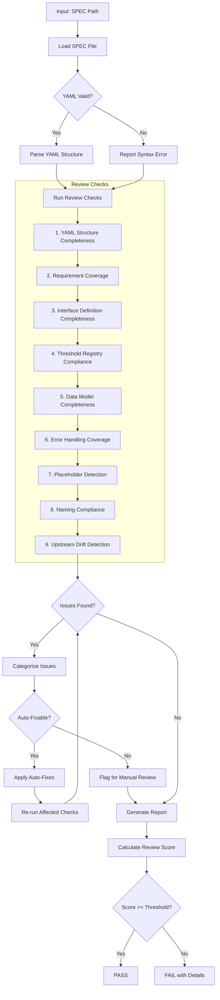
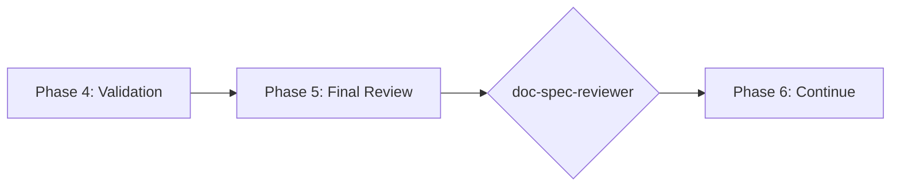

# doc-spec-reviewer

## Purpose

Comprehensive **content review and quality assurance** for Technical Specification (SPEC) documents. This skill performs deep content analysis beyond structural validation, checking YAML structure completeness, upstream-requirement coverage, interface definitions, threshold compliance, and identifying issues that require manual review.

**Layer**: 6 (SPEC Quality Assurance)

**Upstream**: SPEC (from `doc-spec-autopilot` or `doc-spec`)

**Downstream**: None (final QA gate before TDD/IPLAN generation)

---

## When to Use This Skill

Use `doc-spec-reviewer` when:

- **After SPEC Generation**: Run immediately after `doc-spec-autopilot` completes
- **Manual SPEC Edits**: After making manual changes to SPEC
- **Pre-TDD Check**: Before running `doc-tdd-autopilot`
- **Pre-IPLAN Check**: Before running `doc-iplan-autopilot`
- **Periodic Review**: Regular quality checks on existing SPECs

**Do NOT use when**:
- SPEC does not exist yet (use `doc-spec` or `doc-spec-autopilot` first)
- Need structural/schema validation only (use `doc-spec-validator`)
- Generating new SPEC content (use `doc-spec`)

---

## Skill vs Validator: Key Differences

| Aspect | `doc-spec-validator` | `doc-spec-reviewer` |
|--------|----------------------|---------------------|
| **Focus** | Schema compliance, TDD-Ready score | Content quality, implementation readiness |
| **Checks** | Required sections, YAML syntax | Upstream-requirement coverage, interface completeness |
| **Auto-Fix** | Structural issues only | Content issues (formatting) |
| **Output** | TDD-Ready score (numeric) | Review score + issue list |
| **Phase** | Phase 4 (Validation) | Phase 5 (Final Review) |
| **Blocking** | TDD-Ready < threshold blocks | Review score < threshold flags |

---

## Review Workflow



---

## Review Checks

### 0. Structure Compliance (MVP) - BLOCKING

Validates SPEC follows the mandatory nested folder rule.

**Nested Folder Rule**: ALL SPEC documents MUST be in nested folders.

**Required Structure**:

| SPEC Type | Required Location |
|-----------|-------------------|
| YAML | `docs/06_SPEC/SPEC-NN_{slug}/SPEC-NN_{slug}.yaml` |

**Error Codes**:

| Code | Severity | Description |
|------|----------|-------------|
| REV-STR001 | Error | SPEC not in nested folder (BLOCKING) |
| REV-STR002 | Error | Folder name doesn't match SPEC ID |
| REV-STR003 | Warning | File name doesn't match folder name |

**This check is BLOCKING** - SPEC must pass structure validation before other checks proceed.

---

### 1. YAML Structure Completeness

Validates 13-section YAML structure is complete.

**Required Sections**:
1. metadata
2. overview
3. traceability
4. interfaces
5. components
6. methods
7. data_models
8. error_handling
9. threshold_registry
10. req_implementations
11. testing_requirements
12. deployment
13. appendices

**Error Codes**:

| Code | Severity | Description |
|------|----------|-------------|
| REV-YS001 | Error | Required YAML section missing |
| REV-YS002 | Error | Invalid YAML syntax |
| REV-YS003 | Warning | Section is empty |
| REV-YS004 | Info | Optional section missing |

---

### 2. Requirement Coverage

Validates that every upstream formal requirement (EARS, Layer 3) is realized in the SPEC.

**Scope**:
- Every upstream EARS requirement has a corresponding specification element
- The behavior/requirement-mapping content is complete
- Acceptance criteria mapped
- No orphaned specifications

**Error Codes**:

| Code | Severity | Description |
|------|----------|-------------|
| REV-RC001 | Error | Upstream requirement not realized in SPEC |
| REV-RC002 | Warning | Acceptance criteria not mapped |
| REV-RC003 | Warning | Orphaned specification (no upstream requirement) |
| REV-RC004 | Info | Multiple SPEC items for single requirement (acceptable) |

---

### 3. Interface Definition Completeness

Validates external, internal, and class interfaces.

**Scope**:
- External interfaces documented
- Internal interfaces defined
- Class interfaces specified
- Method signatures complete

**Error Codes**:

| Code | Severity | Description |
|------|----------|-------------|
| REV-IF001 | Error | External interface missing |
| REV-IF002 | Error | Method signature incomplete |
| REV-IF003 | Warning | Internal interface not defined |
| REV-IF004 | Warning | Class interface missing |
| REV-IF005 | Info | Parameter types not specified |

---

### 4. Threshold Registry Compliance

Validates thresholds match upstream documents.

**Scope**:
- Thresholds consistent with upstream BRD/PRD/EARS values
- Performance targets defined
- SLA requirements met
- Monitoring thresholds set

**Error Codes**:

| Code | Severity | Description |
|------|----------|-------------|
| REV-TR001 | Error | Threshold mismatch with upstream requirement |
| REV-TR002 | Error | Performance target not defined |
| REV-TR003 | Warning | SLA requirement may not be met |
| REV-TR004 | Info | Monitoring threshold missing |

---

### 5. Data Model Completeness

Validates data models are implementation-ready.

**Scope**:
- All types defined
- Field specifications complete
- Validation rules documented
- Relationships mapped

**Error Codes**:

| Code | Severity | Description |
|------|----------|-------------|
| REV-DM001 | Error | Type not defined |
| REV-DM002 | Warning | Field specification incomplete |
| REV-DM003 | Warning | Validation rules missing |
| REV-DM004 | Info | Relationship not mapped |

---

### 6. Error Handling Coverage

Validates error scenarios documented.

**Scope**:
- Error codes defined
- Recovery strategies documented
- Error messages specified
- Retry semantics clear

**Error Codes**:

| Code | Severity | Description |
|------|----------|-------------|
| REV-EH001 | Error | No error handling defined |
| REV-EH002 | Warning | Recovery strategy missing |
| REV-EH003 | Warning | Error messages not specified |
| REV-EH004 | Info | Retry semantics not documented |

---

### 7. Placeholder Detection

Identifies incomplete content requiring replacement.

**Error Codes**:

| Code | Severity | Description |
|------|----------|-------------|
| REV-P001 | Error | [TODO] placeholder found |
| REV-P002 | Error | [TBD] placeholder found |
| REV-P003 | Warning | Template value not replaced |

---

### 8. Naming Compliance

Validates element IDs follow `doc-naming` standards (`framework/governance/ID_NAMING_STANDARDS.md`).

**Scope**:
- SPEC document references use the document-level form `SPEC-NN`
- Upstream element references use the 4-segment form `TYPE.NN.SS.xxxx` (BRD/PRD/EARS/BDD), with `ADR-NN` for ADR documents
- Component naming convention

**Error Codes**:

| Code | Severity | Description |
|------|----------|-------------|
| REV-N001 | Error | Invalid element ID format (not 4-segment `TYPE.NN.SS.xxxx`) |
| REV-N002 | Error | Document reference not in `SPEC-NN` / `ADR-NN` form |
| REV-N003 | Error | Legacy pattern detected (3-segment, numeric type-code, `SPEC-NNN`, or retired-layer tags) |

---

### 9. Upstream Drift Detection (Mandatory Cache)

Detects when upstream EARS, BDD, and ADR documents have been modified after the SPEC was created or last updated.

**The drift cache is mandatory**. All SPEC review operations must maintain drift cache state to enable accurate incremental drift detection. The cache persists hash values between reviews, eliminating false positives from timestamp-only comparisons.

**Purpose**: Identifies stale SPEC content that may not reflect current upstream documentation. When EARS documents (formal requirements, acceptance criteria), BDD documents (scenarios), or ADR documents (architecture decisions) change, the SPEC may need updates to maintain alignment.

**Scope**:
- `@ears:` tag targets (EARS documents)
- `@bdd:` tag targets (BDD documents)
- `@adr:` tag targets (ADR documents)
- Traceability section upstream artifact links
- Any markdown links to `../03_EARS/`, `../04_BDD/`, or `../05_ADR/` source documents

---

#### Drift Cache File (MANDATORY)

Location: `docs/06_SPEC/.drift_cache.json`

**Schema**:

```json
{
  "cache_version": "1.0",
  "last_review": "2026-02-10T17:00:00",
  "spec_files": {
    "SPEC-03.yaml": {
      "spec_hash": "sha256:abc123...",
      "last_reviewed": "2026-02-10T17:00:00",
      "upstream_refs": {
        "EARS-03.yaml": {
          "file_hash": "sha256:def456...",
          "section_hashes": {
            "requirements": "sha256:ghi789...",
            "acceptance_criteria": "sha256:jkl012..."
          },
          "last_modified": "2026-02-08T10:15:00"
        },
        "ADR-03.yaml": {
          "file_hash": "sha256:mno345...",
          "section_hashes": {
            "decision": "sha256:pqr678..."
          },
          "last_modified": "2026-02-09T14:30:00"
        }
      }
    }
  }
}
```

**Cache Fields**:

| Field | Type | Description |
|-------|------|-------------|
| `cache_version` | string | Schema version for cache format |
| `last_review` | ISO8601 | Timestamp of most recent review run |
| `spec_files` | object | Map of SPEC filename to review state |
| `spec_hash` | string | SHA-256 hash of SPEC file content |
| `last_reviewed` | ISO8601 | When this SPEC was last reviewed |
| `upstream_refs` | object | Map of upstream file to hash state |
| `file_hash` | string | SHA-256 hash of entire upstream file |
| `section_hashes` | object | Map of section name to content hash |
| `last_modified` | ISO8601 | File modification timestamp |

---

#### Three-Phase Detection Algorithm

**Phase 1: Cache Load**

```
1. Load .drift_cache.json from docs/06_SPEC/
2. If cache missing → initialize empty cache, flag REV-D006
3. Validate cache_version compatibility
4. Extract cached state for target SPEC file
```

**Phase 2: Drift Detection**

```
1. Extract all upstream references from SPEC:
   - @ears: tags → [path, section anchor]
   - @bdd: tags → [path, section anchor]
   - @adr: tags → [path, section anchor]
   - Links to ../03_EARS/ → [path]
   - Links to ../04_BDD/ → [path]
   - Links to ../05_ADR/ → [path]
   - Traceability table upstream artifacts → [path]

2. For each upstream reference:
   a. Resolve path to absolute file path
   b. Check file exists (already covered by Check #2)
   c. Compute current SHA-256 hash of file
   d. Compare to cached file_hash
   e. If hash differs → DRIFT detected, proceed to section check
   f. If section anchor specified:
      - Extract section content
      - Compute SHA-256 of section
      - Compare to cached section_hash
      - If differs → SECTION_DRIFT detected
```

**Phase 3: Cache Update**

```
1. After review completes (regardless of pass/fail):
   a. Update spec_hash with current SPEC hash
   b. Update last_reviewed timestamp
   c. For each upstream reference:
      - Update file_hash
      - Update section_hashes
      - Update last_modified
   d. Write .drift_cache.json atomically
2. Cache update is MANDATORY - failure to update is REV-D006
```

---

#### Hash Calculation (MANDATORY BASH EXECUTION)

**CRITICAL**: Execute actual bash commands. DO NOT write placeholder values.

**Full File Hash**:

```bash
sha256sum <file_path> | cut -d' ' -f1
```

Store as: `"hash": "sha256:<64_hex_characters>"`

**Section Hash** (for YAML sections):

```bash
# Extract YAML section and hash
yq '.<section_name>' <file_path> | sha256sum | cut -d' ' -f1
```

**REJECTED VALUES** (re-compute immediately):
- `sha256:verified_no_drift`
- `sha256:pending_verification`
- Any value where hex portion != 64 characters

**Verification**:

```bash
grep -oP '"hash":\s*"sha256:[0-9a-f]{64}"' .drift_cache.json
```

---

#### Error Codes

| Code | Severity | Description |
|------|----------|-------------|
| REV-D001 | Warning | Upstream EARS/BDD/ADR document modified after SPEC creation |
| REV-D002 | Warning | Referenced section content has changed (hash mismatch) |
| REV-D003 | Info | Upstream document version incremented |
| REV-D004 | Info | New content added to upstream document |
| REV-D005 | Error | Critical upstream document substantially modified (>20% change) |
| REV-D006 | Error | Drift cache missing or invalid - cache is mandatory |
| REV-D009 | Error | Invalid hash placeholder detected (`verified_no_drift`, `pending_verification`) |

---

#### Report Output

```markdown
## Upstream Drift Analysis

**Cache Status**: Active (last updated: 2026-02-10T14:30:00)

| Upstream Document | SPEC Reference | Cached Hash | Current Hash | Status | Severity |
|-------------------|----------------|-------------|--------------|--------|----------|
| EARS-03.yaml | @ears Section requirements | sha256:abc1... | sha256:def4... | DRIFT | Warning |
| ADR-03.yaml | @adr decision | sha256:ghi7... | sha256:ghi7... | FRESH | - |

**Drift Summary**:
- Files checked: 2
- Files with drift: 1
- Sections with drift: 1

**Recommendation**: Review upstream EARS/BDD/ADR changes and update SPEC if requirements or decisions have changed.
```

---

#### Auto-Actions

- **Mandatory**: Update `.drift_cache.json` with current hashes after every review
- Add `[DRIFT]` marker to affected @ears/@bdd/@adr tags (optional)
- Generate drift summary in review report

---

#### Configuration

| Setting | Default | Description |
|---------|---------|-------------|
| `cache_enabled` | true | **Mandatory** - cache cannot be disabled |
| `drift_threshold_days` | 7 | Days before drift becomes Warning |
| `critical_threshold_days` | 30 | Days before drift becomes Error |
| `tracked_patterns` | `@ears:`, `@bdd:`, `@adr:` | Patterns to track for drift |

---

## Review Score Calculation

**Scoring Formula**:

| Category | Weight | Calculation |
|----------|--------|-------------|
| YAML Structure Completeness | 14% | (complete_sections / 13) × 14 |
| Requirement Coverage | 19% | (implemented / total_requirements) × 19 |
| Interface Definition Completeness | 19% | (complete_interfaces / total) × 19 |
| Threshold Registry Compliance | 10% | (compliant / total_thresholds) × 10 |
| Data Model Completeness | 14% | (complete_models / total) × 14 |
| Error Handling Coverage | 5% | (covered / required) × 5 |
| Placeholder Detection | 5% | (no_placeholders ? 5 : 5 - count) |
| Naming Compliance | 9% | (valid_ids / total_ids) × 9 |
| Upstream Drift | 5% | (fresh_refs / total_refs) × 5 |

**Total**: Sum of all categories (max 100)

**Thresholds**:
- **PASS**: >= 90
- **WARNING**: 80-89
- **FAIL**: < 80

---

## Command Usage

```bash
# Review specific SPEC
/doc-spec-reviewer SPEC-03

# Review SPEC by path
/doc-spec-reviewer docs/06_SPEC/SPEC-03.yaml

# Review all SPECs
/doc-spec-reviewer all
```

---

## Output Report

Review reports are stored alongside the reviewed document per project standards.

**Nested Folder Rule**: ALL SPEC use nested folders (`SPEC-NN_{slug}/`) regardless of size. This ensures YAML files, review reports, fix reports, and drift cache files are organized together.

**File Naming**: `SPEC-NN.R_review_report_vNNN.md`

**Audit Wrapper Compatibility**: `doc-spec-audit` may emit preferred `SPEC-NN.A_audit_report_vNNN.md`; reviewer output remains valid legacy-compatible input for fixer.

**Location**: Inside the SPEC nested folder: `docs/06_SPEC/SPEC-NN_{slug}/`

### Versioning Rules

1. **First Review**: Creates `SPEC-NN.R_review_report_v001.md`
2. **Subsequent Reviews**: Auto-increments version (v002, v003, etc.)
3. **Same-Day Reviews**: Each review gets unique version number

**Version Detection**: Scans folder for existing `SPEC-NN.R_review_report_v*.md` files and increments.

**Example**:

```
docs/06_SPEC/SPEC-03_f3_observability/
├── SPEC-03_f3_observability.yaml
├── SPEC-03.R_review_report_v001.md    # First review
├── SPEC-03.R_review_report_v002.md    # After fixes
└── .drift_cache.json
```

### Delta Reporting

When previous reviews exist, include score comparison in the report.

See `REVIEW_DOCUMENT_STANDARDS.md` for complete versioning requirements.

---

## Integration with doc-spec-autopilot

This skill is invoked during Phase 5 of `doc-spec-autopilot`:



---

## Related Skills

| Skill | Relationship |
|-------|--------------|
| `doc-naming` | Naming standards for Check #8 |
| `doc-spec-autopilot` | Invokes this skill in Phase 5 |
| `doc-spec-validator` | Structural validation (Phase 4) |
| `doc-spec-fixer` | Applies fixes based on review findings |
| `doc-spec` | SPEC creation rules |
| `doc-ears-reviewer` | Upstream QA (formal requirements) |
| `doc-adr-reviewer` | Upstream QA (architecture decisions) |
| `doc-tdd-autopilot` | Downstream consumer |
| `doc-iplan-autopilot` | Downstream consumer |

---

## Version History

| Version | Date | Changes |
|---------|------|---------|
| 1.6 | 2026-05-22 | Migrated to the framework 8-layer model: SPEC renumbered to **Layer 6**; dropped the retired system/requirement/contract upstream layers — Check #2 + #4 + #9 now track upstream EARS (L3), BDD (L4), ADR (L5); Check #8 enforces 4-segment `TYPE.NN.SS.xxxx` element IDs with `SPEC-NN`/`ADR-NN` document refs (rejects legacy 3-segment, numeric type-code, and `SPEC-NNN` forms); downstream consumers `doc-tdd-autopilot` + `doc-iplan-autopilot`; paths repointed to `docs/06_SPEC/` + `framework/governance/`; TDD-Ready terminology |
| 1.5 | 2026-02-27 | Normalized metadata schema; aligned structure heading to MVP contract; added audit-wrapper compatibility for `.A_` reports |
| 1.4 | 2026-02-11 | **Structure Compliance BLOCKING check**: Added Check #0 as BLOCKING prerequisite; Validates nested folder rule for SPEC documents; REV-STR001-STR003 error codes; Must pass before other checks proceed |
| 1.3 | 2026-02-10 | **Mandatory drift cache**: Cache is now required (REV-D006 error if missing); Three-phase detection algorithm; SHA-256 hash calculation; Enhanced cache schema with section-level hashing; Cache status in report output |
| 1.2 | 2026-02-10 | Added Check #9: Upstream Drift Detection; REV-D001-D005 error codes; drift cache support; configurable thresholds; added doc-spec-fixer to related skills |
| 1.1 | 2026-02-10 | Added review versioning support (_vNNN pattern); Delta reporting for score comparison |
| 1.0 | 2026-02-10 | Initial skill creation with 8 review checks; YAML structure validation; requirement coverage; Interface completeness; Threshold compliance |

## Implementation Plan Consistency (IPLAN-004)

- Treat plan-derived outputs as valid source mode and verify intent preservation from implementation plan scope/objectives.
- Validate upstream autopilot precedence assumption: `--iplan > --ref > --prompt`.
- Flag objective/scope conflicts between plan context and artifact output as blocking issues requiring clarification.
- Do not introduce legacy fallback paths such as `docs-v2.0/00_REF`.

