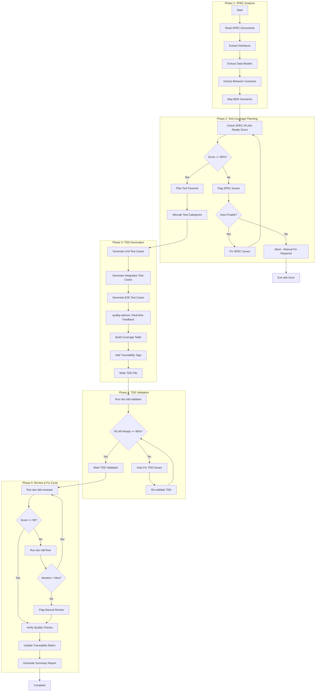
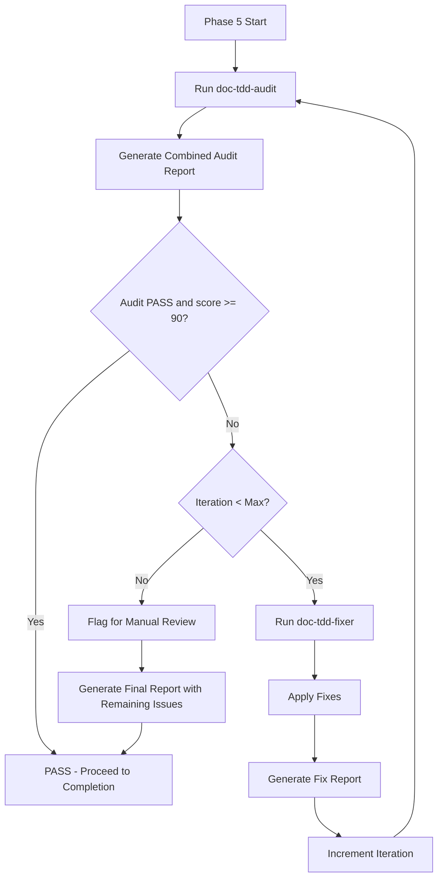
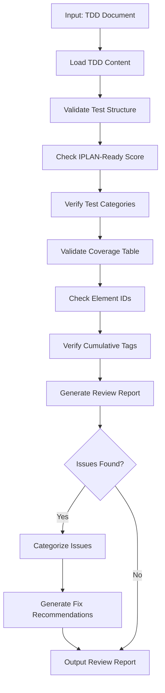
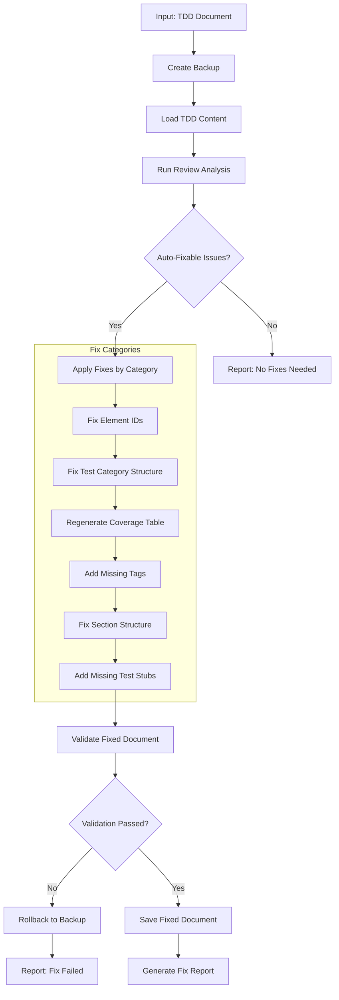

# doc-tdd-autopilot

## Purpose

Automated **Test-Driven Development (TDD)** generation pipeline that processes SPEC documents to generate comprehensive test-case definitions (unit, integration, and e2e tests) with IPLAN-Ready scoring.

**Layer**: 7

**Upstream**: SPEC (Layer 6) — also draws on BRD, PRD, EARS, BDD, ADR

**Downstream**: IPLAN (Layer 8)

---

## Input Contract (IPLAN-004 Standard)

- Supported modes:
  - `--ref <path>`
  - `--prompt "<text>"`
  - `--iplan <path|IPLAN-NN>`
- Precedence: `--iplan > --ref > --prompt`
- IPLAN resolution order:
  1. Use explicit file path when it exists
  2. Resolve `plans/IPLAN-NN*.md`
  3. Resolve `governance/plans/IPLAN-NN*.md`
  4. If multiple matches exist, fail with disambiguation request
- Merge conflict rule:
  - Objective/scope conflicts between primary and supplemental sources are blocking and require user clarification.

---

## Skill Dependencies

| Skill | Purpose | Phase |
|-------|---------|-------|
| `doc-naming` | Element ID format (TDD.NN.SS.xxxx) | All Phases |
| `doc-spec-validator` | Validate SPEC IPLAN-Ready score | Phase 2 |
| `doc-tdd` | TDD creation rules, test-case structure | Phase 3 |
| `quality-advisor` | Real-time quality feedback | Phase 3 |
| `doc-tdd-validator` | Validation with IPLAN-Ready scoring | Phase 4 |
| `doc-tdd-audit` | Unified validator+reviewer report for fixer handoff | Phase 5: Audit |
| `doc-tdd-reviewer` | Content review, link validation, quality scoring | Phase 5: Review |
| `doc-tdd-fixer` | Apply fixes from review report, create missing content | Phase 5: Fix |

---

## Document Type Contract (MANDATORY)

When generating TDD document instances, the autopilot MUST:

1. **Read** `instance_document_type` from template:
   - Source: `framework/layers/07_TDD/TDD-TEMPLATE.yaml`
   - Field: `metadata.document_type: "tdd-document"`

2. **Set** `document_type` in generated document frontmatter:
   ```yaml
   custom_fields:
     document_type: tdd-document    # NOT "template"
     artifact_type: TDD
     layer: 7
   ```

3. **Validation**: Generated documents MUST have `document_type: tdd-document`
   - Templates have `document_type: template`
   - Instances have `document_type: tdd-document`
   - Schema validates both values

**Error Handling**: If `document_type` is missing from template, default to `tdd-document`.

---

## Smart Document Detection

The autopilot automatically determines the action based on the input document type.

### Input Type Recognition

| Input | Detected As | Action |
|-------|-------------|--------|
| `TDD-NN` | Self type | Review existing TDD document |
| `SPEC-NN` | Upstream type | Generate if missing, review if exists |

### Detection Algorithm

```
1. Parse input: Extract TYPE and NN from "{TYPE}-{NN}"
2. Determine action:
   - IF TYPE == "TDD": Review Mode
   - ELSE IF TYPE == "SPEC": Generate/Find Mode
   - ELSE: Error (invalid type for this autopilot)
3. For Generate/Find Mode:
   - Check: Does TDD-{NN} exist in docs/07_TDD/?
   - IF exists: Switch to Review Mode for TDD-{NN}
   - ELSE: Proceed with Generation from SPEC-{NN}
```

### File Existence Check

```bash
# Check for nested folder structure (mandatory)
ls docs/07_TDD/TDD-{NN}_*/
```

### Examples

```bash
# Review mode (same type - TDD input)
/doc-tdd-autopilot TDD-01        # Reviews existing TDD-01

# Generate/Find mode (upstream type - SPEC input)
/doc-tdd-autopilot SPEC-01         # Generates TDD-01 if missing, or reviews existing TDD-01

# Multiple inputs
/doc-tdd-autopilot SPEC-01,SPEC-02 # Generates/reviews TDD-01 and TDD-02
/doc-tdd-autopilot TDD-01,TDD-02   # Reviews TDD-01 and TDD-02
```

### Action Determination Output

```
Input: SPEC-01
├── Detected Type: SPEC (upstream)
├── Expected TDD: TDD-01
├── TDD Exists: Yes → docs/07_TDD/TDD-01_f1_iam/
└── Action: REVIEW MODE - Running doc-tdd-reviewer on TDD-01

Input: SPEC-05
├── Detected Type: SPEC (upstream)
├── Expected TDD: TDD-05
├── TDD Exists: No
└── Action: GENERATE MODE - Creating TDD-05 from SPEC-05

Input: TDD-03
├── Detected Type: TDD (self)
└── Action: REVIEW MODE - Running doc-tdd-reviewer on TDD-03
```

---

## Workflow Overview



---

## Test Categories

TDD is a single unified artifact. Test cases are organized by category within the
TDD document, not as separate artifacts. Categories follow the test pyramid:

| Category | Pyramid Share | Purpose | Target |
|----------|---------------|---------|--------|
| **Unit** | 70% | Validate individual functions/methods in isolation | SPEC interfaces and data models (SPEC Sections 3-4) |
| **Integration** | 20% | Validate component interactions and contracts | SPEC behavior contracts (SPEC Section 5) |
| **E2E** | 10% | Validate full user workflows | BDD scenarios |
| **Security** | optional | Validate threat/abuse paths | Only when SPEC or ADR mandates security testing |

---

## TDD Structure

**All TDD use nested folders** (`TDD-NN_{slug}/`). This keeps the test-case document and companion files organized together.

```
docs/07_TDD/
├── TDD-01_authentication/
│   ├── TDD-01.md                       # Test-case document (unit/integration/e2e cases)
│   ├── TDD-01.A_audit_report_v001.md   # Combined audit report (preferred)
│   ├── TDD-01.R_review_report_v001.md  # Review report (legacy-compatible)
│   ├── TDD-01.F_fix_report_v001.md     # Fix report
│   └── .drift_cache.json                # Drift cache
└── TDD-01_authentication.md             # Redirect stub (optional)
```

---

## Coverage Table Format

Maps each BDD scenario and SPEC element to its covering test cases by category.

| BDD Scenario | Unit | Integration | E2E | Coverage |
|--------------|------|-------------|-----|----------|
| BDD.01.03.8f4c | TDD.01.04.a1b2 | TDD.01.04.c3d4 | TDD.01.04.e5f6 | 100% |
| BDD.01.03.9a2e | TDD.01.04.b7c8 | TDD.01.04.d9e0 | - | 67% |

---

## Element ID Format

Per the [doc-naming skill](../doc-naming/SKILL.md), all TDD test-case IDs use the
4-segment standard `TYPE.NN.SS.xxxx`:

| Segment | Meaning | Example |
|---------|---------|---------|
| `TYPE` | Artifact prefix (always `TDD`) | TDD |
| `NN` | Two-digit document number | 01 |
| `SS` | Two-digit section number (test cases live in Section 4) | 04 |
| `xxxx` | 4-char hex content hash | a1b2 |

**Example**: `TDD.01.04.a1b2`

Document-level references use dash notation: `TDD-NN`, `SPEC-NN`, `ADR-NN`, `IPLAN-NN`.

---

## Phase 5: Review & Fix Cycle

Iterative review and fix cycle to ensure TDD quality before completion.



### 5.1 Initial Review

Run `doc-tdd-audit` to perform validator+reviewer checks and produce a unified fixer-ready report.

```bash
/doc-tdd-audit TDD-NN
```

**Output**: `TDD-NN.A_audit_report_v001.md` (preferred), with `.R_review_report_vNNN.md` compatibility preserved.

### 5.2 Fix Cycle

If review score < 90%, invoke `doc-tdd-fixer`.

```bash
/doc-tdd-fixer TDD-NN --revalidate
```

**Fix Categories**:

| Category | Fixes Applied |
|----------|---------------|
| Missing Test Categories | Add missing unit/integration/e2e test cases |
| Broken Links | Update SPEC/BDD references |
| Element IDs | Convert legacy patterns to TDD.NN.SS.xxxx |
| Coverage Table | Regenerate from test-case definitions |
| Test Structure | Add missing sections per TDD template |
| Traceability | Update cumulative tags (6 upstream layers) |

**Output**: `TDD-NN.F_fix_report_v001.md`

### 5.3 Re-Review

After fixes, automatically re-run audit.

```bash
/doc-tdd-audit TDD-NN
```

**Output**: `TDD-NN.A_audit_report_v002.md` (preferred), with legacy `.R_` compatibility.

### 5.4 Iteration Control

| Parameter | Default | Description |
|-----------|---------|-------------|
| `max_iterations` | 3 | Maximum fix-review cycles |
| `target_score` | 90 | Minimum passing score |
| `stop_on_manual` | false | Stop if only manual issues remain |

**Iteration Example**:

```
Iteration 1:
  Review v001: Score 78 (2 errors, 6 warnings)
  Fix v001: Fixed 5 issues, added 1 test category

Iteration 2:
  Review v002: Score 91 (0 errors, 2 warnings)
  Status: PASS (score >= 90)
```

### 5.5 Quality Checks (Post-Fix)

After passing the fix cycle:

1. **Test Category Completeness**:
   - Unit, integration, and e2e categories present per the test pyramid
   - Each test case has required fields (inputs, expected output, edge cases)
   - No placeholder text remaining

2. **Coverage Table Accuracy**:
   - All BDD scenarios and SPEC elements have test coverage
   - Coverage percentages calculated correctly
   - Pyramid distribution targets met

3. **Element ID Compliance** (per `doc-naming` skill):
   - All IDs use TDD.NN.SS.xxxx format
   - No legacy patterns (UT-XXX, IT-XXX, ST-XXX, FT-XXX)

4. **IPLAN-Ready Report**:
   ```
   IPLAN-Ready Score Breakdown
   ===========================
   Test Category Completeness: 25/25 (unit + integration + e2e present)
   Coverage Table:             18/20 (coverage targets met)
   SPEC Alignment:             20/20 (tests trace to SPEC)
   Element ID Format:          15/15 (valid format)
   Traceability Tags:          10/10 (6 required upstream tags)
   Test Assertions:            8/10 (assertions present)
   ----------------------------
   Total IPLAN-Ready Score: 96/100 (Target: >= 90)
   Status: READY FOR IPLAN GENERATION
   ```

5. **Traceability Matrix Update**:
   - Update the TDD traceability matrix at `docs/07_TDD/TDD-00_TRACEABILITY_MATRIX.md`.
   - This is a declarative authoring step performed by the skill: re-derive the
     BDD-scenario → test-case mapping from the TDD document's coverage table and
     write it into the matrix. No external script is invoked.
   - Reference: `framework/layers/07_TDD/README.md` and `framework/governance/`.

---

## Cumulative Tags (6 Required)

Per `framework/governance/ID_NAMING_STANDARDS.md`, a Layer 7 TDD carries the
six upstream references (no SYS/REQ/CTR layers in the 8-layer model):

```markdown
@brd: BRD.NN.SS.xxxx
@prd: PRD.NN.SS.xxxx
@ears: EARS.NN.SS.xxxx
@bdd: BDD.NN.SS.xxxx
@adr: ADR.NN.SS.xxxx
@spec: SPEC-NN
```

---

## Configuration

### Default Configuration

```yaml
tdd_autopilot:
  version: "1.0"

  scoring:
    iplan_ready_min: 90
    strict_mode: false

  execution:
    max_parallel: 3        # HARD LIMIT - do not exceed
    chunk_size: 3          # Documents per chunk
    pause_between_chunks: true
    auto_fix: true
    continue_on_error: false
    timeout_per_spec: 180  # seconds

  output:
    structure: unified     # single TDD document per SPEC component
    report_format: markdown

  validation:
    skip_validation: false
    fix_iterations_max: 3

  test_categories:
    unit: true
    integration: true
    e2e: true
    security: false        # enable only if SPEC/ADR mandates
```

---

## Execution Modes

### Mode 1: Generate Mode (Default)

Standard TDD generation from SPEC documents (see Workflow Overview above).

### Mode 2: Review Mode

Validate existing TDD documents without modification. Generates quality report with actionable recommendations.

**Command**:
```bash
# Review single TDD
/doc-tdd-autopilot TDD-01 --review

# Review all TDD in directory
/doc-tdd-autopilot docs/07_TDD/ --review --all

# Review with detailed report
/doc-tdd-autopilot TDD-01 --review --verbose
```

**Review Process**:



**Review Report Template**:

```markdown
# TDD Review Report: TDD-NN_{slug}

## Summary
- **IPLAN-Ready Score**: NN% (✅/🟡/❌)
- **Total Issues**: N (E errors, W warnings)
- **Auto-Fixable**: N issues
- **Manual Review**: N issues

## Test Category Coverage
| Category | Cases | Coverage | Status |
|----------|-------|----------|--------|
| Unit | N | NN% | ✅/🟡/❌ |
| Integration | N | NN% | ✅/🟡/❌ |
| E2E | N | NN% | ✅/🟡/❌ |

## Score Breakdown
| Category | Score | Max | Status |
|----------|-------|-----|--------|
| Test Category Completeness | NN | 25 | ✅/🟡/❌ |
| Coverage Table | NN | 20 | ✅/🟡/❌ |
| SPEC Alignment | NN | 20 | ✅/🟡/❌ |
| Element ID Format | NN | 15 | ✅/🟡/❌ |
| Traceability Tags | NN | 10 | ✅/🟡/❌ |
| Test Assertions | NN | 10 | ✅/🟡/❌ |

## Issues by Category

### Auto-Fixable Issues
| Issue | Location | Fix Action |
|-------|----------|------------|
| Legacy ID pattern | Line 45 | Convert UT-001 → TDD.01.04.a1b2 |
| Missing cumulative tag | Traceability | Add @bdd: BDD.01.03.8f4c |

### Manual Review Required
| Issue | Location | Recommendation |
|-------|----------|----------------|
| Missing e2e cases | Section 4 | Add e2e tests for critical workflows |
| Low coverage | SPEC-01 Section 5 | Add integration tests for contract |
```

**Score Indicators**:
- ✅ Green (>=90%): IPLAN-Ready
- 🟡 Yellow (70-89%): Needs improvement
- ❌ Red (<70%): Significant issues

**Review Configuration**:

```yaml
review_mode:
  enabled: true
  checks:
    - test_structure      # Unit/integration/e2e categories present
    - coverage_table      # Coverage >= target per BDD scenario / SPEC element
    - spec_alignment      # Tests trace to SPEC interfaces/contracts
    - element_ids         # TDD.NN.SS.xxxx format
    - cumulative_tags     # 6 required upstream tags present
    - test_assertions     # Each test case has clear assertions
  output:
    format: markdown      # markdown, json, html
    include_recommendations: true
    include_fix_commands: true
  coverage_targets:
    unit: 90             # Unit test coverage target %
    integration: 85      # Integration test coverage target %
    e2e: 75              # E2E happy-path coverage target %
```

### Mode 3: Fix Mode

Auto-repair existing TDD documents with backup and content preservation.

**Command**:
```bash
# Fix single TDD
/doc-tdd-autopilot TDD-01 --fix

# Fix with backup
/doc-tdd-autopilot TDD-01 --fix --backup

# Fix all TDD
/doc-tdd-autopilot docs/07_TDD/ --fix --all

# Fix specific categories only
/doc-tdd-autopilot TDD-01 --fix --only element_ids,tags

# Dry-run fix (preview changes)
/doc-tdd-autopilot TDD-01 --fix --dry-run
```

**Fix Process**:



**TDD-Specific Fix Categories**:

| Category | Description | Auto-Fix Actions |
|----------|-------------|------------------|
| `element_ids` | Element ID format | Convert legacy patterns to TDD.NN.SS.xxxx |
| `test_categories` | Test categories | Add missing unit/integration/e2e cases |
| `coverage_table` | Coverage tracking | Regenerate table from test-case definitions |
| `cumulative_tags` | Traceability tags | Add missing 6 upstream tags |
| `sections` | Section structure | Add missing sections per TDD template |
| `test_stubs` | Missing tests | Generate test stubs for uncovered BDD scenarios |
| `assertions` | Test assertions | Flag tests without assertions (manual fix) |

**Element ID Migration**:

| Legacy Pattern | New Format | Example |
|----------------|------------|---------|
| UT-NNN | TDD.NN.04.xxxx | UT-001 → TDD.01.04.a1b2 |
| IT-NNN | TDD.NN.04.xxxx | IT-001 → TDD.01.04.c3d4 |
| ST-NNN | TDD.NN.04.xxxx | ST-001 → TDD.01.04.e5f6 |
| FT-NNN | TDD.NN.04.xxxx | FT-001 → TDD.01.04.b7c8 |
| TC-NNN | TDD.NN.04.xxxx | TC-001 → TDD.01.04.a1b2 |
| TEST-NNN | TDD.NN.04.xxxx | TEST-001 → TDD.01.04.d9e0 |

**Content Preservation Rules**:

| Content Type | Preservation Rule |
|--------------|-------------------|
| Custom test descriptions | Never delete, only enhance metadata |
| Test assertions | Preserve all test logic |
| Test data/fixtures | Preserve all test data definitions |
| SPEC/BDD references | Validate and update format only |
| Coverage percentages | Recalculate after fixes |
| Test prerequisites | Preserve setup/teardown logic |

**Fix Configuration**:

```yaml
fix_mode:
  enabled: true
  backup:
    enabled: true
    location: "tmp/backups/"
    timestamp: true
  fix_categories:
    element_ids: true       # Convert legacy ID patterns
    test_categories: true   # Add missing test categories
    coverage_table: true    # Regenerate coverage tracking
    cumulative_tags: true   # Add 6 required tags
    sections: true          # Add missing sections
    test_stubs: true        # Generate stubs for uncovered BDD scenarios
    assertions: false       # Manual only (flag but don't auto-fix)
  validation:
    post_fix: true          # Validate after fixes
    rollback_on_fail: true  # Restore backup if validation fails
  preserve:
    test_descriptions: true
    test_assertions: true
    test_data: true
    spec_references: true
```

**Fix Report Template**:

```markdown
# TDD Fix Report: TDD-NN_{slug}

## Summary
- **Backup Created**: tmp/backups/TDD-NN_{slug}_20260209_143022/
- **Issues Fixed**: N of M auto-fixable issues
- **Manual Review**: N issues flagged

## Fixes Applied

### Element ID Migration
| Original | Fixed | Location |
|----------|-------|----------|
| UT-001 | TDD.01.04.a1b2 | Line 45 |
| IT-001 | TDD.01.04.c3d4 | Line 23 |
| ST-001 | TDD.01.04.e5f6 | Line 12 |

### Test Cases Added
| Category | Cases Generated | Status |
|----------|-----------------|--------|
| E2E | 5 workflow tests | Created from BDD scenarios |

### Coverage Table Regenerated
| BDD Scenario | Before | After |
|--------------|--------|-------|
| BDD.01.03.8f4c | 50% | 100% |
| BDD.01.03.9a2e | 25% | 67% |
| Overall | 45% | 78% |

### Cumulative Tags Added
- @ears: EARS.01.03.5e2a (added)
- @adr: ADR.01.03.e5b1 (added)

## Test Stubs Generated
| BDD Scenario | Category | Stub ID |
|--------------|----------|---------|
| BDD.01.03.aa11 | Unit | TDD.01.04.f0a1 |
| BDD.01.03.aa11 | Integration | TDD.01.04.f0a2 |

## Manual Review Required

### Tests Without Assertions
| Test ID | Issue |
|---------|-------|
| TDD.01.04.a3c1 | No assert statements |
| TDD.01.04.b4d2 | Missing expected outcome |

### Low Coverage Areas
| SPEC Reference | Current | Target | Action Needed |
|----------------|---------|--------|---------------|
| SPEC-01 Section 5 | 25% | 85% | Add 2+ integration tests |

## Validation Results
- **IPLAN-Ready Score**: Before: 68% → After: 92%
- **Validation Errors**: Before: 12 → After: 0
- **Status**: ✅ All auto-fixes validated
```

**Command Line Options** (Review/Fix Modes):

| Option | Default | Description |
|--------|---------|-------------|
| `--review` | false | Run review mode only |
| `--fix` | false | Run fix mode |
| `--backup` | true | Create backup before fixing |
| `--dry-run` | false | Preview fixes without applying |
| `--only` | all | Comma-separated fix categories |
| `--verbose` | false | Detailed output |
| `--all` | false | Process all TDD in directory |
| `--output-format` | markdown | Report format (markdown, json) |
| `--generate-stubs` | true | Generate test stubs for uncovered BDD scenarios |
| `--test-categories` | all | Comma-separated test categories to fix |

---

## Context Management

### Chunked Parallel Execution (MANDATORY)

**CRITICAL**: To prevent conversation context overflow errors ("Prompt is too long", "Conversation too long"), all autopilot operations MUST follow chunked execution rules:

**Chunk Size Limit**: Maximum 3 documents per chunk

**Chunking Rules**:

1. **Chunk Formation**: Group SPEC-derived TDD documents into chunks of maximum 3 at a time
2. **Sequential Chunk Processing**: Process one chunk at a time, completing all documents in a chunk before starting the next
3. **Context Pause**: After completing each chunk, provide a summary and pause for user acknowledgment
4. **Progress Tracking**: Display chunk progress (e.g., "Chunk 2/4: Processing TDD-04, TDD-05, TDD-06...")

**Why Chunking is Required**:

- Prevents "Conversation too long" errors during batch processing
- Allows context compaction between chunks
- Enables recovery from failures without losing all progress
- Provides natural checkpoints for user review

**Chunk Completion Template**:

```markdown
## Chunk N/M Complete

Generated:
- TDD-XX: IPLAN-Ready Score 94% (unit + integration + e2e)
- TDD-YY: IPLAN-Ready Score 92% (unit + integration + e2e)
- TDD-ZZ: IPLAN-Ready Score 95% (unit + integration + e2e)

Proceeding to next chunk...
```

---

## Related Resources

- **TDD Skill**: `../doc-tdd/SKILL.md`
- **TDD Validator**: `../doc-tdd-validator/SKILL.md`
- **Naming Standards**: `../doc-naming/SKILL.md`
- **Quality Advisor**: `../quality-advisor/SKILL.md`
- **TDD Template**: `framework/layers/07_TDD/TDD-TEMPLATE.yaml`
- **TDD Guide**: `framework/layers/07_TDD/README.md`
- **Governance**: `framework/governance/`

---

## Review Document Standards

Review reports generated by this skill are formal project documents and MUST comply with shared standards.

**Reference**: See `REVIEW_DOCUMENT_STANDARDS.md` in the skills directory for complete requirements.

**Key Requirements**:

1. **Storage Location**: Same folder as the reviewed TDD document
2. **File Naming**: `TDD-NN.A_audit_report_vNNN.md` (preferred) and `TDD-NN.R_review_report_vNNN.md` (legacy-compatible)
3. **YAML Frontmatter**: Required with `artifact_type: TDD-REVIEW`, `layer: 7`
4. **Score Field**: `impl_ready_score_claimed` / `impl_ready_score_validated`
5. **Parent Reference**: Must link to parent TDD document

**Example Location** (ALWAYS use nested folders):

```
docs/07_TDD/TDD-03_f3_observability/
├── TDD-03_f3_observability.md          # ← Main document
├── TDD-03.A_audit_report_v001.md       # ← Combined audit report (preferred)
├── TDD-03.R_review_report_v001.md      # ← Review report
├── TDD-03.F_fix_report_v001.md         # ← Fix report
└── .drift_cache.json                    # ← Drift cache
```

**Nested Folder Rule**: ALL TDD use nested folders (`TDD-NN_{slug}/`) regardless of size. This keeps companion files (review reports, fix reports, drift cache) organized with their parent document.

---

## Version History

| Version | Date | Changes |
|---------|------|---------|
| 3.0 | 2026-05-22 | Migrated to the framework 8-layer model: this autopilot now targets TDD (Layer 7) with downstream IPLAN (Layer 8); removed the three legacy upstream layers between ADR and SPEC; collapsed the legacy test-subtype artifacts into unified TDD test categories (unit/integration/e2e, optional security); adopted 4-segment element IDs (TDD.NN.SS.xxxx); replaced dead validation-script references with declarative checklist + pointers to `framework/layers/07_TDD/README.md` and `framework/governance/`; updated all paths to `framework/layers/07_TDD/` and sibling-relative skill references |
| 2.6 | 2026-02-27 | Normalized frontmatter to `metadata` schema with `versioning_policy`; integrated audit-first workflow and outputs; normalized review-document naming guidance to versioned `.A_` preferred with `.R_` legacy compatibility |
| 2.5 | 2026-02-26 | Added performance and security test support in test types and element ID tables; fixed @spec tag format to use dash notation (SPEC-NN) |
| 2.4 | 2026-02-11 | **Smart Document Detection**: Added automatic document type recognition; self-type input triggers review mode; upstream-type input triggers generate-if-missing or find-and-review |
| 2.3 | 2026-02-10 | **Review & Fix Cycle**: Iterative review → fix cycle; added iteration control (max 3 cycles); added quality checks and traceability matrix update step |
| 2.2 | 2026-02-10 | Added Review Document Standards section; review reports stored alongside reviewed documents with proper YAML frontmatter and parent references |
| 2.1 | 2026-02-09 | Added Review Mode and Fix Mode with backup, content preservation, and test stub generation |
| 1.0 | 2026-02-08 | Initial skill creation with 5-phase workflow |
</content>
</invoke>
