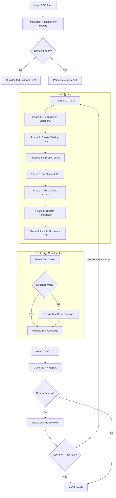
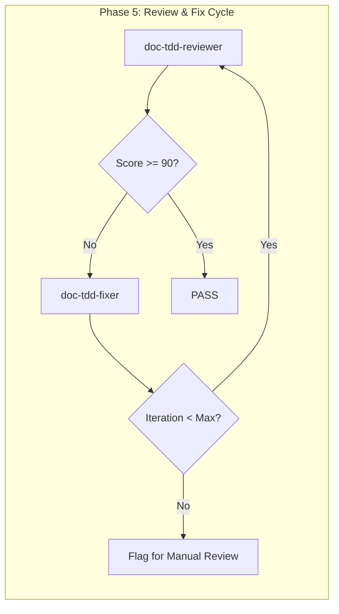

# doc-tdd-fixer

## Purpose

Automated **fix skill** that reads the latest review report and applies fixes to TDD (Test-Driven Development) documents. This skill bridges the gap between `doc-tdd-reviewer` (which identifies issues) and the corrected TDD, enabling iterative improvement cycles.

**Layer**: 7 (TDD Quality Improvement)

**Upstream**: SPEC documents, TDD document, Review/Audit Report (`TDD-NN.A_audit_report_vNNN.md` preferred; `TDD-NN.R_review_report_vNNN.md` legacy-compatible)

**Downstream**: Fixed TDD, Fix Report (`TDD-NN.F_fix_report_vNNN.md`)

---

## When to Use This Skill

Use `doc-tdd-fixer` when:

- **After Review**: Run after `doc-tdd-reviewer` identifies issues
- **Iterative Improvement**: Part of Review -> Fix -> Review cycle
- **Automated Pipeline**: CI/CD integration for quality gates
- **Batch Fixes**: Apply fixes to multiple TDDs based on review reports
- **Test Case Structure Issues**: Test cases have malformed structure

**Do NOT use when**:
- No review report exists (run `doc-tdd-reviewer` first)
- Creating new TDD (use `doc-tdd` or `doc-tdd-autopilot`)
- Only need validation (use `doc-tdd-validator`)

### Report Selection Precedence (Deterministic)

1. Select report with latest timestamp/version.
2. If timestamps/versions tie, prefer `.A_audit_report_vNNN.md` over `.R_review_report_vNNN.md`.

---

## Skill Dependencies

| Skill | Purpose | When Used |
|-------|---------|-----------|
| `doc-tdd-audit` | Unified validator+reviewer wrapper | Preferred upstream report source |
| `doc-tdd-reviewer` | Source of issues to fix | Input (reads review report) |
| `doc-naming` | Element ID standards | Fix element IDs |
| `doc-tdd` | TDD creation rules | Create missing sections |
| `doc-spec` | SPEC traceability | Validate upstream links |

---

## Workflow Overview



---

## Fix Phases

### Phase 0: Fix Structure Violations (CRITICAL)

Fixes TDD documents that are not at the expected location. This phase runs FIRST because all subsequent phases depend on correct file structure.

**Document Rule**: One TDD document per SPEC component, named `TDD-NN_{component_slug}.yaml`, located under `docs/07_TDD/`.

**Required Structure**:
| Item | Required Location |
|------|-------------------|
| TDD document | `docs/07_TDD/TDD-NN_{slug}.yaml` |
| TDD index | `docs/07_TDD/TDD-00_index.md` |

**Fix Actions**:

| Issue Code | Issue | Fix Action |
|------------|-------|------------|
| REV-STR001 | TDD not in `docs/07_TDD/` | Move file to correct directory, update all links |
| REV-STR002 | Filename doesn't match `TDD-NN_{slug}.yaml` | Rename file to match |
| REV-STR003 | TDD missing from index | Add entry to `TDD-00_index.md` |
| REV-STR004 | Component slug mismatch with SPEC | Align slug with parent SPEC component |

**Structure Fix Workflow**:

```python
def fix_tdd_structure(tdd_path: str) -> list:
    """Fix TDD structure violations."""
    fixes = []

    filename = os.path.basename(tdd_path)
    parent_folder = os.path.dirname(tdd_path)

    # Extract TDD ID and slug from filename: TDD-NN_{slug}.yaml
    match = re.match(r'TDD-(\d+)_([^/]+)\.yaml', filename)
    if not match:
        return []  # Cannot auto-fix invalid filename

    tdd_id = match.group(1)
    slug = match.group(2)
    expected_dir = "docs/07_TDD"

    # Check if already in correct directory
    if os.path.basename(parent_folder) != "07_TDD":
        new_path = os.path.join(expected_dir, filename)
        os.makedirs(expected_dir, exist_ok=True)
        shutil.move(tdd_path, new_path)
        fixes.append(f"Moved {tdd_path} to {new_path}")

        # Update upstream links in moved file
        content = Path(new_path).read_text()
        updated_content = content.replace('../06_SPEC/', '../06_SPEC/')
        Path(new_path).write_text(updated_content)
        fixes.append("Updated relative links for corrected location")

    return fixes
```

**Link Path Updates After Move**:

| Original Path | Updated Path |
|---------------|--------------|
| `../06_SPEC/SPEC-01.yaml` | `../06_SPEC/SPEC-01.yaml` |

---

### Phase 1: Create Missing Files

Creates files that are referenced but don't exist.

**Scope**:

| Missing File | Action | Template Used |
|--------------|--------|---------------|
| `TDD-NN_test_data.yaml` | Create test data file | Test data template |
| `TDD-NN_fixtures.yaml` | Create test fixtures file | Fixtures template |
| `TDD-00_index.md` | Create index | Index template |
| Reference docs | Create placeholder | REF template |

**Test Data Template**:

```yaml
# TDD-NN: Test Data Definitions
# Auto-generated by doc-tdd-fixer - requires completion

test_data:
  version: "1.0.0"
  tdd_id: TDD-NN
  created: "YYYY-MM-DD"
  status: draft

datasets:
  # TODO: Add test datasets
  valid_inputs:
    - id: TD-001
      description: "Valid input data set 1"
      data:
        # Add data fields

  invalid_inputs:
    - id: TD-002
      description: "Invalid input data set 1"
      data:
        # Add data fields

  edge_cases:
    - id: TD-003
      description: "Edge case data set 1"
      data:
        # Add data fields

boundary_values:
  # TODO: Define boundary values for testing
  - field: example_field
    min: 0
    max: 100
    boundary_tests:
      - value: -1
        expected: error
      - value: 0
        expected: success
      - value: 100
        expected: success
      - value: 101
        expected: error
```

**Test Fixtures Template**:

```yaml
# TDD-NN: Test Fixtures
# Auto-generated by doc-tdd-fixer - requires completion

fixtures:
  version: "1.0.0"
  tdd_id: TDD-NN
  created: "YYYY-MM-DD"

setup:
  # TODO: Define setup fixtures
  database:
    - name: test_db_setup
      description: "Initialize test database"
      actions:
        - action: create_schema
        - action: seed_data

  services:
    - name: mock_api_setup
      description: "Setup mock API endpoints"

teardown:
  # TODO: Define teardown fixtures
  database:
    - name: test_db_cleanup
      actions:
        - action: drop_schema
```

**Test Matrix Template**:

```markdown
---
title: "TDD-NN: Test Matrix"
tags:
  - tdd
  - test-matrix
  - layer-7
custom_fields:
  document_type: test-matrix
  artifact_type: TDD-MATRIX
  layer: 7
  parent_tdd: TDD-NN
---

# TDD-NN Test Matrix

## Coverage Summary

| BDD Scenario | Test Cases | Pass | Fail | Skip | Coverage |
|--------------|------------|------|------|------|----------|
| BDD.01.03.8f4c | TDD.01.04.a3c1, TDD.01.04.b2d8 | - | - | - | - |

## Test Case Matrix

| Test ID | BDD Scenario | Priority | Type | Status |
|---------|--------------|----------|------|--------|
| TDD.01.04.a3c1 | BDD.01.03.8f4c | P1 | unit | Pending |

## Environment Matrix

| Environment | OS | Browser/Runtime | Status |
|-------------|----|-----------------| -------|
| CI | Linux | Node 18 | Pending |

---

*Created by doc-tdd-fixer as placeholder. Complete this document.*
```

---

### Phase 2: Fix Broken Links

Updates links to point to correct locations.

**Fix Actions**:

| Issue Code | Issue | Fix Action |
|------------|-------|------------|
| REV-L001 | Broken internal link | Update path or create target file |
| REV-L002 | External link unreachable | Add warning comment, keep link |
| REV-L003 | Absolute path used | Convert to relative path |
| REV-L008 | Test data reference broken | Update test data path |
| REV-L009 | Fixture reference broken | Update fixture path |

**Path Resolution Logic**:

```python
def fix_link_path(tdd_location: str, target_path: str) -> str:
    """Calculate correct relative path based on TDD location."""

    # TDD files: docs/07_TDD/TDD-01_slug.yaml
    # Test data: docs/07_TDD/data/
    # Fixtures: docs/07_TDD/fixtures/

    if is_test_data_reference(target_path):
        return fix_test_data_ref(tdd_location, target_path)
    elif is_fixture_reference(target_path):
        return fix_fixture_ref(tdd_location, target_path)
    else:
        return calculate_relative_path(tdd_location, target_path)
```

---

### Phase 3: Fix Element IDs

Converts invalid element IDs to the correct 4-segment format.

**Element ID Format**: `TDD.{doc_id}.{section_id}.{hash}` (4 segments). Test cases live in Section 4, so the section segment is `04`; the hash is a 4-character hex content hash. Test type (unit / integration / e2e / security) is a `type` **attribute** on each case, NOT an ID code or separate document.

**Conversion Rules**:

| Pattern | Issue | Conversion |
|---------|-------|------------|
| `TC-XXX` | Legacy pattern | `TDD.NN.04.xxxx` |
| `UT-XXX` | Legacy unit-test pattern | `TDD.NN.04.xxxx` (`type: unit`) |
| `IT-XXX` | Legacy integration-test pattern | `TDD.NN.04.xxxx` (`type: integration`) |
| `ST-XXX` / `FT-XXX` | Legacy patterns | `TDD.NN.04.xxxx` (set `type` attribute) |
| 3-segment `TDD.NN.xxxx` | Missing section segment | Insert section `04` -> `TDD.NN.04.xxxx` |

**Note**: There are no numeric type codes in the 8-layer model. Tests are NOT categorized by separate ID codes or separate test artifacts; they are organized as content with a `type` attribute on each test case within the single TDD document.

**Regex Patterns**:

```python
# Find element IDs missing the section segment (3-segment legacy form)
legacy_3seg = r'TDD\.(\d{2})\.([0-9a-f]{4})\b'

# Find legacy test-ID patterns
legacy_tc = r'###\s+TC-(\d+):'
legacy_ut = r'###\s+UT-(\d+):'
legacy_it = r'###\s+IT-(\d+):'
legacy_ft = r'###\s+FT-(\d+):'
```

---

### Phase 4: Fix Content Issues

Addresses placeholders and incomplete content.

**Fix Actions**:

| Issue Code | Issue | Fix Action |
|------------|-------|------------|
| REV-P001 | `[TODO]` placeholder | Flag for manual completion (cannot auto-fix) |
| REV-P002 | `[TBD]` placeholder | Flag for manual completion (cannot auto-fix) |
| REV-P003 | Template date `YYYY-MM-DD` | Replace with current date |
| REV-P004 | Template name `[Name]` | Replace with metadata author or flag |
| REV-P005 | Empty section | Add minimum template content |
| REV-T001 | Missing test inputs | Add placeholder inputs structure |
| REV-T002 | Missing expected output | Add placeholder expected output |
| REV-T003 | Missing edge cases | Add placeholder edge cases |

**Auto-Replacements**:

```python
replacements = {
    'YYYY-MM-DDTHH:MM:SS': datetime.now().strftime('%Y-%m-%dT%H:%M:%S'),
    'YYYY-MM-DD': datetime.now().strftime('%Y-%m-%d'),
    'MM/DD/YYYY': datetime.now().strftime('%m/%d/%Y'),
    '[Current date]': datetime.now().strftime('%Y-%m-%dT%H:%M:%S'),
}
```

**Test Case Structure Repair**:

| Missing Element | Added Template |
|-----------------|----------------|
| Inputs | `inputs: [] # TODO: Define inputs` |
| Expected Output | `expected_output: # TODO: Define expected output` |
| Edge cases | `edge_cases: [] # TODO: Define edge cases` |
| Type | `type: unit # default; set unit/integration/e2e/security` |
| Test file | `test_file: "tests/unit/test_TODO.py"` |

---

### Phase 5: Update References

Ensures traceability and cross-references are correct.

**Fix Actions**:

| Issue | Fix Action |
|-------|------------|
| Missing `@spec:` reference | Add SPEC traceability tag (`SPEC-NN`) |
| Missing `@bdd:` reference | Add BDD traceability tag (for e2e cases) |
| Incorrect upstream path | Update to correct relative path |
| Missing traceability entry | Add to Section 7 traceability |

**SPEC/BDD Traceability Fix**:

```yaml
# Before
- id: "TDD.01.04.a3c1"
  name: "User authentication test"

# After
- id: "TDD.01.04.a3c1"
  name: "User authentication test"
  spec_ref: "@spec: SPEC-01"
  bdd_ref: "@bdd: BDD.01.03.8f4c"
```

---

### Phase 6: Handle Upstream Drift (Auto-Merge)

Addresses issues where upstream SPEC documents have changed since TDD creation using a tiered auto-merge system.

#### 6.0.1 Hash Validation Fixes

**FIX-H001: Invalid Hash Placeholder**

Trigger: Hash contains placeholder instead of SHA-256

Fix:
```bash
sha256sum <upstream_file_path> | cut -d' ' -f1
```
Update cache with: `sha256:<64_hex_output>`

**FIX-H002: Missing Hash Prefix**

Trigger: 64 hex chars but missing `sha256:` prefix

Fix: Prepend `sha256:` to value

**FIX-H003: Upstream File Not Found**

Trigger: Cannot compute hash (file missing)

Fix: Set `drift_detected: true`, add to manual review

| Code | Description | Auto-Fix | Severity |
|------|-------------|----------|----------|
| FIX-H001 | Replace placeholder hash with actual SHA-256 | Yes | Error |
| FIX-H002 | Add missing sha256: prefix | Yes | Warning |
| FIX-H003 | Upstream file not found | Partial | Error |

---

**Upstream/Downstream Context**:
- **Upstream**: SPEC (Layer 6) - Test cases derive from the component contract
- **Downstream**: IPLAN (Layer 8) / Code - Tests inform the implementation plan

**Drift Issue Codes** (from `doc-tdd-reviewer`):

| Code | Severity | Description | Tier Mapping |
|------|----------|-------------|--------------|
| REV-D001 | Warning | SPEC document modified after TDD | Calculated per threshold |
| REV-D002 | Warning | Referenced specification content changed | Calculated per threshold |
| REV-D003 | Info | SPEC document version incremented | Tier 1 |
| REV-D004 | Info | New specifications added to upstream | Tier 1 or 2 |
| REV-D005 | Error | Critical SPEC modification (>20% change) | Tier 3 |

#### Tiered Auto-Merge Thresholds

| Tier | Change % | Action | Version Bump | Requires Review |
|------|----------|--------|--------------|-----------------|
| **Tier 1** | < 5% | Auto-merge new test cases | Patch (x.y.Z) | No |
| **Tier 2** | 5-15% | Auto-merge with changelog | Minor (x.Y.0) | Summary only |
| **Tier 3** | > 15% | Archive + regeneration trigger | Major (X.0.0) | Yes (mandatory) |

#### Change Percentage Calculation

```python
def calculate_change_percentage(spec_before: str, spec_after: str, tdd: str) -> float:
    """
    Calculate drift percentage based on:
    1. Specification section changes affecting test cases
    2. New contract behavior requiring new tests
    3. Modified contract behavior requiring test updates
    4. Removed contract behavior requiring test deprecation
    """
    spec_elements = extract_testable_elements(spec_before)
    spec_elements_new = extract_testable_elements(spec_after)
    tdd_coverage = extract_test_coverage(tdd)

    added = spec_elements_new - spec_elements
    removed = spec_elements - spec_elements_new
    modified = detect_modifications(spec_before, spec_after)

    total_elements = len(spec_elements_new)
    changed_elements = len(added) + len(removed) + len(modified)

    return (changed_elements / total_elements) * 100 if total_elements > 0 else 0
```

#### Test ID Patterns for TDD

**Format**: `TDD.{doc_id}.04.{hash}` (test cases are Section 4 elements)

Test type is a `type` attribute, not part of the ID:

| Type attribute | Description | Example ID |
|----------------|-------------|------------|
| unit | Validate individual functions/data-model constraints | TDD.01.04.a3c1 |
| integration | Validate component interactions and contracts | TDD.01.04.b2d8 |
| e2e | Validate full workflows mapped from BDD scenarios | TDD.01.04.c5e0 |
| security | Optional vulnerability/threat tests | TDD.01.04.d7f2 |

Where:
- `doc_id` = TDD document number (01-99)
- `04` = Section 4 (Test Case Definitions)
- `hash` = 4-character hex content hash (SHA256, first 4 chars)

**Auto-Generated ID Example**:
```python
def generate_test_id(tdd_num: int, content: str, existing_ids: list) -> str:
    """Generate next available 4-segment test ID."""
    import hashlib
    hash4 = hashlib.sha256(content.encode()).hexdigest()[:4]
    candidate = f"TDD.{tdd_num:02d}.04.{hash4}"
    # Re-hash on collision by appending a salt
    salt = 0
    while candidate in existing_ids:
        salt += 1
        hash4 = hashlib.sha256(f"{content}{salt}".encode()).hexdigest()[:4]
        candidate = f"TDD.{tdd_num:02d}.04.{hash4}"
    return candidate

# Example: TDD.01.04.a3c1
```

#### Tier 1: Auto-Merge (< 5% Change)

**Trigger**: Minor SPEC updates that require additional test coverage.

**Actions**:
1. Parse new/modified contract behavior from SPEC
2. Generate new test case stubs with auto-generated IDs
3. Insert test cases in the Section 4 test case definitions
4. Increment patch version (1.0.0 -> 1.0.1)
5. Update drift cache with merge record

**Example Auto-Generated Test Case**:

```yaml
# TDD.01.04.e8a2: [Auto-Generated] Validate new_field parameter
- id: "TDD.01.04.e8a2"
  name: "[Auto-Generated] Validate new_field parameter"
  type: unit
  spec_ref: "@spec: SPEC-01"
  drift_merge: "Tier-1 auto-merge on 2026-05-22"
  status: PENDING_REVIEW
  target: "[TODO: derived from SPEC-01 new_field contract]"
  inputs: []   # TODO: Define inputs based on SPEC-01 new_field
  expected_output: # TODO: Define expected output
  edge_cases: []   # TODO: Define edge cases
```

#### Tier 2: Auto-Merge with Changelog (5-15% Change)

**Trigger**: Moderate SPEC updates affecting multiple test cases.

**Actions**:
1. Perform all Tier 1 actions
2. Generate detailed changelog section
3. Mark affected existing tests for review
4. Increment minor version (1.0.0 -> 1.1.0)
5. Create drift summary in fix report

**Changelog Section Format**:

```markdown
## Drift Changelog (Tier 2 Auto-Merge)

**Merge Date**: 2026-05-22T16:00:00
**SPEC Version**: SPEC-01 v2.3.0 -> v2.4.0
**Change Percentage**: 8.5%
**Version Bump**: 1.2.0 -> 1.3.0

### New Test Cases Added

| Test ID | Source Spec | Type | Description |
|---------|-------------|------|-------------|
| TDD.01.04.f1b9 | SPEC-01 (batch endpoint) | integration | Batch processing integration test |
| TDD.01.04.c4d7 | SPEC-01 (validation rule) | unit | New validation rule unit test |

### Existing Tests Marked for Review

| Test ID | Reason | Action Required |
|---------|--------|-----------------|
| TDD.01.04.a3c1 | Upstream spec modified | Review expected output |
| TDD.01.04.b2d8 | API contract changed | Update inputs/expected_state |

### Tests Deprecated (Not Deleted)

| Test ID | Reason | Status |
|---------|--------|--------|
| TDD.01.04.d7f2 | Spec section removed | [DEPRECATED] |
```

#### Tier 3: Archive and Regeneration (> 15% Change)

**Trigger**: Major SPEC overhaul requiring significant test restructuring.

**Actions**:
1. Create archive manifest
2. Archive current TDD version
3. Generate regeneration request for `doc-tdd-autopilot`
4. Increment major version (1.0.0 -> 2.0.0)
5. Flag for mandatory human review

**Archive Manifest Format**:

```yaml
# TDD-01_archive_manifest.yaml
archive:
  tdd_id: TDD-01
  archived_version: "1.5.2"
  archive_date: "2026-05-22T16:00:00"
  archive_reason: "Tier 3 drift - SPEC changes exceed 15%"
  change_percentage: 23.4

  upstream_trigger:
    document: SPEC-01.yaml
    previous_version: "2.3.0"
    current_version: "3.0.0"
    modification_date: "2026-05-22T14:00:00"

archived_tests:
  total_count: 25
  by_type:
    unit: 12
    integration: 8
    e2e: 3
    security: 2

  deprecated_not_deleted:
    - id: TDD.01.04.d7f2
      reason: "Spec contract behavior removed"
      original_spec_ref: "SPEC-01"
    - id: TDD.01.04.c5e0
      reason: "Integration point deprecated"
      original_spec_ref: "SPEC-01"

regeneration:
  triggered: true
  target_skill: doc-tdd-autopilot
  new_version: "2.0.0"
  preserve_deprecated: true

archive_location: "docs/07_TDD/archive/TDD-01_v1.5.2/"
```

#### No-Deletion Policy

**CRITICAL**: Tests are NEVER deleted, only marked as deprecated.

**Deprecation Format**:

```yaml
# [DEPRECATED] TDD.01.04.d7f2: Validate legacy_field parameter
- id: "TDD.01.04.d7f2"
  name: "Validate legacy_field parameter"
  type: unit
  status: DEPRECATED
  deprecated_date: "2026-05-22"
  deprecated_reason: "Upstream SPEC-01 contract behavior removed in v3.0.0"
  original_spec_ref: "@spec: SPEC-01"  # behavior no longer exists
  # DEPRECATION NOTICE: preserved for historical traceability and audit;
  # not executed. Original test content preserved below.
```

**Deprecation Rules**:

| Scenario | Action | Marker |
|----------|--------|--------|
| SPEC contract behavior removed | Mark deprecated | `status: DEPRECATED` |
| SPEC behavior obsoleted | Mark deprecated | `status: DEPRECATED` |
| Test superseded by new test | Mark deprecated with reference | `status: DEPRECATED` + `superseded_by` |
| Test temporarily disabled | Mark skipped (not deprecated) | `status: SKIP` |

#### Enhanced Drift Cache

The drift cache tracks merge history for audit and rollback purposes.

**Cache Location**: `.drift_cache.json` (project root or docs folder)

**Enhanced Structure**:

```json
{
  "version": "2.0",
  "last_updated": "2026-05-22T16:00:00",
  "documents": {
    "TDD-01": {
      "current_version": "1.3.0",
      "last_check": "2026-05-22T16:00:00",
      "upstream": {
        "SPEC-01": {
          "last_version": "2.4.0",
          "last_modified": "2026-05-22T14:00:00",
          "content_hash": "sha256:abc123..."
        }
      },
      "merge_history": [
        {
          "merge_date": "2026-05-22T16:00:00",
          "tier": 1,
          "change_percentage": 3.2,
          "version_before": "1.2.5",
          "version_after": "1.2.6",
          "tests_added": ["TDD.01.04.e8a2"],
          "tests_modified": [],
          "tests_deprecated": [],
          "auto_merged": true
        },
        {
          "merge_date": "2026-05-20T10:00:00",
          "tier": 2,
          "change_percentage": 8.5,
          "version_before": "1.1.0",
          "version_after": "1.2.0",
          "tests_added": ["TDD.01.04.f1b9", "TDD.01.04.c4d7"],
          "tests_modified": ["TDD.01.04.a3c1", "TDD.01.04.b2d8"],
          "tests_deprecated": ["TDD.01.04.d7f2"],
          "auto_merged": true,
          "changelog_ref": "TDD-01.yaml#drift-changelog-2026-05-20"
        }
      ],
      "deprecated_tests": [
        {
          "id": "TDD.01.04.d7f2",
          "deprecated_date": "2026-05-20",
          "reason": "SPEC contract behavior removed",
          "original_spec_ref": "SPEC-01"
        }
      ]
    }
  }
}
```

#### Drift Fix Actions Summary

| Tier | Change % | Auto-Fix | Version | Tests Added | Tests Modified | Tests Deprecated | Archive |
|------|----------|----------|---------|-------------|----------------|------------------|---------|
| 1 | < 5% | Yes | Patch | Auto-generate | None | None | No |
| 2 | 5-15% | Yes | Minor | Auto-generate | Flag for review | Mark deprecated | No |
| 3 | > 15% | No | Major | Regenerate all | N/A | Preserve all | Yes |

**Drift Marker Format** (retained for backward compatibility):

```yaml
# DRIFT: SPEC-01.yaml modified 2026-05-20 (TDD created 2026-05-18)
# DRIFT-TIER: 2 | CHANGE: 8.5% | AUTO-MERGED: 2026-05-22
spec_ref: "@spec: SPEC-01"
```

---

## Test Case Structure Fixes

TDD documents contain structured test cases in Section 4. This section details specific test case repair strategies.

### Test Case Detection

```python
def find_test_cases(content: str) -> list:
    """Find all test case element IDs in TDD content."""
    # Match 4-segment Section-4 test case IDs
    pattern = r'TDD\.(\d{2})\.04\.([0-9a-f]{4})'
    return re.findall(pattern, content)
```

### Required Test Case Elements

| Element | Required | Default Value |
|---------|----------|---------------|
| ID | Yes | Generate `TDD.NN.04.xxxx` |
| Name | Yes | "[TODO: Add name]" |
| Type | Yes | "unit" (set unit/integration/e2e/security) |
| spec_ref | Yes | "@spec: SPEC-NN" |
| Inputs | Yes | Placeholder list |
| Expected Output | Yes | "[TODO: Define expected output]" |
| Edge cases | No | Placeholder list |
| Status | No | pending |

### Test Case Template

```yaml
- id: "TDD.NN.04.xxxx"
  name: "[Test Case Name]"
  type: unit            # unit | integration | e2e | security
  status: pending       # pending | pass | fail | skip
  spec_ref: "@spec: SPEC-NN"
  bdd_ref: "@bdd: BDD.NN.03.xxxx"   # required for e2e cases
  target: "Component.method"
  test_file: "tests/unit/test_component.py"
  test_function: "test_behavior"
  inputs:
    - name: "param"
      type: "str"
      value: "example"
  expected_output:
    type: "ReturnType"
    value: "expected"
  edge_cases:
    - condition: "[edge condition]"
      expected: "[expected behavior]"
```

### Structure Repair Actions

| Issue | Repair Action |
|-------|---------------|
| Missing `type` attribute | Add `type: unit` (default) |
| Missing inputs | Add placeholder inputs list |
| Missing expected output | Add placeholder expected_output |
| Missing edge cases | Add placeholder edge_cases list |
| Missing SPEC reference | Add `spec_ref: "@spec: SPEC-NN"` placeholder |

---

## Command Usage

### Basic Usage

```bash
# Fix TDD based on latest review
/doc-tdd-fixer TDD-01

# Fix with explicit audit report (preferred)
/doc-tdd-fixer TDD-01 --review-report TDD-01.A_audit_report_v001.md

# Fix with explicit legacy review report (supported)
/doc-tdd-fixer TDD-01 --review-report TDD-01.R_review_report_v001.md

# Fix and re-run review
/doc-tdd-fixer TDD-01 --revalidate

# Fix with iteration limit
/doc-tdd-fixer TDD-01 --revalidate --max-iterations 3

# Fix test case structure only
/doc-tdd-fixer TDD-01 --fix-types test_cases
```

### Options

| Option | Default | Description |
|--------|---------|-------------|
| `--review-report` | latest | Specific review report to use |
| `--revalidate` | false | Run reviewer after fixes |
| `--max-iterations` | 3 | Max fix-review cycles |
| `--fix-types` | all | Specific fix types (comma-separated) |
| `--create-missing` | true | Create missing reference files |
| `--backup` | true | Backup TDD before fixing |
| `--dry-run` | false | Preview fixes without applying |
| `--validate-structure` | true | Validate test case structure after fixes |
| `--acknowledge-drift` | false | Interactive drift acknowledgment mode |
| `--update-drift-cache` | true | Update .drift_cache.json after fixes |

### Fix Types

| Type | Description |
|------|-------------|
| `missing_files` | Create missing test data, fixture, index docs |
| `broken_links` | Fix link paths |
| `element_ids` | Convert legacy element IDs to `TDD.NN.04.xxxx` |
| `content` | Fix placeholders, dates, names |
| `references` | Update SPEC/BDD traceability and cross-references |
| `drift` | Handle upstream drift detection issues |
| `test_cases` | Fix test case structure issues |
| `all` | All fix types (default) |

---

## Output Artifacts

### Fix Report

**Location Rule**: Fix reports are stored alongside the TDD document under `docs/07_TDD/`.

**File Naming**: `TDD-NN.F_fix_report_vNNN.md`

**Location**: `docs/07_TDD/`

**Structure**:

```markdown
---
title: "TDD-NN.F: Fix Report v001"
tags:
  - tdd
  - fix-report
  - quality-assurance
custom_fields:
  document_type: fix-report
  artifact_type: TDD-FIX
  layer: 7
  parent_doc: TDD-NN
  source_review: TDD-NN.A_audit_report_v001.md
  fix_date: "YYYY-MM-DDTHH:MM:SS"
  fix_tool: doc-tdd-fixer
  fix_version: "1.0"
---

# TDD-NN Fix Report v001

## Summary

| Metric | Value |
|--------|-------|
| Source Review | TDD-NN.A_audit_report_v001.md |
| Issues in Review | 20 |
| Issues Fixed | 17 |
| Issues Remaining | 3 (manual review required) |
| Files Created | 2 |
| Files Modified | 1 |
| Test Cases Repaired | 5 |

## Files Created

| File | Type | Location |
|------|------|----------|
| TDD-01_test_data.yaml | Test Data | docs/07_TDD/data/ |
| TDD-01_fixtures.yaml | Test Fixtures | docs/07_TDD/fixtures/ |

## Test Case Structure Repairs

| Test Case | Issue | Repair Applied |
|-----------|-------|----------------|
| TDD.01.04.a3c1 | Missing inputs | Added placeholder inputs |
| TDD.01.04.b2d8 | Missing expected output | Added placeholder output |
| TDD.01.04.c5e0 | Malformed edge cases | Repaired structure |
| TDD.01.04.d7f2 | Missing SPEC reference | Added @spec placeholder |
| TDD.01.04.e8a2 | Missing type attribute | Set type: unit |

## Fixes Applied

| # | Issue Code | Issue | Fix Applied | File |
|---|------------|-------|-------------|------|
| 1 | REV-N004 | Invalid element ID | Converted to TDD.01.04.a3c1 | TDD-01.yaml |
| 2 | REV-T001 | Missing test inputs | Added inputs structure | TDD-01.yaml |
| 3 | REV-L003 | Absolute path used | Converted to relative | TDD-01.yaml |

## Issues Requiring Manual Review

| # | Issue Code | Issue | Location | Reason |
|---|------------|-------|----------|--------|
| 1 | REV-P001 | [TODO] placeholder | TDD-01.yaml:L78 | Test content needed |
| 2 | REV-D002 | SPEC content changed | SPEC-01 | Review specification update |

## Upstream Drift Summary

| Upstream Document | Reference | Modified | TDD Updated | Days Stale | Action Required |
|-------------------|-----------|----------|-------------|------------|-----------------|
| SPEC-01.yaml | TDD-01:L57 | 2026-05-20 | 2026-05-18 | 2 | Review for changes |

## Validation After Fix

| Metric | Before | After | Delta |
|--------|--------|-------|-------|
| Review Score | 82 | 94 | +12 |
| Errors | 6 | 0 | -6 |
| Warnings | 8 | 3 | -5 |
| Valid Test Cases | 12/17 | 17/17 | +5 |

## Next Steps

1. Complete [TODO] placeholders in test case inputs/outputs
2. Review upstream SPEC drift
3. Populate test data in TDD-01_test_data.yaml
4. Run `/doc-tdd-reviewer TDD-01` to verify fixes
```

---

## Integration with Autopilot

This skill is invoked by `doc-tdd-autopilot` in the Review -> Fix cycle:



**Autopilot Integration Points**:

| Phase | Action | Skill |
|-------|--------|-------|
| Phase 5a | Run initial review | `doc-tdd-reviewer` |
| Phase 5b | Apply fixes if issues found | `doc-tdd-fixer` |
| Phase 5c | Re-run review | `doc-tdd-reviewer` |
| Phase 5d | Repeat until pass or max iterations | Loop |

---

## Error Handling

### Recovery Actions

| Error | Action |
|-------|--------|
| Review report not found | Prompt to run `doc-tdd-reviewer` first |
| Cannot create file (permissions) | Log error, continue with other fixes |
| Cannot parse review report | Abort with clear error message |
| Test case parse error | Attempt repair, flag if unrecoverable |
| Max iterations exceeded | Generate report, flag for manual review |

### Backup Strategy

Before applying any fixes:

1. Create backup in `tmp/backup/TDD-NN_YYYYMMDD_HHMMSS/`
2. Copy all TDD files to backup location
3. Apply fixes to original files
4. If error during fix, restore from backup

---

## Validation Checks (Declarative)

The framework is spec-only — there are no validation scripts to run. This skill
*is* the validator: after applying fixes, confirm the TDD passes the declarative
checks below, with `framework/layers/07_TDD/README.md` and
`framework/governance/` as the authority.

- [ ] Filename format valid (`TDD-NN_{slug}.yaml`) and located under `docs/07_TDD/`
- [ ] All element IDs use the 4-segment form `TDD.NN.04.xxxx`
- [ ] Each test case carries a valid `type` (unit/integration/e2e/security)
- [ ] Inputs/expected outputs present for each test case
- [ ] BDD scenario -> test mapping intact (Section 3)
- [ ] Cumulative upstream tags present: @brd, @prd, @ears, @bdd, @adr, @spec
- [ ] Parent SPEC reference (`SPEC-NN`) valid and file exists
- [ ] Index (`TDD-00_index.md`) updated

See `doc-tdd` for the full creation/validation contract.

---

## Related Skills

| Skill | Relationship |
|-------|--------------|
| `doc-tdd-reviewer` | Provides review report (input) |
| `doc-tdd-autopilot` | Orchestrates Review -> Fix cycle |
| `doc-tdd-validator` | Structural validation |
| `doc-naming` | Element ID standards |
| `doc-tdd` | TDD creation rules |
| `doc-spec` | SPEC upstream traceability |
| `doc-iplan` | Downstream implementation plan |

---

## Version History

| Version | Date | Changes |
|---------|------|---------|
| 2.3 | 2026-05-22 | **MAJOR**: Migrated to the 8-layer TDD model (Layer 7). TSPEC->TDD throughout; upstream SPEC (L6), downstream IPLAN (L8); removed test subtypes (UTEST/ITEST/STEST/FTEST/PTEST/SECTEST) and numeric type codes (40-45) — test types are now a `type` attribute on Section-4 test cases. 4-segment element IDs (`TDD.NN.04.xxxx`); paths point at `docs/07_TDD/` and `framework/layers/07_TDD/`; validation is now this skill's declarative checklist (framework is spec-only). |
| 2.2 | 2026-02-26 | (legacy) Added performance/security test support; updated type codes table. |
| 2.1 | 2026-02-11 | (legacy) Added Phase 0 structure enforcement; runs FIRST before other fix phases. |
| 2.0 | 2026-02-10 | (legacy) Enhanced Phase 6 with tiered auto-merge system (Tier 1 <5% patch, Tier 2 5-15% minor with changelog, Tier 3 >15% archive and regenerate); no-deletion policy with deprecation markers; enhanced drift cache with merge history; archive manifest for Tier 3. |
| 1.0 | 2026-02-10 | (legacy) Initial skill creation; 6-phase fix workflow; test case structure repair; test data and fixture file generation; element ID conversion; SPEC drift handling; autopilot Review->Fix integration. |

## Implementation Plan Consistency (IPLAN-004)

- Treat plan-derived outputs as valid source mode and verify intent preservation from implementation plan scope/objectives.
- Validate upstream autopilot precedence assumption: `--iplan > --ref > --prompt`.
- Flag objective/scope conflicts between plan context and artifact output as blocking issues requiring clarification.
- Do not introduce legacy fallback paths such as `docs-v2.0/00_REF`.
