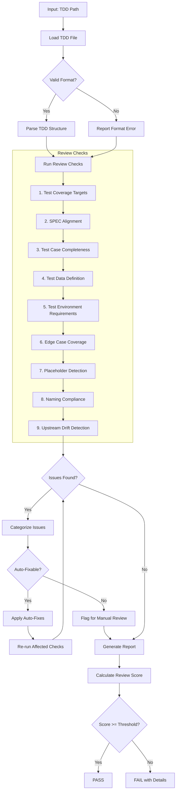
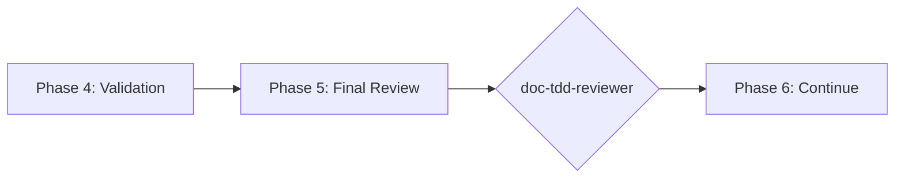

# doc-tdd-reviewer

## Purpose

Comprehensive **content review and quality assurance** for Test-Driven Development (TDD) documents. This skill performs deep content analysis beyond structural validation, checking test coverage across the test pyramid (unit, integration, e2e, and optional security tests), SPEC alignment, test case completeness, and identifying issues that require manual review.

**Layer**: 7 (TDD Quality Assurance)

**Upstream**: TDD (from `doc-tdd-autopilot` or `doc-tdd`)

**Downstream**: None (final QA gate before IPLAN)

---

## When to Use This Skill

Use `doc-tdd-reviewer` when:

- **After TDD Generation**: Run immediately after `doc-tdd-autopilot` completes
- **Manual TDD Edits**: After making manual changes to a TDD document
- **Pre-IPLAN**: Before generating the implementation plan
- **Coverage Review**: When assessing test coverage completeness
- **Periodic Review**: Regular quality checks on existing TDD documents

**Do NOT use when**:
- TDD does not exist yet (use `doc-tdd` or `doc-tdd-autopilot` first)
- Need structural/schema validation only (use `doc-tdd-validator`)
- Generating new TDD content (use `doc-tdd`)

---

## Skill vs Validator: Key Differences

| Aspect | `doc-tdd-validator` | `doc-tdd-reviewer` |
|--------|----------------------|---------------------|
| **Focus** | Schema compliance, IPLAN-Ready score | Content quality, test completeness |
| **Checks** | Required sections, format | Coverage targets, SPEC alignment |
| **Auto-Fix** | Structural issues only | Content issues (formatting) |
| **Output** | IPLAN-Ready score (numeric) | Review score + issue list |
| **Phase** | Phase 4 (Validation) | Phase 5 (Final Review) |
| **Blocking** | IPLAN-Ready < threshold blocks | Review score < threshold flags |

---

## Review Workflow



---

## Review Checks

### 0. Structure Compliance (MVP) - BLOCKING

Validates the TDD follows the mandatory nested folder rule.

**Nested Folder Rule**: ALL TDD documents MUST be in nested folders.

**Required Structure**:

| Document | Required Location |
|----------|-------------------|
| TDD | `docs/07_TDD/TDD-NN_{slug}/TDD-NN_{slug}.yaml` |

**Error Codes**:

| Code | Severity | Description |
|------|----------|-------------|
| REV-STR001 | Error | TDD not in nested folder (BLOCKING) |
| REV-STR002 | Error | Folder name doesn't match TDD ID |
| REV-STR003 | Warning | File name doesn't match folder name |
| REV-STR004 | Error | TDD not in the `docs/07_TDD/` layer directory |

**This check is BLOCKING** - the TDD must pass structure validation before other checks proceed.

---

### 1. Test Coverage Targets

Validates coverage targets are met across the test pyramid.

**Coverage Targets**:
- Unit tests: >= 90%
- Integration tests: >= 85%
- E2E tests: >= 75% of happy paths
- Security tests (if SPEC/ADR mandates): all authentication/authorization paths

**Error Codes**:

| Code | Severity | Description |
|------|----------|-------------|
| REV-TC001 | Error | Unit coverage below 90% |
| REV-TC002 | Error | Integration coverage below 85% |
| REV-TC003 | Warning | E2E missing critical happy paths |
| REV-TC004 | Warning | Mandated security tests missing |

---

### 2. SPEC Alignment

Validates tests trace to SPEC component contracts.

**Scope**:
- Every SPEC interface/method has corresponding tests
- All data model constraints tested
- Error scenarios covered
- Thresholds validated in tests

**Error Codes**:

| Code | Severity | Description |
|------|----------|-------------|
| REV-SA001 | Error | SPEC interface/method without test |
| REV-SA002 | Error | Data model constraint not tested |
| REV-SA003 | Warning | Error scenario not covered |
| REV-SA004 | Warning | Threshold not validated in test |

---

### 3. Test Case Completeness

Validates test cases have all required elements.

**Required Elements**:
- Test case ID (`TDD.NN.04.xxxx`)
- Name
- SPEC reference
- Inputs
- Expected output
- Edge cases / error paths

**Error Codes**:

| Code | Severity | Description |
|------|----------|-------------|
| REV-TCC001 | Error | Test case missing required element |
| REV-TCC002 | Warning | Test steps/workflow incomplete |
| REV-TCC003 | Warning | Expected results vague |
| REV-TCC004 | Info | Cleanup/teardown not defined |

---

### 4. Test Data Definition

Validates test data is properly defined.

**Scope**:
- Concrete input values documented
- Boundary values included
- Invalid/malicious data sets present
- Data setup/teardown defined

**Error Codes**:

| Code | Severity | Description |
|------|----------|-------------|
| REV-TD001 | Error | No test data defined |
| REV-TD002 | Warning | Boundary values not included |
| REV-TD003 | Warning | Invalid data not tested |
| REV-TD004 | Info | Data setup not documented |

---

### 5. Test Environment Requirements

Validates environment specifications present.

**Scope**:
- Environment requirements documented
- Dependencies and mocks listed
- Configuration specified
- Resource requirements defined

**Error Codes**:

| Code | Severity | Description |
|------|----------|-------------|
| REV-TE001 | Warning | Environment requirements missing |
| REV-TE002 | Warning | Dependencies/mocks not listed |
| REV-TE003 | Info | Configuration not specified |
| REV-TE004 | Info | Resource requirements not defined |

---

### 6. Edge Case Coverage

Validates edge cases and error conditions tested.

**Scope**:
- Boundary conditions tested
- Null/empty input handling
- Timeout scenarios
- Concurrent access cases

**Error Codes**:

| Code | Severity | Description |
|------|----------|-------------|
| REV-EC001 | Warning | Boundary condition not tested |
| REV-EC002 | Warning | Null/empty input not tested |
| REV-EC003 | Info | Timeout scenario not covered |
| REV-EC004 | Info | Concurrent access not tested |

---

### 7. Placeholder Detection

Identifies incomplete content requiring replacement.

**Error Codes**:

| Code | Severity | Description |
|------|----------|-------------|
| REV-P001 | Error | [TODO] placeholder found |
| REV-P002 | Error | [TBD] placeholder found |
| REV-P003 | Warning | Template value not replaced |

---

### 8. Naming Compliance

Validates element IDs follow `doc-naming` standards.

**Scope**:
- Test case element IDs use the `TDD.NN.SS.xxxx` 4-segment format (`xxxx` = 4-char hex hash)
- Document-level references use dash notation (`SPEC-NN`, `ADR-NN`, `IPLAN-NN`)
- Test function/file naming convention followed

**Error Codes**:

| Code | Severity | Description |
|------|----------|-------------|
| REV-N001 | Error | Invalid element ID format |
| REV-N002 | Error | Wrong segment count (must be `TDD.NN.SS.xxxx`) |
| REV-N003 | Error | Legacy pattern detected |

---

### 9. Upstream Drift Detection (Mandatory Cache)

Detects when upstream SPEC documents have been modified after the TDD was created or last updated.

**The drift cache is mandatory.** All TDD reviews must maintain and validate against the drift cache to ensure test definitions remain synchronized with SPEC changes.

**Purpose**: Identifies stale TDD content that may not reflect current SPEC documentation. When SPEC documents (interfaces, methods, data models) change, the TDD may need updates to maintain test coverage alignment.

**Scope**:
- `@spec:` tag targets (SPEC documents)
- Traceability section upstream artifact links
- Any links to `../06_SPEC/` source documents

#### Drift Cache File (MANDATORY)

Location: `docs/07_TDD/.drift_cache.json`

**Schema**:

```json
{
  "cache_version": "2.0",
  "created": "2026-05-22T17:00:00Z",
  "last_validated": "2026-05-22T17:00:00Z",
  "documents": {
    "TDD-03": {
      "tdd_path": "docs/07_TDD/TDD-03_f3_observability/TDD-03_f3_observability.yaml",
      "tdd_hash": "sha256:abc123...",
      "last_updated": "2026-05-22T14:30:00Z",
      "upstream_refs": {
        "SPEC-03.yaml": {
          "path": "docs/06_SPEC/SPEC-03_f3_observability.yaml",
          "content_hash": "sha256:def456...",
          "section_hashes": {
            "methods": "sha256:ghi789...",
            "interfaces": "sha256:jkl012...",
            "data_models": "sha256:mno345..."
          },
          "last_validated": "2026-05-22T14:30:00Z"
        }
      }
    }
  }
}
```

#### Three-Phase Detection Algorithm

**Phase 1: Cache Initialization**
```
IF .drift_cache.json does not exist:
    1. Create cache file with schema version 2.0
    2. Scan all TDD documents in docs/07_TDD/
    3. For each TDD:
       a. Extract upstream SPEC references
       b. Compute content hashes for the TDD
       c. Compute content hashes for each upstream SPEC
       d. Store in cache
    4. Report: "Cache initialized with N TDD documents"
```

**Phase 2: Drift Detection**
```
FOR each TDD being reviewed:
    1. Load cached hashes for this TDD
    2. For each upstream SPEC reference:
       a. Compute current hash of SPEC document
       b. Compare to cached hash
       c. IF hashes differ:
          - Flag as DRIFT
          - Compute section-level hashes to identify changed sections
          - Calculate change percentage
    3. Check timestamp: SPEC mtime > TDD last_updated
    4. Aggregate drift findings by severity
```

**Phase 3: Cache Update**
```
AFTER successful review (score >= threshold):
    1. Update content hashes for reviewed TDD
    2. Update upstream SPEC hashes
    3. Set last_validated timestamp
    4. Write updated cache to disk
    5. Report: "Cache updated for TDD-NN"
```

#### Hash Calculation (MANDATORY BASH EXECUTION)

**CRITICAL**: Execute actual bash commands. DO NOT write placeholder values.

**Full File Hash**:

```bash
sha256sum <file_path> | cut -d' ' -f1
```

Store as: `"hash": "sha256:<64_hex_characters>"`

**Section Hash** (for YAML sections):

```bash
yq '.<section_name>' <file_path> | sha256sum | cut -d' ' -f1
```

**REJECTED VALUES** (re-compute immediately):
- `sha256:verified_no_drift`
- `sha256:pending_verification`
- Any value where hex portion != 64 characters

**Verification**:

```bash
grep -oP '"hash":\s*"sha256:[0-9a-f]{64}"' .drift_cache.json
```

**Error Codes**:

| Code | Severity | Description |
|------|----------|-------------|
| REV-D001 | Warning | Upstream SPEC document modified after TDD creation |
| REV-D002 | Warning | Referenced section content has changed (hash mismatch) |
| REV-D003 | Info | Upstream document version incremented |
| REV-D004 | Info | New content added to upstream document |
| REV-D005 | Error | Critical upstream document substantially modified (>20% change) |
| REV-D006 | Error | Drift cache missing or corrupted - must initialize before review |
| REV-D009 | Error | Invalid hash placeholder detected (`verified_no_drift`, `pending_verification`) |

**Report Output**:

```markdown
## Upstream Drift Analysis

**Cache Status**: Valid | Last validated: 2026-05-22T14:30:00Z

| Upstream Document | TDD Reference | Cached Hash | Current Hash | Change % | Severity |
|-------------------|---------------|-------------|--------------|----------|----------|
| SPEC-03.yaml | @spec methods | sha256:abc1... | sha256:xyz9... | 15% | Warning |
| SPEC-03.yaml | @spec interfaces | sha256:def4... | sha256:def4... | 0% | OK |

### Changed Sections Detail

**SPEC-03.yaml#methods** (15% change):
- Lines 45-67: Method signature changed
- Lines 120-135: New parameter added

**Recommendation**: Review upstream SPEC changes and update TDD test cases for modified interfaces.
```

**Auto-Actions**:
- Initialize `.drift_cache.json` if missing (Phase 1)
- Update cache with current hashes after successful review (Phase 3)
- Add `[DRIFT]` marker to affected @spec tags in review report
- Generate drift summary with section-level detail

**Configuration**:

| Setting | Default | Description |
|---------|---------|-------------|
| `cache_enabled` | true | **Mandatory** - cache is always enabled |
| `drift_threshold_days` | 7 | Days before drift becomes Warning |
| `critical_threshold_days` | 30 | Days before drift becomes Error |
| `change_threshold_percent` | 20 | Change percentage triggering Error severity |
| `tracked_patterns` | `@spec:` | Patterns to track for drift |

---

## Review Score Calculation

**Scoring Formula**:

| Category | Weight | Calculation |
|----------|--------|-------------|
| Test Coverage Targets | 19% | (coverage_met / 4) × 19 |
| SPEC Alignment | 19% | (aligned_tests / total) × 19 |
| Test Case Completeness | 19% | (complete / total_cases) × 19 |
| Test Data Definition | 9% | (data_score) × 9 |
| Test Environment Requirements | 5% | (requirements_met / total) × 5 |
| Edge Case Coverage | 9% | (covered / identified) × 9 |
| Placeholder Detection | 5% | (no_placeholders ? 5 : 5 - count) |
| Naming Compliance | 10% | (valid_ids / total_ids) × 10 |
| Upstream Drift | 5% | (fresh_refs / total_refs) × 5 |

**Total**: Sum of all categories (max 100)

**Thresholds**:
- **PASS**: >= 90
- **WARNING**: 80-89
- **FAIL**: < 80

---

## Command Usage

```bash
# Review specific TDD
/doc-tdd-reviewer TDD-03

# Review TDD by path
/doc-tdd-reviewer docs/07_TDD/TDD-03_f3_observability/TDD-03_f3_observability.yaml

# Review all TDDs
/doc-tdd-reviewer all
```

---

## Output Report

Review reports are stored alongside the reviewed document per project standards.

**Nested Folder Rule**: ALL TDD documents use nested folders (`TDD-NN_{slug}/`) regardless of size. This ensures review reports, fix reports, and drift cache files are organized with their parent document.

**File Naming**: `TDD-NN.R_review_report_vNNN.md`

**Audit Wrapper Compatibility**: `doc-tdd-audit` can emit `TDD-NN.A_audit_report_vNNN.md` as preferred fixer input while reviewer-native `.R_review_report_vNNN.md` remains supported.

**Location**: Inside the TDD nested folder: `docs/07_TDD/TDD-NN_{slug}/`

### Versioning Rules

1. **First Review**: Creates `TDD-NN.R_review_report_v001.md`
2. **Subsequent Reviews**: Auto-increments version (v002, v003, etc.)
3. **Same-Day Reviews**: Each review gets unique version number

**Version Detection**: Scans folder for existing `TDD-NN.R_review_report_v*.md` files and increments.

**Example**:

```
docs/07_TDD/TDD-03_f3_observability/
├── TDD-03_f3_observability.yaml
├── TDD-03.R_review_report_v001.md    # First review
├── TDD-03.R_review_report_v002.md    # After fixes
└── .drift_cache.json
```

### Delta Reporting

When previous reviews exist, include score comparison in the report.

See `REVIEW_DOCUMENT_STANDARDS.md` for complete versioning requirements.

---

## Integration with doc-tdd-autopilot

This skill is invoked during Phase 5 of `doc-tdd-autopilot`:



---

## Related Skills

| Skill | Relationship |
|-------|--------------|
| `doc-naming` | Naming standards for Check #8 |
| `doc-tdd-autopilot` | Invokes this skill in Phase 5 |
| `doc-tdd-audit` | Wraps validator+reviewer into combined audit output |
| `doc-tdd-validator` | Structural validation (Phase 4) |
| `doc-tdd-fixer` | Applies fixes based on review findings |
| `doc-tdd` | TDD creation rules |
| `doc-spec-reviewer` | Upstream QA |

---

## Standards & References

- **TDD layer guide**: `framework/layers/07_TDD/README.md`
- **TDD template**: `framework/layers/07_TDD/TDD-TEMPLATE.yaml`
- **ID naming standards**: `framework/governance/ID_NAMING_STANDARDS.md`

---

## Version History

| Version | Date | Changes |
|---------|------|---------|
| 1.6 | 2026-05-22 | Migrated to the 8-layer framework model: TDD (Layer 7), single template (no test subtypes); test categories (unit/integration/e2e/security) reviewed as TDD test-case content; element IDs use 4-segment `TDD.NN.SS.xxxx`; upstream is SPEC (Layer 6); downstream is IPLAN (Layer 8); replaced script/`.claude` references with `framework/governance/` + `framework/layers/07_TDD/` pointers |
| 1.5 | 2026-02-26 | Expanded coverage review across all test categories; updated element type handling |
| 1.4 | 2026-02-11 | **BLOCKING Structure Compliance check**: Added Check #0 as BLOCKING gate; validates nested folder rule; REV-STR001-STR004 error codes; document must pass structure validation before other checks proceed |
| 1.3 | 2026-02-10 | **Mandatory drift cache**: Cache is now required for all reviews; three-phase detection algorithm; SHA-256 hash calculation; REV-D006 error code for missing cache; cache schema v2.0 with section-level hashes; report output with cache status and change percentages |
| 1.2 | 2026-02-10 | Added Check #9: Upstream Drift Detection - detects when SPEC documents modified after TDD creation; REV-D001-D005 error codes; drift cache support; configurable thresholds; added fixer to related skills |
| 1.1 | 2026-02-10 | Added review versioning support (_vNNN pattern); delta reporting for score comparison |
| 1.0 | 2026-02-10 | Initial skill creation with 8 review checks; coverage target validation; SPEC alignment; test case completeness; edge case coverage |

## Implementation Plan Consistency (IPLAN-004)

- Treat plan-derived outputs as valid source mode and verify intent preservation from implementation plan scope/objectives.
- Validate upstream autopilot precedence assumption: `--iplan > --ref > --prompt`.
- Flag objective/scope conflicts between plan context and artifact output as blocking issues requiring clarification.
- Do not introduce legacy fallback paths such as `docs-v2.0/00_REF`.
