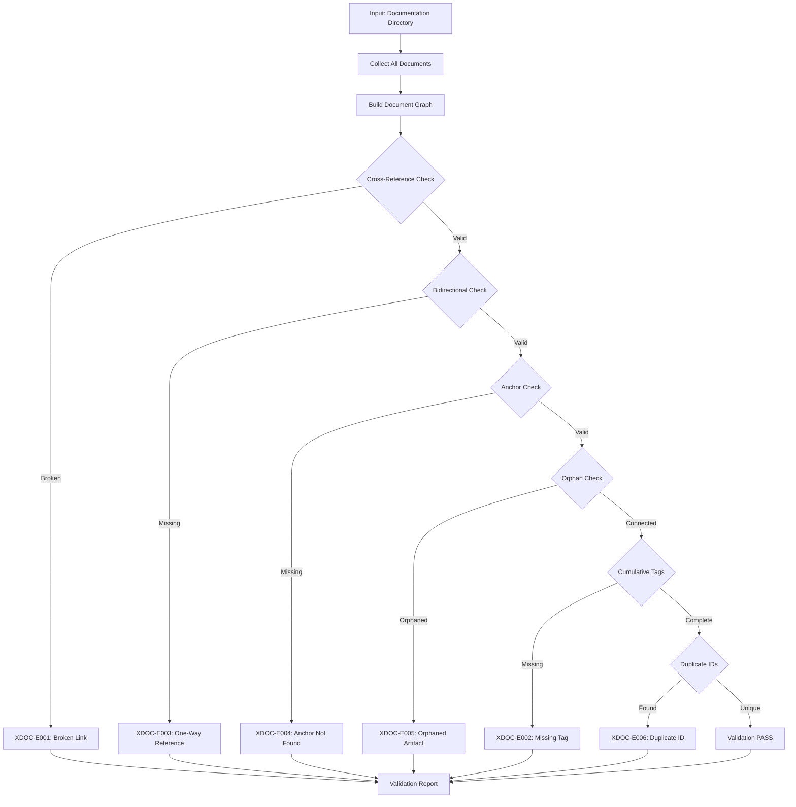

# doc-validator

Cross-document validation for SDD framework compliance. For single-document validation, use the dedicated layer validators.

## Purpose

Validates relationships and consistency ACROSS documents in the SDD framework.

**Core Functions**:
- Identifies broken cross-references between documents
- Detects orphaned artifacts (documents with no upstream references)
- Validates bidirectional link consistency
- Checks cumulative tagging hierarchy across layers
- Detects duplicate IDs across documents
- Validates traceability matrix completeness
- Monitors project-wide consistency

**This Skill Does NOT**:
- Validate single document structure (use `{TYPE}_VALIDATION_RULES.md` in each artifact directory)
- Validate single document metadata (use `{TYPE}_VALIDATION_RULES.md` in each artifact directory)
- Validate single document content (use `{TYPE}_VALIDATION_RULES.md` in each artifact directory)

**Dedicated Layer Validators** (single-document structure/metadata/content — use the sibling `../doc-{type}-validator/` skills, with the layer `README.md` as authority):
| Layer | Artifact | Single-Document Validator | Layer Authority |
|-------|----------|---------------------------|-----------------|
| 1 | BRD | `../doc-brd-audit/` (BRD has no standalone validator) | `framework/layers/01_BRD/README.md` |
| 2 | PRD | `../doc-prd-validator/` | `framework/layers/02_PRD/README.md` |
| 3 | EARS | `../doc-ears-validator/` | `framework/layers/03_EARS/README.md` |
| 4 | BDD | `../doc-bdd-validator/` | `framework/layers/04_BDD/README.md` |
| 5 | ADR | `../doc-adr-validator/` | `framework/layers/05_ADR/README.md` |
| 6 | SPEC | `../doc-spec-validator/` | `framework/layers/06_SPEC/README.md` |
| 7 | TDD | `../doc-tdd-validator/` | `framework/layers/07_TDD/README.md` |
| 8 | IPLAN | `../doc-iplan-validator/` | `framework/layers/08_IPLAN/README.md` |

**ID Format Validation**: For unified ID format validation (4-segment element IDs `TYPE.NN.SS.xxxx` and dash document refs `SPEC-NN`/`ADR-NN`/`IPLAN-NN`), use the `../doc-naming/` skill.

**Reference**: [ID_NAMING_STANDARDS.md](../../../framework/governance/ID_NAMING_STANDARDS.md)

**Complexity**: Medium (cross-reference analysis across multiple documents)

**Resource Requirements**:
- CPU: Moderate (file parsing, graph traversal)
- Memory: 200-500MB for 100-200 documents
- Disk: Minimal (read-only validation)
- Network: None (local file operations only)

**Failure Modes**:
- Broken cross-reference: Reports links to non-existent documents
- Missing bidirectional link: Reports one-way references
- Orphaned artifact: Reports documents with no upstream connections
- Duplicate ID: Reports ID conflicts across documents
- Traceability gap: Reports missing required upstream tags

---

## When to Use This Skill

**Use doc-validator when**:
- Validating relationships BETWEEN documents
- Checking project-wide traceability
- Detecting orphaned artifacts
- Validating bidirectional link consistency
- Checking cumulative tagging across layers
- Detecting duplicate IDs across documents
- Before major releases (project-wide validation)

**Do NOT use doc-validator when**:
- Validating a single document's structure (use `{TYPE}_VALIDATION_RULES.md`)
- Validating a single document's metadata (use `{TYPE}_VALIDATION_RULES.md`)
- Validating a single document's content (use `{TYPE}_VALIDATION_RULES.md`)
- Validating ID format compliance (use `doc-naming` skill)
- For detailed traceability analysis (use `trace-check` skill)

---

## Skill Inputs

| Input | Type | Description | Example/Default |
|-------|------|-------------|-----------------|
| docs_path | Required | Path to documentation directory | `{project_root}/docs/` |
| scope | Optional | Validation scope | `"cross-document"` (default), `"traceability"`, `"full"` |
| strictness | Optional | Validation strictness level | `"strict"` (default), `"permissive"` |
| report_format | Optional | Output report format | `"markdown"` (default), `"json"`, `"text"` |

**Scopes**:
- `cross-document`: Links, references, bidirectional consistency
- `traceability`: Cumulative tags, upstream/downstream validation
- `full`: All cross-document validations

---

## Cross-Document Validators

This skill *is* the validator: the framework is spec-only (no runtime code).
Apply the declarative checks below, using `framework/governance/` (for ID,
tag, and traceability rules) and the layer `README.md` files as authority.

| Category | Check | Description | Error Codes |
|----------|-------|-------------|-------------|
| LINKS | Link resolution | Every markdown/document link resolves to an existing file/anchor | XDOC-E001, XDOC-E004 |
| CROSS-REF | Cross-reference | Each cited document/element ID exists in the corpus | XDOC-E001, XDOC-E003 |
| SECTION | Section count | Section file count matches metadata | SEC-E001, SEC-E002, SEC-E003, SEC-W001 |
| DIAGRAM | Diagram consistency | Mermaid diagrams match prose entities | DIAG-E001, DIAG-E002, DIAG-W001, DIAG-W002 |
| TERM | Terminology | Terminology/acronym consistency | TERM-E001, TERM-E002, TERM-W001, TERM-W002 |
| COUNT | Counts | Stated counts match itemized totals | COUNT-E001, COUNT-W001 |
| FWDREF | Forward reference | No upstream→downstream ID references | FWDREF-E001, FWDREF-E002, FWDREF-W001 |
| TAGS | Cumulative tags | Cumulative tag compliance per the 8-layer hierarchy | XDOC-E002 |
| IDS | ID format & uniqueness | Element IDs are 4-segment `TYPE.NN.SS.xxxx`; document refs are dash form (`SPEC-NN`/`ADR-NN`/`IPLAN-NN`); no duplicates | XDOC-E006, XDOC-E007 |
| MATRIX | Traceability matrix | Matrix completeness across the 8 layers | XDOC-W001 |

**Auto-Fixable categories**: SECTION, TERM, COUNT findings are typically
auto-fixable (regenerate counts/sections, normalize terms).

**Reference**: See `framework/governance/DOC_GOVERNANCE_CORE.md` and
`framework/governance/TRACEABILITY.md` for the governing rules.

### ID-Format Enforcement (IDS)

The IDS check MUST enforce the 8-layer ID standard from
`framework/governance/ID_NAMING_STANDARDS.md`:

- **Element IDs** — require the 4-segment form `TYPE.NN.SS.xxxx`
  (`TYPE` ∈ {BRD, PRD, EARS, BDD, ADR, TDD}; `NN`/`SS` two-digit;
  `xxxx` 4-char hex). Example: `BRD.01.07.a7f3`.
- **Document-level refs** — require the dash form `SPEC-NN`, `ADR-NN`,
  `IPLAN-NN`. Example: `SPEC-01`.
- **REJECT** legacy forms: 3-segment element IDs (`TYPE.NN.xxxx`), the
  numeric type-code scheme (e.g. `40`–`45`, `26`, `27`), and any reference
  to the retired `SYS`/`REQ`/`CTR`/`TSPEC`/`TASKS` artifacts — these have no
  place in the 8-layer model. Flag each with XDOC-E007.

---

## Validation Workflow



---

## Error Codes Reference

### Cross-Document Errors (XDOC)

| Code | Message | Severity | Fix |
|------|---------|----------|-----|
| XDOC-E001 | Referenced ID/file not found | ERROR | Verify target document exists |
| XDOC-E002 | Missing cumulative tag | ERROR | Add required upstream tag |
| XDOC-E003 | Bidirectional link missing | ERROR | Add reverse reference |
| XDOC-E004 | Anchor not found in target | ERROR | Fix anchor reference |
| XDOC-E005 | Orphaned artifact | ERROR | Add upstream reference |
| XDOC-E006 | Duplicate ID detected | ERROR | Use unique IDs across project |
| XDOC-E007 | Invalid/legacy ID format | ERROR | Use 4-segment `TYPE.NN.SS.xxxx` or dash `SPEC-NN`/`ADR-NN`/`IPLAN-NN`; remove legacy/retired-artifact IDs |
| XDOC-W001 | Weak traceability | WARNING | Add direct links |
| XDOC-W002 | Unused artifact | WARNING | Consider removal or linking |

### Section Consistency Errors (SEC)

| Code | Message | Severity | Fix |
|------|---------|----------|-----|
| SEC-E001 | Section count mismatch | ERROR | Update metadata or add sections |
| SEC-E002 | Missing referenced section | ERROR | Create referenced section file |
| SEC-E003 | Section ordering invalid | ERROR | Fix section numbering |
| SEC-W001 | Empty section detected | WARNING | Add content or remove section |

### Diagram Consistency Errors (DIAG)

| Code | Message | Severity | Fix |
|------|---------|----------|-----|
| DIAG-E001 | Diagram references missing entity | ERROR | Add entity to prose |
| DIAG-E002 | Diagram syntax error | ERROR | Fix Mermaid syntax |
| DIAG-W001 | Diagram outdated vs prose | WARNING | Update diagram |
| DIAG-W002 | Prose entity missing from diagram | WARNING | Add to diagram |

### Terminology Errors (TERM)

| Code | Message | Severity | Fix |
|------|---------|----------|-----|
| TERM-E001 | Undefined term used | ERROR | Add to glossary |
| TERM-E002 | Conflicting term definitions | ERROR | Standardize definition |
| TERM-W001 | Inconsistent term usage | WARNING | Use canonical form |
| TERM-W002 | Acronym without expansion | WARNING | Add first-use expansion |

### Count Consistency Errors (COUNT)

| Code | Message | Severity | Fix |
|------|---------|----------|-----|
| COUNT-E001 | Stated count differs from actual | ERROR | Update count or items |
| COUNT-W001 | Count format non-standard | WARNING | Use standard count format |

### Forward Reference Errors (FWDREF)

| Code | Message | Severity | Fix |
|------|---------|----------|-----|
| FWDREF-E001 | Upstream references downstream ID | ERROR | Remove forward reference |
| FWDREF-E002 | Circular reference detected | ERROR | Break reference cycle |
| FWDREF-W001 | Implicit forward reference | WARNING | Make explicit or remove |

---

## Cumulative Tag Validation

Each layer must include ALL upstream tags per the 8-layer SDD hierarchy:

| Layer | Artifact | Required Upstream Tags |
|-------|----------|------------------------|
| 1 | BRD | None (top level) |
| 2 | PRD | @brd |
| 3 | EARS | @brd, @prd |
| 4 | BDD | @brd, @prd, @ears |
| 5 | ADR | @brd, @prd, @ears, @bdd |
| 6 | SPEC | @brd, @prd, @ears, @bdd, @adr (5 tags) |
| 7 | TDD | @brd, @prd, @ears, @bdd, @adr, @spec (6 tags) |
| 8 | IPLAN | @brd, @prd, @ears, @bdd, @adr, @spec, @tdd (7 tags) |

**Authority**: `framework/registry/LAYER_REGISTRY.yaml` (`required_tags`) and
`framework/governance/TRACEABILITY.md`.

---

## Quality Gates

### Severity Levels

| Level | Code | Exit Code | Blocks Commit | Description |
|-------|------|-----------|---------------|-------------|
| ERROR | E | 2 | Yes | Critical issue, must fix |
| WARNING | W | 1 | --strict only | Should fix |
| INFO | I | 0 | No | Suggestion |

### Project-Wide Gates

| Gate | Threshold | Measurement |
|------|-----------|-------------|
| Zero Cross-Ref Errors | 0 | Count of XDOC-E level issues |
| Orphan Limit | 0 | Count of orphaned artifacts |
| Bidirectional Compliance | 100% | Links with reverse references |
| Cumulative Tag Compliance | 100% | Documents with complete upstream tags |
| Duplicate ID Count | 0 | Duplicate IDs across project |

---

## Integration Points

### With Layer Validators

- Single-document validation delegated to `doc-{type}-validator` skills
- Cross-document validation runs after layer validators pass
- Combined quality reports

### With doc-flow

- Invoked after artifact generation for cross-document checks
- Blocks workflow on cross-reference errors
- Provides link fix suggestions

### With trace-check

- Complementary validation (cross-refs vs. detailed traceability)
- Shared cumulative tag validation logic
- Combined traceability reports

### With code-review

- Post-commit cross-document validation
- Quality gate enforcement

---

## Usage Examples

This skill runs as declarative checks (no runtime scripts). Invoke it by
naming the scope; it reads the corpus and applies the checks above.

### Validate Cross-References

> Run doc-validator over `docs/` with scope `cross-document`, strictness
> `strict`. Reports broken/one-way references (XDOC-E001/E003/E004).

### Validate All Links

> Run doc-validator over `docs/` with the LINKS check. Confirms every link
> and anchor resolves.

### Validate Cumulative Tags

> Run doc-validator over `docs/` with scope `traceability`. Confirms each
> document carries its full upstream tag set per the 8-layer hierarchy.

### Detect Duplicate / Malformed IDs

> Run doc-validator over `docs/` with the IDS check. Flags duplicate IDs
> (XDOC-E006) and any legacy/3-segment/retired-artifact IDs (XDOC-E007).

### Full Cross-Document Validation

> Run doc-validator over `docs/` with scope `full`. Applies every check
> above and emits a consolidated report.

---

## Validation Report Format

```
=== Cross-Document Validation Report ===

Scope: docs/
Status: FAILED

Cross-Reference Errors (3):
- [XDOC-E001] EARS-02_payments.yaml references non-existent SPEC-05_gateway.yaml
  → Create target document or fix reference

- [XDOC-E003] ADR-03_caching.yaml linked from SPEC-01 but no reverse link
  → Add @adr reference from SPEC-01

- [XDOC-E005] IPLAN-04_batch.yaml has no upstream references
  → Add @tdd tag to connect to its TDD

Cumulative Tag Warnings (2):
- [XDOC-E002] IPLAN-02 missing required @adr tag
  → Add @adr: ADR-NN to traceability section

- [XDOC-E002] IPLAN-01 missing required @spec tag
  → Add @spec: SPEC-NN to traceability section

Summary:
- Documents analyzed: 45
- Cross-reference errors: 3
- Orphaned artifacts: 1
- Bidirectional compliance: 94% (32/34)
- Cumulative tag compliance: 96% (43/45)
```

---

## Check Reference

The framework is spec-only, so there are no runtime scripts. This skill
applies the following declarative checks (see the Cross-Document Validators
table above for error codes):

| Check | Purpose |
|-------|---------|
| Cross-reference | Each cited document/element ID resolves |
| Link resolution | Markdown/document links and anchors resolve |
| Cumulative tags | Full upstream tag set per the 8-layer hierarchy |
| Traceability matrix | Matrix completeness across the 8 layers |
| ID format & uniqueness | 4-segment / dash refs; no duplicates; no legacy/retired IDs |
| Section consistency | Section file count matches metadata |
| Diagram vs prose | Mermaid entities match prose |
| Term consistency | Canonical terminology/acronyms |
| Count consistency | Stated counts match itemized totals |
| Forward references | No upstream→downstream references |

**Authority**: `framework/governance/` (ID, tag, traceability rules) and the
layer `README.md` files under `framework/layers/<NN>_<X>/`.

---

## Version History

| Version | Date | Changes | Author |
|---------|------|---------|--------|
| 4.0.0 | 2026-05-22 | Migrated to the 8-layer framework model: dropped SYS/REQ/CTR/TSPEC/TASKS; SPEC=L6, TDD=L7, IPLAN=L8; layer-validator and tag tables rebuilt to 8 layers; ID-format check now requires 4-segment `TYPE.NN.SS.xxxx` + dash document refs and rejects legacy 3-segment/numeric-type-code/retired-artifact forms (XDOC-E007); removed dead validation-script commands — this skill *is* the validator (framework is spec-only); paths point at `framework/layers/<NN>_<X>/` and `framework/governance/`; cross-references use plugin-relative `../doc-X/` | System |
| 3.2.0 | 2026-02-08 | Added YAML frontmatter version/last_updated fields; standardized Version History format | System |
| 3.1.0 | 2025-12-29 | Updated layer validator references to `{TYPE}_VALIDATION_RULES.md` files; added doc-naming skill reference | System |
| 3.0.0 | 2025-12-20 | Refactored to cross-document validation only; removed single-document validation | System |
| 2.0.0 | 2025-12-19 | Complete overhaul; restructured following trace-check pattern; standardized error codes | System |
| 1.0.0 | 2025-11-01 | Initial release | System |
