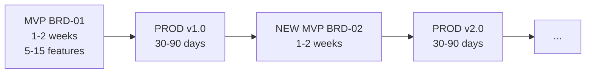

# UCX Framework

**AI-First Specification-Driven Development (SDD) with Scalable Depth**

> **AI-First Design**: This framework is designed for AI agents (Claude Code, Gemini CLI, GitHub Copilot) as the primary operators. Humans work *through* AI assistants. AI agents autonomously execute workflows, generate artifacts, and manage the development lifecycle.

---

## Core Lifecycle: MVP → PROD → NEW MVP



| Phase | Duration | Output |
|:------|:---------|:-------|
| **MVP** | 1-2 weeks | BRD → PRD → EARS → BDD → ADR → SPEC → TDD → IPLAN → Code |
| **PROD** | 30-90 days | Operate, measure metrics, collect user feedback |
| **NEW MVP** | 1-2 weeks | Create NEW BRD for next feature set, repeat cycle |

Each BRD represents one iteration cycle. New features get new BRDs (BRD-01, BRD-02, BRD-03). Cross-cycle traceability via `@depends: BRD-01`. The framework is the **8-layer** flow above (the pre-migration 14-layer model is superseded).

## Recommended Agent Operating Model

Default agent split for v3.2 delivery:

- Hermes agent controls the document lifecycle from BRD through IPLAN.
- Claude Code, Codex, or another code-generation agent implements source code from approved IPLAN artifacts.
- UCX validation/review gates remain active before and after code implementation.

Planning-first core principle (framework-wide):

- No implementation starts without approved plans.
- Required sequence: analyze inputs -> roadmap -> planning index -> changelog plan -> gap review/fix -> implementation plan (IPLAN) -> approval -> implementation.
- Approval authority: human reviewer or independent LLM-as-judge session.

Plan taxonomy (framework-wide):

| Plan Type | Purpose | Location | Retention |
|---|---|---|---|
| Document-layer IPLAN | Layer-8 implementation bridge for SDD artifacts (BRD -> ... -> SPEC/TDD -> IPLAN -> Code) | Project SDD docs (`docs/IPLAN/`, `UCX/08_IPLAN/`, or equivalent lifecycle output) | Permanent |
| Permanent development plan | Operational project development planning, cross-session execution, and project history tracking | `plans/` | Permanent |
| Temporary plan | Bug fixes, document corrections, and minor one-off work with no long-term tracking value | `tmp/` | Disposable |

Escalation rule: if temporary-plan scope expands (new capability, cross-cutting dependency, or multi-session coordination), promote it to a permanent plan in `plans/`.

Governance state flow for autonomous execution:

- `ai:ready -> ai:in-progress -> ai:review-requested`
- Only `ai:ready` issues are eligible for autonomous execution.

## Development and Issue-Fix Operating Model

Default closed-loop workflow:

1. Hermes (human-in-loop) drives planning and approval from BRD through IPLAN.
2. Execution agents (Claude Code, Codex, OpenCode, or equivalent) implement approved IPLAN scope, open PRs, and run required checks.
3. Deployment executes through CI/CD after merge gates pass.
4. Observability stack (metrics, logs, alerts) feeds incidents to Hermes triage.
5. Hermes creates and prioritizes GitHub issues with traceability links and acceptance criteria.
6. Hermes completes planning-first artifacts and approval before execution starts.
7. Issues in `ai:ready` are assigned to execution agents for autonomous implement -> PR -> validate -> deploy.
8. Hermes verifies post-deployment evidence and closes issues when acceptance criteria and monitoring checks pass.

## Hermes Skills (UCX V3)

Hermes runtime skills are located in `ucx_hermes/skills/hermes/`.

- `ucx-sdd-bridge`: UCX V3 lifecycle orchestration with MCP-only document-layer flow.
- `ucx-github-governance`: issue/PR governance, labels, and round-based merge gates.
- `ucx-github-deploy-governance`: CI/CD, QA, staging/prod readiness, and post-deploy loop.
- `ucx-kb-context`: retrieval enrichment from KB before create/review/remediate.
- `ucx-kb-maintenance`: governed KB update workflow after approved IPLAN evidence.

See `ucx_hermes/skills/hermes/README.md` and `ucx_hermes/docs/HERMES_INTEGRATION.md`.

## KB Policy Baseline

UCX V3 policy requires KB representation for document artifacts and governed ingestion behavior.

- Mandatory KB coverage rules: `ucx_hermes/skills/hermes/ucx-kb-maintenance/KB_GENERAL_RULES.md`
- Canonical entry structure: `ucx_hermes/skills/hermes/ucx-kb-maintenance/KB_ENTRY_TEMPLATE.md`
- KB augments decisions; UCX MCP lifecycle gates remain source of truth.

Review/remediation runtime controls in UCX Hermes:

- `sdd_review` supports `review_mode=prompt_only` and `review_mode=saga_parallel`.
- In saga mode, `saga_branch_llm_enabled` enables branch-level fan-out/fan-in LLM execution.
- Rollout defaults can be driven by `UCX_REVIEW_SAGA_BRANCH_LLM_PHASE` (`A/B` off, `C` on when explicit flag is absent).
- Optional explicit environment override: `UCX_REVIEW_SAGA_BRANCH_LLM_ENABLED`.
- Debug-only branch raw output retention is controlled by `UCX_REVIEW_DEBUG_RAW_OUTPUTS=true` and persisted text is redacted before write.
- Default review executor in saga branch mode is `api/openrouter`; default remediation executor is `api/claude-sonnet` when executor is omitted.
- Default generation controls are `temperature=0.2`, `top_p=0.9`, `top_k` unset, `max_output_tokens=4000`.

---

## SDD Depth Variants

| Depth | Layers | Best For | Timeline |
|:------|:-------|:---------|:---------|
| **SDD-Lite** | REF → BRD → PRD → IPLAN | MVPs, prototypes, solo + AI | 1-3 months |
| **SDD-Standard** | + EARS, BDD, ADR | Production apps, small teams | 3-6 months |
| **SDD-Full** | All 8 layers + CHG governance overlay | Enterprise, regulated, multi-team | 6+ months |

See [framework/README.md](./framework/README.md) for detailed layer mappings.

---

## Architecture

### SDD v3 (Recommended — 8 Layers)

Streamlined 8-layer framework with C4 architecture model mapping. All layers use **unified YAML templates** with embedded authoring guidance (`_guidance` fields).

| Layer | Artifact | Name | C4 Level | Template |
|-------|----------|------|----------|----------|
| 1 | BRD | Business Requirements Document | C4-L1 Context | `BRD-TEMPLATE.yaml` |
| 2 | PRD | Product Requirements Document | C4-L2 Container | `PRD-TEMPLATE.yaml` |
| 3 | EARS | Easy Approach to Requirements Syntax | Decision Bridge | `EARS-TEMPLATE.yaml` |
| 4 | BDD | Behavior-Driven Development | Decision Bridge | `BDD-TEMPLATE.yaml` |
| 5 | ADR | Architecture Decision Record | Decision Bridge | `ADR-TEMPLATE.yaml` |
| 6 | SPEC | Technical Specification | C4-L3 Component | `SPEC-TEMPLATE.yaml` |
| 7 | TDD | Test-Driven Development Guide | Implementation Bridge | `TDD-TEMPLATE.yaml` |
| 8 | IPLAN | Implementation Plan | Implementation Bridge | `IPLAN-TEMPLATE.yaml` |

CHG (Change Management) is a governance overlay with 5 gates (GATE-01 through GATE-CODE). See `framework/governance/chg/`.

> The pre-migration 14-layer model (with `SYS`/`REQ`/`CTR`/`TSPEC`/`TASKS`) is
> **superseded** by the 8-layer flow above and is no longer used.

---

## Repository Structure

| Directory | Purpose |
|:----------|:--------|
| `framework/` | **SDD** (current): 8-layer framework with C4 mapping, CHG governance overlay |
| `ucx_hermes/` | **UCX Hermes** — Primary AI agent orchestration platform: 25 MCP tools for SDD lifecycle. Creates per-project context for Hermes and other AI agents. This is the canonical active runtime. |
| `mcp_ucx/` | **DEPRECATED** — Historical UCX package directory. Frozen at v1.22.0. Use `ucx_hermes/` for all new work. See [mcp_ucx/docs/README.md](mcp_ucx/docs/README.md) for archive status. |
| `governance/` | Project governance templates, setup guides, CI/CD scripts |
| `ucx_kb/` | Knowledge base package (RAG + Graph) |
| `plans/` | Permanent project development plans and planning history |
| `tmp/` | Temporary plans and disposable working artifacts |
| `changelog/` | Per-version changelogs |
| `roadmap/` | Roadmap and release planning |

Note: historical records in `changelog/`, `plans/`, `tmp/`, and archived docs may contain legacy naming (for example `mcp-sdd` or `MCP SDD`) to preserve release and audit accuracy.

### framework/ (Current)

```
framework/
├── 01_BRD/               BRD-TEMPLATE.yaml (978 lines), BRD-00_index.md, README
├── 02_PRD/               PRD-TEMPLATE.yaml (607 lines), PRD-00_index.md, README
├── 03_EARS/              EARS-TEMPLATE.yaml (376 lines), EARS-00_index.md, README
├── 04_BDD/               BDD-TEMPLATE.yaml (367 lines), BDD-00_index.md, README
├── 05_ADR/               ADR-TEMPLATE.yaml (446 lines), ADR-00_index.md, README
├── 06_SPEC/              SPEC-TEMPLATE.yaml (189 lines), SPEC-00_index.md, README
├── 07_TDD/               TDD-TEMPLATE.yaml (266 lines), TDD-00_index.md, README
├── 08_IPLAN/             IPLAN-TEMPLATE.yaml, IPLAN-00_index.yaml, README
├── CHG/                  Change management governance overlay (5-gate system)
├── LAYER_REGISTRY.yaml   Authoritative layer definitions (232 lines)
├── README.md             v3 framework overview with C4 mapping
├── SPEC_DRIVEN_DEVELOPMENT_GUIDE.md
├── ID_NAMING_STANDARDS.md
├── TRACEABILITY.md
├── DIAGRAM_STANDARDS.md
├── THRESHOLD_NAMING_RULES.md
├── TESTING_STRATEGY_TDD.md
├── QUICK_REFERENCE.md
└── plans/                Migration plans (v2→v3, CHG transition)
```

### framework/ (Legacy v2)

```
framework/
├── {NN}_{TYPE}/          11 layer directories, each with {TYPE}-TEMPLATE.yaml
├── CHG/                  Change management (4-gate system)
├── PROJECT/              SDD Project Model (sprint integration)
├── README.md             Framework overview
├── ID_NAMING_STANDARDS.md
├── TRACEABILITY.md
├── DIAGRAM_STANDARDS.md
├── MVP_WORKFLOW_GUIDE.md
└── SPEC_DRIVEN_DEVELOPMENT_GUIDE.md
```

### mcp_ucx/ Highlights

25 MCP tools (13 deterministic, 1 maintenance, 2 session management, 2 executor management, 2 orchestration, 5 LLM-dependent):

| Tool | Purpose |
|------|---------|
| `sdd_validate` | Validate SDD artifacts against templates (MD + YAML, cross-section rules) |
| `sdd_validate_links` | Validate markdown links (file + anchor resolution) |
| `sdd_create` | Scaffold new SDD documents |
| `sdd_consistency` | Artifact lineage checks (MD + YAML) |
| `sdd_preflight` | Environment readiness checks |
| `sdd_review` | Multi-persona LLM document review (configurable persona lists via `persona_mappings.yaml`) |
| `sdd_remediate` | Deterministic remediation findings + source-protected fix via `--fix` |
| `sdd_clean` | Prune obsolete stage artifacts (reports, derived copies), keep latest N |
| `sdd_run_lifecycle` | Full create→validate→review→fix pipeline (with optional `clean_before`) |
| `sdd_score_show` | Quality score with categorized weights (structural/cross-section) |
| `sdd_next_action` | Recommend next lifecycle stage (MD + YAML aware) |

All 11 unified YAML templates available in `mcp_ucx/templates/`.

Saga review execution behavior:

- Branch reducer performs deterministic fan-in with overlap deduplication by normalized content hash.
- Tie-break order for overlapping findings is `priority (P0>P1>P2>P3)`, then lexical category, then deterministic `branch_id` order.
- Saga branch telemetry may include executor, model, latency, token usage, and parse status.

Project UCX assets (personas, prompts, templates) scaffolded to `{project}/UCX/` via `sdd_init`.

---

## Quick Start

### For New Projects

1. Choose your SDD depth (Lite / Standard / Full)
2. Copy templates from `ucx_hermes/templates/` or layer directories
3. Create documents using ucx_hermes `sdd_create`
4. Validate with ucx_hermes `sdd_validate`

### Document Size Policy

All SDD documents are **monolithic** (single self-contained file) up to **50,000 tokens**. If a document exceeds 50,000 tokens, create a new document of the same type with its own scope.

### Validation

```bash
# Via ucx_hermes CLI
python -m mcp_server.cli.main validate --project <path> --doc-type brd --layer 01_BRD --document <file>

# Link validation
python -m mcp_server.cli.main validate-links --target <path>
```

Template-link validation policy:

- `governance/templates/` contains scaffold files intended for downstream projects.
- Do not treat direct `validate-links --target governance/templates/...` failures as blockers in this framework repo.
- Validate template link integrity after scaffold in the target project, or validate only non-template docs in the framework repo.

---

## Cumulative Tagging

Each layer requires traceability tags from ALL upstream layers:

**v3 (8 layers):**

```
BRD (0 tags) → PRD (@brd) → EARS (+@prd) → BDD (+@ears) → ADR (+@bdd) → SPEC (+@adr) → TDD (+@spec) → IPLAN (+@tdd)
```

See [framework/TRACEABILITY.md](./framework/TRACEABILITY.md).

---

## Key References

### Framework

| Document | Purpose |
|----------|---------|
| [framework/README.md](./framework/README.md) | SDD v3 framework overview (current, recommended) |
| [framework/registry/LAYER_REGISTRY.yaml](./framework/registry/LAYER_REGISTRY.yaml) | Authoritative layer definitions with C4 mapping |
| [framework/SPEC_DRIVEN_DEVELOPMENT_GUIDE.md](./framework/SPEC_DRIVEN_DEVELOPMENT_GUIDE.md) | Complete SDD v3 methodology |
| [framework/ID_NAMING_STANDARDS.md](./framework/ID_NAMING_STANDARDS.md) | Document and element ID formats |
| [framework/TRACEABILITY.md](./framework/TRACEABILITY.md) | Cross-layer traceability rules |
| [framework/DIAGRAM_STANDARDS.md](./framework/DIAGRAM_STANDARDS.md) | Mermaid-only diagram rules, C4+DFD model |

### Governance

| Document | Purpose |
|----------|---------|
| [governance/README.md](./governance/README.md) | Governance template library |
| [governance/GOVERNANCE_RULES.md](./governance/GOVERNANCE_RULES.md) | Operational policies |
| [framework/governance/chg/README.md](./framework/governance/chg/README.md) | Change management governance overlay (5-gate system) |

### Releases

| Document | Purpose |
|----------|---------|
| [roadmap/ROADMAP.md](./roadmap/ROADMAP.md) | Version timeline and planned releases |
| [changelog/](./changelog/) | Per-version changelogs (v0.1.0 – v0.20.0) |

---

## Version

| Field | Value |
|-------|-------|
| Current Version | 0.20.0 |
| Latest Release | SDD v3.2 — 8-layer streamlined framework with C4 mapping, CHG governance overlay |
| ucx_hermes Version | 2.0.0 |
| Next Major | 1.0.0 (multi-MCP ecosystem with governance and knowledge base) |

---

## License

MIT
