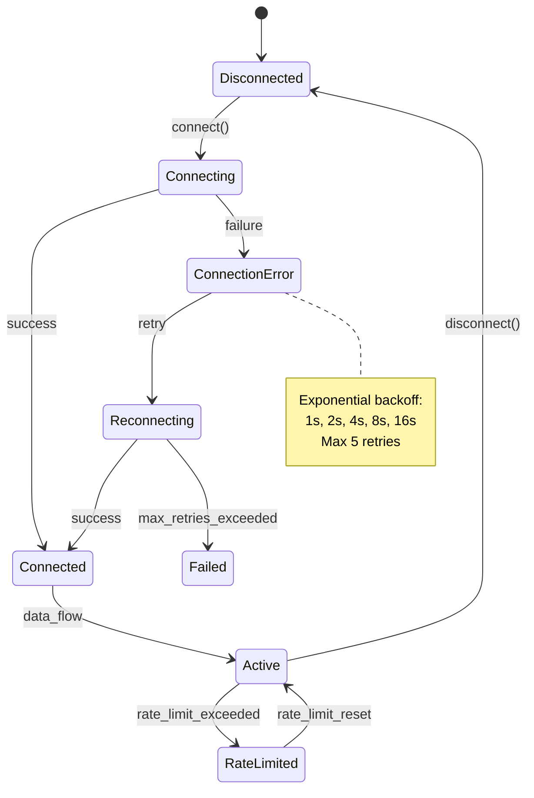

# Comprehensive Analysis: REQ (Requirements) Directory Structure & Implementation

**Analysis Date**: November 19, 2025
**Scope**: Requirements Documentation (REQ) organization, naming conventions, content structure, and enhanced features
**Source**: `/opt/data/docs_flow_framework/ai_dev_flow/REQ/` directory and supporting documentation

---

## EXECUTIVE SUMMARY

The REQ (Requirements) directory implements a sophisticated, enterprise-grade requirements management system that transforms atomic, testable requirements into "SPEC-ready" specifications. This implementation significantly advances beyond basic requirements documentation by:

- **Dual-layer specification**: Combines testable requirements (REQ) with complete technical specifications for automated SPEC generation
- **Mandatory metadata completeness**: Enforces 12-section structure with machine-validatable content
- **Full traceability chains**: Cumulative tagging from business strategy (Layer 0) through production validation (Layer 15)
- **Automated validation**: Python scripts validate ID patterns, completeness, cross-references, and SPEC-readiness scores
- **Version 2 (SPEC-Ready) template**: Includes interfaces, schemas, error handling, configuration—everything needed for code generation

---

## 1. DIRECTORY STRUCTURE & ORGANIZATION

### 1.1 Root Structure

```
REQ/
├── README.md                              # Purpose, workflow, naming conventions, quality gates
├── REQ-TEMPLATE.md                        # V2 template with all required sections
├── REQ-000_index.md                       # Central index tracking all REQ documents
├── REQ-000_TRACEABILITY_MATRIX-TEMPLATE.md # Template for bidirectional traceability
│
├── archived/                              # Historical versions
│   └── REQ-TEMPLATE-V1-ARCHIVED.md        # Legacy V1 template (for reference only)
│
├── examples/                              # Real-world examples
│   ├── TRACEABILITY_MATRIX_REQ_EXAMPLE.md # Complete traceability matrix example
│   ├── api/
│   │   ├── REQ-001_api_integration_example.md        # Core API integration pattern
│   │   ├── av/
│   │   │   └── REQ-001_alpha_vantage_integration.md  # Real example: stock data API
│   │   └── ib/
│   │       └── REQ-002_ib_gateway_integration.md     # Real example: broker gateway
│   ├── auth/
│   │   └── REQ-003_access_control_example.md         # RBAC with role hierarchy
│   ├── data/
│   │   └── REQ-002_data_validation_example.md        # Multi-layer validation pattern
│   └── risk/
│       └── lim/
│           └── REQ-003_position_limit_enforcement.md # Risk management pattern
```

### 1.2 Hierarchical Organization Patterns

REQs are organized by **functional domain** and **subdomain**:

```
REQ/
├── api/               # External API integration requirements
│   ├── av/           # Stock data API provider (Alpha Vantage, etc.)
│   └── ib/           # Interactive Brokers gateway
├── auth/             # Authentication & authorization
├── data/             # Data management & validation
├── risk/             # Risk management & compliance
│   ├── lim/          # Position limits enforcement
│   ├── mon/          # Risk monitoring
│   └── hed/          # Hedging requirements
├── perf/             # Performance requirements
└── core/             # Core system requirements (optional)
```

**Key Design**:
- Categories encode functional areas (api, risk, data, etc.)
- Subcategories encode specificity (av for Alpha Vantage, ib for Interactive Brokers)
- Sequential numbering maintains ordering across categories
- Numbers are globally unique (no collision between domains)

---

## 2. FILE NAMING CONVENTIONS & ID PATTERNS

### 2.1 Universal File Naming Pattern

```
REQ/{domain}/{subdomain}/REQ-NNN_{descriptive_slug}.md
```

### 2.2 Naming Components

| Component | Format | Example | Rules |
|-----------|--------|---------|-------|
| **Base Directory** | `REQ/` | `REQ/` | Constant |
| **Domain** | `{domain}` | `api`, `risk`, `data` | Functional area |
| **Subdomain** | `{subdomain}` | `av`, `ib`, `lim` | Specific sub-area |
| **Prefix** | `REQ-` | `REQ-` | Constant (document type) |
| **Primary ID** | `NNN` | `001`, `042`, `099`, `1000` | 3-4 digits, zero-padded |
| **Secondary ID** | `-YY` | `-01`, `-02` | Optional, 2-3 digits |
| **Slug** | `{slug}` | `alpha_vantage_integration` | snake_case descriptor |
| **Extension** | `.md` | `.md` | Markdown format |

### 2.3 Concrete Examples

| File Path | H1 ID | Purpose |
|-----------|-------|---------|
| `REQ/api/av/REQ-001_alpha_vantage_integration.md` | `REQ-001` | Alpha Vantage API integration |
| `REQ/risk/lim/REQ-003_position_limit_enforcement.md` | `REQ-003` | Position limit enforcement logic |
| `REQ/data/REQ-002_data_validation_example.md` | `REQ-002` | Multi-layer data validation |
| `REQ/auth/REQ-003_access_control_example.md` | `REQ-003` | RBAC with role hierarchy |

### 2.4 ID Uniqueness Rules

**Atomic vs. Multi-Document**:
- **Atomic Document**: Single logical unit → `REQ-NNN_{slug}.md` (most common)
  - Example: `REQ-001_alpha_vantage_integration.md`

- **Multi-Document Group**: Related documents forming cohesive unit → `REQ-NNN-01_{slug}.md`, `REQ-NNN-02_{slug}.md`
  - Example: `REQ-045-01_real_time_validation.md`, `REQ-045-02_schema_validation.md`
  - Use only when: documents are sequentially related, share traceability scope, require ordered reading

**Collision Prevention**:
- ✅ VALID: `REQ-009-01_{slug}.md` AND `REQ-009-02_{slug}.md` (same NNN, different YY)
- ❌ INVALID: `REQ-009_{slug}.md` AND `REQ-009-01_{slug}.md` (NNN collision)

### 2.5 Number Allocation Strategy

| Range | Usage | Overflow |
|-------|-------|----------|
| `001-999` | Primary allocation | 3 digits |
| `1000-9999` | Extended allocation (if >999 REQs) | 4 digits |
| Sub-IDs: `01-99` | Multi-doc components | 2 digits |
| Sub-IDs: `100-999` | Extended multi-doc (if needed) | 3 digits |

**Allocation Best Practice**:
1. Allocate sequentially (001, 002, 003...)
2. Keep numbers stable (don't renumber existing REQs)
3. Categories are folders, not encoded in ID
4. Maintain central index (REQ-000_index.md) for allocation tracking

---

## 3. CONTENT STRUCTURE: REQ V2 (SPEC-READY) TEMPLATE

### 3.1 Mandatory 12-Section Architecture

Every REQ must contain **exactly 12 sections** in this order:

| Section | Purpose | Content Type | Validation |
|---------|---------|--------------|-----------|
| **1. Description** | High-level requirement statement | Narrative + use cases | Modal language (SHALL/SHOULD/MAY) |
| **2. Document Control** | Metadata & tracking info | Table with status, version, dates | Semantic versioning |
| **3. Interface Specifications** | Protocol/ABC definitions | Python code with type annotations | Executable Python |
| **4. Data Schemas** | All data structures & validation | JSON Schema + Pydantic + SQL | Schema validation |
| **5. Error Handling** | Exception catalog & state machines | Table + Mermaid diagrams | Exception types mapped |
| **6. Configuration** | YAML config with examples | YAML + environment variables | Pydantic validation |
| **7. Non-Functional Requirements** | Performance, security, scalability | Tables with targets | Quantitative metrics |
| **8. Implementation Guidance** | Algorithms & architectural patterns | Python pseudocode | Design patterns |
| **9. Acceptance Criteria** | Measurable validation conditions | Numbered criteria with tests | Binary pass/fail |
| **10. Verification Methods** | How requirements will be tested | BDD/unit/integration/contract/perf | Test coverage |
| **11. Traceability** | Upstream sources & downstream artifacts | Tables with cross-references | Link validation |
| **12. Change History** | Version tracking & updates | Table with dates/versions | Audit trail |

### 3.2 Section 1: Description (Requirement Statement)

**Core Structure**:
```markdown
## 1. Description

[The system/component] SHALL/SHOULD/MAY [precise, atomic statement defining exactly one specific behavior].

[Business justification explaining why this requirement exists and what problem it solves.]

### Context
[What makes this requirement necessary and how it fits into the larger system.]

### Use Case Scenario
**Primary Flow**:
1. [Actor] initiates [action]
2. [System] validates [precondition]
3. [System] executes [core behavior]
4. [System] returns [outcome]

**Alternative Flows**:
- **Error Path**: When [error condition], system SHALL [error handling]
- **Edge Case**: When [boundary condition], system SHALL [boundary handling]
```

**Quality Characteristics**:
- ✅ Uses modal language (SHALL = mandatory, SHOULD = preferred, MAY = optional)
- ✅ Single, atomic requirement (no compound behaviors)
- ✅ Context-independent (understandable in isolation)
- ✅ Includes use cases with primary and alternative flows
- ✅ Concrete, specific language (no vague terms like "properly" or "appropriately")

**Example** (from REQ-001):
```markdown
The system SHALL integrate with external market data API providers to fetch real-time stock quotes, 
historical prices, and market metadata with tier-appropriate rate limiting, authentication, caching, 
and circuit breaker protection.
```

### 3.3 Section 2: Document Control (Metadata Table)

**Mandatory Metadata**:
```markdown
| Item | Details |
|------|---------|
| **Status** | Draft/Review/Approved/Implemented/Verified/Retired |
| **Version** | Semantic version (e.g., 1.0.0, 2.1.3) |
| **Date Created** | YYYY-MM-DD |
| **Last Updated** | YYYY-MM-DD |
| **Author** | Name and role |
| **Priority** | Critical/High/Medium/Low |
| **Category** | Functional/Non-Functional/Security/Performance/Reliability |
| **Source Document** | PRD-NNN, SYS-NNN references |
| **Verification Method** | BDD/Spec/Unit Test/Integration Test/Contract Test |
| **Assigned Team** | Team/Person responsible |
| **SPEC-Ready Score** | 0-100% (Target: ≥90%) |
```

**Key Fields**:
- **Status**: Lifecycle tracking (Draft → Review → Approved → Implemented → Verified)
- **Version**: Semantic versioning enables change tracking
- **SPEC-Ready Score**: Percentage of mandatory V2 sections completed (target ≥90%)
- **Priority**: Influences implementation sequencing
- **Source Document**: Upstream traceability (PRD, SYS, EARS)

### 3.4 Section 3: Interface Specifications (Contracts)

**Three Sub-Sections**:

#### 3.4.1 Protocol/Abstract Base Class Definition

```python
from typing import Protocol, AsyncIterator
from abc import ABC, abstractmethod
from dataclasses import dataclass

class MarketDataAPIClient(Protocol):
    """Protocol defining contract for market data API integration.
    
    Implementations must provide these methods with exact signatures.
    """
    
    async def connect(
        self,
        credentials: APICredentials,
        timeout: float = 5.0
    ) -> ConnectionResult:
        """Establish connection to market data API.
        
        Args:
            credentials: API authentication credentials
            timeout: Connection timeout in seconds
            
        Returns:
            ConnectionResult with status, session_id, rate_limit_tier
            
        Raises:
            ConnectionError: When connection fails after retries
            AuthenticationError: When credentials invalid
            TimeoutError: When exceeds timeout
        """
        ...
    
    async def get_quote(self, symbol: str) -> QuoteResponse:
        """Fetch real-time quote for symbol.
        
        Raises:
            RateLimitExceeded, ValidationError, APIError
        """
        ...
```

**Key Requirements**:
- Type annotations on all parameters and return values
- Complete docstrings with Args/Returns/Raises sections
- Exception specifications for all error cases
- Default parameters documented

#### 3.4.2 Data Transfer Objects (DTOs)

```python
@dataclass(frozen=True)
class APICredentials:
    """Credentials for API authentication."""
    api_key: str
    secret_key: str | None = None
    auth_type: str = "api_key"  # api_key, oauth2, certificate

@dataclass
class DataRequest:
    """Request structure for API data fetching."""
    endpoint: str
    method: str = "GET"  # GET, POST, PUT, DELETE
    query_params: dict[str, str | int | float] | None = None
    headers: dict[str, str] | None = None
    body: dict | None = None
    timeout: float = 30.0
```

#### 3.4.3 REST API Endpoints (if applicable)

```markdown
| Endpoint | Method | Request Schema | Response Schema | Rate Limit |
|----------|--------|----------------|-----------------|------------|
| `/data/quotes` | GET | `QuoteRequest` | `QuoteResponse` | 100/min |
| `/data/historical` | GET | `HistoricalRequest` | `HistoricalResponse` | 75/min |
| `/orders/create` | POST | `OrderRequest` | `OrderResponse` | 50/min |
```

### 3.5 Section 4: Data Schemas (Multi-Format)

**Three Sub-Sections**:

#### 4.1 JSON Schema Definitions

```json
{
  "$schema": "http://json-schema.org/draft-07/schema#",
  "title": "QuoteResponse",
  "type": "object",
  "required": ["symbol", "price", "timestamp"],
  "properties": {
    "symbol": {
      "type": "string",
      "pattern": "^[A-Z]{1,5}$",
      "description": "Stock ticker symbol"
    },
    "price": {
      "type": "number",
      "minimum": 0.01,
      "multipleOf": 0.01,
      "description": "Current price in USD"
    }
  },
  "additionalProperties": false
}
```

#### 4.2 Pydantic Models with Field-Level Validators

```python
from pydantic import BaseModel, Field, field_validator, model_validator

class QuoteResponse(BaseModel):
    """Quote response with validation."""
    
    symbol: str = Field(
        ...,
        min_length=1,
        max_length=5,
        pattern=r"^[A-Z]{1,5}$",
        description="Stock ticker symbol"
    )
    price: float = Field(..., gt=0, decimal_places=2)
    timestamp: datetime
    bid: float | None = Field(None, ge=0)
    ask: float | None = Field(None, ge=0)
    
    @field_validator('price', 'bid', 'ask')
    @classmethod
    def validate_price_precision(cls, v: float) -> float:
        """Ensure prices have max 2 decimal places."""
        if v is not None and round(v, 2) != v:
            raise ValueError(f"Max 2 decimals, got {v}")
        return v
    
    @model_validator(mode='after')
    def validate_bid_ask_spread(self) -> 'QuoteResponse':
        """Ensure bid <= price <= ask."""
        if self.bid and self.ask and self.price:
            if not (self.bid <= self.price <= self.ask):
                raise ValueError("Invalid spread")
        return self
    
    class Config:
        frozen = True  # Immutable
```

#### 4.3 Database Schema (SQLAlchemy)

```python
from sqlalchemy import Column, Integer, String, Float, DateTime, CheckConstraint

class Quote(Base):
    """Quote model with database constraints."""
    __tablename__ = 'quotes'
    
    id = Column(Integer, primary_key=True, autoincrement=True)
    symbol = Column(String(5), nullable=False, index=True)
    price = Column(Float, nullable=False)
    timestamp = Column(DateTime, nullable=False, index=True)
    bid = Column(Float, nullable=True)
    ask = Column(Float, nullable=True)
    volume = Column(Integer, nullable=True)
    
    __table_args__ = (
        CheckConstraint('price > 0', name='check_price_positive'),
        CheckConstraint('bid >= 0', name='check_bid_non_negative'),
        CheckConstraint('ask >= 0', name='check_ask_non_negative'),
        Index('idx_symbol_timestamp', 'symbol', 'timestamp'),
    )
```

### 3.6 Section 5: Error Handling Specifications

**Three Sub-Sections**:

#### 5.1 Exception Catalog (Mandatory)

```markdown
| Exception Type | HTTP Code | Error Code | Retry? | Recovery Strategy |
|---|---|---|---|---|
| `ConnectionError` | 503 | `CONN_001` | Yes | Exponential backoff, max 5 retries |
| `AuthenticationError` | 401 | `AUTH_001` | No | Refresh credentials, alert admin |
| `RateLimitExceeded` | 429 | `RATE_001` | Yes | Wait for rate limit reset, queue request |
| `ValidationError` | 400 | `VALID_001` | No | Log error, return to caller |
| `TimeoutError` | 504 | `TIMEOUT_001` | Yes | Retry with increased timeout |
```

**Error Code Format**: `{CATEGORY}_{NUMBER}` (e.g., `CONN_001`, `RATE_003`)

#### 5.2 Error Response Schema

```python
class ErrorResponse(BaseModel):
    """Standardized error response structure."""
    
    error_code: str              # CONN_001, RATE_001, etc.
    error_message: str
    error_type: Literal[
        "ConnectionError",
        "AuthenticationError",
        "RateLimitExceeded",
        "ValidationError",
        "APIError",
        "TimeoutError"
    ]
    timestamp: datetime
    request_id: str
    retry_after: int | None = None  # Seconds until retry allowed
    details: dict | None = None      # Additional context
```

#### 5.3 State Machine Diagram (Mermaid)



### 3.7 Section 6: Configuration Specifications

**Three Sub-Sections**:

#### 6.1 YAML Configuration Example

```yaml
# config/api_client.yaml
api_client:
  connection:
    base_url: "https://api.example.com/v1"
    timeout_seconds: 30.0
    max_connections: 100
    keepalive_seconds: 60
  
  authentication:
    type: "api_key"
    credentials_source: "google_secret_manager"
    secret_name: "api_credentials_prod"
    refresh_interval_hours: 24
  
  rate_limits:
    tier: "premium"
    requests_per_minute: 75
    burst_allowance: 10
    throttle_strategy: "queue"
  
  retry:
    enabled: true
    max_attempts: 5
    initial_delay_seconds: 1.0
    max_delay_seconds: 60.0
    backoff_multiplier: 2.0
```

#### 6.2 Environment Variables Table

```markdown
| Variable | Type | Required | Default | Description |
|----------|------|----------|---------|-------------|
| `API_BASE_URL` | string | Yes | - | Base URL for API |
| `API_TIMEOUT` | float | No | 30.0 | Request timeout in seconds |
| `API_RATE_LIMIT` | int | No | 75 | Requests per minute |
| `API_RETRY_ENABLED` | bool | No | true | Enable retry logic |
```

#### 6.3 Validation Rules (Pydantic)

```python
class APIClientConfig(BaseModel):
    """Validated configuration for API client."""
    
    base_url: str = Field(..., regex=r'^https?://[^\s]+$')
    timeout_seconds: float = Field(30.0, gt=0, le=300)
    max_connections: int = Field(100, ge=1, le=1000)
    requests_per_minute: int = Field(75, ge=1, le=10000)
    max_retry_attempts: int = Field(5, ge=0, le=10)
    
    @field_validator('base_url')
    @classmethod
    def validate_https_in_production(cls, v: str) -> str:
        """Ensure HTTPS in production."""
        import os
        if os.getenv('ENV') == 'production' and not v.startswith('https://'):
            raise ValueError("Production must use HTTPS")
        return v
```

### 3.8 Section 7: Non-Functional Requirements

```markdown
## 7. Non-Functional Requirements (NFRs)

### Performance
| Metric | Target (p50) | Target (p95) | Target (p99) | Measurement |
|--------|---|---|---|---|
| Response Time | <200ms | <500ms | <1000ms | APM traces |
| Throughput | 100 req/s | 75 req/s | 50 req/s | Load test |
| Connection Time | <2s | <5s | <10s | Metrics |

### Reliability
- **Availability**: 99.9% uptime (max 43 min/month downtime)
- **Error Rate**: <0.1% of requests
- **Data Integrity**: 100% (checksums, validation)

### Security
- **Authentication**: API key + TLS 1.3 minimum
- **Data Encryption**: AES-256 at rest, TLS in transit
- **Secrets Management**: Google Secret Manager (no plaintext)
- **Audit Logging**: All API calls logged with request_id

### Scalability
- **Horizontal Scaling**: Support 10-100 instances
- **Connection Pooling**: Max 100 connections per instance
- **Resource Limits**: CPU <20%, Memory <512MB per instance
```

**Characteristics**:
- Specific, quantifiable targets (not "fast" or "reliable")
- Separated by category (performance, reliability, security, scalability)
- Includes measurement methods

### 3.9 Section 8: Implementation Guidance

```markdown
## 8. Implementation Guidance

### 8.1 Recommended Architecture Patterns

**Pattern**: Retry with Exponential Backoff + Circuit Breaker

\`\`\`python
async def fetch_with_resilience(
    client: ExternalAPIClient,
    request: DataRequest,
    config: RetryConfig
) -> DataResponse:
    """Fetch data with retry logic and circuit breaker.
    
    Algorithm:
    1. Check circuit breaker state (open/closed/half-open)
    2. If open, fail fast with CircuitOpenError
    3. If closed/half-open, attempt request
    4. On failure, apply exponential backoff retry
    5. Update circuit breaker based on result
    """
    circuit_breaker = get_circuit_breaker('api_client')
    
    # Check circuit state
    if circuit_breaker.is_open():
        raise CircuitOpenError("Circuit breaker is open")
    
    # Retry loop with exponential backoff
    delay = config.initial_delay
    for attempt in range(1, config.max_attempts + 1):
        try:
            response = await client.fetch_data(request)
            circuit_breaker.record_success()
            return response
        except RetryableError as e:
            if attempt == config.max_attempts:
                circuit_breaker.record_failure()
                raise MaxRetriesExceeded(...) from e
            
            await asyncio.sleep(delay)
            delay = min(delay * config.backoff_multiplier, config.max_delay)
\`\`\`

### 8.2 Concurrency and Async Patterns
### 8.3 Dependency Injection
```

**Includes**:
- Algorithms with pseudocode
- Design patterns (retry, circuit breaker, dependency injection)
- Concurrency strategies
- Example implementations

### 3.10 Section 9: Acceptance Criteria

```markdown
## 9. Acceptance Criteria

### Primary Functional Criteria
- ✅ **AC-001**: API connection established within 5 seconds
  - **Verification**: Integration test with test credentials
  - **Pass Criteria**: Connection succeeds in <5s for 100% of attempts

- ✅ **AC-002**: Data retrieval completes within SLA (p95 <500ms)
  - **Verification**: Load test with 1000 requests
  - **Pass Criteria**: p95 latency <500ms, p99 <1000ms

- ✅ **AC-003**: Rate limiting enforced at 75 req/min
  - **Verification**: Send 100 requests in 1 minute
  - **Pass Criteria**: 76th request returns 429

### Error and Edge Case Criteria
- ✅ **AC-004**: Connection failures trigger exponential backoff
- ✅ **AC-005**: Circuit breaker opens after 5 consecutive failures
- ✅ **AC-006**: Invalid responses return ValidationError

### Quality and Constraint Criteria
- ✅ **AC-007**: Response time <500ms at p95 under normal load
- ✅ **AC-008**: Secrets never logged or exposed in errors

### Data Validation Criteria
- ✅ **AC-009**: Response data validates against JSON Schema
- ✅ **AC-010**: Pydantic models reject invalid data

### Integration Criteria
- ✅ **AC-011**: Contract tests pass with API provider
- ✅ **AC-012**: Observability metrics published (latency, errors, rate)
```

**Characteristics**:
- Numbered sequentially (AC-001, AC-002, ...)
- Include verification method (unit test, integration test, load test, etc.)
- Include pass criteria (quantifiable, objective)
- Cover functional, error, quality, data, and integration concerns

### 3.11 Section 10: Verification Methods

```markdown
## 10. Verification Methods

### Automated Testing
- **BDD Scenarios**: [BDD-NNN.feature](../../BDD/BDD-NNN.feature)
  - Scenario: Successful API connection
  - Scenario: Rate limiting enforcement
  - Scenario: Retry on transient failure

- **Unit Tests**: `tests/unit/api/test_api_client.py`
  - Test: Credential validation
  - Test: Request building
  - Test: Response parsing

- **Integration Tests**: `tests/integration/api/test_api_integration.py`
  - Test: End-to-end data fetch
  - Test: Retry logic with real API
  - Test: Rate limit handling

- **Contract Tests**: `tests/contract/api/test_api_contract.py`
  - Test: Request/response schema compliance
  - Test: API version compatibility

- **Performance Tests**: `tests/performance/api/test_api_performance.py`
  - Test: Latency benchmarks (p50/p95/p99)
  - Test: Throughput under load
  - Test: Connection pooling efficiency

### Technical Validation
- **Specification Compliance**: [SPEC-NNN](../../SPEC/.../SPEC-NNN.yaml)
- **Schema Validation**: JSON Schema, Pydantic, Database constraints
```

### 3.12 Section 11: Traceability

```markdown
## 11. Traceability

### Upstream Sources
| Source | Document | Section | Relationship |
|---|---|---|---|
| BRD | [BRD-NNN](../../BRD/BRD-NNN.md) | Section 2.4 | Business objectives |
| PRD | [PRD-NNN](../../PRD/PRD-NNN.md) | Functional Req 4.x | Product features |
| SYS | [SYS-NNN](../../SYS/SYS-NNN.md) | Sys Req 3.x | System specification |
| EARS | [EARS-NNN](../../EARS/EARS-NNN.md) | Event-driven stmt | Formal engineering req |

### Downstream Artifacts
- **ADRs**: [ADR-NNN](../ADR/ADR-NNN.md) - Architecture decisions
- **SPECs**: [SPEC-NNN](../../SPEC/.../SPEC-NNN.yaml) - Technical specifications
- **BDD**: [BDD-NNN](../../BDD/BDD-NNN.feature) - Behavior scenarios
- **CTR**: [CTR-NNN](../../CTR/CTR-NNN.md) - API contracts

### Traceability Tags (Cumulative Tagging - Layer 7)
\`\`\`markdown
@brd: BRD-NNN:REQUIREMENT-ID
@prd: PRD-NNN:REQUIREMENT-ID
@ears: EARS-NNN:STATEMENT-ID
@bdd: BDD-NNN:SCENARIO-ID
@adr: ADR-NNN
@sys: SYS-NNN:SECTION-ID
\`\`\`

### Code Implementation Paths
- `src/[module]/client.py`: API client implementation
- `src/[module]/models.py`: Pydantic models
- `src/[module]/errors.py`: Exception definitions
- `tests/unit/[module]/test_client.py`: Unit tests
```

**Cumulative Tagging Hierarchy**:
- REQ (Layer 7) must include ALL upstream artifact tags
- Format: `@artifact_type: DOCUMENT-ID:REQUIREMENT-ID`
- Example: `@brd: BRD-001:FR-030`, `@sys: SYS-008:PERF-001`

### 3.13 Section 12: Change History

```markdown
## 12. Change History

| Date | Version | Change | Author |
|------|---------|--------|--------|
| 2025-01-09 | 1.0.0 | Initial V2 template with interface/schema/error/config | Platform Team |
| 2025-01-15 | 1.1.0 | Added circuit breaker configuration | Integration Team |
| 2025-02-01 | 2.0.0 | Enhanced with state machine diagrams | Architecture Team |

**Template Version**: 2.0 (SPEC-Ready)
**Next Review**: YYYY-MM-DD (quarterly review recommended)
**Technical Contact**: [Name/Email]
**SPEC-Ready Checklist**: ✅ Interfaces ✅ Schemas ✅ Errors ✅ Config
```

---

## 4. NAMING CONVENTIONS & ID STANDARDS

### 4.1 Document ID Format

**Pattern**: `REQ-NNN_{descriptive_slug}` or `REQ-NNN-YY_{descriptive_slug}`

| Part | Rules | Example |
|------|-------|---------|
| Prefix | Constant `REQ-` | `REQ-` |
| Primary ID | 3-4 digits, zero-padded | `001`, `099`, `1000` |
| Secondary ID | Optional, 2-3 digits | `-01`, `-02` |
| Slug | snake_case, max 50 chars | `alpha_vantage_integration` |
| Extension | `.md` | `.md` |

### 4.2 Document Control Metadata

**H1 ID Format**: `# REQ-NNN: [Title]`

Example from README:
```markdown
# REQ-001: External Market Data API Integration
```

### 4.3 Hierarchical Path Convention

**Pattern**: `REQ/{domain}/{subdomain}/REQ-NNN_{slug}.md`

**Examples**:
- `REQ/api/av/REQ-001_alpha_vantage_integration.md` → API / Stock Data
- `REQ/api/ib/REQ-002_ib_gateway_integration.md` → API / Broker Gateway
- `REQ/risk/lim/REQ-003_position_limit_enforcement.md` → Risk / Limits
- `REQ/data/REQ-002_data_validation_example.md` → Data Management

### 4.4 Central Index Allocation

**File**: `REQ/REQ-000_index.md`

**Purpose**: Track all REQ-NNN allocations and prevent collisions

**Contents**:
```markdown
# Requirements Index (REQ)

## Documents

- API / Data Provider
  - Descriptor: [REQ-001_alpha_vantage_integration.md](./api/av/REQ-001_alpha_vantage_integration.md)
- API / Broker Gateway
  - Descriptor: [REQ-002_ib_gateway_integration.md](./api/ib/REQ-002_ib_gateway_integration.md)
- Risk / Limits
  - Descriptor: [REQ-003_position_limit_enforcement.md](./risk/lim/REQ-003_position_limit_enforcement.md)
```

---

## 5. CROSS-REFERENCING & TRACEABILITY APPROACHES

### 5.1 Upstream Traceability (Where REQ comes from)

```markdown
### Upstream Sources

| Source Type | Document | Section | Relationship |
|---|---|---|---|
| BRD | [BRD-001](../../BRD/BRD-001_business_strategy.md) | Section 2.4 | Business objectives justifying this requirement |
| PRD | [PRD-003](../../PRD/PRD-003_product_features.md) | Section 4.2 | Product features this enables |
| SYS | [SYS-008](../../SYS/SYS-008_system_spec.md) | Section 3.x | System-level specification this implements |
| EARS | [EARS-001](../../EARS/EARS-001_events.md) | EVENT-003 | Formal engineering requirement |
```

### 5.2 Downstream Traceability (Where REQ goes to)

```markdown
### Downstream Artifacts

#### Architecture Decisions
| ADR | Title | Aspects Addressed |
|---|---|---|
| [ADR-033](../ADR/ADR-033_risk_architecture.md) | Risk Architecture | Implementation pattern, resilience design |

#### Technical Specifications
| SPEC | Title | Implementation |
|---|---|---|
| [SPEC-NNN](../../SPEC/.../SPEC-NNN.yaml) | API Client Spec | Interface + schema + error handling |

#### Behavior-Driven Development
| BDD | Scenario | Acceptance Criteria Validated |
|---|---|---|
| [BDD-003](../../BDD/BDD-003_api_integration.feature) | API Integration | AC-001, AC-002, AC-003 |

#### Code Implementation
- `src/api/client.py`: API client implementation
- `src/api/models.py`: Pydantic models
- `tests/unit/api/test_client.py`: Unit tests
```

### 5.3 Cumulative Tagging (Complete Chain)

**Principle**: Every REQ includes tags from ALL upstream artifacts

**Format**:
```markdown
@brd: BRD-NNN:REQUIREMENT-ID
@prd: PRD-NNN:REQUIREMENT-ID
@ears: EARS-NNN:STATEMENT-ID
@bdd: BDD-NNN:SCENARIO-ID
@adr: ADR-NNN
@sys: SYS-NNN:SECTION-ID
```

**Layer 7 Requirements** (REQ is Layer 7):
- Must reference BRD (Layer 1)
- Must reference PRD (Layer 2)
- Must reference EARS (Layer 3)
- Must reference BDD (Layer 4)
- Must reference ADR (Layer 5)
- Must reference SYS (Layer 6)

**Example** (from documentation):
```markdown
@brd: BRD-001:FR-030
@prd: PRD-003:FEATURE-002
@ears: EARS-001:EVENT-003
@bdd: BDD-003:scenario-realtime-quote
@adr: ADR-033
@sys: SYS-008:PERF-001
```

### 5.4 Markdown Link Format

**Standard**: Relative paths with anchors
```markdown
[Document ID](../relative/path/to/file.md#ANCHOR)
```

**Examples**:
```markdown
- [BRD-001](../../BRD/BRD-001_strategy.md#BRD-001)
- [SPEC-NNN](../../SPEC/services/SPEC-003.yaml)
- [BDD-003](../../BDD/BDD-003_api_integration.feature#scenario-connection)
```

---

## 6. SPECIAL FEATURES & ENHANCEMENTS (vs. Basic REQ Templates)

### 6.1 V2 SPEC-Ready Template

**Unique to this implementation**:
- **12-Section Mandatory Structure** (vs. basic 4-5 sections)
- **Complete Interface Specifications** (Protocol/ABC + DTOs + REST APIs)
- **Multi-Format Schemas** (JSON Schema + Pydantic + SQLAlchemy)
- **Exception Catalogs** (organized by error type, HTTP code, retry strategy)
- **State Machine Diagrams** (Mermaid diagrams for complex workflows)
- **Configuration Examples** (YAML + env vars + validation)
- **Implementation Guidance** (algorithms, patterns, pseudocode)

**SPEC-Ready Score Metric**:
- Measures completeness: 0-100% (target ≥90%)
- Indicates whether REQ contains ALL information for SPEC generation
- No additional analysis needed for code generation

### 6.2 Automated Validation Infrastructure

**Scripts Available**:
1. **validate_requirement_ids.py**: Enforce ID patterns, filename compliance, V2 sections
2. **validate_req_spec_readiness.py**: Score REQ for SPEC-readiness, check mandatory sections
3. **validate_traceability_matrix.py**: Check upstream/downstream links, identify orphans
4. **validate_tags_against_docs.py**: Verify cumulative tags reference actual documents
5. **validate_documentation_paths.py**: Validate all cross-reference links exist

**Usage Example**:
```bash
# Check REQ format and ID compliance
python validate_requirement_ids.py --directory REQ/

# Score SPEC-readiness
python validate_req_spec_readiness.py --req-file REQ/api/REQ-001.md

# Validate traceability chains
python validate_traceability_matrix.py --directory REQ/
```

### 6.3 Real-World Examples

**Included**:
1. **REQ-001**: API integration pattern
   - 1372 lines, 95% SPEC-ready
   - REST API client with resilience patterns
   - Rate limiting, circuit breaker, retry logic

2. **REQ-002**: Data validation pattern
   - 345 lines, 95% SPEC-ready
   - Multi-layer validation pipeline
   - Schema + business rules + database constraints

3. **REQ-003**: Access control pattern
   - 464 lines, 95% SPEC-ready
   - RBAC with role hierarchy
   - JWT-based authorization middleware

### 6.4 Hierarchical Domain Organization

**vs. Flat Numbering** (basic approach):
- ❌ Basic: All REQs in single directory (REQ/REQ-001.md, REQ/REQ-002.md...)
- ✅ This impl: Domain hierarchy (REQ/api/av/, REQ/risk/lim/, etc.)

**Benefits**:
- Logical organization by functional area
- Easier to navigate large requirement sets
- Categories self-document purpose
- Enables domain-specific templates (if needed)

### 6.5 Traceability Matrix Integration

**Automatic Matrix Generation**:
- Template: `REQ-000_TRACEABILITY_MATRIX-TEMPLATE.md`
- Example: `examples/TRACEABILITY_MATRIX_REQ_EXAMPLE.md`

**Tracks**:
- Upstream dependencies (EARS → SYS → REQ)
- Downstream artifacts (REQ → SPEC → Code)
- Orphaned requirements (missing upstream/downstream)
- Coverage statistics (% with upstream, % with downstream)

**Example Matrix Stats**:
- Total REQs: 24
- Upstream Coverage: 100% (24/24)
- Downstream Coverage: 75% (18/24)
- Orphaned: 0

### 6.6 Version 2 Evolution (from V1)

**V1 (Archived)**: Basic template with minimal sections
**V2 (Current)**: SPEC-Ready with complete specifications

| Aspect | V1 | V2 |
|--------|----|----|
| **Interfaces** | Optional, often missing | Mandatory with type annotations |
| **Schemas** | Placeholder text | JSON Schema + Pydantic + SQL |
| **Error Handling** | Basic descriptions | Exception catalog + state machines |
| **Configuration** | Generic placeholders | Concrete YAML + validation |
| **SPEC Readiness** | 40-70% | 90-95% |
| **Line Count** | 30-48 (sparse) or 260-410 (bloated) | 400-500 (focused) |

**Migration Strategy**:
- No forced migration: V1 files can coexist
- New REQs use V2 template
- Gradual conversion of existing REQs

---

## 7. LAYERS & POSITIONING IN WORKFLOW

### 7.1 16-Layer Specification-Driven Development Workflow

```
Layer 0:  Strategy
Layer 1:  BRD (Business Requirements Document)
Layer 2:  PRD (Product Requirements Document)
Layer 3:  EARS (Easy Approach to Requirements Syntax)
Layer 4:  BDD (Behavior-Driven Development)
Layer 5:  ADR (Architecture Decision Records)
Layer 6:  SYS (System Requirements)
Layer 7:  REQ (Atomic Requirements)  ← YOU ARE HERE
Layer 8:  IMPL (Implementation Plans)
Layer 9:  CTR (API Contracts)
Layer 10: SPEC (Technical Specifications)
Layer 11: TASKS (Code Generation)
Layer 12: IPLAN (Implementation Plans)
Layer 13: Code
Layer 14: Tests
Layer 15: Validation
```

### 7.2 REQ as the Bridge Layer

**What feeds REQ**:
- BRD: Business context & objectives
- PRD: Product features & user needs
- EARS: Testable requirement expressions
- BDD: Behavior scenarios
- ADR: Architecture decisions
- SYS: System-level specifications

**What REQ feeds**:
- IMPL: Implementation roadmap
- CTR: API contract definitions
- SPEC: Detailed technical specifications
- Code: Source code generation (from SPEC)
- Tests: Test case generation (from BDD + SPEC)

**Purpose**: Transform high-level business needs (BRD/PRD) into atomic, testable, implementable specifications (SPEC)

---

## 8. README & DOCUMENTATION

### 8.1 README.md Contents

**Sections**:
1. **Purpose**: Define REQ as testable specification layer
2. **Workflow Visualization**: Show REQ's position in 16-layer workflow
3. **REQ Document Structure**: Describe all 12 sections
4. **File Organization Hierarchy**: Explain domain/subdomain structure
5. **File Naming Convention**: REQ-NNN_{slug} pattern
6. **Requirement Statement Quality**: Atomic principle, measurable validation, modal language
7. **Acceptance Criteria Patterns**: Functional, performance, security, integration
8. **Requirement Refinement Process**: PRD → REQ evolution
9. **Cross-Reference Linking**: Upstream and downstream traceability
10. **Quality Gates**: Mandatory validation checklist
11. **REQ Writing Guidelines**: Best practices (concrete, error cases, terminology, performance, testing)
12. **Common REQ Patterns**: Data validation, authentication, error handling
13. **REQ Lifecycle Management**: Draft → Accepted → Superseded → Retired
14. **Integration with Development Workflow**: During definition, implementation, testing, review
15. **Benefits of Atomic Requirements**: Clarity, testability, traceability, modularity
16. **Avoiding Common Pitfalls**: Compound reqs, implementation details, vague acceptance, untestable reqs
17. **Tools and Automation**: Validation and test mapping scripts
18. **REQ Template V2 Section**: Comprehensive guide to SPEC-Ready requirements

### 8.2 Supporting Documentation

- **TRACEABILITY.md**: Complete 16-layer workflow with cumulative tagging
- **ID_NAMING_STANDARDS.md**: Authoritative naming rules (applies to documentation, not code)
- **SPEC_DRIVEN_DEVELOPMENT_GUIDE.md**: Overall SDD methodology

---

## 9. VALIDATION & ENFORCEMENT

### 9.1 Automated Validation Scripts

**1. validate_requirement_ids.py**
```
Checks:
- REQ-NNN ID format compliance (3-4 digits)
- Filename matches document ID
- V2 mandatory sections present (all 12)
- No duplicate REQ-IDs
- Proper hierarchical organization
```

**2. validate_req_spec_readiness.py**
```
Checks:
- SPEC-Ready score (% of mandatory sections)
- Target: ≥90%
- Lists missing sections
- Suggests completion priority
```

**3. validate_traceability_matrix.py**
```
Checks:
- All REQs have upstream sources (BRD, SYS, EARS)
- All REQs link to downstream artifacts (SPEC, BDD)
- Identifies orphaned requirements
- Coverage statistics
```

**4. validate_tags_against_docs.py**
```
Checks:
- Cumulative tags (@brd, @prd, @ears, @bdd, @adr, @sys) exist
- Tagged documents actually exist
- Anchor references are valid
```

**5. validate_documentation_paths.py**
```
Checks:
- All cross-reference links exist
- Relative paths are correct
- No broken markdown links
```

### 9.2 Quality Gates (from README.md)

**Every REQ must**:
✅ Reference upstream PRD or SRS as source requirement
✅ Express exactly one atomic requirement using SHALL language
✅ Include measurable acceptance criteria with specific validation conditions
✅ Link to relevant ADR(s) that address the requirement
✅ Define verification methods (BDD scenarios, specifications, tests)
✅ Maintain traceability to downstream implementation artifacts

**REQ validation checklist**:
- ✅ Description uses precise SHALL/SHOULD/MAY language
- ✅ Acceptance criteria are quantitative and testable
- ✅ No compound requirements (single responsibility principle)
- ✅ Cross-reference links are functional and point to valid artifacts
- ✅ No implementation details (focus on what, not how)
- ✅ Requirement is independently verifiable

---

## 10. COMPARISON WITH STANDARD REQ TEMPLATES

### 10.1 Basic Template Limitations

**Standard Requirements Documents** (IEEE 830, etc.):
- Simple structure (overview, detailed requirements, interface)
- No executable specifications
- Limited traceability support
- No automated validation
- No SPEC-readiness metric

**vs. This Implementation**:
- 12-section SPEC-Ready structure
- Complete interfaces, schemas, errors, configuration
- Cumulative tagging with automated validation
- SPEC-readiness score (0-100%)
- Machine-readable metadata
- Automatic matrix generation

### 10.2 What Makes This Unique

| Aspect | Standard | This Implementation |
|--------|----------|---------------------|
| **Sections** | 3-5 (brief) | 12 (comprehensive) |
| **Interfaces** | Text descriptions | Python Protocol/ABC with type hints |
| **Schemas** | Informal | JSON Schema + Pydantic + SQLAlchemy |
| **Error Handling** | Bullet points | Catalog + state machines + codes |
| **Configuration** | Placeholder examples | Concrete YAML + validation rules |
| **Traceability** | Manual cross-refs | Cumulative tags with automated validation |
| **SPEC-Ready** | N/A | 0-100% score metric |
| **Validation** | Manual review | 5 automated scripts |
| **Examples** | Few | 3 detailed real-world patterns |
| **Integration** | Standalone | 16-layer workflow positioned |
| **Code Generation** | Manual from REQ | Automated from SPEC (derived from REQ) |

---

## 11. EXAMPLE REQUIREMENT: REQ-001 (Detailed Walkthrough)

### Full Context
**File**: `REQ/api/REQ-001_api_integration_example.md` (1372 lines, 95% SPEC-ready)
**Domain**: External API Integration
**Purpose**: Market data API client with resilience patterns

### Key Highlights

**Section 1 - Description**:
```
The system SHALL integrate with external market data API providers to fetch real-time 
stock quotes, historical prices, and market metadata with tier-appropriate rate limiting, 
authentication, caching, and circuit breaker protection.
```

**Section 3 - Interfaces**:
- `MarketDataAPIClient` Protocol with `connect()`, `get_quote()`, `get_historical()`, `disconnect()`
- Full type annotations and docstrings
- Exception specifications

**Section 4 - Schemas**:
- JSON Schema for `QuoteResponse`, `HistoricalResponse`
- Pydantic models with field validators and cross-field validation
- SQLAlchemy ORM models with CHECK constraints

**Section 5 - Error Handling**:
- 6 exception types (ConnectionError, AuthenticationError, RateLimitExceeded, etc.)
- Error codes: CONN_001, AUTH_001, RATE_001, etc.
- State machine showing connection lifecycle with retry backoff

**Section 6 - Configuration**:
- YAML config with connection, auth, rate limits, retry, circuit breaker, cache, monitoring
- 8 environment variables defined
- Pydantic validator for production HTTPS enforcement

**Section 9 - Acceptance Criteria**: 12 AC items including:
- AC-001: Connection within 5 seconds
- AC-002: Data retrieval within SLA (p95 <500ms)
- AC-003: Rate limiting at 75 req/min
- AC-004: Exponential backoff on failure
- AC-005: Circuit breaker after 5 failures
- AC-008: Secrets never logged
- AC-009: Schema validation
- AC-011: Contract tests pass
- AC-012: Metrics published

---

## CONCLUSION

The REQ directory implementation represents an **advanced, enterprise-grade requirements management system** that goes far beyond basic requirements documentation by:

1. **Embedding Complete Technical Specifications**: Interfaces, schemas, error handling, and configuration eliminate information gaps between requirements and code
2. **Enforcing Atomic, Testable Requirements**: Single responsibility, measurable criteria, and modal language prevent interpretation disputes
3. **Enabling Automated Validation**: 5 validation scripts ensure consistency, completeness, and correctness
4. **Positioning as Bridge Layer**: REQ (Layer 7) transforms business needs (Layers 1-6) into specifications (Layers 8-15)
5. **Supporting Code Generation**: SPEC-ready metric indicates when REQ contains all information for automated code generation
6. **Maintaining Complete Traceability**: Cumulative tagging with automated validation creates unbroken chains from business strategy to production code

This implementation is particularly valuable for **complex systems requiring high assurance**, such as financial platforms, where complete requirement specifications are essential for correctness, compliance, and maintainability.
