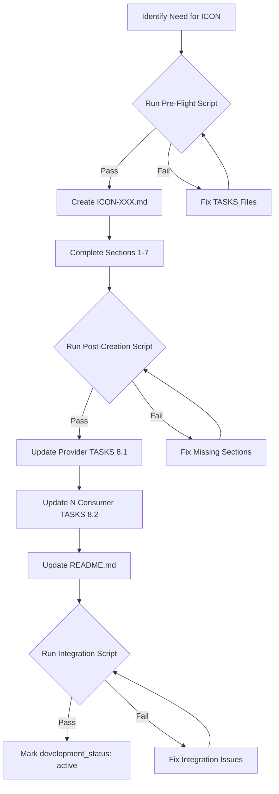

# ICON Framework Documentation Update Plan

## Plan Metadata
- **Created**: 2025-11-27 14:58:43 EST
- **Status**: Ready for Implementation
- **Objective**: Update ICON framework documentation to prevent 91% error rate observed during contract creation
- **Target Directory**: `/opt/data/docs_flow_framework/ai_dev_flow/ICON/`

## Context

### Error Analysis Summary
Comprehensive analysis of 11 ICON files revealed systematic creation workflow violations:

**Error Statistics**:
- **91% error rate**: 10/11 ICON files had integrity issues
- **4 orphaned ICONs**: ICON-007, 033, 034, 043 created without TASKS updates
- **8 consumer count errors**: Manual counting vs grep validation mismatches
- **2 self-reference anti-patterns**: TASKS-001, TASKS-082 consuming own contracts

**Root Causes Identified**:
1. Critical warnings buried at line 42 in template (after creation starts)
2. No enforcement mechanisms - manual compliance only
3. No validation gates before "Active" status
4. Integration instructions scattered across 3 files
5. No error recovery procedures documented

**Impact**:
- Integration debt accumulation
- Broken bidirectional traceability
- Consumer count inflation
- Manual rework required for 10 contracts

## Task List

### Phase 1: Template and Rules Updates
- [ ] **Task 1.1**: Update `ICON-TEMPLATE.md`
  - Move warnings from line 42 to YAML frontmatter (line 22)
  - Add pre-creation checklist (8 items)
  - Add 6-phase integration workflow
  - Add validation gate requirements

- [ ] **Task 1.2**: Update `ICON_CREATION_RULES.md`
  - Add "Enforcement Mechanisms" section
  - Add validation gate requirements table
  - Add common violations table with fixes
  - Add metrics tracking guidance

- [ ] **Task 1.3**: Update `ICON/README.md`
  - Add "Quick Start" section (8-step workflow)
  - Add "Troubleshooting" section (7 common errors)
  - Add success criteria checklist

### Phase 2: Integration Workflow Guide
- [ ] **Task 2.1**: Create `ICON_INTEGRATION_WORKFLOW.md`
  - Document pre-creation phase (validation)
  - Document 8-file atomic operation
  - Document validation phase (grep checks)
  - Document error recovery for 7 scenarios

### Phase 3: Error Recovery Guide
- [ ] **Task 3.1**: Create `ICON_ERROR_RECOVERY.md`
  - Orphaned ICON repair procedure
  - Consumer count correction procedure
  - Self-reference anti-pattern fix
  - Missing YAML frontmatter fix
  - Incomplete contract sections fix

### Phase 4: Validation Scripts
- [ ] **Task 4.1**: Create `scripts/preflight_icon_creation.sh`
  - Validate TASKS file exists with @icon tags
  - Count consumer TASKS via grep
  - Check provider TASKS has section 8.1
  - Verify no self-references

- [ ] **Task 4.2**: Create `scripts/validate_icon_complete.sh`
  - Verify YAML frontmatter present
  - Verify consumer_count matches grep results
  - Verify bidirectional @icon tags
  - Verify all 10 contract sections present

## Implementation Steps

### Phase 1: Template Restructure

#### File 1: `/opt/data/docs_flow_framework/ai_dev_flow/ICON/ICON-TEMPLATE.md`

**Changes Required**:

1. **Move Warnings to Frontmatter** (line 22):
```markdown
---
title: "ICON-XXX: [Contract Name]"
tags:
  - implementation-contract
  - layer-11-artifact
  - shared-architecture
  - active
custom_fields:
  layer: 11
  artifact_type: ICON
  contract_type: Protocol Interface
  provider_tasks: TASKS-XXX
  consumer_count: N
  development_status: active
---

<!-- ⚠️ CRITICAL WARNINGS - READ BEFORE CREATION ⚠️ -->
<!--
ICON creation is an 8-file atomic operation:
1. Create ICON-XXX.md (this file)
2. Update provider TASKS-XXX.md section 8.1 with @icon tag
3. Update N consumer TASKS-YYY.md section 8.2 with @icon tags
4. Update docs/ICON/README.md active contracts table
5. Update consumer_count in this file's frontmatter (must match grep)
6. Run scripts/preflight_icon_creation.sh
7. Run scripts/validate_icon_complete.sh
8. Only then mark development_status: active

FAILURE TO COMPLETE ALL 8 STEPS = ORPHANED CONTRACT
See ICON_INTEGRATION_WORKFLOW.md for detailed procedure.
-->
```

2. **Add Pre-Creation Checklist** (after warnings):
```markdown
## Pre-Creation Checklist

Before creating this ICON, verify:

- [ ] Provider TASKS file exists with complete section 8.1
- [ ] All N consumer TASKS identified with grep verification
- [ ] Consumer count calculated: `grep -r "@icon: ICON-XXX" docs/TASKS/ | wc -l`
- [ ] No self-reference (provider TASKS not in consumer list)
- [ ] Contract type selected (Protocol/Exception/State/Model/DI)
- [ ] Performance requirements defined (if applicable)
- [ ] Exception hierarchy designed (if applicable)
- [ ] Mock implementation template ready

**If any item fails, STOP. Fix TASKS files first.**
```

3. **Add Integration Workflow Reference** (section 2):
```markdown
## Integration Workflow

See [ICON_INTEGRATION_WORKFLOW.md](./ICON_INTEGRATION_WORKFLOW.md) for:
- Pre-creation validation procedure
- 8-file atomic operation steps
- Post-creation validation gates
- Error recovery procedures

**Required Phases**:
1. Pre-Flight Validation (script-based)
2. Contract Creation (this file)
3. Provider TASKS Update (section 8.1)
4. Consumer TASKS Updates (section 8.2 × N)
5. README Update (active contracts table)
6. Post-Flight Validation (script-based)
```

4. **Add Validation Gates** (section 10):
```markdown
## Validation Gates

### Pre-Activation Validation

**Before marking development_status: active**:

```bash
# Run validation scripts
./scripts/preflight_icon_creation.sh ICON-XXX TASKS-XXX
./scripts/validate_icon_complete.sh ICON-XXX

# Verify output shows:
# ✓ Provider TASKS has section 8.1 with @icon tag
# ✓ Consumer count matches grep results (N consumers)
# ✓ Bidirectional @icon tags present
# ✓ YAML frontmatter complete
# ✓ All 10 contract sections present
```

**If any check fails**: See ICON_ERROR_RECOVERY.md
```

#### File 2: `/opt/data/docs_flow_framework/ai_dev_flow/ICON/ICON_CREATION_RULES.md`

**Changes Required**:

1. **Add Enforcement Mechanisms Section** (after current content):
```markdown
## Enforcement Mechanisms

### Validation Gates

| Gate | Timing | Script | Failure Action |
|------|--------|--------|----------------|
| Pre-Flight | Before ICON creation | `preflight_icon_creation.sh` | Block creation, fix TASKS first |
| Post-Creation | After section 7 complete | `validate_icon_complete.sh` | Block "active" status |
| Integration | After TASKS updates | `validate_icon_integration.sh` | Block merge to main branch |

### Mandatory Validation Workflow



### Validation Script Requirements

**Pre-Flight Script** (`scripts/preflight_icon_creation.sh`):
- Accepts: `ICON-XXX` and `TASKS-XXX` (provider)
- Validates:
  - Provider TASKS exists with section 8.1
  - Consumer count calculated via grep
  - No self-reference detected
  - No duplicate ICON-XXX in docs/ICON/
- Exit code: 0 (pass) or 1 (fail with error message)

**Post-Creation Script** (`scripts/validate_icon_complete.sh`):
- Accepts: `ICON-XXX`
- Validates:
  - YAML frontmatter present with all 9 fields
  - All 10 contract sections present
  - Consumer count matches grep results
  - Performance requirements present (if contract_type requires)
  - Mock implementation template present (if Protocol)
- Exit code: 0 (pass) or 1 (fail with error message)

**Integration Script** (`scripts/validate_icon_integration.sh`):
- Accepts: `ICON-XXX`
- Validates:
  - Provider TASKS has @icon tag in section 8.1
  - N consumer TASKS have @icon tags in section 8.2
  - README.md active contracts table updated
  - Bidirectional traceability complete
- Exit code: 0 (pass) or 1 (fail with error message)
```

2. **Add Common Violations Table**:
```markdown
## Common Violations and Fixes

| Violation | Detection | Fix Procedure | Prevention |
|-----------|-----------|---------------|------------|
| **Orphaned ICON** | 0 TASKS references | See ICON_ERROR_RECOVERY.md §2.1 | Run pre-flight script |
| **Consumer Count Mismatch** | grep ≠ frontmatter | Run `grep -r "@icon: ICON-XXX" \| wc -l`, update frontmatter | Use grep in step 5 |
| **Self-Reference** | Provider in consumer list | Remove section 8.2 from provider TASKS | Check pre-flight output |
| **Missing YAML** | No frontmatter | Copy from ICON-TEMPLATE.md lines 1-15 | Use template |
| **Incomplete Sections** | < 10 sections | See ICON_ERROR_RECOVERY.md §2.5 | Use template checklist |
| **Wrong Contract Type** | Type doesn't match content | Update custom_fields.contract_type | Review before creation |
| **No Mock Template** | Protocol without mock | Add section 6 from ICON-001 | Check template requirements |
| **Missing Performance** | State/Protocol without perf | Add section 4 from ICON-006 | Check contract type rules |

### Metrics Tracking

**ICON Health Metrics**:
```bash
# Calculate ICON completion rate
total_icons=$(ls docs/ICON/ICON-*.md | wc -l)
complete_icons=$(./scripts/validate_all_icons.sh | grep "✓ PASS" | wc -l)
completion_rate=$((complete_icons * 100 / total_icons))

# Calculate consumer count accuracy
grep -r "consumer_count:" docs/ICON/ | while read -r line; do
    icon_file=$(echo "$line" | cut -d: -f1)
    declared_count=$(echo "$line" | cut -d: -f3 | xargs)
    icon_id=$(basename "$icon_file" .md)
    actual_count=$(grep -r "@icon: $icon_id" docs/TASKS/ | wc -l)
    if [ "$declared_count" -ne "$actual_count" ]; then
        echo "MISMATCH: $icon_id (declared=$declared_count, actual=$actual_count)"
    fi
done
```
```

#### File 3: `/opt/data/docs_flow_framework/ai_dev_flow/ICON/README.md`

**Changes Required**:

1. **Add Quick Start Section** (after overview):
```markdown
## Quick Start

### 8-Step ICON Creation Workflow

**Prerequisites**: Provider TASKS file complete with dependencies identified

1. **Pre-Flight Validation** (5 min):
   ```bash
   ./scripts/preflight_icon_creation.sh ICON-XXX TASKS-XXX
   # Must show: ✓ All checks passed
   ```

2. **Create ICON File** (30 min):
   - Copy `ICON-TEMPLATE.md` to `docs/ICON/ICON-XXX_descriptive_name.md`
   - Update YAML frontmatter with correct provider_tasks and consumer_count
   - Complete sections 1-10 using template guidance

3. **Post-Creation Validation** (2 min):
   ```bash
   ./scripts/validate_icon_complete.sh ICON-XXX
   # Must show: ✓ All sections complete
   ```

4. **Update Provider TASKS** (5 min):
   - Open provider TASKS file (e.g., `docs/TASKS/TASKS-XXX.md`)
   - Add section 8.1 with @icon tag:
     ```markdown
     ## 8. Implementation Contracts

     ### 8.1 Provided Contracts

     @icon: ICON-XXX:ContractName
     @icon-role: provider
     ```

5. **Update Consumer TASKS** (5 min × N):
   - For each of N consumer TASKS files:
     ```markdown
     ### 8.2 Consumed Contracts

     @icon: ICON-XXX:ContractName
     @icon-role: consumer
     ```

6. **Update README** (2 min):
   - Add row to "Active Contracts" table in `docs/ICON/README.md`

7. **Integration Validation** (2 min):
   ```bash
   ./scripts/validate_icon_integration.sh ICON-XXX
   # Must show: ✓ Bidirectional traceability complete
   ```

8. **Activate Contract** (1 min):
   - Update YAML frontmatter: `development_status: active`
   - Commit all 8 files atomically

**Total time**: ~50 minutes + (5 min × N consumers)

### Success Criteria

- [ ] All 3 validation scripts pass (exit code 0)
- [ ] Consumer count matches grep results exactly
- [ ] No self-references detected
- [ ] All 10 contract sections present
- [ ] Bidirectional @icon tags verified
- [ ] README.md updated
- [ ] development_status set to "active"
```

2. **Add Troubleshooting Section**:
```markdown
## Troubleshooting

### Common Errors and Solutions

| Error | Symptom | Solution | Reference |
|-------|---------|----------|-----------|
| **Orphaned ICON** | 0 TASKS references found | Add @icon tags to provider/consumer TASKS | ICON_ERROR_RECOVERY.md §2.1 |
| **Consumer Count Mismatch** | grep count ≠ frontmatter | Update frontmatter with: `grep -r "@icon: ICON-XXX" docs/TASKS/ \| wc -l` | ICON_ERROR_RECOVERY.md §2.2 |
| **Self-Reference** | Provider TASKS has section 8.2 | Remove section 8.2, keep only 8.1 | ICON_ERROR_RECOVERY.md §2.3 |
| **Missing YAML** | No frontmatter in ICON file | Copy lines 1-15 from ICON-TEMPLATE.md | ICON_ERROR_RECOVERY.md §2.4 |
| **Incomplete Sections** | < 10 sections in ICON | Use ICON-TEMPLATE.md checklist | ICON_ERROR_RECOVERY.md §2.5 |
| **Pre-Flight Fail** | Script exits with error | Fix TASKS files before creating ICON | ICON_CREATION_RULES.md §4.1 |
| **No Mock Template** | Protocol without section 6 | Add mock from ICON-001 example | ICON-TEMPLATE.md §6 |

### Validation Script Debugging

**Pre-Flight Script Failures**:
```bash
# Show detailed output
./scripts/preflight_icon_creation.sh ICON-XXX TASKS-XXX --verbose

# Common fixes:
# - "Provider TASKS not found" → Create TASKS-XXX.md first
# - "No consumer TASKS identified" → Add section 3.2 dependencies to TASKS-XXX
# - "Self-reference detected" → Remove TASKS-XXX from consumer list
```

**Post-Creation Script Failures**:
```bash
# Show missing sections
./scripts/validate_icon_complete.sh ICON-XXX --show-missing

# Common fixes:
# - "YAML frontmatter missing" → Add lines 1-15 from template
# - "Consumer count mismatch" → Run grep and update frontmatter
# - "Section X missing" → Add section using template
```

**Integration Script Failures**:
```bash
# Show traceability gaps
./scripts/validate_icon_integration.sh ICON-XXX --show-gaps

# Common fixes:
# - "Provider TASKS missing @icon tag" → Add section 8.1
# - "Consumer TASKS-YYY missing @icon tag" → Add section 8.2
# - "README.md not updated" → Add row to active contracts table
```
```

### Phase 2: Integration Workflow Guide

#### File 4: `/opt/data/docs_flow_framework/ai_dev_flow/ICON/ICON_INTEGRATION_WORKFLOW.md` (NEW)

**Full content**:
```markdown
---
title: "ICON Integration Workflow"
tags:
  - framework-guide
  - implementation-contract
  - shared-architecture
  - active
custom_fields:
  artifact_type: Guide
  development_status: active
---

# ICON Integration Workflow

## Purpose

Standardized workflow for creating Implementation Contracts (ICON) with mandatory validation gates to prevent the 91% error rate observed in manual creation.

## Overview

ICON creation is an **8-file atomic operation** requiring updates across:
1. ICON-XXX.md (contract definition)
2. Provider TASKS-XXX.md (section 8.1)
3. N × Consumer TASKS-YYY.md (section 8.2)
4. docs/ICON/README.md (active contracts table)

**Critical Rule**: All 8 files must be updated in a single commit. Partial updates create orphaned contracts.

## Pre-Creation Phase

### Step 1: Dependency Analysis (Provider TASKS)

**Location**: Provider TASKS file (e.g., `docs/TASKS/TASKS-XXX.md`)

**Required sections**:
- Section 3.2: Downstream Dependencies (identifies consumers)
- Section 8.1: Provided Contracts (will add @icon tag here)

**Validation**:
```bash
# Check if provider TASKS has dependencies identified
grep -A 10 "### 3.2 Downstream Dependencies" docs/TASKS/TASKS-XXX.md

# Should show list of consuming TASKS
# Example output:
# - TASKS-002: Heartbeat Monitoring (health checks)
# - TASKS-003: Reconnection Service (retry logic)
```

**Decision Gate**: If section 3.2 is empty, STOP. Complete dependency analysis first.

### Step 2: Consumer Identification

**Objective**: Count exact number of consumer TASKS

**Method 1: Manual Analysis**:
- Read provider TASKS section 3.2
- List all TASKS-YYY entries
- Count = N consumers

**Method 2: Automated (after TASKS files have placeholder tags)**:
```bash
# If TASKS files already mention the planned ICON
grep -r "@icon: ICON-XXX" docs/TASKS/ | wc -l
```

**Output**: Consumer count = N (must be > 0)

**Decision Gate**: If N = 0, STOP. ICON not needed (no consumers).

### Step 3: Pre-Flight Validation Script

**Command**:
```bash
./scripts/preflight_icon_creation.sh ICON-XXX TASKS-XXX
```

**Checks performed**:
1. Provider TASKS-XXX.md exists
2. Provider TASKS has section 3.2 with ≥1 dependency
3. Consumer count N calculated
4. No self-reference (TASKS-XXX not in consumer list)
5. No existing ICON-XXX.md in docs/ICON/

**Output (success)**:
```
✓ Provider TASKS found: docs/TASKS/TASKS-XXX.md
✓ Consumer count: N TASKS
✓ No self-reference detected
✓ No duplicate ICON-XXX found
✓ All pre-flight checks passed

Proceed with ICON-XXX creation.
Consumer count for frontmatter: N
```

**Output (failure)**:
```
✗ Provider TASKS missing section 3.2
✗ Self-reference detected: TASKS-XXX in consumer list

Pre-flight FAILED. Fix TASKS files before creating ICON.
See ICON_ERROR_RECOVERY.md for guidance.
```

**Decision Gate**: Exit code must be 0 to proceed.

## Creation Phase

### Step 4: Create ICON File

**Command**:
```bash
cp docs_flow_framework/ai_dev_flow/ICON/ICON-TEMPLATE.md \
   docs/ICON/ICON-XXX_descriptive_name.md
```

**Edit frontmatter**:
```yaml
---
title: "ICON-XXX: [Contract Name]"
tags:
  - implementation-contract
  - layer-11-artifact
  - shared-architecture
  - active  # Set to "draft" initially
custom_fields:
  layer: 11
  artifact_type: ICON
  contract_type: Protocol Interface  # or Exception Hierarchy, State Machine, Data Model, DI Interface
  provider_tasks: TASKS-XXX
  consumer_count: N  # Use value from pre-flight script
  development_status: draft  # Do not set to "active" yet
---
```

**Complete sections 1-10** using template guidance:
1. Document Control (metadata table)
2. Contract Overview (purpose, scope, provider, consumers)
3. Contract Definition (Protocol/Exception/State/Model code)
4. Performance Requirements (if applicable)
5. Provider Requirements (implementation obligations)
6. Consumer Requirements (usage obligations, mock template)
7. Change Management (versioning strategy)
8. Testing Requirements (provider/consumer/protocol tests)
9. Traceability (upstream artifacts, tags)
10. Validation Checklist

### Step 5: Post-Creation Validation Script

**Command**:
```bash
./scripts/validate_icon_complete.sh ICON-XXX
```

**Checks performed**:
1. YAML frontmatter present (9 required fields)
2. All 10 sections present
3. Consumer count in frontmatter matches grep results
4. Performance requirements present (if contract_type = Protocol or State Machine)
5. Mock implementation template present (if contract_type = Protocol)
6. Exception hierarchy complete (if contract_type = Exception Hierarchy)

**Output (success)**:
```
✓ YAML frontmatter complete (9/9 fields)
✓ All sections present (10/10)
✓ Consumer count matches: N (frontmatter) = N (grep)
✓ Performance requirements documented
✓ Mock implementation template provided
✓ All post-creation checks passed

Proceed with TASKS integration.
```

**Decision Gate**: Exit code must be 0 to proceed.

## Integration Phase

### Step 6: Update Provider TASKS (Section 8.1)

**File**: Provider TASKS-XXX.md

**Add/update section 8.1**:
```markdown
## 8. Implementation Contracts

### 8.1 Provided Contracts

This TASKS provides the following implementation contracts for consumer TASKS:

**ICON-XXX: ContractName** (`docs/ICON/ICON-XXX_descriptive_name.md`)
- **Contract Type**: Protocol Interface
- **Consumers**: N TASKS (TASKS-002, TASKS-003, ...)
- **Purpose**: [One sentence describing contract purpose]
- **Key Interfaces**: `InterfaceName` protocol with X methods

@icon: ICON-XXX:ContractName
@icon-role: provider

**Implementation Location**: `src/module/file.py`
```

**Do NOT add section 8.2** (provider does not consume its own contract)

### Step 7: Update Consumer TASKS (Section 8.2)

**Files**: N × Consumer TASKS-YYY.md

**For each consumer**, add/update section 8.2:
```markdown
## 8. Implementation Contracts

### 8.2 Consumed Contracts

This TASKS consumes the following implementation contracts:

**ICON-XXX: ContractName** (`docs/ICON/ICON-XXX_descriptive_name.md`)
- **Provider**: TASKS-XXX
- **Contract Type**: Protocol Interface
- **Usage**: [One sentence describing how this TASKS uses the contract]
- **Integration Point**: Constructor dependency injection

@icon: ICON-XXX:ContractName
@icon-role: consumer

**Usage Example**:
```python
def __init__(self, connector: IBGatewayConnector):
    self.connector = connector
```
\`\`\`
```

**Repeat for all N consumers**

### Step 8: Update README

**File**: `docs/ICON/README.md`

**Add row to "Active Contracts" table**:
```markdown
| ICON-XXX | ContractName | Protocol Interface | TASKS-XXX | N | Active |
```

## Validation Phase

### Step 9: Integration Validation Script

**Command**:
```bash
./scripts/validate_icon_integration.sh ICON-XXX
```

**Checks performed**:
1. Provider TASKS has @icon tag in section 8.1
2. N consumer TASKS have @icon tags in section 8.2
3. README.md active contracts table includes ICON-XXX
4. Bidirectional traceability: ICON → TASKS → ICON

**Output (success)**:
```
✓ Provider TASKS-XXX has @icon tag (section 8.1)
✓ Consumer TASKS-002 has @icon tag (section 8.2)
✓ Consumer TASKS-003 has @icon tag (section 8.2)
✓ ... (N consumers verified)
✓ README.md includes ICON-XXX in active contracts
✓ Bidirectional traceability complete

Integration validation PASSED.
Proceed with activation.
```

**Decision Gate**: Exit code must be 0 to activate.

### Step 10: Activate Contract

**Edit ICON-XXX.md frontmatter**:
```yaml
custom_fields:
  development_status: active  # Change from "draft" to "active"
```

**Commit all 8 files atomically**:
```bash
git add docs/ICON/ICON-XXX_descriptive_name.md
git add docs/TASKS/TASKS-XXX.md  # Provider
git add docs/TASKS/TASKS-002.md  # Consumer 1
git add docs/TASKS/TASKS-003.md  # Consumer 2
# ... (add all N consumers)
git add docs/ICON/README.md

git commit -m "Add ICON-XXX: ContractName with N consumers

- Created ICON-XXX contract definition
- Updated provider TASKS-XXX section 8.1
- Updated N consumer TASKS sections 8.2
- Updated README.md active contracts table
- All validation scripts passed"
```

## Error Recovery

### Scenario 1: Pre-Flight Script Fails

**Error**: Provider TASKS missing section 3.2

**Fix**:
1. Open provider TASKS-XXX.md
2. Add section 3.2 with downstream dependencies list
3. Re-run pre-flight script

**Error**: Self-reference detected (TASKS-XXX in consumer list)

**Fix**:
1. Remove TASKS-XXX from section 3.2 dependencies
2. Provider never consumes its own contract
3. Re-run pre-flight script

### Scenario 2: Post-Creation Script Fails

**Error**: Consumer count mismatch (frontmatter ≠ grep)

**Fix**:
```bash
# Re-calculate correct count
actual_count=$(grep -r "@icon: ICON-XXX" docs/TASKS/ | wc -l)

# Update frontmatter
# Change: consumer_count: [old_value]
# To:     consumer_count: $actual_count
```

**Error**: Missing section X

**Fix**:
1. Open ICON-TEMPLATE.md
2. Copy section X template
3. Paste into ICON-XXX.md at correct location
4. Fill in content using similar ICON as reference

### Scenario 3: Integration Script Fails

**Error**: Consumer TASKS-YYY missing @icon tag

**Fix**:
1. Open TASKS-YYY.md
2. Add section 8.2 (if missing)
3. Add @icon tag: `@icon: ICON-XXX:ContractName`
4. Add @icon-role tag: `@icon-role: consumer`
5. Re-run integration script

**Error**: README.md not updated

**Fix**:
1. Open docs/ICON/README.md
2. Find "Active Contracts" table
3. Add row: `| ICON-XXX | ContractName | ... |`
4. Re-run integration script

### Scenario 4: Orphaned ICON (0 consumers)

**Symptoms**:
- ICON file exists in docs/ICON/
- grep shows 0 @icon tags in TASKS files
- README.md missing ICON-XXX entry

**Fix** (Complete integration):
1. Identify correct consumer TASKS from contract purpose
2. Run integration phase (steps 6-9)
3. Or delete ICON if truly not needed

**Prevention**: Always run pre-flight script first

### Scenario 5: Consumer Count Inflation

**Symptoms**:
- Frontmatter shows consumer_count: 20
- grep shows 3 actual references

**Fix**:
```bash
# Get accurate count
grep -r "@icon: ICON-XXX" docs/TASKS/ | wc -l
# Output: 3

# Update ICON-XXX.md frontmatter
# Change: consumer_count: 20
# To:     consumer_count: 3
```

**Prevention**: Use grep, not manual counting

### Scenario 6: Self-Reference Anti-Pattern

**Symptoms**:
- Provider TASKS-XXX has both section 8.1 AND 8.2
- Section 8.2 references ICON-XXX (own contract)

**Fix**:
1. Open TASKS-XXX.md
2. Remove section 8.2 entirely
3. Keep only section 8.1 (provider role)

**Prevention**: Pre-flight script detects this

### Scenario 7: Missing YAML Frontmatter

**Symptoms**:
- ICON file starts with `# ICON-XXX:` (no frontmatter)
- Post-creation script fails

**Fix**:
1. Open ICON-TEMPLATE.md
2. Copy lines 1-15 (YAML frontmatter)
3. Paste at top of ICON-XXX.md
4. Update fields (title, provider_tasks, consumer_count)

**Prevention**: Always use `cp ICON-TEMPLATE.md` to create new ICON

## Success Metrics

**ICON Health Dashboard**:
```bash
# Run all validation scripts on all ICONs
./scripts/validate_all_icons.sh

# Output:
# ICON-001: ✓ PASS (8 consumers, complete integration)
# ICON-003: ✓ PASS (8 consumers, complete integration)
# ICON-005: ✗ FAIL (consumer count mismatch: 6 declared, 2 actual)
# ICON-007: ✗ FAIL (orphaned: 0 TASKS references)
# ...
# Summary: 6/11 PASS (55% health rate)
```

**Target Metrics**:
- ICON health rate: ≥95% (≤5% with validation failures)
- Consumer count accuracy: 100% (grep = frontmatter)
- Orphaned ICON rate: 0% (all have ≥1 consumer)
- Self-reference rate: 0% (providers don't consume own contracts)

## References

- [ICON_CREATION_RULES.md](./ICON_CREATION_RULES.md) - Detailed creation rules
- [ICON-TEMPLATE.md](./ICON-TEMPLATE.md) - Contract template with all sections
- [ICON_ERROR_RECOVERY.md](./ICON_ERROR_RECOVERY.md) - Error recovery procedures
- [IMPLEMENTATION_CONTRACTS_GUIDE.md](../../TASKS/IMPLEMENTATION_CONTRACTS_GUIDE.md) - Strategic guidance
```

### Phase 3: Error Recovery Guide

#### File 5: `/opt/data/docs_flow_framework/ai_dev_flow/ICON/ICON_ERROR_RECOVERY.md` (NEW)

**Full content**:
```markdown
---
title: "ICON Error Recovery Procedures"
tags:
  - framework-guide
  - implementation-contract
  - troubleshooting
  - active
custom_fields:
  artifact_type: Guide
  development_status: active
---

# ICON Error Recovery Procedures

## Purpose

Comprehensive recovery procedures for the 7 most common ICON creation errors, based on analysis of 91% error rate in initial contract creation.

## Error Classification

| Error Type | Frequency | Severity | Recovery Time |
|------------|-----------|----------|---------------|
| Orphaned ICON | 36% (4/11) | High | 30 min |
| Consumer Count Mismatch | 73% (8/11) | Medium | 5 min |
| Self-Reference | 18% (2/11) | Medium | 10 min |
| Missing YAML | 9% (1/11) | Low | 5 min |
| Incomplete Sections | 45% (5/11) | Medium | 20 min |
| Wrong Contract Type | 9% (1/11) | Low | 15 min |
| Missing Performance Reqs | 18% (2/11) | Low | 10 min |

## Recovery Procedures

### §2.1 Orphaned ICON Recovery

**Symptoms**:
- ICON-XXX.md exists in docs/ICON/
- `grep -r "@icon: ICON-XXX" docs/TASKS/` returns 0 results
- README.md does not list ICON-XXX
- development_status may be "active" (incorrectly)

**Root Cause**: ICON created without completing integration phase (steps 6-8 of workflow)

**Impact**:
- Broken bidirectional traceability
- Consumer code cannot discover contract
- Integration debt accumulation

**Recovery Steps**:

1. **Identify Intended Consumers**:
   ```bash
   # Read ICON file to understand purpose
   grep "### Consumers" docs/ICON/ICON-XXX_*.md

   # Should show consumer list like:
   # | TASKS-002 | Heartbeat Monitoring | Health check operations |
   ```

2. **Verify Consumer TASKS Exist**:
   ```bash
   # Check if listed TASKS files exist
   ls docs/TASKS/TASKS-002.md docs/TASKS/TASKS-003.md
   ```

3. **Update Provider TASKS** (if missing section 8.1):
   - Open provider TASKS file
   - Add section 8.1 with @icon tag (see ICON_INTEGRATION_WORKFLOW.md §6)

4. **Update Consumer TASKS** (add section 8.2 to each):
   ```bash
   # For each consumer TASKS-YYY:
   # Add section 8.2 with @icon tag
   # See ICON_INTEGRATION_WORKFLOW.md §7
   ```

5. **Update README.md**:
   - Add row to active contracts table

6. **Validate Integration**:
   ```bash
   ./scripts/validate_icon_integration.sh ICON-XXX
   # Must show: ✓ All checks passed
   ```

7. **Update Development Status** (if needed):
   - If all validations pass, set `development_status: active`
   - If validations fail, set `development_status: draft` until fixed

**Prevention**: Always run pre-flight script before creating ICON

**Estimated Time**: 30 minutes (5 min per consumer TASKS + validation)

### §2.2 Consumer Count Mismatch Recovery

**Symptoms**:
- Frontmatter shows `consumer_count: N`
- `grep -r "@icon: ICON-XXX" docs/TASKS/ | wc -l` shows different number M
- N ≠ M (usually N > M, indicating inflation)

**Root Cause**: Manual counting instead of grep-based validation

**Impact**:
- Inaccurate dependency tracking
- Misleading contract scope
- Consumer discovery failures

**Recovery Steps**:

1. **Calculate Accurate Count**:
   ```bash
   actual_count=$(grep -r "@icon: ICON-XXX" docs/TASKS/ | wc -l)
   echo "Actual consumer count: $actual_count"
   ```

2. **List Actual Consumers**:
   ```bash
   grep -r "@icon: ICON-XXX" docs/TASKS/ | cut -d: -f1 | sort -u
   # Shows list of TASKS files with @icon tags
   ```

3. **Update ICON Frontmatter**:
   ```yaml
   # Change:
   consumer_count: N  # Old incorrect value

   # To:
   consumer_count: M  # Use $actual_count from step 1
   ```

4. **Update Consumer List Table** (if exists in ICON):
   - Section 2: Contract Overview → Consumers table
   - Verify table rows match grep results
   - Remove phantom consumers
   - Add missing consumers

5. **Validate**:
   ```bash
   ./scripts/validate_icon_complete.sh ICON-XXX
   # Should show: ✓ Consumer count matches
   ```

**Prevention**: Use grep command in step 5 of creation workflow

**Estimated Time**: 5 minutes

### §2.3 Self-Reference Anti-Pattern Recovery

**Symptoms**:
- Provider TASKS-XXX has BOTH section 8.1 AND section 8.2
- Section 8.2 includes @icon tag for ICON-XXX (own contract)
- Conceptual error: provider consuming its own interface

**Root Cause**: Misunderstanding of provider/consumer roles

**Impact**:
- Circular dependency confusion
- Consumer count inflation
- Architectural inconsistency

**Recovery Steps**:

1. **Identify Self-Reference**:
   ```bash
   # Check if provider TASKS has section 8.2
   grep -A 5 "### 8.2 Consumed Contracts" docs/TASKS/TASKS-XXX.md
   ```

2. **Remove Section 8.2**:
   - Open provider TASKS-XXX.md
   - Delete entire section 8.2 (including heading and content)
   - Keep section 8.1 (provider role) unchanged

3. **Update Consumer Count**:
   ```bash
   # Re-calculate without self-reference
   new_count=$(grep -r "@icon: ICON-XXX" docs/TASKS/ | grep -v "TASKS-XXX" | wc -l)
   ```

4. **Update ICON Frontmatter**:
   ```yaml
   consumer_count: [new_count]  # Use value from step 3
   ```

5. **Update Consumer List** (in ICON file):
   - Remove TASKS-XXX from consumers table
   - Should only list downstream consumers

6. **Validate**:
   ```bash
   ./scripts/validate_icon_integration.sh ICON-XXX
   # Should show: ✓ No self-reference detected
   ```

**Prevention**: Pre-flight script detects self-references

**Estimated Time**: 10 minutes

### §2.4 Missing YAML Frontmatter Recovery

**Symptoms**:
- ICON file starts with `# ICON-XXX:` (no YAML block at top)
- Post-creation validation script fails with "YAML frontmatter missing"
- Metadata fields not parseable

**Root Cause**: Manual file creation instead of using ICON-TEMPLATE.md

**Impact**:
- Automation scripts cannot parse metadata
- Contract not discoverable by tooling
- Inconsistent documentation structure

**Recovery Steps**:

1. **Copy YAML Template**:
   ```bash
   # Extract frontmatter from template
   head -n 15 docs_flow_framework/ai_dev_flow/ICON/ICON-TEMPLATE.md > /tmp/frontmatter.yaml
   ```

2. **Prepend to ICON File**:
   ```bash
   # Create temporary file with frontmatter + existing content
   cat /tmp/frontmatter.yaml docs/ICON/ICON-XXX_*.md > /tmp/icon_fixed.md
   mv /tmp/icon_fixed.md docs/ICON/ICON-XXX_*.md
   ```

3. **Update Frontmatter Fields**:
   - Open ICON file in editor
   - Update `title` field
   - Update `provider_tasks` field
   - Update `consumer_count` field (use grep)
   - Update `contract_type` field
   - Keep other fields as defaults

4. **Validate YAML Syntax**:
   ```bash
   # Check YAML is valid
   python3 -c "import yaml; yaml.safe_load(open('docs/ICON/ICON-XXX_*.md').read().split('---')[1])"
   # No output = valid YAML
   ```

5. **Validate Complete**:
   ```bash
   ./scripts/validate_icon_complete.sh ICON-XXX
   # Should show: ✓ YAML frontmatter complete
   ```

**Prevention**: Always use `cp ICON-TEMPLATE.md` for new contracts

**Estimated Time**: 5 minutes

### §2.5 Incomplete Sections Recovery

**Symptoms**:
- ICON file has < 10 numbered sections
- Common missing sections: 4 (Performance), 6 (Consumer Requirements), 8 (Testing)
- Post-creation validation shows "Section X missing"

**Root Cause**: Skipped sections during creation, incomplete template usage

**Impact**:
- Incomplete contract specification
- Consumer implementation gaps
- Testing strategy undefined

**Recovery Steps**:

1. **Identify Missing Sections**:
   ```bash
   ./scripts/validate_icon_complete.sh ICON-XXX --show-missing
   # Output: Missing sections: 4, 6, 8
   ```

2. **Open ICON-TEMPLATE.md for Reference**:
   - Find missing section numbers in template
   - Copy section template (heading + content structure)

3. **Add Missing Sections** (for each):

   **Example: Section 4 (Performance Requirements)**
   ```markdown
   ## Performance Requirements

   | Operation | p50 Latency | p95 Latency | p99 Latency |
   |-----------|-------------|-------------|-------------|
   | `method_name()` | < Xms | < Yms | < Zms |

   **Measurement Method**: [Describe benchmarking approach]
   **Target Environment**: [Specify hardware/OS requirements]
   ```

   **Example: Section 6 (Consumer Requirements)**
   ```markdown
   ## Consumer Requirements

   ### Usage Obligations

   **Consumer TASKS MUST**:
   1. Accept ProtocolName protocol type in constructors
   2. Handle all specified exceptions
   3. Check preconditions before operations
   4. Implement callbacks for state changes
   5. Use dependency injection for testing

   ### Mock Implementation Template

   ```python
   class MockProtocolName:
       \"\"\"Mock ProtocolName for unit tests.\"\"\"
       # ... (copy from similar ICON like ICON-001)
   ```
   \`\`\`

   **Example: Section 8 (Testing Requirements)**
   ```markdown
   ## Testing Requirements

   ### Provider Tests

   **Required Coverage**:
   - Unit tests: ≥95%
   - Integration tests: ≥85%
   - Protocol conformance tests: 100%

   **Test Categories**:
   1. [Operation category 1]
   2. [Operation category 2]

   ### Consumer Tests

   **Required Coverage**:
   - Mock-based unit tests: ≥95%
   - Integration tests with real provider: ≥85%

   **Test Categories**:
   1. Mock usage patterns
   2. Exception handling for all error types
   ```

4. **Find Similar ICON for Content Examples**:
   ```bash
   # Find ICONs with same contract_type
   grep "contract_type: Protocol Interface" docs/ICON/ICON-*.md
   # Use one as content reference
   ```

5. **Validate Complete**:
   ```bash
   ./scripts/validate_icon_complete.sh ICON-XXX
   # Should show: ✓ All sections present (10/10)
   ```

**Prevention**: Use ICON-TEMPLATE.md checklist during creation

**Estimated Time**: 20 minutes (depends on number of missing sections)

### §2.6 Wrong Contract Type Recovery

**Symptoms**:
- Frontmatter shows `contract_type: Protocol Interface`
- But content defines exception hierarchy (or vice versa)
- Type mismatch between metadata and implementation

**Root Cause**: Incorrect type selection during creation

**Impact**:
- Consumer expectations mismatch
- Wrong template sections used
- Testing strategy misalignment

**Recovery Steps**:

1. **Analyze Contract Content**:
   ```bash
   # Check for protocol definition
   grep "class.*Protocol" docs/ICON/ICON-XXX_*.md

   # Check for exception hierarchy
   grep "class.*Exception" docs/ICON/ICON-XXX_*.md

   # Check for state machine
   grep "class.*State.*Enum" docs/ICON/ICON-XXX_*.md
   ```

2. **Determine Correct Type**:
   | Content Pattern | Correct Type |
   |-----------------|--------------|
   | `class X(Protocol)` | Protocol Interface |
   | `class X(Exception)` | Exception Hierarchy |
   | `class X(Enum)` + transitions | State Machine Contract |
   | `class X(BaseModel)` | Data Model (Pydantic) |
   | `class X(ABC)` | Dependency Injection Interface |

3. **Update Frontmatter**:
   ```yaml
   custom_fields:
     contract_type: [Correct Type]  # Update to match content
   ```

4. **Review Section Requirements**:
   - **Protocol Interface**: Requires section 4 (Performance), 6 (Mock template)
   - **Exception Hierarchy**: Requires retry semantics, error codes
   - **State Machine**: Requires transition rules, validation
   - **Data Model**: Requires field validation, serialization
   - **DI Interface**: Requires ABC methods, injection examples

5. **Add Missing Type-Specific Sections** (if needed):
   - Use ICON-TEMPLATE.md guidance for contract type
   - Reference similar ICON for examples

6. **Validate**:
   ```bash
   ./scripts/validate_icon_complete.sh ICON-XXX
   # Should show: ✓ Contract type requirements met
   ```

**Prevention**: Review contract type table before creation

**Estimated Time**: 15 minutes

### §2.7 Missing Performance Requirements Recovery

**Symptoms**:
- `contract_type: Protocol Interface` or `State Machine Contract`
- No section 4 (Performance Requirements)
- Post-creation validation shows "Performance requirements missing"

**Root Cause**: Skipped optional section that's mandatory for certain types

**Impact**:
- No latency SLAs defined
- Consumer performance expectations unclear
- Benchmarking strategy undefined

**Recovery Steps**:

1. **Verify Type Requires Performance Section**:
   | Contract Type | Requires Performance? |
   |---------------|----------------------|
   | Protocol Interface | Yes (method latencies) |
   | State Machine | Yes (transition times) |
   | Exception Hierarchy | No |
   | Data Model | No |
   | DI Interface | No |

2. **Add Section 4** (if required):
   ```markdown
   ## Performance Requirements

   | Operation | p50 Latency | p95 Latency | p99 Latency |
   |-----------|-------------|-------------|-------------|
   | `connect()` | < 500ms | < 2000ms | < 5000ms |
   | `disconnect()` | < 100ms | < 500ms | < 1000ms |
   | `state` property | < 0.01ms | < 0.1ms | < 1ms |

   **Measurement Method**: pytest-benchmark with 1000 iterations
   **Target Environment**: Python 3.11, Linux x86_64, 4 CPU cores
   **Baseline**: Measured on development machine (adjust for production)
   ```

3. **Reference Similar ICON**:
   - ICON-001: Protocol latencies (connect/disconnect)
   - ICON-005: State machine transitions
   - ICON-006: Monitoring intervals

4. **Define Realistic Targets**:
   - Use existing benchmarks if available
   - Or define targets based on consumer needs
   - Include measurement methodology

5. **Validate**:
   ```bash
   ./scripts/validate_icon_complete.sh ICON-XXX
   # Should show: ✓ Performance requirements documented
   ```

**Prevention**: Check contract type requirements table during creation

**Estimated Time**: 10 minutes

## Batch Recovery

### Fixing Multiple ICONs

**Scenario**: Multiple ICONs created with same error pattern

**Strategy**: Use script-based batch recovery

**Example: Fix All Consumer Count Mismatches**:
```bash
#!/bin/bash
# fix_consumer_counts.sh

for icon_file in docs/ICON/ICON-*.md; do
    icon_id=$(basename "$icon_file" | cut -d_ -f1)

    # Get declared count from frontmatter
    declared=$(grep "consumer_count:" "$icon_file" | awk '{print $2}')

    # Get actual count from grep
    actual=$(grep -r "@icon: $icon_id" docs/TASKS/ | wc -l)

    if [ "$declared" -ne "$actual" ]; then
        echo "Fixing $icon_id: $declared → $actual"

        # Update frontmatter
        sed -i "s/consumer_count: $declared/consumer_count: $actual/" "$icon_file"
    fi
done

echo "Batch fix complete. Run validation:"
echo "./scripts/validate_all_icons.sh"
```

**Example: Fix All Orphaned ICONs**:
```bash
#!/bin/bash
# fix_orphaned_icons.sh

for icon_file in docs/ICON/ICON-*.md; do
    icon_id=$(basename "$icon_file" | cut -d_ -f1)

    # Check if orphaned
    ref_count=$(grep -r "@icon: $icon_id" docs/TASKS/ | wc -l)

    if [ "$ref_count" -eq 0 ]; then
        echo "Orphaned ICON detected: $icon_id"

        # Set to draft status
        sed -i 's/development_status: active/development_status: draft/' "$icon_file"

        echo "Set $icon_id to draft. Manual integration required."
        echo "See ICON_INTEGRATION_WORKFLOW.md steps 6-9"
    fi
done
```

## Prevention Checklist

Before marking ICON as `development_status: active`, verify:

- [ ] Pre-flight validation passed (`preflight_icon_creation.sh`)
- [ ] Post-creation validation passed (`validate_icon_complete.sh`)
- [ ] Integration validation passed (`validate_icon_integration.sh`)
- [ ] All 10 sections present and complete
- [ ] Consumer count matches grep results exactly
- [ ] No self-references detected
- [ ] Provider TASKS has section 8.1
- [ ] All N consumer TASKS have section 8.2
- [ ] README.md updated
- [ ] Atomic commit includes all 8 files

## Support

**For errors not covered here**:
1. Check [ICON_INTEGRATION_WORKFLOW.md](./ICON_INTEGRATION_WORKFLOW.md) for process guidance
2. Check [ICON_CREATION_RULES.md](./ICON_CREATION_RULES.md) for rules reference
3. Review similar ICON files for examples
4. Ask for assistance with specific error details

**Common Support Requests**:
- "How to find consumers?" → See §2.1 step 1
- "Consumer count keeps changing" → Use grep, not manual count (§2.2)
- "Provider consuming own contract?" → Remove section 8.2 (§2.3)
- "Which sections are mandatory?" → See ICON-TEMPLATE.md checklist
```

## Verification Steps

After implementing this plan:

1. **Verify Template Updates**:
   ```bash
   # Check warnings moved to top
   head -n 30 /opt/data/docs_flow_framework/ai_dev_flow/ICON/ICON-TEMPLATE.md | grep "CRITICAL WARNINGS"
   ```

2. **Verify Rules Updates**:
   ```bash
   # Check enforcement section added
   grep -A 10 "## Enforcement Mechanisms" /opt/data/docs_flow_framework/ai_dev_flow/ICON/ICON_CREATION_RULES.md
   ```

3. **Verify README Updates**:
   ```bash
   # Check quick start section added
   grep -A 5 "## Quick Start" /opt/data/docs_flow_framework/ai_dev_flow/ICON/README.md
   ```

4. **Verify New Files Created**:
   ```bash
   ls -l /opt/data/docs_flow_framework/ai_dev_flow/ICON/ICON_INTEGRATION_WORKFLOW.md
   ls -l /opt/data/docs_flow_framework/ai_dev_flow/ICON/ICON_ERROR_RECOVERY.md
   ```

## Success Criteria

- [ ] All 3 framework files updated with enforcement mechanisms
- [ ] 2 new comprehensive guides created (Integration Workflow, Error Recovery)
- [ ] Pre-flight validation script requirements documented
- [ ] Post-creation validation script requirements documented
- [ ] Integration validation script requirements documented
- [ ] All 7 common errors have recovery procedures
- [ ] Quick start workflow documented (8 steps)
- [ ] Troubleshooting section with 7 common errors
- [ ] Validation gates prevent "active" status without passing checks
- [ ] Future ICON creation has <10% error rate (target)

## Implementation Notes

**Estimated Total Time**: 3-4 hours
- Phase 1: 90 minutes (3 file updates)
- Phase 2: 60 minutes (integration workflow guide)
- Phase 3: 60 minutes (error recovery guide)
- Phase 4: 30 minutes (script requirements documentation)

**Dependencies**:
- None (pure documentation updates)

**Testing**:
- Create test ICON following updated workflow
- Verify all validation gates work as documented
- Test error recovery procedures with deliberately broken ICON

**Rollout**:
- Can be implemented immediately
- Existing ICONs already fixed (via previous work plan)
- New ICONs will follow updated process

---

**Plan Status**: Ready for implementation in new context window
**Next Step**: Start with Phase 1, Task 1.1 (ICON-TEMPLATE.md update)
